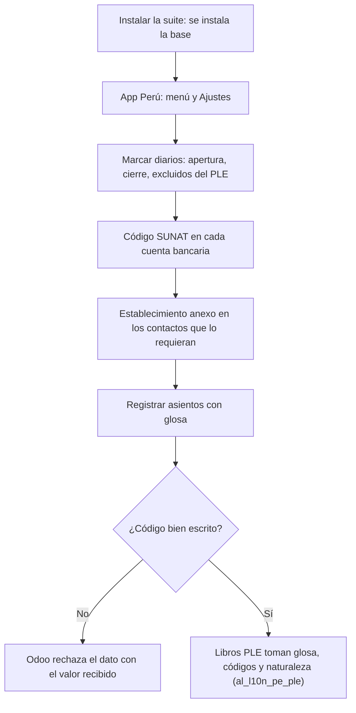

# Guía funcional — Base de Contabilidad Perú

> Módulo técnico `al_account_base` · versión `9.20261009` · área `OL-ACCOUNTING`.
> Para consultores funcionales: qué resuelve, la norma que lo respalda y el
> proceso completo con un ejemplo que cuadra. Enlaces verificados el
> 10/10/2026 con `docs/validacion/verificar_enlaces.py`.

## 1. Para qué sirve

Es el punto de partida de la localización contable peruana de la suite. No
contiene reglas de negocio: crea la **app Perú** (menú y página de Ajustes)
donde cuelgan los demás módulos, y añade los datos que piden los **libros
electrónicos (PLE)** y que Odoo no trae de serie: la **glosa** del asiento, la
**naturaleza del diario** (movimiento, apertura o cierre), la exclusión de un
diario de los libros, el **código SUNAT del banco** y el **establecimiento
anexo** del contacto.

Lo usan el contador general y el administrador del sistema. Normalmente se
instala solo, como dependencia de otro módulo de la suite.

**Fuera del alcance:** no genera libros ni asientos (eso lo hacen
`al_l10n_pe_ple`, `al_account_destinations`, etc.) ni trae el plan contable
(lo instala la localización `l10n_pe` de Odoo).

## 2. Marco normativo y conceptual

- **Libros y registros electrónicos (PLE)** — Resolución de Superintendencia
  N.° 286-2009/SUNAT y sus modificatorias (por ejemplo, la 196-2010/SUNAT,
  que reemplazó su Anexo 2 con las estructuras y tablas). El Libro Diario pide
  una **glosa** por apunte; el Libro Caja y Bancos, el **código de la entidad
  financiera** (tabla 3).
- **Plan Contable General Empresarial (PCGE)** — catálogo de cuentas del
  Consejo Normativo de Contabilidad que usa la localización.

| Término | Significado | Dónde aparece en Odoo |
|---|---|---|
| Glosa | Descripción de la operación que exige el Libro Diario | Asiento (cabecera) y apunte (columna opcional) |
| Naturaleza del diario | Si el diario registra operaciones del periodo, la apertura o el cierre | Diario ▸ campos Perú |
| Excluir del PLE | Diario auxiliar cuyos asientos no son operaciones declarables | Diario |
| Código SUNAT del banco | Código de dos dígitos de la entidad financiera (tabla 3 del PLE) | Cuenta bancaria |
| Establecimiento anexo | Código de cuatro dígitos del establecimiento declarado en el RUC (principal 0000) | Contacto con país Perú |

## 3. Proceso de inicio a fin

| # | Paso | Dónde en Odoo | Quién | Resultado |
|---|---|---|---|---|
| 1 | Revisar la app Perú y sus secciones | Perú ▸ Configuración | Administrador | Menú con secciones Contabilidad, Comprobantes electrónicos, Tributos SUNAT, Cuentas de la localización y Consultas RUC / DNI |
| 2 | Revisar la página de Ajustes de la localización | Perú ▸ Configuración ▸ Ajustes | Administrador | Bloque Contabilidad (PE) y los de cada módulo instalado |
| 3 | Marcar la naturaleza de los diarios | Perú ▸ Configuración ▸ Contabilidad ▸ Diarios | Contador | Apertura, Cierre o Movimiento; «Excluir del PLE» en auxiliares |
| 4 | Registrar el código SUNAT del banco | Perú ▸ Configuración ▸ Contabilidad ▸ Cuentas bancarias | Contador | Dos dígitos exactos; si no, no se guarda |
| 5 | Registrar el establecimiento anexo | Contactos ▸ contacto con país Perú (debajo del RUC) | Contador | Cuatro dígitos exactos; principal 0000 |
| 6 | Escribir la glosa | Contabilidad ▸ Contabilidad ▸ Asientos contables | Contador | Glosa en la cabecera y, si se activa la columna, en cada apunte |
| 7 | Corregir un asiento | Asiento ▸ Restablecer a borrador | Contador | Visible en publicados y cancelados, salvo bloqueados con hash o que requieren anulación ante SUNAT |

## 4. Ejemplo completo

Comercial Demo Perú S.A.C. provisiona el alquiler de su local de Miraflores
de setiembre de 2026 por S/ 3 500,00 (asiento real de la demostración
MISCE/2026/09/0001).

Glosa del asiento: «Provisión del alquiler del local de Miraflores – setiembre 2026».

| Cuenta | Descripción (etiqueta / glosa del apunte) | Debe | Haber |
|---|---|---|---|
| 6352000 | Alquileres – Edificaciones · Alquiler local Miraflores / Alquiler setiembre 2026 | 3 500,00 | |
| 4699000 | Otras cuentas por pagar diversas · Alquiler por pagar / Por pagar a DEMO Distribuidora Norte | | 3 500,00 |
| **Totales** | | **3 500,00** | **3 500,00** |

Qué texto llega al Libro Diario simplificado (formato 5.2) en cada línea, por orden de preferencia:

| Glosa del apunte | Etiqueta del apunte | Texto en el libro |
|---|---|---|
| Alquiler setiembre 2026 | Alquiler local Miraflores | Alquiler setiembre 2026 |
| (vacía) | Alquiler local Miraflores | Alquiler local Miraflores |
| (vacía) | (vacía) | Glosa del asiento; si falta, su referencia o su número |

Validación de los códigos SUNAT:

| Campo | Valor | Resultado |
|---|---|---|
| Código SUNAT del banco | 02 | Aceptado (Banco de Crédito del Perú) |
| Código SUNAT del banco | 123 | Rechazado: debe tener dos dígitos (recortarlo daría otro banco) |
| Establecimiento anexo | 0000 | Aceptado (principal) |
| Establecimiento anexo | 00123 | Rechazado: debe tener cuatro dígitos |

## 5. Configuración inicial

1. Instale cualquier módulo de la suite: la base se instala sola.
2. Revise **Perú ▸ Configuración ▸ Ajustes** (solo administradores).
3. En **Perú ▸ Configuración ▸ Contabilidad ▸ Diarios** marque los diarios de
   apertura y cierre y los que no deben ir a los libros.
4. Complete el **Código SUNAT del banco** de las cuentas bancarias de la
   compañía antes de generar el Libro Caja y Bancos.
5. Registre el **Establecimiento anexo** de los contactos con varios
   establecimientos.

## 6. Reportes y libros relacionados

- **Libro Diario (5.1 / 5.2)** de `al_l10n_pe_ple`: usa la glosa.
- **Libro Caja y Bancos (1.1 / 1.2)**: usa el código SUNAT del banco.
- **Registro de Compras**: excluye los diarios marcados.
- **Comprobante impreso** (`al_l10n_pe_invoice`): muestra la glosa y usa el
  encabezado y el pie comunes que define este módulo.

## 7. Casos especiales y errores frecuentes

| Situación | Qué pasa | Qué hacer |
|---|---|---|
| No se ve la columna Glosa en los apuntes | Es opcional | Actívela en el selector de columnas de la pestaña Apuntes contables |
| No aparecen Naturaleza del diario ni Establecimiento anexo | Solo para compañías o contactos de Perú | Revise el país de la compañía o del contacto |
| «Restablecer a borrador» da error | Asiento bloqueado con hash o comprobante que exige anulación ante SUNAT | Use la nota de crédito o la comunicación de baja |
| Se duplica un asiento | La glosa no se copia | Escriba la glosa del nuevo asiento |

## 8. Preguntas frecuentes del consultor

- **¿Hay que instalarlo aparte?** No: los módulos de la suite lo declaran como
  dependencia.
- **¿Funciona en Community?** Sí, solo depende de `account`.
- **¿Por qué no recorta el código mal escrito?** Porque «123» recortado a «12»
  sería otro banco válido y el libro saldría mal sin que nadie lo advierta.
- **¿Dónde aparecen los ajustes de los otros módulos?** En la misma página
  Perú de Ajustes y en la pestaña Contabilidad PE de la compañía.

## 9. Referencias

Verificadas el 10/10/2026.

- [R.S. N.° 286-2009/SUNAT — Libros y registros electrónicos](https://www.sunat.gob.pe/legislacion/superin/2009/rs286.doc)
- [R.S. N.° 196-2010/SUNAT — Modifica la 286-2009 y reemplaza su Anexo 2](https://www.sunat.gob.pe/legislacion/superin/2010/196-10.pdf)
- [Plan Contable General Empresarial 2019 (MEF)](https://cdn.www.gob.pe/uploads/document/file/315820/PCGE_2019.pdf)
- [Odoo 19 — Localización Perú](https://www.odoo.com/documentation/19.0/applications/finance/fiscal_localizations/peru.html)
- [Odoo 19 — Contabilidad](https://www.odoo.com/documentation/19.0/applications/finance/accounting.html)
