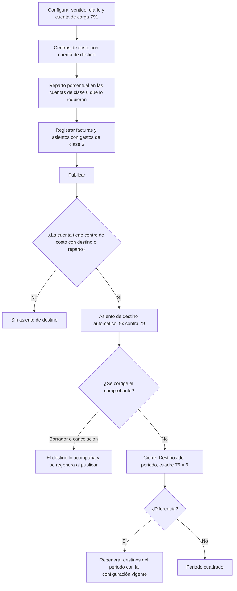

# Guía funcional — Cuentas destino (dinámica 6 ↔ 9)

> Módulo técnico `al_account_destinations` · versión `11.20261009` · área `OL-ACCOUNTING`.
> Para consultores funcionales: qué resuelve, la norma que lo respalda y el
> proceso completo con un ejemplo que cuadra. Enlaces verificados el
> 10/10/2026 con `docs/validacion/verificar_enlaces.py`.

## 1. Para qué sirve

En el Perú los gastos se registran **por naturaleza** en la clase 6 y, para
conocer el costo **por función** (producción, administración, ventas…), se
trasladan a la **clase 9** contra la **cuenta de carga 79**. Hacerlo a mano
exige un asiento extra por cada gasto o uno masivo a fin de mes, con riesgo de
olvidos, porcentajes distintos o descuadres por redondeo.

El módulo genera ese **asiento de destino** automáticamente al publicar cada
comprobante, según el **centro de costo** del gasto o el **reparto
porcentual** configurado en la cuenta, y muestra el **cuadre 79 = Elemento 9**
del periodo. Lo usa el área contable y de costos.

**Fuera del alcance:** el paso de compras (60) a inventarios (Elemento 2,
contra la 61) lo hace la valoración de inventario de Odoo (`stock_account`).
Una cuenta sin reparto ni centro de costo con destino no genera asiento de
destino (no es un error).

## 2. Marco normativo y conceptual

- **Plan Contable General Empresarial (PCGE)**: las cargas de la clase 6 se
  transfieren a las cuentas de costos y gastos por función (Elemento 9) con
  abono a la **79 Cargas imputables a cuentas de costos y gastos**; al cierre,
  el saldo acreedor de la 79 debe ser igual al saldo deudor del Elemento 9.

| Término | Significado | Dónde aparece en Odoo |
|---|---|---|
| Clase 6 | Gastos por naturaleza (servicios, personal, tributos…) | Plan contable |
| Elemento 9 | Costos y gastos por función o destino | Plan contable, cuenta destino |
| Cuenta de carga | Contrapartida del destino: 791 (también 78 o 72 en casos especiales) | Ajustes ▸ Asientos de destino o la propia cuenta |
| Sentido | 6 → 9 (el del PCGE) o 9 → 6 (empresas que registran por función) | Ajustes ▸ Asientos de destino |
| Centro de costo | Cuenta analítica con su cuenta de destino del Elemento 9 | Cuentas analíticas |

## 3. Proceso de inicio a fin

| # | Paso | Dónde en Odoo | Quién | Resultado |
|---|---|---|---|---|
| 1 | Elegir sentido, diario de destinos y cuenta de carga | Perú ▸ Configuración ▸ Ajustes ▸ Asientos de destino | Contador | Configuración de la compañía (del RUC: las sucursales usan la de su raíz) |
| 2 | Indicar la cuenta de destino de cada centro de costo | Contabilidad ▸ Configuración ▸ Cuentas analíticas | Contador de costos | El centro de costo decide el reparto |
| 3 | Configurar el reparto de la cuenta (opcional) | Perú ▸ Configuración ▸ Contabilidad ▸ Plan contable ▸ cuenta ▸ Configuración de destinos | Contador | Cuentas destino con porcentajes que suman 100 % |
| 4 | Revisar todos los repartos | Perú ▸ Configuración ▸ Cuentas de la localización ▸ Destinos por cuenta | Contador | Lista editable e importable |
| 5 | Publicar el comprobante | Contabilidad ▸ Proveedores ▸ Facturas (o cualquier asiento) | Contabilidad | Asiento «Destino: número» en el diario de destinos |
| 6 | Revisar el destino | Factura ▸ Otra información ▸ Asiento de destino | Contabilidad | Enlace al asiento generado |
| 7 | Cuadrar el periodo | Perú ▸ Destinos ▸ Destinos del periodo | Contador | Saldo 79, saldo Elemento 9 y diferencia; Regenerar destinos |

## 4. Ejemplo completo

Factura de proveedor por energía eléctrica de octubre de 2026: S/ 1 000,00 +
IGV 18 % = S/ 1 180,00. Sentido **6 → 9**. La distribución analítica del gasto
es 70 % Administración (cuenta de destino 942100) y 30 % Ventas (951100).

**Asiento de la factura**

| Cuenta | Descripción | Debe | Haber |
|---|---|---|---|
| 6361000 | Servicios básicos – Energía eléctrica | 1 000,00 | |
| 4011100 | IGV – Cuenta propia | 180,00 | |
| 4212000 | Facturas por pagar | | 1 180,00 |
| **Totales** | | **1 180,00** | **1 180,00** |

**Asiento de destino generado al publicar** (solo la línea de gasto interviene;
el IGV y la cuenta por pagar no)

| Cuenta | Descripción | Debe | Haber |
|---|---|---|---|
| 942100 | Gastos de administración (9) — 70 % | 700,00 | |
| 951100 | Gastos de ventas (9) — 30 % | 300,00 | |
| 7910000 | Cargas imputables a cuentas de costos y gastos | | 1 000,00 |
| **Totales** | | **1 000,00** | **1 000,00** |

Cuadre del periodo: saldo acreedor 79 = S/ 1 000,00; saldo deudor Elemento 9 =
S/ 1 000,00; diferencia 0.

**Redondeo:** una cuenta repartida en tres destinos de 33,3333 % con un gasto
de S/ 100,00 genera 33,33 + 33,33 + **33,34** = 100,00: la última línea recibe
el remanente y el asiento cuadra siempre.

## 5. Configuración inicial

1. **Perú ▸ Configuración ▸ Ajustes ▸ Asientos de destino**: sentido (6 a 9
   por defecto), **diario de destinos** (obligatorio) y **cuenta de carga por
   defecto** (normalmente 791).
2. Cuentas analíticas (centros de costo) con su **cuenta de destino**.
3. Reparto propio en las cuentas que no usen centros de costo (suma 100 %).
4. Cuenta de carga propia en la cuenta solo si es distinta (78 para gastos
   cubiertos por provisiones, 72 para producción de activo inmovilizado).

## 6. Reportes y libros relacionados

- **Destinos del periodo**: cuadre 79 vs Elemento 9 y regeneración.
- Los asientos de destino entran al **Libro Diario** (PLE 5.1/5.2) y a los
  estados financieros por función (`al_l10n_pe_financial_reports`).

## 7. Casos especiales y errores frecuentes

| Situación | Qué pasa | Qué hacer |
|---|---|---|
| Los porcentajes no suman 100 % | La cuenta no se guarda (tolerancia ±0,01 %) | Corrija los porcentajes |
| Parte del gasto sin centro de costo con destino y la cuenta sin reparto | Error al publicar que indica qué porcentaje quedó sin destino | Asigne centro de costo o reparto a la cuenta |
| Falta el diario de destinos | Aviso al publicar | Configúrelo en Ajustes |
| Se cambió un reparto | Los destinos ya publicados no cambian solos | Destinos del periodo ▸ Regenerar destinos |
| Comprobante vuelto a borrador o cancelado | El destino hace lo mismo | Al publicar de nuevo se regenera conservando su número |
| «Desactivar destinos» en la cuenta | La cuenta no reparte | Úselo para cuentas de clase 6 sin destino |

## 8. Preguntas frecuentes del consultor

- **¿Por qué mi factura no generó destino?** La cuenta de gasto no tiene
  reparto ni centro de costo con destino, o tiene «Desactivar destinos».
- **¿Y el paso de las compras 60 a inventarios?** Lo hace la valoración de
  inventario de Odoo, no este módulo.
- **¿Funciona con sucursales?** Sí: el sentido, la carga y el reparto son del
  RUC (compañía raíz).
- **¿Puedo importar los repartos?** Sí, desde la lista Destinos por cuenta
  (Acciones ▸ Importar registros).

## 9. Referencias

Verificadas el 10/10/2026.

- [Plan Contable General Empresarial 2019 (MEF)](https://cdn.www.gob.pe/uploads/document/file/315820/PCGE_2019.pdf)
- [Resolución que aprueba el PCGE 2026 (El Peruano)](https://busquedas.elperuano.pe/dispositivo/NL/2550786-1)
- [Odoo 19 — Contabilidad analítica](https://www.odoo.com/documentation/19.0/applications/finance/accounting/reporting/analytic_accounting.html)
- [Odoo 19 — Contabilidad](https://www.odoo.com/documentation/19.0/applications/finance/accounting.html)
