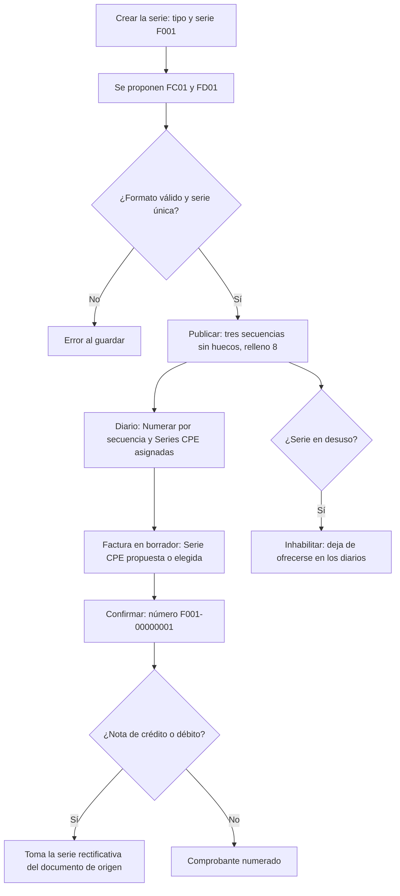

# Guía funcional — Numeración por secuencia y Series CPE

> Módulo técnico `al_account_move_name_sequence` · versión `13.20261008` · área `OL-ACCOUNTING`.
> Para consultores funcionales: qué resuelve, la norma que lo respalda y el
> proceso completo con un ejemplo que cuadra. Enlaces verificados el
> 10/10/2026 con `docs/validacion/verificar_enlaces.py`.

## 1. Para qué sirve

SUNAT identifica cada comprobante electrónico por su **serie** de cuatro
caracteres (F para facturas, B para boletas) y un **correlativo** continuo de
hasta ocho dígitos; las notas de crédito y débito llevan su **serie
rectificativa** vinculada a la del comprobante que modifican. La numeración
nativa de Odoo se basa en el último número del diario y permite renumerar, lo
que complica llevar varias series en un diario o garantizar que no se repitan.

El módulo numera con **secuencias explícitas sin huecos**, solo en los diarios
que se activen: **Series CPE** (F001, B001… con sus rectificativas FC01/FD01)
para diarios con documentos, y un **prefijo simple** (p. ej. CC01-) para los
demás. Lo usan el contador y el responsable de facturación.

**Fuera del alcance:** no envía comprobantes a SUNAT (eso lo hace la
facturación electrónica de Odoo o un OSE) ni reutiliza números anulados.

## 2. Marco normativo y conceptual

- **Reglamento de Comprobantes de Pago** (R.S. N.° 007-99/SUNAT y
  modificatorias): exige numeración correlativa por serie.
- **Sistema de Emisión Electrónica**: las series electrónicas empiezan con F
  (facturas y sus notas) o B (boletas y sus notas) y el correlativo tiene hasta
  ocho dígitos (por ejemplo, R.S. N.° 206-2019/SUNAT modificó el reglamento al
  ampliar la emisión electrónica).

| Término | Significado | Dónde aparece en Odoo |
|---|---|---|
| Serie CPE | Serie de 4 caracteres de un tipo de comprobante (01 factura, 03 boleta) | Perú ▸ Configuración ▸ Comprobantes electrónicos ▸ Series CPE |
| Serie rectificativa | Serie de las notas de crédito (FC01) y débito (FD01) de una serie | Serie CPE |
| Secuencia sin huecos | Contador que no salta números al asignarlos | Se crea al publicar la serie |
| Numerar por secuencia | Casilla que activa el módulo en un diario | Diario |

## 3. Proceso de inicio a fin

| # | Paso | Dónde en Odoo | Quién | Resultado |
|---|---|---|---|---|
| 1 | Crear la serie | Perú ▸ Configuración ▸ Comprobantes electrónicos ▸ Series CPE ▸ Nuevo | Contador | Serie en borrador con rectificativas propuestas |
| 2 | Publicar la serie | Serie ▸ Publicar | Contador | Tres secuencias sin huecos (comprobante, NC, ND) |
| 3 | Activar el diario | Perú ▸ Configuración ▸ Contabilidad ▸ Diarios ▸ Numerar por secuencia | Contador | Series CPE asignadas al diario |
| 4 | Emitir | Contabilidad ▸ Clientes ▸ Facturas ▸ Confirmar | Facturación | Número tomado de la secuencia de la serie |
| 5 | Nota de crédito | Factura ▸ Nota de crédito | Facturación | Serie FC de la serie de origen |
| 6 | Diario sin documentos | Diario ▸ Prefijo (serie) | Contador | Secuencia propia, p. ej. CC01- |
| 7 | Retirar una serie | Serie ▸ Inhabilitar | Contador | Ya no se ofrece; «Volver a borrador» la reabre |

## 4. Ejemplo completo

Comercial Demo Perú emite desde su diario de ventas con las series F001 y
F002. Asientos reales de la demostración:

**Factura F002-00000002** (servicio de instalación de red, S/ 1 000,00 + IGV)

| Cuenta | Descripción | Debe | Haber |
|---|---|---|---|
| 1213000 | Facturas por cobrar | 1 180,00 | |
| 7012100 | Venta local | | 1 000,00 |
| 4011100 | IGV – Cuenta propia | | 180,00 |
| **Totales** | | **1 180,00** | **1 180,00** |

**Nota de crédito FC02-00000001** que anula la factura anterior: toma la serie
rectificativa de F002.

| Cuenta | Descripción | Debe | Haber |
|---|---|---|---|
| 7012100 | Venta local | 1 000,00 | |
| 4011100 | IGV – Cuenta propia | 180,00 | |
| 1213000 | Facturas por cobrar | | 1 180,00 |
| **Totales** | | **1 180,00** | **1 180,00** |

**Caja chica CC01-00000002** (diario sin documentos con prefijo CC01-)

| Cuenta | Descripción | Debe | Haber |
|---|---|---|---|
| 6560000 | Suministros — Útiles de oficina | 142,50 | |
| 1041001 | Banco | | 142,50 |
| **Totales** | | **142,50** | **142,50** |

Qué serie usa cada documento en un diario con F001 y F002:

| Comprobante | Serie que numera | Número |
|---|---|---|
| Factura (01) con serie F002 | F002 | F002-00000002 |
| Nota de crédito (07) de F002-00000002 | FC02 | FC02-00000001 |
| Nota de débito (08) de una factura F002 | FD02 | siguiente de FD02- |

## 5. Configuración inicial

1. Cree y publique las series en **Perú ▸ Configuración ▸ Comprobantes
   electrónicos ▸ Series CPE** (requiere administrador de Contabilidad).
2. En cada diario que deba numerar por secuencia, marque **Numerar por
   secuencia** y asigne sus **Series CPE**; en diarios sin documentos escriba
   el **Prefijo (serie)** y, si aplica, el **Prefijo NC (serie)**.
3. Emita un comprobante de prueba y verifique el número.

## 6. Reportes y libros relacionados

- El número (serie-correlativo) es el que usan la **factura electrónica**, el
  **QR** del comprobante impreso y los **registros de ventas y compras**
  (PLE / SIRE).
- **Series CPE ▸ Comprobantes**: lista de documentos de cada serie.

## 7. Casos especiales y errores frecuentes

| Situación | Qué pasa | Qué hacer |
|---|---|---|
| La factura sigue con numeración nativa | En diarios con documentos solo cuentan las Series CPE | Asigne al diario una serie publicada del tipo de documento |
| No aparece «Serie CPE» en la factura | Solo en borrador y si el diario tiene series | Revise el diario |
| Formato de serie inválido | Facturas F + 3 alfanuméricos; boletas B o E + 3 | Corrija la serie |
| Comprobante cancelado | Su número no se reutiliza (no hay aviso de hueco) | Es el comportamiento esperado |
| Cambié el prefijo y siguen los números anteriores | El prefijo se usa al crear la secuencia | Cambie el prefijo en la secuencia o genere otra |

## 8. Preguntas frecuentes del consultor

- **¿Afecta a los diarios que no marco?** No: siguen con la numeración de Odoo.
- **¿Varias series en un diario?** Sí; si hay más de una candidata, el usuario
  elige la serie en cada borrador.
- **¿Cuándo se asigna el número?** Al confirmar, no al crear el borrador.
- **¿Las notas de crédito usan la serie de la nota o la del origen?** La
  rectificativa de la serie del documento de origen.

## 9. Referencias

Verificadas el 10/10/2026.

- [Reglamento de Comprobantes de Pago — R.S. N.° 007-99/SUNAT (SUNAT)](https://www.sunat.gob.pe/legislacion/superin/1999/007_anterior.htm)
- [R.S. N.° 206-2019/SUNAT — Modifica el Reglamento de Comprobantes de Pago](https://www.sunat.gob.pe/legislacion/superin/2019/206-2019.pdf)
- [Odoo 19 — Facturas de cliente](https://www.odoo.com/documentation/19.0/applications/finance/accounting/customer_invoices.html)
- [Odoo 19 — Localización Perú](https://www.odoo.com/documentation/19.0/applications/finance/fiscal_localizations/peru.html)
