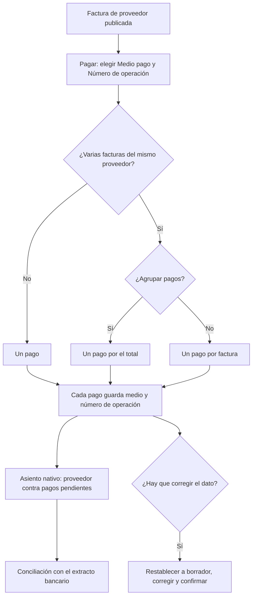

# Guía funcional — Medios de pago SUNAT

> Módulo técnico `al_account_payments` · versión `7.20261008` · área `OL-ACCOUNTING`.
> Para consultores funcionales: qué resuelve, la norma que lo respalda y el
> proceso completo con un ejemplo que cuadra. Enlaces verificados el
> 10/10/2026 con `docs/validacion/verificar_enlaces.py`.

## 1. Para qué sirve

La ley de bancarización obliga a pagar con **medios de pago** del sistema
financiero las obligaciones desde cierto importe; si no, el gasto o costo y el
crédito fiscal del IGV pueden desconocerse. Para sustentarlo en una
fiscalización hay que saber, pago por pago, **qué medio se usó** (según la
tabla de SUNAT) y **qué número de operación** dio el banco.

El módulo carga el **catálogo de medios de pago de SUNAT** y añade al pago, y
al asistente **Pagar**, el **medio de pago** y el **número de operación
bancaria**. Lo usan tesorería y contabilidad.

**Fuera del alcance:** no valida si un pago debió bancarizarse ni genera
asientos propios (el asiento es el nativo del pago).

## 2. Marco normativo y conceptual

- **Ley N.° 28194**, Ley para la Lucha contra la Evasión y para la
  Formalización de la Economía (TUO aprobado por D.S. N.° 150-2007-EF):
  medios de pago obligatorios y sus efectos tributarios.
- **D. Leg. N.° 1529** (2022): bajó el monto a partir del cual se deben usar
  medios de pago de S/ 3 500 o US$ 1 000 a **S/ 2 000 o US$ 500** (aplica
  también a pagos parciales de una obligación que supere ese monto).
- **Tabla 1 de medios de pago** de SUNAT (Anexo de los libros electrónicos):
  001 Depósito en cuenta, 003 Transferencia de fondos, 007 Cheque… hasta 999
  Otros medios de pago.

| Término | Significado | Dónde aparece en Odoo |
|---|---|---|
| Medio de pago | Código de la tabla de SUNAT con su descripción | Perú ▸ Configuración ▸ Tributos SUNAT ▸ Medios de pago |
| Código de facturador | Código del medio para el comprobante electrónico | Ficha del medio (columna oculta en la lista) |
| Para detracción | Medio admitido para el depósito de detracciones | Ficha del medio |
| Número de operación banco | Referencia que entrega el banco | Pago y asistente Pagar |

## 3. Proceso de inicio a fin

| # | Paso | Dónde en Odoo | Quién | Resultado |
|---|---|---|---|---|
| 1 | Revisar el catálogo | Perú ▸ Configuración ▸ Tributos SUNAT ▸ Medios de pago | Contador | 20 medios cargados (001 a 011, 101 a 108 y 999) |
| 2 | Pagar la factura | Contabilidad ▸ Proveedores ▸ Facturas ▸ Pagar | Tesorería | Medio y número de operación en el asistente |
| 3 | Pago agrupado | Seleccionar facturas ▸ Pagar ▸ Agrupar pagos | Tesorería | Un pago con los datos del asistente |
| 4 | Revisar el pago | Contabilidad ▸ Proveedores ▸ Pagos | Contador | Datos editables solo en borrador |
| 5 | Conciliar | Contabilidad ▸ Conciliación bancaria | Tesorería | El número de operación se cruza con el extracto |

## 4. Ejemplo completo

Comercial Demo Perú paga a DEMO PAGO Proveedor SAC dos facturas de S/ 590,00
(S/ 500,00 + IGV) cada una con un solo depósito en cuenta, operación 00471205
(asiento real PBNK1/2026/00006). El total, S/ 1 180,00, es menor que
S/ 2 000,00, pero la empresa decide igual pagar por banco y deja la constancia.

| Cuenta | Descripción | Debe | Haber |
|---|---|---|---|
| 4212000 | Facturas por pagar — F001-00004620, F001-00004621 | 1 180,00 | |
| 1041004 | Pagos pendientes | | 1 180,00 |
| **Totales** | | **1 180,00** | **1 180,00** |

Datos guardados en el pago: Medio pago **001 - DEPÓSITO EN CUENTA**; Número de
operación banco **00471205**. Al conciliar el extracto, el apunte de pagos
pendientes pasa a la cuenta del banco.

Caso que exige bancarización: una factura de S/ 2 360,00 (S/ 2 000,00 + IGV)
supera los S/ 2 000,00: debe pagarse con un medio del sistema financiero (por
ejemplo 003 Transferencia de fondos) aunque se pague en dos partes de
S/ 1 180,00.

## 5. Configuración inicial

1. Instale el módulo: el catálogo de 20 medios se carga solo.
2. Revise la marca **Para detracción** (en el catálogo inicial, 003
   Transferencia de fondos) y el **Código de facturador** si su facturador lo
   requiere.
3. Archive los medios que la empresa no use (Acciones ▸ Archivar).
4. Indique a tesorería que complete medio y número de operación en el
   asistente Pagar.

## 6. Reportes y libros relacionados

- **Libro Caja y Bancos** (PLE 1.1/1.2) y **Registro de Compras**: el medio de
  pago y la operación sustentan los pagos de los comprobantes.
- **Detracciones** (`al_l10n_pe_detraction`): el depósito usa medios marcados
  para detracción.
- Lista de pagos: filtrar o agrupar por medio de pago para revisar la
  bancarización del periodo.

## 7. Casos especiales y errores frecuentes

| Situación | Qué pasa | Qué hacer |
|---|---|---|
| El pago confirmado tiene un dato equivocado | Campos de solo lectura | Restablecer a borrador, corregir y confirmar |
| No encuentro el medio en el asistente | Está archivado o se busca mal | Busque por código (003) o texto (transf); desarchívelo |
| Se pagó sin medio | El campo queda vacío (es opcional) | Complételo antes de confirmar el pago |
| No se puede crear un medio desde el asistente | Está bloqueado a propósito | Créelo en el catálogo |

## 8. Preguntas frecuentes del consultor

- **¿Cambia el asiento del pago?** No: es el nativo de Odoo.
- **¿Es obligatorio llenar los campos?** No en el sistema; sí conviene para
  sustentar la bancarización.
- **¿Sirve para cobros de clientes?** Sí, los campos están en todos los pagos.
- **¿Qué monto obliga a bancarizar?** Desde S/ 2 000 o US$ 500 (D. Leg. 1529);
  para inmuebles, vehículos y capital, desde 1 UIT.

## 9. Referencias

Verificadas el 10/10/2026.

- [Ley N.° 28194 — Ley para la Lucha contra la Evasión y para la Formalización de la Economía (Congreso)](https://www.leyes.congreso.gob.pe/Documentos/Leyes/28194.pdf)
- [TUO de la Ley N.° 28194 — D.S. N.° 150-2007-EF (SUNAT)](https://www.sunat.gob.pe/legislacion/itf/ds150_07.pdf)
- [D. Leg. N.° 1529 — Modifica la Ley 28194 (El Peruano)](https://busquedas.elperuano.pe/dispositivo/NL/2044433-2)
- [Odoo 19 — Pagos](https://www.odoo.com/documentation/19.0/applications/finance/accounting/payments.html)
