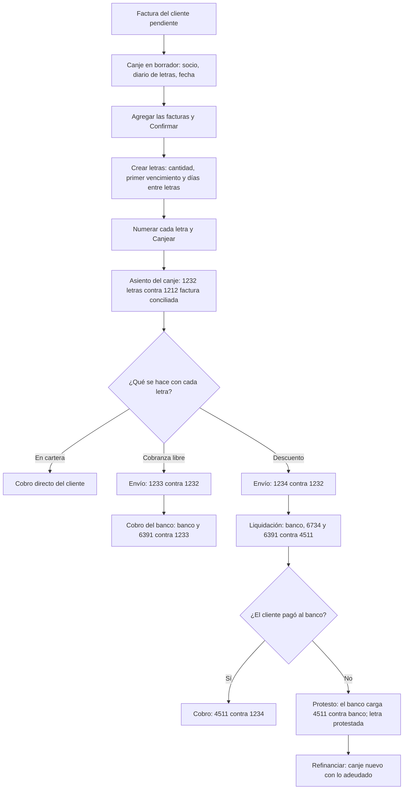

# Guía funcional — Letras de cambio y canje

> Módulo técnico `al_l10n_pe_account_letter` · versión `18.20261009` · área `OL-ACCOUNTING`.
> Para consultores funcionales: qué resuelve, la norma que lo respalda y el
> proceso completo con un ejemplo que cuadra. Enlaces verificados el
> 10/10/2026 con `docs/validacion/verificar_enlaces.py`.

## 1. Para qué sirve

En el Perú es habitual financiar ventas y compras **canjeando facturas por
letras de cambio** con vencimientos escalonados, que luego se llevan al banco
en **cobranza libre** o en **descuento**, y que a veces hay que **renovar**
(refinanciar) o **protestar**. Sin un módulo, cada paso es un asiento manual.

El módulo convierte cada canje en un documento con estados que **genera y
concilia los asientos**: canje de facturas por letras (clientes y
proveedores), envío al banco, liquidación del descuento, cobro, protesto,
refinanciación y canje masivo. Lo usan créditos y cobranzas, tesorería y
contabilidad.

**Fuera del alcance:** la **factura negociable** no es una letra (se gestiona
con el módulo de factoring); no hay integración con los bancos ni emisión del
título físico; no hay devengo de intereses de la letra.

## 2. Marco normativo y conceptual

- **Ley N.° 27287, Ley de Títulos Valores**: regula la letra de cambio, su
  aceptación, endoso, protesto y plazos.
- **PCGE**: subcuentas de **123 Letras por cobrar** (en cartera, en cobranza,
  en descuento), **423 Letras por pagar**, **45 Obligaciones financieras** para
  el descuento, **673 Intereses** y **639 Gastos bancarios**.

| Término | Significado | Dónde aparece en Odoo |
|---|---|---|
| Canje | Reemplazo de facturas pendientes por letras (CLC clientes, CLP proveedores) | Perú ▸ Letras de cambio ▸ Canje de letras |
| En cartera | Letra en poder de la empresa | Tipo de letra |
| Cobranza libre | Letra entregada al banco solo para cobrarla | Tipo de letra (cuenta 1233) |
| Descuento | El banco adelanta el dinero antes del vencimiento; es una deuda con el banco hasta que el cliente paga | Tipo de letra (cuenta 1234, obligación 4511) |
| Protesto | Constancia de que la letra no se pagó | Asistente Protesto |
| Refinanciación | Lo adeudado de un canje pasa a un canje nuevo con otros vencimientos | Canje ▸ Refinanciar |

## 3. Proceso de inicio a fin

| # | Paso | Dónde en Odoo | Quién | Resultado |
|---|---|---|---|---|
| 1 | Configurar cuentas de letras | Perú ▸ Configuración ▸ Cuentas de la localización ▸ Cuentas de letras | Contador | Una cuenta por tipo de cuenta, tipo de letra y moneda |
| 2 | Crear el canje | Perú ▸ Letras de cambio ▸ Clientes ▸ Canje de letras ▸ Nuevo | Créditos | Canje CLC en borrador |
| 3 | Agregar facturas y confirmar | Canje ▸ Facturas ▸ Confirmar | Créditos | Estado Comprobado |
| 4 | Crear y numerar letras | Canje ▸ Letras ▸ Crear letras | Créditos | Importes y vencimientos repartidos |
| 5 | Canjear | Canje ▸ Canjear | Créditos | Asiento del canje; factura conciliada y «Canjeado» |
| 6 | Enviar al banco | Canje ▸ Canje (todas o por letra) | Tesorería | Asiento de cobranza libre o descuento |
| 7 | Liquidar, cobrar o protestar | Canje ▸ Liquidar descuento / Cobro del banco / Protesto | Tesorería | Asientos de banco, intereses, gastos y obligación |
| 8 | Refinanciar | Canje ▸ Refinanciar (o Acciones ▸ Refinanciación masiva) | Créditos | Canje nuevo con lo adeudado |
| 9 | Seguimiento | Perú ▸ Letras de cambio ▸ Letras por cobrar / Análisis de letras | Créditos | Saldos, vencidas, por banco y mes |

## 4. Ejemplo completo

DEMO LETRA Cliente SAC compra mercadería por S/ 3 000,00 + IGV = S/ 3 540,00
y acepta canjearla por **3 letras de S/ 1 180,00** a 30, 60 y 90 días. La
letra 1 se descuenta en el banco, la letra 2 va a cobranza libre y la letra 3
se descuenta y luego se protesta.

**1. Factura de venta**

| Cuenta | Descripción | Debe | Haber |
|---|---|---|---|
| 1212000 | Facturas por cobrar emitidas en cartera | 3 540,00 | |
| 7011100 | Venta de mercaderías | | 3 000,00 |
| 4011100 | IGV – Cuenta propia | | 540,00 |
| **Totales** | | **3 540,00** | **3 540,00** |

**2. Canje (CLC)** — la factura queda conciliada; si las letras no sumaran
exacto, la diferencia iría a la cuenta Redondeo.

| Cuenta | Descripción | Debe | Haber |
|---|---|---|---|
| 1232000 | Letras por cobrar en cartera — LET-001 | 1 180,00 | |
| 1232000 | Letras por cobrar en cartera — LET-002 | 1 180,00 | |
| 1232000 | Letras por cobrar en cartera — LET-003 | 1 180,00 | |
| 1212000 | Facturas por cobrar — factura canjeada | | 3 540,00 |
| **Totales** | | **3 540,00** | **3 540,00** |

**3. Letra 1 a descuento y liquidación** (intereses S/ 35,00; comisión y gastos S/ 4,50)

| Asiento | Cuenta | Debe | Haber |
|---|---|---|---|
| Envío a descuento | 1234000 Letras en descuento | 1 180,00 | |
| | 1232000 Letras en cartera | | 1 180,00 |
| Liquidación del descuento | 1041000 Banco (neto) | 1 140,50 | |
| | 6734000 Intereses por documentos descontados | 35,00 | |
| | 6391000 Gastos bancarios | 4,50 | |
| | 4511000 Obligación con el banco (valor nominal) | | 1 180,00 |
| Cobro (el cliente pagó al banco) | 4511000 Obligación con el banco | 1 180,00 | |
| | 1234000 Letras en descuento | | 1 180,00 |

**4. Letra 2 a cobranza libre** (gastos de cobranza S/ 5,00)

| Asiento | Cuenta | Debe | Haber |
|---|---|---|---|
| Envío a cobranza | 1233000 Letras en cobranza | 1 180,00 | |
| | 1232000 Letras en cartera | | 1 180,00 |
| Cobro del banco | 1041000 Banco (neto) | 1 175,00 | |
| | 6391000 Gastos bancarios | 5,00 | |
| | 1233000 Letras en cobranza | | 1 180,00 |

**5. Letra 3 descontada y protestada**: tras el envío y la liquidación (como
la letra 1), el cliente no paga; el banco carga la letra:

| Cuenta | Descripción | Debe | Haber |
|---|---|---|---|
| 4511000 | Obligación con el banco | 1 180,00 | |
| 1041000 | Banco (cargo por la letra protestada) | | 1 180,00 |
| **Totales** | | **1 180,00** | **1 180,00** |

La letra queda **Protestada** y vuelve a estar pendiente a cargo del cliente;
con **Refinanciar** se genera un canje nuevo con su saldo. Cada asiento del
ejemplo cuadra por sí mismo.

## 5. Configuración inicial

1. **Cuentas de letras**: una fila por tipo de cuenta (por cobrar / por
   pagar), tipo de letra (en cartera, cobranza libre, descuento, protestada) y
   moneda; al menos «En cartera».
2. **Cuentas de la compañía** para las operaciones con el banco: obligación
   (4511), intereses (6734), gastos (6391) y redondeo.
3. **Diarios** generales cuyo nombre contenga «letra» y «cobrar» (clientes) o
   «letra» y «pagar» (proveedores), marcados como diarios de letras.
4. **Cuentas «Redondeo»** de tipo gasto y de otros ingresos.
5. **Grupo de Gestión de letras** para los usuarios.

## 6. Reportes y libros relacionados

- **Letras por cobrar / por pagar**: saldo, vencidas en rojo, por banco y tipo.
- **Análisis de letras**: tabla dinámica por tipo, moneda y mes de vencimiento.
- Los asientos van al **Libro Diario** y al **Libro de Inventarios y Balances**
  (detalle de la cuenta 12/42) del PLE.
- La factura muestra su **Estado de canje** y el canje que la canceló.

## 7. Casos especiales y errores frecuentes

| Situación | Qué pasa | Qué hacer |
|---|---|---|
| No aparece ningún diario en el canje | Solo se ofrecen diarios con «letra» y «cobrar/pagar» en el nombre | Renombre o cree el diario |
| No encuentro la factura | Solo apuntes publicados, con saldo, del socio y de la moneda del diario | Revise socio, moneda y tipo de documento |
| «No se ha configurado la cuenta» al enviar al banco | Falta la fila de cuenta para ese tipo y moneda | Complete Cuentas de letras |
| Canje parcial | Se permite | Baje el importe de la factura o use «Pago parcial» |
| Fecha futura en el canje | No se permite | Use la fecha de hoy o anterior |
| Protesto tardío | El canje anota que se protestó fuera del plazo legal | Revise con el área legal |

## 8. Preguntas frecuentes del consultor

- **¿Sirve para proveedores?** Sí: canje CLP con letras por pagar (cuenta 423).
- **¿Puedo enviar al banco una sola letra?** Sí: tipo de canje «Por letra».
- **¿Qué es el canje masivo?** Un registro que consolida varios canjes ya
  canjeados de un mismo socio; los de origen pasan a Historial de canje.
- **¿Y si el cliente no paga a tiempo?** Refinanciar con la nueva fecha: el
  saldo pasa a letras nuevas sin perder el rastro de las de origen.
- **¿Funciona en dólares?** Sí, con las cuentas configuradas por moneda y el
  tipo de cambio del módulo de tipo de cambio Perú.

## 9. Referencias

Verificadas el 10/10/2026.

- [Ley N.° 27287 — Ley de Títulos Valores (Congreso)](https://www.leyes.congreso.gob.pe/Documentos/Leyes/27287.pdf)
- [Plan Contable General Empresarial 2019 (MEF)](https://cdn.www.gob.pe/uploads/document/file/315820/PCGE_2019.pdf)
- [Odoo 19 — Pagos](https://www.odoo.com/documentation/19.0/applications/finance/accounting/payments.html)
- [Odoo 19 — Contabilidad](https://www.odoo.com/documentation/19.0/applications/finance/accounting.html)
