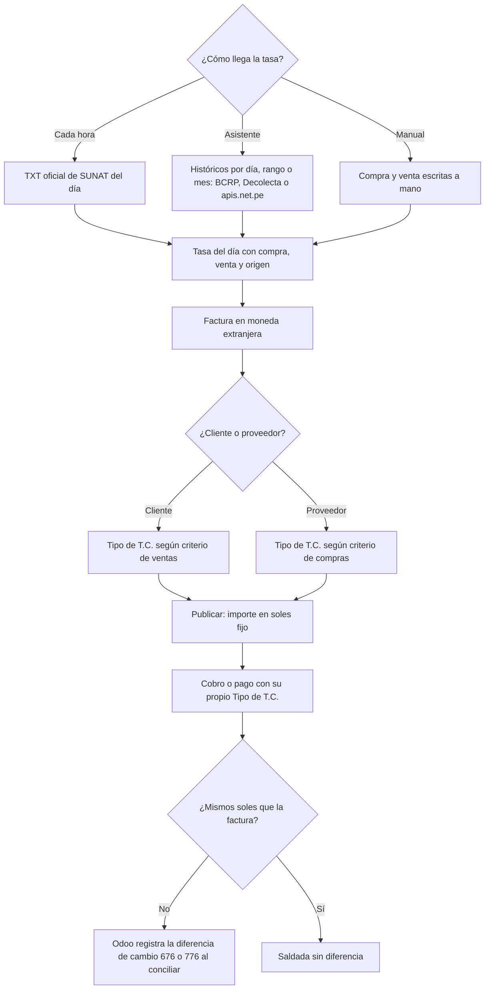

# Guía funcional — Tipo de cambio Perú

> Módulo técnico `al_l10n_pe_currency` · versión `13.20261008` · área `OL-ACCOUNTING`.
> Para consultores funcionales: qué resuelve, la norma que lo respalda y el
> proceso completo con un ejemplo que cuadra. Enlaces verificados el
> 10/10/2026 con `docs/validacion/verificar_enlaces.py`.

## 1. Para qué sirve

En el Perú se publica cada día un tipo de cambio **compra** y otro **venta**,
y las normas tributarias indican cuál usar según la operación. Odoo guarda una
sola tasa por día, así que el contador termina corrigiendo a mano la tasa de
cada comprobante.

El módulo guarda **compra, venta y origen** de cada tasa, la **actualiza cada
hora** desde el archivo oficial de SUNAT, carga **históricos** desde el BCRP (o
Decolecta / apis.net.pe) y permite elegir **compra o venta en cada factura y
cada pago**, lo que fija su importe en soles. Lo usan contabilidad y tesorería.

**Fuera del alcance:** el ajuste de saldos al cierre de mes (lo hace
`al_l10n_pe_exchange_closure`); conversiones entre dos monedas extranjeras
(usan la tasa nativa de Odoo).

## 2. Marco normativo y conceptual

- **Ley del Impuesto a la Renta, artículo 61**: las diferencias de cambio son
  resultados computables y las operaciones en moneda extranjera se contabilizan
  al tipo de cambio vigente.
- **Reglamento de la LIR, artículo 34**: tipo de cambio **compra** para activos
  y **venta** para pasivos.
- **Reglamento de la Ley del IGV**: las operaciones en moneda extranjera se
  convierten al tipo de cambio **venta** de la fecha en que nace la obligación
  tributaria (criterio por defecto del módulo).
- El tipo de cambio de referencia es el que publica la **SBS** al cierre de
  operaciones; SUNAT lo publica con fecha del día siguiente y el **BCRP** lo
  difunde en sus series estadísticas.

| Término | Significado | Dónde aparece en Odoo |
|---|---|---|
| T.C. compra / venta | Precio del dólar al que compra o vende el sistema financiero | Tipos de cambio ▸ Compra / Venta |
| Origen | De dónde vino la tasa: SUNAT, BCRP, Decolecta, apis.net.pe o Manual | Tipos de cambio |
| Tipo de T.C. | Compra o venta elegido en el comprobante | Factura y pago (solo en moneda extranjera) |
| Diferencia de cambio | Resultado al cobrar o pagar a un tipo distinto al registrado | Cuentas 676 (pérdida) y 776 (ganancia) |

## 3. Proceso de inicio a fin

| # | Paso | Dónde en Odoo | Quién | Resultado |
|---|---|---|---|---|
| 1 | Elegir el criterio de ventas y compras | Contabilidad ▸ Configuración ▸ Ajustes ▸ Tipo de cambio (Perú) | Contador | Venta por defecto en ambos |
| 2 | Verificar la actualización automática | Ajustes ▸ Técnico ▸ Acciones planificadas ▸ «Tipo de cambio: actualizar desde SUNAT» | Administrador | Activa al instalar, cada hora |
| 3 | Cargar históricos | Perú ▸ Tipo de cambio ▸ Actualizar tipo de cambio | Contador | Tasas de meses anteriores (BCRP sin token) |
| 4 | Revisar las tasas | Perú ▸ Tipo de cambio ▸ Tipos de cambio | Contador | Compra, venta y origen por día |
| 5 | Emitir la factura en dólares | Contabilidad ▸ Clientes ▸ Facturas | Facturación | Tipo de T.C. propuesto, editable en borrador |
| 6 | Cobrar o pagar | Factura ▸ Pagar | Tesorería | El pago lleva su propio Tipo de T.C. |
| 7 | Revisar la diferencia de cambio | Asiento de diferencia de cambio al conciliar | Contador | 676 o 776 |

## 4. Ejemplo completo

Factura de venta del 02/08/2026 por US$ 1 000,00 + IGV US$ 180,00 =
US$ 1 180,00. Ese día SUNAT publicó **compra 3,391** y **venta 3,400**
(datos de demostración «DEMO TC FACTURA»).

**Factura a T.C. venta (criterio por defecto)**

| Cuenta | Descripción | Debe | Haber |
|---|---|---|---|
| 1212000 | Facturas por cobrar (US$ 1 180,00 × 3,400) | 4 012,00 | |
| 7011100 | Venta (US$ 1 000,00 × 3,400) | | 3 400,00 |
| 4011100 | IGV (US$ 180,00 × 3,400) | | 612,00 |
| **Totales** | | **4 012,00** | **4 012,00** |

La misma factura con **Tipo de T.C. compra** quedaría en 3 391,00 + 610,38 =
**4 001,38** (diferencia de S/ 10,62).

**Cobro de US$ 1 180,00 el mismo día con Tipo de T.C. compra**

| Cuenta | Descripción | Debe | Haber |
|---|---|---|---|
| 1041000 | Banco (US$ 1 180,00 × 3,391) | 4 001,38 | |
| 1212000 | Facturas por cobrar | | 4 001,38 |
| **Totales** | | **4 001,38** | **4 001,38** |

**Diferencia de cambio que registra Odoo al conciliar** (la factura quedó en
S/ 4 012,00 y el cobro canceló S/ 4 001,38)

| Cuenta | Descripción | Debe | Haber |
|---|---|---|---|
| 6760000 | Pérdida por diferencia de cambio | 10,62 | |
| 1212000 | Facturas por cobrar | | 10,62 |
| **Totales** | | **10,62** | **10,62** |

## 5. Configuración inicial

1. Revise el criterio de **T.C. en ventas** y **T.C. en compras** (Venta por
   defecto, criterio del IGV).
2. Confirme que la acción planificada de SUNAT esté activa.
3. Cargue los meses anteriores con **Actualizar tipo de cambio**, fuente BCRP.
4. Si usará Decolecta o apis.net.pe, registre el token en su conexión de
   consulta RUC/DNI (`l10n_pe_vat_sunat`).
5. Verifique las cuentas de diferencia de cambio de la compañía (676 / 776).

## 6. Reportes y libros relacionados

- Los importes en soles de facturas y pagos alimentan los **registros de
  ventas y compras** (PLE / SIRE) y el **tipo de cambio** que informan.
- El **cierre de tipo de cambio** mensual (`al_l10n_pe_exchange_closure`) usa
  estas mismas tasas.
- **Letras de cambio** en moneda extranjera usan la compra o la venta según el
  canje.

## 7. Casos especiales y errores frecuentes

| Situación | Qué pasa | Qué hacer |
|---|---|---|
| No puedo cambiar el Tipo de T.C. | La factura está publicada | Pásela a borrador |
| Sábado o feriado sin tasa | Se usa la última tasa anterior | La fecha mostrada junto a la moneda es la de la tasa aplicada |
| Compra mayor que venta | Aviso, pero se puede guardar | Revise el dato |
| Registré solo la venta | La compra toma el mismo valor | Complete la compra si la conoce |
| Diferencia de cambio el mismo día | Factura y cobro con tipos distintos | Es correcto: refleja el tipo elegido |
| Una tasa manual | La actualización automática no la pisa | Edítela si hay que corregirla |

## 8. Preguntas frecuentes del consultor

- **¿Qué fuente conviene para cargar un año?** BCRP: sin token y todo el rango
  en una consulta.
- **¿Por qué el tipo «del día» es del día anterior?** Porque SUNAT publica el
  cierre SBS de un día con la fecha del día siguiente.
- **¿Cambia algo si no hay compra/venta para una fecha?** Odoo convierte con su
  tasa nativa.
- **¿Los pagos siguen el criterio de la factura?** No: el cobro sigue el
  criterio de ventas y el pago a proveedor el de compras, y se puede cambiar.

## 9. Referencias

Verificadas el 10/10/2026.

- [Ley del Impuesto a la Renta, capítulo IX — artículo 61 (SUNAT)](https://www.sunat.gob.pe/legislacion/renta/ley/capix.pdf)
- [Reglamento de la LIR, capítulo IX — artículo 34 (SUNAT)](https://www.sunat.gob.pe/legislacion/renta/regla/cap9.pdf)
- [Consulta del tipo de cambio de SUNAT](https://e-consulta.sunat.gob.pe/cl-at-ittipcam/tcS01Alias)
- [Tipo de cambio promedio ponderado (SBS)](https://www.sbs.gob.pe/app/pp/sistip_portal/paginas/publicacion/tipocambiopromedio.aspx)
- [Series estadísticas del BCRP](https://estadisticas.bcrp.gob.pe/estadisticas/series/)
- [Odoo 19 — Multimoneda](https://www.odoo.com/documentation/19.0/applications/finance/accounting/get_started/multi_currency.html)
