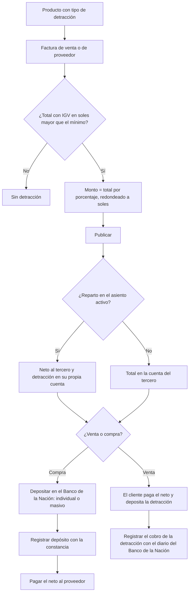

# Guía funcional — Detracciones (SPOT)

> Módulo técnico `al_l10n_pe_detraction` · versión `21.20261008` · área `OL-ACCOUNTING`.
> Para consultores funcionales: qué resuelve, la norma que lo respalda y el
> proceso completo con un ejemplo que cuadra. Enlaces verificados el
> 10/10/2026 con `docs/validacion/verificar_enlaces.py`.

## 1. Para qué sirve

En las operaciones sujetas al **Sistema de Pago de Obligaciones Tributarias
(SPOT)** el comprador descuenta un porcentaje del importe total y lo
**deposita en la cuenta de detracciones del proveedor en el Banco de la
Nación**; el proveedor cobra el neto y usa ese fondo para pagar sus tributos.

El módulo lleva el régimen de punta a punta: **catálogo de tipos** (catálogo 54)
con porcentaje y monto mínimo, **cálculo** en facturas de venta y compra
(código dominante, mínimo y redondeo a soles enteros), **reparto** opcional en
el asiento, **registro del depósito** con su constancia, **archivo de
depósito masivo** del Banco de la Nación y **contraste** del catálogo con
SUNAT. Lo usan facturación, compras, tesorería y contabilidad.

**Fuera del alcance:** no envía el archivo al banco ni consulta constancias en
línea; el contraste con SUNAT solo muestra diferencias (no cambia el catálogo
solo). Requiere Odoo Enterprise (usa campos de `l10n_pe_reports`).

## 2. Marco normativo y conceptual

- **TUO del D. Leg. N.° 940** (D.S. N.° 155-2004-EF) y **R.S. N.°
  183-2004/SUNAT** con sus modificatorias: bienes y servicios sujetos,
  porcentajes, montos mínimos y forma de depósito. Por ejemplo, la **R.S. N.°
  082-2018/SUNAT** modificó porcentajes y anexos, y la **R.S. N.°
  216-2019/SUNAT** introdujo el número de pago de detracciones.
- Regla general: aplica a operaciones mayores a **S/ 700** (con mínimos
  propios en algunos anexos) y el monto se **redondea a soles enteros**.

| Término | Significado | Dónde aparece en Odoo |
|---|---|---|
| Tipo de detracción | Código del catálogo 54 con porcentaje y mínimo | Perú ▸ Configuración ▸ Tributos SUNAT ▸ Detracciones |
| Código dominante | Si hay varios productos afectos, el de mayor porcentaje | Pestaña Detracción de la factura |
| Constancia de depósito | Número y fecha que entrega el banco | Factura ▸ Detracción |
| Cuenta de detracciones | Cuenta del proveedor en el Banco de la Nación (11 dígitos) | Contacto, debajo del RUC |
| Tipo de operación 1001 | Operación sujeta a detracción en el comprobante electrónico | Se fija al publicar la venta |

## 3. Proceso de inicio a fin

| # | Paso | Dónde en Odoo | Quién | Resultado |
|---|---|---|---|---|
| 1 | Revisar el catálogo | Perú ▸ Configuración ▸ Tributos SUNAT ▸ Detracciones | Contador | 32 códigos con porcentaje y mínimo |
| 2 | Asignar el tipo al producto | Producto ▸ Contabilidad ▸ Detracción | Contador | Código y porcentaje del comprobante, automáticos |
| 3 | Cuenta de detracciones del contacto | Contacto (debajo del RUC) | Compras | 11 dígitos; necesaria para el depósito masivo |
| 4 | Activar el reparto (opcional) | Perú ▸ Configuración ▸ Ajustes ▸ Detracciones | Contador | Cuentas de detracciones por cobrar y por pagar |
| 5 | Emitir o registrar la factura | Contabilidad ▸ Clientes / Proveedores ▸ Facturas ▸ pestaña Detracción | Facturación / compras | Monto y neto calculados |
| 6 | Depositar | Perú ▸ Detracciones ▸ Depósito masivo (Banco de la Nación), o en el banco | Tesorería | Archivo TXT y lista de excluidos con su motivo |
| 7 | Registrar el depósito | Factura ▸ Detracción ▸ Registrar depósito | Tesorería | Pago y constancia guardada |
| 8 | Seguimiento | Perú ▸ Detracciones ▸ Facturas, Depósitos, Productos, Análisis | Contador | Pendientes sin constancia en amarillo |
| 9 | Contrastar con SUNAT | Detracciones ▸ Contrastar con SUNAT | Contador | Diferencias para revisar y aplicar |

## 4. Ejemplo completo

Comercial Demo Perú contrata un servicio empresarial (código 022, 12 %) por
S/ 3 000,00 + IGV S/ 540,00 = **S/ 3 540,00**, con el reparto en el asiento
activo.

Cálculo: 3 540,00 × 12 % = 424,80 → **S/ 425** (redondeo a soles enteros).
Neto a pagar al proveedor: 3 540,00 − 425,00 = **S/ 3 115,00**.

**Factura de proveedor**

| Cuenta | Descripción | Debe | Haber |
|---|---|---|---|
| 63x | Servicio empresarial (cuenta del producto) | 3 000,00 | |
| 4011100 | IGV – Cuenta propia | 540,00 | |
| 4212000 | Facturas por pagar — neto al proveedor | | 3 115,00 |
| Cuenta detracciones por pagar (configurada) | Detracción — depósito en el Banco de la Nación | | 425,00 |
| **Totales** | | **3 540,00** | **3 540,00** |

**Depósito de la detracción** (Registrar depósito, constancia guardada en la factura)

| Cuenta | Descripción | Debe | Haber |
|---|---|---|---|
| Cuenta detracciones por pagar | Detracción ‹constancia› | 425,00 | |
| 1041004 | Pagos pendientes (pasa al banco al conciliar) | | 425,00 |
| **Totales** | | **425,00** | **425,00** |

**Pago del neto al proveedor** (flujo normal de pagos)

| Cuenta | Descripción | Debe | Haber |
|---|---|---|---|
| 4212000 | Facturas por pagar | 3 115,00 | |
| 1041004 | Pagos pendientes | | 3 115,00 |
| **Totales** | | **3 115,00** | **3 115,00** |

En una **venta** con los mismos importes el asiento es el espejo: 3 115,00 a
la cuenta del cliente y 425,00 a la cuenta de detracciones por cobrar, contra
venta 3 000,00 e IGV 540,00; el cobro de la detracción se registra con el
diario que representa la cuenta del Banco de la Nación.

## 5. Configuración inicial

1. Revise el catálogo y actualice el monto mínimo de los códigos del Anexo 1
   con la UIT del año (en 2026, ½ UIT = S/ 2 750).
2. Asigne el **Tipo de detracción** a los productos y servicios afectos.
3. Ventas: registre la cuenta de detracciones del Banco de la Nación en las
   cuentas bancarias de la compañía y cree un diario de banco para ella.
4. Compras: complete la **Cuenta de detracciones** de cada proveedor.
5. Opcional: active **Separar detracción en el asiento** con sus dos cuentas.

## 6. Reportes y libros relacionados

- **Registro de Compras (PLE 8.1)** y **no domiciliados (8.3)**: número y fecha
  de la constancia.
- **Comprobante electrónico**: bloque de detracción (tipo de operación 1001).
- **Perú ▸ Detracciones ▸ Análisis de detracciones**: por tipo y mes.
- **Depósito masivo**: archivo de ancho fijo del Banco de la Nación.

## 7. Casos especiales y errores frecuentes

| Situación | Qué pasa | Qué hacer |
|---|---|---|
| No aparece la pestaña Detracción | Sin producto afecto, total bajo el mínimo o nota de crédito | Revise el producto y el total en soles |
| Aviso de cuenta de detracciones al publicar | Reparto activo sin cuentas | Configure las cuentas o desactive el reparto |
| No aparece «Registrar depósito» | Factura no publicada o con constancia | Verifique el estado y el campo Detracción |
| Comprobante excluido del depósito masivo | Falta tipo, monto, RUC, cuenta BN o fecha | Corrija el dato que indica el motivo |
| SUNAT cambió un porcentaje | El catálogo no cambia solo | Edite el tipo y «Actualizar productos vinculados», o aplíquelo desde el contraste |
| Factura en dólares | El mínimo se compara en soles | Es correcto |

## 8. Preguntas frecuentes del consultor

- **¿Por qué 425 y no 424,80?** SUNAT exige el depósito en soles enteros.
- **¿El depósito genera asiento?** Crea un pago estándar; el asiento depende de
  la cuenta de pagos pendientes del método del diario o nace al conciliar.
- **¿Con varios productos afectos qué código va?** El de mayor porcentaje.
- **¿Las notas de crédito llevan detracción?** No.
- **¿Funciona en Community?** No: requiere Enterprise.

## 9. Referencias

Verificadas el 10/10/2026.

- [Normas legales de detracciones (SUNAT, orientación)](https://orientacion.sunat.gob.pe/normas-legales-detracciones-empresas)
- [Consultas sobre detracciones (SUNAT, orientación)](https://orientacion.sunat.gob.pe/consultas-sunat-detracciones-empresas)
- [R.S. N.° 082-2018/SUNAT — Modifica la R.S. 183-2004/SUNAT](https://www.sunat.gob.pe/legislacion/superin/2018/082-2018.pdf)
- [R.S. N.° 216-2019/SUNAT — Número de pago de detracciones](https://www.sunat.gob.pe/legislacion/superin/2019/216-2019.pdf)
- [Detracciones — Banco de la Nación](https://www.bn.com.pe/clientes/detracciones/)
- [Odoo 19 — Localización Perú](https://www.odoo.com/documentation/19.0/applications/finance/fiscal_localizations/peru.html)
