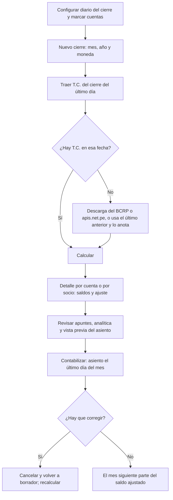

# Guía funcional — Cierre de tipo de cambio

> Módulo técnico `al_l10n_pe_exchange_closure` · versión `9.20261008` · área `OL-ACCOUNTING`.
> Para consultores funcionales: qué resuelve, la norma que lo respalda y el
> proceso completo con un ejemplo que cuadra. Enlaces verificados el
> 10/10/2026 con `docs/validacion/verificar_enlaces.py`.

## 1. Para qué sirve

Al cierre de cada mes, los saldos en moneda extranjera de las cuentas de
balance (bancos, cuentas por cobrar y por pagar, préstamos) deben expresarse
al tipo de cambio de la fecha: los **activos al T.C. compra** y los **pasivos al
T.C. venta**. Hacerlo en hojas de cálculo obliga a arrastrar saldos de cada
mes, separar clientes y proveedores y rehacer todo si llega un documento
atrasado.

El módulo calcula el ajuste desde los apuntes publicados, con **saldos
acumulados** (el mes siguiente parte del saldo ya ajustado), detalle **por
cuenta o por socio**, **analítica** heredada y el **asiento** listo contra las
cuentas de diferencia de cambio (776 ganancia / 676 pérdida). Lo usa el
contador en el cierre mensual.

**Fuera del alcance:** la diferencia de cambio que Odoo registra al conciliar
cobros y pagos (realizada) la hace Odoo; este módulo la considera dentro del
saldo. Las partidas no monetarias (inventarios, activo fijo) no se revalúan.

## 2. Marco normativo y conceptual

- **Ley del Impuesto a la Renta, artículo 61**: las diferencias de cambio son
  resultados computables del ejercicio.
- **Reglamento de la LIR, artículo 34**: para expresar en soles los saldos en
  moneda extranjera se usa el tipo de cambio **compra** para activos y
  **venta** para pasivos, al cierre de operaciones de la fecha del balance.
- **NIC 21**: las partidas monetarias se convierten al tipo de cambio de
  cierre y la diferencia va a resultados.

| Término | Significado | Dónde aparece en Odoo |
|---|---|---|
| Partida monetaria | Saldo que se cobra o paga en una cantidad fija de moneda | Cuentas marcadas para el cierre |
| Saldo en M.E. | Saldo acumulado en dólares a la fecha de cierre | Detalle del cierre |
| Saldo contable | Saldo en soles, con los cierres anteriores | Detalle del cierre |
| Saldo revaluado | Saldo en M.E. × T.C. | Detalle del cierre |
| Ajuste | Revaluado − contable: positivo = ganancia, negativo = pérdida | Detalle y asiento |

## 3. Proceso de inicio a fin

| # | Paso | Dónde en Odoo | Quién | Resultado |
|---|---|---|---|---|
| 1 | Elegir el diario del cierre | Perú ▸ Configuración ▸ Ajustes ▸ Cierre de tipo de cambio | Contador | Diario general dedicado (p. ej. CTC) |
| 2 | Marcar las cuentas | Plan contable ▸ cuenta ▸ Contabilidad ▸ Cierre de tipo de cambio (PE) | Contador | Sin detalle (por cuenta) o con detalle (por socio); T.C. automático o forzado |
| 3 | Revisar las cuentas incluidas | Perú ▸ Configuración ▸ Cuentas de la localización ▸ Cuentas del cierre de T.C. | Contador | Lista filtrada |
| 4 | Crear el cierre y traer el T.C. | Perú ▸ Tipo de cambio ▸ Cierre de tipo de cambio ▸ Nuevo ▸ Traer T.C. | Contador | Compra y venta del cierre |
| 5 | Calcular | Cierre ▸ Calcular | Contador | Detalle con saldo, revaluado y ajuste |
| 6 | Revisar | Cierre ▸ Vista previa del asiento / lupa del renglón | Contador | Asiento previsto y apuntes que forman cada saldo |
| 7 | Contabilizar | Cierre ▸ Contabilizar | Contador | Asiento publicado; estado Contabilizado |

## 4. Ejemplo completo

Cierre de **junio de 2026** en dólares, con **compra 3,410** y **venta 3,418**
(datos de demostración). Saldos acumulados al 30/06/2026:

| Cuenta | Socio | Saldo US$ | T.C. | Saldo S/ | Revaluado S/ | Ajuste S/ |
|---|---|---|---|---|---|---|
| 1041002 Banco en US$ | — | 5 000,00 | 3,410 compra | 16 930,00 | 17 050,00 | +120,00 |
| 1212000 Por cobrar | DEMO TC Cliente | 10 000,00 | 3,410 compra | 33 890,00 | 34 100,00 | +210,00 |
| 1212000 Por cobrar | DEMO TC Analítica | 10 000,00 | 3,410 compra | 33 890,00 | 34 100,00 | +210,00 |
| 4212000 Por pagar | DEMO TC Proveedor | −6 000,00 | 3,418 venta | −20 304,00 | −20 508,00 | −204,00 |

Ganancia S/ 540,00, pérdida S/ 204,00, neto **+S/ 336,00**.

**Asiento del cierre** (CTC, 30/06/2026; las líneas de balance solo corrigen soles)

| Cuenta | Descripción | Debe | Haber |
|---|---|---|---|
| 1041002 | Banco en US$ (5 000 × 3,410) | 120,00 | |
| 1212000 | Por cobrar — DEMO TC Cliente | 210,00 | |
| 1212000 | Por cobrar — DEMO TC Analítica | 210,00 | |
| 4212000 | Por pagar — DEMO TC Proveedor (6 000 × 3,418) | | 204,00 |
| 7760000 | Ganancia por diferencia de cambio | | 540,00 |
| 6760000 | Pérdida por diferencia de cambio | 204,00 | |
| **Totales** | | **744,00** | **744,00** |

En la demostración la ganancia del cliente con analítica (S/ 210,00) va en su
propia línea de la 776 con la distribución heredada de sus ventas (60 % /
40 %). En **julio** (compra 3,395, venta 3,404) cada saldo contable ya incluye
el ajuste de junio, así que solo se reconoce la variación del mes.

## 5. Configuración inicial

1. Diario general para el cierre en **Perú ▸ Configuración ▸ Ajustes ▸ Cierre
   de tipo de cambio**.
2. Cuentas de diferencia de cambio de la compañía (676 / 776).
3. Marque cada cuenta de balance en moneda extranjera: **sin detalle** (bancos,
   préstamos) o **con detalle** (cuentas por cobrar y por pagar) y el **T.C. a
   aplicar** (automático por defecto).
4. Tipos de cambio del mes cargados (módulo `al_l10n_pe_currency`).

## 6. Reportes y libros relacionados

- El asiento entra al **Libro Diario** y a los estados financieros; la columna
  opcional **T.C. de cierre** en los apuntes guarda el tipo usado.
- **Lista de cierres**: ganancia, pérdida, neto y estado por mes.
- Base para el **Libro de Inventarios y Balances** con saldos expresados al
  cierre.

## 7. Casos especiales y errores frecuentes

| Situación | Qué pasa | Qué hacer |
|---|---|---|
| No hay T.C. de la fecha | Intenta descargarlo; si no, usa el último anterior y lo anota | Revise el historial o registre el T.C. a mano |
| Falta diario o cuentas 676/776 | Error al calcular | Complete la configuración |
| Ya hay un cierre posterior contabilizado | No se calcula ni contabiliza el mes anterior | Cancele los cierres posteriores en orden |
| Llegó un documento atrasado | El saldo acumulado lo incluye | Recalcule el mes (o el siguiente lo corrige solo) |
| Cuenta con naturaleza contraria | El automático usaría el tipo equivocado | Fuerce «Siempre compra» o «Siempre venta» en la cuenta |
| Cierre contabilizado con error | No se puede eliminar | Cancelar, volver a borrador y recalcular |

## 8. Preguntas frecuentes del consultor

- **¿Se revierte el asiento al día siguiente?** No: es definitivo y el mes
  siguiente solo reconoce la nueva variación.
- **¿Qué T.C. usa?** Por defecto el cierre de operaciones del último día del
  mes (SBS), que SUNAT publica con fecha del día siguiente.
- **¿Por qué detallar por socio?** Para que el ajuste de cada cliente o
  proveedor se pueda conciliar con sus documentos.
- **¿Se pueden tener dos cierres del mismo mes?** Solo uno vigente por mes,
  moneda y compañía (los cancelados no cuentan).

## 9. Referencias

Verificadas el 10/10/2026.

- [Ley del Impuesto a la Renta, capítulo IX — artículo 61 (SUNAT)](https://www.sunat.gob.pe/legislacion/renta/ley/capix.pdf)
- [Reglamento de la LIR, capítulo IX — artículo 34 (SUNAT)](https://www.sunat.gob.pe/legislacion/renta/regla/cap9.pdf)
- [NIC 21 — Efectos de las variaciones en los tipos de cambio (IFRS Foundation)](https://www.ifrs.org/issued-standards/list-of-standards/ias-21-the-effects-of-changes-in-foreign-exchange-rates/)
- [Tipo de cambio promedio ponderado (SBS)](https://www.sbs.gob.pe/app/pp/sistip_portal/paginas/publicacion/tipocambiopromedio.aspx)
- [Series estadísticas del BCRP](https://estadisticas.bcrp.gob.pe/estadisticas/series/)
- [Odoo 19 — Multimoneda](https://www.odoo.com/documentation/19.0/applications/finance/accounting/get_started/multi_currency.html)
