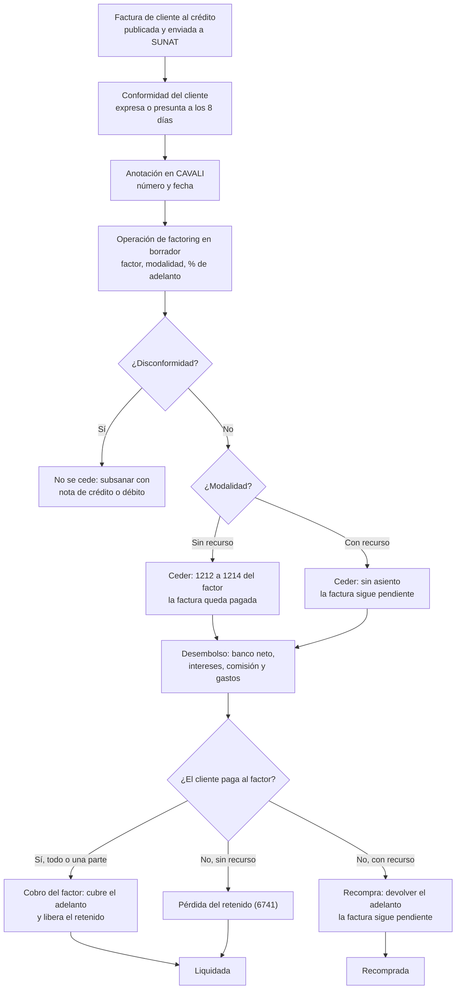

# Guía funcional — Factoring de facturas

> Módulo técnico `al_l10n_pe_factoring` · versión `4.20261010` · área `OL-ACCOUNTING`.
> Para consultores funcionales: qué resuelve, la norma que lo respalda y el
> proceso completo con un ejemplo que cuadra. Enlaces verificados el
> 10/10/2026 con `docs/validacion/verificar_enlaces.py`.

## 1. Para qué sirve

Una empresa que vende al crédito (30, 60 o 90 días) necesita liquidez antes de
que el cliente pague. Con el **factoring** cede (vende) esas facturas a un
banco o empresa de factoring —el **factor**—, que le adelanta la mayor parte
del importe y cobra la factura al vencimiento.

El módulo lo usan **tesorería y contabilidad**: registra en Odoo la operación
con el factor sobre las facturas de cliente ya emitidas, sin duplicarlas, y
genera los asientos de cada momento (cesión, desembolso, intereses, cobro,
recompra o pérdida) con las cuentas del PCGE.

**Fuera del alcance:** la comunicación con CAVALI (Factrack) y con la
plataforma de conformidad de SUNAT (aquí se registran los datos que devuelven),
la factura negociable impresa (tercera copia física) y los desembolsos
parciales del factor dentro de una misma operación (se usa una operación por
tramo).

## 2. Marco normativo y conceptual

**Normas**

- **Ley 29623**, que promueve el financiamiento a través de la factura
  comercial: crea la **factura negociable**, un título valor que incorpora el
  derecho de cobro del saldo de la factura y que puede transferirse.
- **Decreto de Urgencia 013-2020** (financiamiento de la MIPYME): modifica la
  Ley 29623 y, para la factura electrónica (Título I), exige que la factura al
  crédito informe el **plazo de pago** y el **monto neto pendiente de pago**, que
  se ponga a disposición del cliente y de SUNAT (hasta 2 días) y regula la
  **conformidad**: el cliente tiene **8 días calendario** para dar su
  conformidad o disconformidad; si no se pronuncia, se **presume conforme** sin
  admitir prueba en contrario (art. 7). La factura electrónica puede
  transferirse desde su **anotación en cuenta** en una ICLV (CAVALI).
- **R.S. 193-2020/SUNAT**: la factura electrónica indica la forma de pago
  (contado o crédito) y, si es al crédito, el monto neto pendiente de pago y las
  fechas y montos de las cuotas. El monto neto **excluye** la detracción y la
  retención del IGV.
- **R.S. 037-2002/SUNAT** (régimen de retenciones del IGV): un cliente agente
  de retención retiene el 3 % de las facturas de más de S/ 700.
- **NIIF 9** (instrumentos financieros): decide si la cuenta por cobrar se da de
  baja según quién asume el riesgo.
- **Ley del IGV**: la cesión de créditos no es una venta gravada; no se emite
  comprobante por la cesión. Los intereses y comisiones del factor siguen las
  reglas de los servicios financieros.

**Conceptos clave**

| Término | Significado | Dónde aparece en Odoo |
|---|---|---|
| Factor | Banco o empresa que compra las facturas | Operación ▸ Factor |
| Sin recurso | El factor asume el riesgo de impago: la factura se da de baja | Operación ▸ Modalidad |
| Con recurso | Si el cliente no paga, la empresa devuelve el adelanto: la factura **no** se da de baja y el adelanto es una deuda | Operación ▸ Modalidad |
| Valor nominal | Monto neto pendiente de pago que se cede | Línea ▸ Valor nominal |
| Adelanto | Parte del nominal que el factor paga al inicio (p. ej. 90 %) | Línea ▸ % de adelanto |
| Retenido | Resto del nominal; el factor lo paga cuando el cliente cancela | Línea ▸ Retenido |
| Conformidad | Aceptación de la factura por el cliente (expresa o presunta) | Línea ▸ Conformidad |
| Anotación en cuenta | Registro de la factura negociable en CAVALI | Línea ▸ Anotación CAVALI |
| Recompra | Con recurso: la empresa devuelve el adelanto porque el cliente no pagó | Operación ▸ Recompra |

## 3. Proceso de inicio a fin

| # | Paso | Dónde en Odoo | Quién | Resultado |
|---|---|---|---|---|
| 1 | Emitir la factura al crédito (con plazo de pago) | Contabilidad ▸ Clientes ▸ Facturas | Ventas / facturación | Factura publicada; el CPE informa el monto neto pendiente |
| 2 | Registrar la conformidad y la anotación en CAVALI | Operación ▸ Facturas (columnas Conformidad, Anotación CAVALI) | Tesorería | La disconformidad impide ceder |
| 3 | Crear la operación | Contabilidad ▸ Clientes ▸ Facturas ▸ Acciones ▸ Ceder a factoring, o Perú ▸ Factoring ▸ Operaciones | Tesorería | Operación en **Borrador** con el nominal propuesto |
| 4 | Ceder | Operación ▸ Ceder facturas | Tesorería | **Cedida**; sin recurso, asiento de cesión |
| 5 | Registrar el desembolso | Operación ▸ Registrar desembolso | Tesorería | **Desembolsada**; asiento de banco |
| 6 | Devengar intereses (con recurso) | Operación ▸ Devengar intereses | Contabilidad | Gasto financiero del periodo |
| 7 | Cobro del factor (total o parcial) | Operación ▸ Cobro del factor | Tesorería | **Liquidada** cuando todo está cobrado |
| 7b | Recompra (con recurso, impago) | Operación ▸ Recompra | Tesorería | **Recomprada**; la factura sigue pendiente |
| 7c | Pérdida del retenido (sin recurso, impago) | Operación ▸ Pérdida del retenido | Contabilidad | **Liquidada**; pérdida en 6741 |

Caminos alternativos: **Cancelar** solo antes del desembolso (la factura vuelve
al cliente); **Volver a borrador** una operación cancelada. Una factura no se
puede ceder dos veces salvo que la operación anterior se cancele o se recompre.

## 4. Ejemplo completo

Constructora SAC emite el **01/10/2026** la factura F001-125 a Inmobiliaria del
Sur SAC por **S/ 10 000 + IGV 1 800 = S/ 11 800**, al crédito con vencimiento el
**30/11/2026**. El cliente es **agente de retención**. El 10/10/2026 la cede a
Factor Capital SA con un **adelanto del 90 %**; el factor cobra **intereses de
S/ 180**, una **comisión facturada de S/ 118** (S/ 100 + IGV 18) y **gastos de
S/ 20**.

**Cálculos (verificados)**

- Monto neto pendiente de pago = 11 800 − retención 3 % (354,00) = **S/ 11 446,00**
  (valor nominal propuesto; la retención la sustenta el cliente con su
  comprobante de retención).
- Adelanto = 11 446,00 × 90 % = **S/ 10 301,40**; retenido = **S/ 1 144,60**.
- Neto en el banco = 10 301,40 − 180 − 118 − 20 = **S/ 9 983,40**.
- Conformidad presunta: 01/10/2026 + 8 días = **09/10/2026** (antes de ceder).

**Factura de la comisión del factor** (se registra como factura de proveedor)

| Cuenta | Descripción | Debe | Haber |
|---|---|---|---|
| 6391 | Comisión de factoring | 100,00 | |
| 40111 | IGV crédito fiscal | 18,00 | |
| 4212 | Factor Capital SA (por pagar) | | 118,00 |
| | **Total** | **118,00** | **118,00** |

### 4.1 Sin recurso

**Cesión (10/10/2026)** — la factura queda pagada por el nominal

| Cuenta | Descripción | Debe | Haber |
|---|---|---|---|
| 1214 | Facturas cedidas — Factor Capital SA | 11 446,00 | |
| 1212 | Facturas por cobrar — Inmobiliaria del Sur SAC | | 11 446,00 |
| | **Total** | **11 446,00** | **11 446,00** |

**Desembolso** — la comisión facturada se paga con el descuento

| Cuenta | Descripción | Debe | Haber |
|---|---|---|---|
| 1041 | Banco | 9 983,40 | |
| 6734 | Intereses por documentos descontados | 180,00 | |
| 4212 | Factura de la comisión (se concilia y queda pagada) | 118,00 | |
| 6391 | Gastos | 20,00 | |
| 1214 | Adelanto — Factor Capital SA | | 10 301,40 |
| | **Total** | **10 301,40** | **10 301,40** |

**Cobros del factor** — el cliente paga en dos partes

1. Paga S/ 6 000: cubre el adelanto; no libera retenido → **sin asiento**
   (queda por cobrar S/ 5 446).
2. Paga S/ 5 446: S/ 4 301,40 completan el adelanto y **S/ 1 144,60** liberan el
   retenido:

| Cuenta | Descripción | Debe | Haber |
|---|---|---|---|
| 1041 | Banco | 1 144,60 | |
| 1214 | Retenido liberado — Factor Capital SA | | 1 144,60 |
| | **Total** | **1 144,60** | **1 144,60** |

Si el cliente no pagara, el factor asume el impago pero no libera el retenido:
**Pérdida del retenido** = 6741 debe 1 144,60 / 1214 haber 1 144,60.

### 4.2 Con recurso (misma factura)

**Cesión** — sin asiento: la factura sigue pendiente a nombre del cliente (NIIF
9) y se marca «Cedida»; «Pagar» queda bloqueado (la cobra el factor).

**Desembolso** — el adelanto es una obligación; los intereses se difieren

| Cuenta | Descripción | Debe | Haber |
|---|---|---|---|
| 1041 | Banco | 9 983,40 | |
| 3731 | Intereses por devengar | 180,00 | |
| 4212 | Factura de la comisión | 118,00 | |
| 6391 | Gastos | 20,00 | |
| 4512 | Obligación con Factor Capital SA | | 10 301,40 |
| | **Total** | **10 301,40** | **10 301,40** |

**Devengo** (octubre y noviembre, S/ 90 cada mes): 6734 debe 90,00 / 3731 haber
90,00.

**Cobro del factor** (el cliente pagó todo al vencimiento)

| Cuenta | Descripción | Debe | Haber |
|---|---|---|---|
| 4512 | Cancelación del adelanto | 10 301,40 | |
| 1041 | Banco (retenido) | 1 144,60 | |
| 1212 | Inmobiliaria del Sur SAC (la factura queda pagada) | | 11 446,00 |
| | **Total** | **11 446,00** | **11 446,00** |

**Recompra** (si el cliente no pagó nada): 4512 debe 10 301,40 / banco haber
10 301,40; la factura sigue pendiente y se gestiona como cualquier deuda del
cliente (provisión o castigo nativos de Odoo).

**Moneda extranjera:** una obligación de USD 800 recibida a 3,75 (S/ 3 000) y
cancelada cuando el dólar está a 3,80 se salda en la 4512 por S/ 3 000 (cambio
histórico) y la diferencia de **S/ 40** va a pérdida por diferencia de cambio.

## 5. Configuración inicial

1. Cuentas: *Perú ▸ Configuración ▸ Cuentas de la localización ▸ Factoring*.
   Se crean solas con el PCGE por modalidad (1214, 4512, 6734, 3731, 6391 y
   6741); ajústelas al plan de la empresa y añada filas por moneda si usa
   cuentas distintas en dólares.
2. Diarios: un diario de tipo «Varios» para la cesión y el devengo, y el
   diario del banco donde abona el factor.
3. Factor: créelo como contacto (empresa con RUC). Para comisiones facturadas,
   registre su factura de proveedor antes del desembolso.
4. Facturas al crédito: use términos de pago con vencimiento (la factura
   negociable nace de una venta al crédito).
5. Permisos: facturación (crear y operar), administrador contable (cuentas),
   solo lectura (auditor).
6. Diferencia de cambio: verifique las cuentas de ganancia y pérdida por
   diferencia de cambio en los ajustes de Contabilidad.

## 6. Reportes y libros relacionados

- **Perú ▸ Factoring ▸ Facturas cedidas**: cartera cedida por factor, cliente y
  vencimiento; cobrado y por cobrar; vencidas en rojo.
- **Perú ▸ Factoring ▸ Análisis de factoring**: nominal y pendiente por factor
  y estado.
- **Perú ▸ Factoring ▸ Costo financiero**: intereses, comisión, gastos y
  retenido perdido por factor y mes.
- **Libros electrónicos**: la factura sigue en el Registro de Ventas (RVIE) por
  su importe; la cesión no genera comprobante. Los asientos de cesión,
  desembolso y cobro van al **Libro Diario**. La comisión facturada va al
  Registro de Compras como cualquier factura de proveedor.

## 7. Casos especiales y errores frecuentes

| Situación | Qué pasa | Qué hacer |
|---|---|---|
| El cliente dio su disconformidad | La operación no se puede ceder | Subsanar con nota de crédito o débito (o nuevo comprobante) y registrar la conformidad |
| Factura al contado | La cesión lo advierte en el historial | Verificar con el factor: la factura negociable nace de una venta al crédito |
| Factura con detracción | El nominal propuesto excluye la detracción | El cliente deposita la detracción en el Banco de la Nación; esa parte sigue en la factura |
| Cliente agente de retención | El nominal excluye el 3 % | Registrar la retención sufrida con el comprobante del cliente |
| Nominal mayor que el saldo de la factura | Error al ceder | Corregir el valor nominal |
| Intereses y comisiones mayores que el adelanto | Error en el desembolso | Revisar la liquidación del factor |
| Se intenta «Pagar» una factura cedida | Bloqueado | Registrar el cobro desde la operación |
| Hay que deshacer una cesión | Solo antes del desembolso | Operación ▸ Cancelar |
| El cliente pagó solo una parte | Cobro parcial | Cobro del factor con una sola factura e importe cobrado |

## 8. Preguntas frecuentes del consultor

**¿Qué modalidad elegir?** La que diga el contrato con el factor. Si el factor
puede exigir la devolución cuando el cliente no paga, es **con recurso**.

**¿Por qué con recurso la factura no aparece pagada?** Porque según NIIF 9 el
riesgo sigue en la empresa: la cuenta por cobrar no se da de baja hasta que el
cliente paga al factor.

**¿Se emite algún comprobante por la cesión?** No. La cesión no está gravada con
IGV; solo la comisión del factor, si la factura.

**¿Dónde veo cuánto me cuesta el factoring?** En *Costo financiero*: intereses,
comisión, gastos y retenido perdido por factor y mes.

**¿Se integra con CAVALI o SUNAT?** No en esta versión: se registran el número y
la fecha de anotación y el estado de conformidad que informan esas
plataformas.

**¿Puedo ceder solo una parte de una factura?** Sí: el valor nominal es
editable (no puede superar el saldo pendiente).

## 9. Referencias

Enlaces verificados el 10/10/2026:

- Ley 29623 (texto original, Congreso): https://www.leyes.congreso.gob.pe/Documentos/Leyes/29623.pdf
- Decreto de Urgencia 013-2020 (Congreso): https://www.leyes.congreso.gob.pe/Documentos/2016_2021/Decretos/Urgencias/2020/DU-013-2020-PP.pdf
- R.S. 193-2020/SUNAT: https://www.sunat.gob.pe/legislacion/superin/2020/193-2020.pdf
- Anexo de la R.S. 193-2020/SUNAT (forma de pago y cuotas en el UBL): https://www.sunat.gob.pe/legislacion/superin/2020/anexo4-193-2020.pdf
- R.S. 193-2020/SUNAT en gob.pe: https://www.gob.pe/institucion/sunat/normas-legales/1124498-193-2020-sunat
- R.S. 037-2002/SUNAT (régimen de retenciones del IGV): https://www.sunat.gob.pe/legislacion/superin/2002/037.htm
- TUO de la Ley del IGV (SUNAT): https://www.sunat.gob.pe/legislacion/igv/ley/index.html
- CAVALI: https://www.cavali.com.pe/
- NIIF 9 Instrumentos financieros (IFRS Foundation): https://www.ifrs.org/issued-standards/list-of-standards/ifrs-9-financial-instruments/
- NIC 21 Efectos de las variaciones en las tasas de cambio: https://www.ifrs.org/issued-standards/list-of-standards/ias-21-the-effects-of-changes-in-foreign-exchange-rates/
- Plan Contable General Empresarial (MEF): https://www.mef.gob.pe/contenidos/conta_publ/documentac/PCGE_2019.pdf
- Documentación de Contabilidad de Odoo 19: https://www.odoo.com/documentation/19.0/applications/finance/accounting.html
