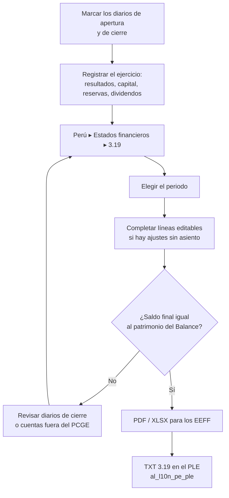

# Guía funcional — Reportes financieros Perú

> Módulo técnico `al_l10n_pe_financial_reports` · versión `2.20261008` · área `OL-ACCOUNTING`.
> Para consultores funcionales: qué resuelve, la norma que lo respalda y el
> proceso completo con un ejemplo que cuadra. Enlaces verificados el
> 10/10/2026 con `docs/validacion/verificar_enlaces.py`.

## 1. Para qué sirve

Reúne los **estados financieros peruanos** como informes contables de Odoo,
en **Perú ▸ Estados financieros**. Hoy contiene el **Estado de Cambios en el
Patrimonio Neto (formato 3.19)**, calculado desde los asientos con las cuentas
del PCGE, y accesos al **Balance** y al **Estado de Resultados** de Odoo
Enterprise en su variante peruana.

Lo usa el contador al cierre del ejercicio o de un periodo intermedio. El
3.19 sale en pantalla, en PDF y en XLSX, y **cuadra con el patrimonio del
Balance** a la misma fecha.

**Fuera del alcance:** el Estado de Flujos de Efectivo y la versión por
columnas del 3.19 (la del módulo 18.0 no se migró). El TXT 3.19 para el PLE lo
genera `al_l10n_pe_ple`.

## 2. Marco normativo y conceptual

- **NIC 1, Presentación de estados financieros**: exige el estado de cambios
  en el patrimonio entre los estados financieros completos.
- **PCGE** (Plan Contable General Empresarial): define las cuentas de
  patrimonio (50 capital, 51 acciones de inversión, 52 capital adicional, 56 y
  57 resultados no realizados y excedente de revaluación, 58 reservas, 59
  resultados acumulados). Vigente el PCGE 2019; el **PCGE 2026** fue aprobado
  en setiembre de 2026 y es obligatorio desde el 1/1/2028.
- **Formato 3.19** del Libro de Inventarios y Balances (R.S. 286-2009/SUNAT).

| Término | Significado | Dónde aparece en Odoo |
|---|---|---|
| Saldo inicial | Patrimonio al día anterior al periodo, más la apertura | Primera línea del informe |
| Saldo reexpresado | Saldo inicial + cambios de política + corrección de errores | Línea editable |
| Movimiento | Variación del periodo por rubro | Columna Movimiento |
| Diario de apertura / cierre | Naturaleza del diario (`al_account_base`) | Perú ▸ Configuración ▸ Contabilidad ▸ Diarios |
| Línea editable | Importe que no sale de asientos (aportes, distribuciones) | Lápiz de la línea |

## 3. Proceso de inicio a fin

| # | Paso | Dónde en Odoo | Quién | Resultado |
|---|---|---|---|---|
| 1 | Naturaleza de los diarios | Perú ▸ Configuración ▸ Contabilidad ▸ Diarios ▸ Naturaleza del diario | Contador | Apertura y cierre identificados |
| 2 | Abrir el informe | Perú ▸ Estados financieros ▸ 3.19 Estado de Cambios en el Patrimonio Neto | Contador | Saldo inicial, movimientos y saldo final |
| 3 | Ajustes sin asiento | Lápiz de la línea (cambios de política, corrección de errores, aportes…) | Contador | Importe con nota |
| 4 | Cuadrar con el Balance | Perú ▸ Estados financieros ▸ Balance | Contador | Mismo patrimonio |
| 5 | Exportar | Botones PDF / XLSX | Contador | Archivo para los EEFF |

## 4. Ejemplo completo

Saldos al 1/1/2026: capital 50.000 (5011), reserva legal 5.000 (5821) y
resultados acumulados 20.000 (5911): **patrimonio inicial 75.000**.

Movimientos del ejercicio:

| Hecho | Cuenta | Debe | Haber |
|---|---|---|---|
| Aumento de capital en efectivo | 1041 Banco | 10.000,00 | |
| | 5011 Capital social | | 10.000,00 |
| Dividendos declarados | 5911 Utilidades acumuladas | 8.000,00 | |
| | 4411 Dividendos por pagar | | 8.000,00 |
| Constitución de reserva legal | 5911 Utilidades acumuladas | 1.200,00 | |
| | 5821 Reserva legal | | 1.200,00 |
| | **Totales** | **19.200,00** | **19.200,00** |

Además, el resultado del ejercicio en las cuentas de resultados es una
ganancia de **12.000**.

Estado de Cambios en el Patrimonio Neto (columna Movimiento):

| Línea | Importe |
|---|---|
| Saldos al inicio del periodo | 75.000,00 |
| Ganancia (pérdida) neta del ejercicio | 12.000,00 |
| Emisión (reducción) de capital | 10.000,00 |
| Constitución (aplicación) de reservas | 1.200,00 |
| Dividendos y otras variaciones de resultados acumulados | −9.200,00 |
| **Saldos al final del periodo** | **89.000,00** |

Comprobación: 75.000 + 12.000 + 10.000 + 1.200 − 9.200 = 89.000, igual al
patrimonio del Balance (capital 60.000 + reserva 6.200 + resultados
acumulados 10.800 + resultado del ejercicio 12.000 = 89.000). La línea de la
cuenta 59 suma el dividendo (−8.000) y el traslado a la reserva (−1.200).

## 5. Configuración inicial

1. Usar el **plan contable peruano** (PCGE) con las cuentas 50 a 59 para el
   patrimonio.
2. Marcar la **naturaleza** de los diarios: *Apertura* para la carga de
   saldos al empezar a usar Odoo y *Cierre* para los asientos de cierre del
   ejercicio, que el informe excluye de los movimientos.
3. No requiere otros ajustes: el informe está disponible al instalar el
   módulo.

## 6. Reportes y libros relacionados

- **Balance** y **Estado de resultados** (Enterprise) en el mismo menú.
- **TXT 3.19** del Libro de Inventarios y Balances: `al_l10n_pe_ple`, con la
  captura por rubro de la tabla 34.
- Libro 3 en general (3.8, 3.9, 3.23): ver la guía de `al_l10n_pe_ple`.

## 7. Casos especiales y errores frecuentes

| Situación | Qué pasa | Qué hacer |
|---|---|---|
| El saldo final no cuadra con el Balance | Hay ajustes editables o asientos de cierre en un diario sin naturaleza Cierre | Revisar las líneas editables y la naturaleza de los diarios |
| El resultado sale duplicado | El asiento de cierre está en un diario de movimiento | Pasar el asiento a un diario de naturaleza Cierre |
| Cierre y reapertura de todo el balance al 31/12 | Ambos asientos deben ir en diarios de Cierre | El diario de Apertura queda solo para la carga inicial |
| Cuentas de patrimonio fuera de 50-59 | Salen en «Otras variaciones del patrimonio» | Revisar el plan de cuentas |

## 8. Preguntas frecuentes del consultor

**¿De dónde sale el resultado del ejercicio?** De las cuentas de resultados
del periodo, no de la cuenta 59: así sale aunque aún no se haya cerrado.

**¿Puedo agregar notas a las líneas?** Sí, las líneas editables llevan nota.

**¿El PCGE 2026 cambia algo?** Será obligatorio desde 2028; si el plan
cambia, habrá que revisar las cuentas de cada línea.

## 9. Referencias

Verificadas el 10/10/2026:

- NIC 1 — Presentación de estados financieros (IFRS Foundation): https://www.ifrs.org/issued-standards/list-of-standards/ias-1-presentation-of-financial-statements/
- Resolución 002-2019-EF/30 — PCGE 2019 (MEF): https://mef.gob.pe/contenidos/conta_publ/documentac/Resolucion_CNC002_2019EF30.pdf
- Resolución 002-2026-EF/30 — PCGE 2026 (El Peruano): https://busquedas.elperuano.pe/dispositivo/NL/2550786-1
- R.S. 286-2009/SUNAT — Libros electrónicos (formato 3.19): https://www.sunat.gob.pe/legislacion/superin/2009/rs286.doc
- Odoo 19 — Informes contables: https://www.odoo.com/documentation/19.0/applications/finance/accounting/reporting.html
