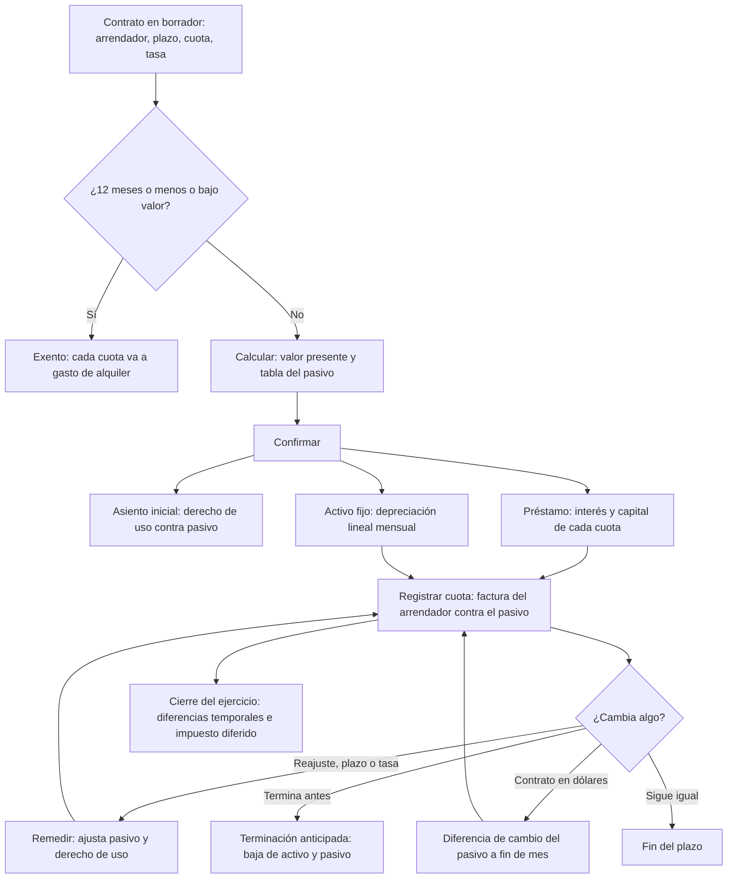

# Guía funcional — Arrendamientos NIIF 16

> Módulo técnico `al_l10n_pe_lease` · versión `2.20261010` · área `OL-ACCOUNTING`.
> Para consultores funcionales: qué resuelve, la norma que lo respalda y el
> proceso completo con un ejemplo que cuadra. Enlaces verificados el
> 10/10/2026 con `docs/validacion/verificar_enlaces.py`.

## 1. Para qué sirve

Una empresa que alquila oficinas, almacenes, locales o equipos (es
**arrendataria**) y reporta con NIIF plenas no puede registrar el alquiler
como un simple gasto del mes: la NIIF 16 le exige reconocer en el balance un
**pasivo** por las cuotas futuras y un **activo por derecho de uso**. Además,
para el impuesto a la renta se sigue deduciendo el alquiler, lo que obliga a
controlar una diferencia temporal.

El módulo lleva el contrato de principio a fin: lo mide, crea el activo y el
pasivo, genera cada mes la depreciación y el interés, prepara la factura del
arrendador, permite **remedir** (reajuste de renta, cambio de plazo o de
tasa), **terminar antes de tiempo**, ajustar por **diferencia de cambio** los
contratos en dólares y calcular el **impuesto diferido**. Lo usan el contador
general y el área de tesorería o administración que recibe las facturas del
arrendador.

**Fuera del alcance:**

- El arrendador (quien da en alquiler): el módulo es solo para el arrendatario.
- Pagos variables (porcentaje de ventas, consumo, mantenimiento): se facturan
  aparte, a gasto; no forman parte del pasivo.
- La garantía entregada al arrendador: es informativa en el contrato; se
  registra aparte (por ejemplo con el módulo de depósitos en garantía).
- El asiento del impuesto diferido: el reporte calcula el importe; el
  contador registra el asiento.
- Necesita **Odoo Enterprise** (usa los módulos de activos fijos y de
  préstamos de Odoo).

## 2. Marco normativo y conceptual

- **NIIF 16 Arrendamientos** (IASB; oficializada en el Perú por el Consejo
  Normativo de Contabilidad). El arrendatario reconoce un activo por derecho
  de uso y un pasivo por arrendamiento, salvo las exenciones de corto plazo
  (12 meses o menos) y de bajo valor.
  [NIIF 16 (IFRS Foundation)](https://www.ifrs.org/issued-standards/list-of-standards/ifrs-16-leases/) ·
  [NIIF 16 en español (MEF)](https://mef.gob.pe/contenidos/conta_publ/con_nor_co/niif/NIIF_16_BV2024_IRACH.pdf)
- **PCGE 2019** (Res. N.° 002-2019-EF/30): incorporó las cuentas del derecho
  de uso por arrendamiento operativo (32x), su depreciación acumulada (39x) y
  su gasto de depreciación (68x).
  [PCGE 2019](https://cdn.www.gob.pe/uploads/document/file/315820/PCGE_2019.pdf) ·
  [Resolución N.° 002-2019-EF/30](https://mef.gob.pe/contenidos/conta_publ/documentac/Resolucion_CNC002_2019EF30.pdf)
- **Impuesto a la renta.** Se deducen los gastos necesarios para producir la
  renta (artículo 37) en el ejercicio en que se devengan (artículo 57). SUNAT
  concluyó que el derecho de uso **no es activo fijo ni intangible**: no se
  deprecia ni amortiza para el impuesto, de modo que lo deducible es el
  alquiler devengado. El mismo informe señala que el derecho de uso **sí
  integra la base del ITAN**.
  [Informe N.° 054-2021-SUNAT/7T0000](https://www.sunat.gob.pe/legislacion/oficios/2021/informe-oficios/i054-2021-7T0000.pdf) ·
  [LIR, capítulo VI (art. 37)](https://www.sunat.gob.pe/legislacion/renta/ley/capvi.pdf) ·
  [LIR, capítulo VIII (art. 57)](https://www.sunat.gob.pe/legislacion/renta/ley/capviii.pdf)
- **NIC 12 Impuesto a las ganancias**: la diferencia entre el gasto contable y
  el deducible es temporal y genera impuesto diferido, a la tasa del 29,5 %
  (artículo 55 de la LIR).
  [NIC 12](https://www.ifrs.org/issued-standards/list-of-standards/ias-12-income-taxes/) ·
  [LIR, capítulo VII (art. 55)](https://www.sunat.gob.pe/legislacion/renta/ley/capvii.pdf)
- **NIC 21 Efectos de las variaciones en las tasas de cambio**: el pasivo en
  dólares es una partida monetaria (se ajusta al cierre); el derecho de uso es
  no monetario (queda al tipo de cambio del inicio).
  [NIC 21](https://www.ifrs.org/issued-standards/list-of-standards/ias-21-the-effects-of-changes-in-foreign-exchange-rates/)
- **IGV y detracción** de la factura del arrendador: el arrendamiento de
  bienes está en el Anexo 3 del sistema de detracciones (10 %).
  [R.S. N.° 183-2004/SUNAT](https://www.sunat.gob.pe/legislacion/superin/2004/183.htm) ·
  [Cartilla de detracciones (SUNAT)](https://orientacion.sunat.gob.pe/sites/default/files/inline-files/Cartilla_detracciones.pdf)

| Término | Significado | Dónde aparece en Odoo |
|---|---|---|
| Pasivo por arrendamiento | Valor presente de las cuotas que faltan pagar | «Pasivo inicial»; cuentas 4521 / 4522 |
| Derecho de uso | Activo que representa usar el bien durante el plazo | «Derecho de uso»; activo fijo enlazado |
| Tasa incremental de endeudamiento | Tasa que la empresa pagaría por un préstamo al mismo plazo | «Tasa incremental anual (%)» |
| Cuota adelantada / vencida | Se paga al inicio o al final de cada mes | «Pago» |
| Remedición | Recalcular el pasivo por un cambio del contrato | Botón «Remedir» |
| Diferencia temporal | Gasto contable − gasto deducible | Menú «Diferencias temporales» |

## 3. Proceso de inicio a fin

| # | Paso | Dónde en Odoo (menú ▸ …) | Quién | Resultado |
|---|---|---|---|---|
| 1 | Crear las subcuentas del pasivo (una vez) | Contrato ▸ Crear subcuentas del pasivo | Contador | Cuentas 4521 (largo plazo) y 4522 (corto plazo) |
| 2 | Registrar el contrato | Perú ▸ Arrendamientos ▸ Contratos ▸ Nuevo | Contador | Contrato en borrador; si dura 12 meses o menos, «Corto plazo» |
| 3 | Calcular | Contrato ▸ Calcular | Contador | Pasivo, derecho de uso y tabla del pasivo |
| 4 | Confirmar | Contrato ▸ Confirmar | Contador | Asiento inicial, activo fijo y préstamo; estado «En curso» (o «Exento») |
| 5 | Cada mes: depreciación e interés | Automático (fecha de cada asiento) | Odoo | Depreciación 683 / 39 y cuota del préstamo (interés 673, capital y corto plazo) |
| 6 | Cada mes: factura del arrendador | Contrato ▸ Registrar cuota | Tesorería | Factura en borrador contra el pasivo de corto plazo, con IGV y detracción |
| 7 | Si cambia la renta, el plazo o la tasa | Contrato ▸ Remedir | Contador | Pasivo y derecho de uso ajustados; préstamo nuevo; historial |
| 8 | Contratos en dólares, a fin de mes | Automático (cron) o Contrato ▸ Diferencia de cambio | Odoo / contador | Ajuste del pasivo al tipo de cambio de cierre |
| 9 | Si el contrato termina antes | Contrato ▸ Terminación anticipada | Contador | Baja del derecho de uso (pérdida) y del pasivo (ganancia); «Terminado» |
| 10 | Al cierre del ejercicio | Perú ▸ Arrendamientos ▸ Diferencias temporales | Contador | Diferencia temporal e impuesto diferido por contrato |
| 11 | Al vencer el plazo | Contrato ▸ Fin del plazo | Contador | Contrato «Terminado» |

**Caminos alternativos.** Un contrato confirmado no se cancela: se termina
anticipadamente. La remedición y la terminación rigen desde el **primer día
de un mes** sin asientos del préstamo ni del activo contabilizados desde esa
fecha (los asientos posteriores se rehacen). El cierre de un periodo con
fecha de bloqueo impide cambios anteriores a ella, como en todo Odoo.

## 4. Ejemplo completo

**Caso.** Comercial Demo Perú S.A.C. alquila el *Depósito Ate* desde el
01/01/2026 por 36 meses, cuota de S/ 3 000 sin IGV pagada al inicio de cada
mes, tasa incremental del 12 % anual. Desde el 01/10/2026 la renta sube a
S/ 3 300 (reajuste del 10 %). Es el contrato de demostración ARR/2026/0080.

**Medición inicial.**

- Tasa mensual = 1,12^(1/12) − 1 = **0,948879 %**.
- Pasivo = valor presente de las 35 cuotas que faltan (la de enero se paga al
  firmar) = 3 000 × Σ 1/(1 + r)^k, k = 1…35 = **S/ 88 988,92**.
- Derecho de uso = pasivo + cuota adelantada = 88 988,92 + 3 000 =
  **S/ 91 988,92**, que se deprecia en 36 meses: S/ 2 555,25 al mes.

| Cuenta | Descripción | Debe | Haber |
|---|---|---|---|
| 32331 | Derecho de uso – edificaciones | 91 988,92 | |
| 4521 | Pasivo por arrendamiento – largo plazo | | 88 988,92 |
| 183 | Cuota de enero pagada por adelantado (transitoria) | | 3 000,00 |
| | **Totales** | **91 988,92** | **91 988,92** |

La factura de enero del arrendador carga la 183 y la salda.

**Cada mes (febrero).** El préstamo registra la cuota 2 al 28/02: interés =
88 988,92 × 0,948879 % = 844,40; capital = 3 000 − 844,40 = 2 155,60.

| Cuenta | Descripción | Debe | Haber |
|---|---|---|---|
| 4521 | Capital del pasivo (largo plazo) | 2 155,60 | |
| 6732 | Intereses del arrendamiento | 844,40 | |
| 4522 | Cuota por pagar (corto plazo) | | 3 000,00 |
| | **Totales** | **3 000,00** | **3 000,00** |

La factura del arrendador de febrero (con «Producto de la cuota»):

| Cuenta | Descripción | Debe | Haber |
|---|---|---|---|
| 4522 | Cuota por pagar (corto plazo) | 3 000,00 | |
| 40111 | IGV de la cuota (18 %) | 540,00 | |
| 4212 | Proveedor (arrendador) | | 3 540,00 |
| | **Totales** | **3 540,00** | **3 540,00** |

La depreciación del mes la registra el activo: 683111 a 39412 por S/ 2 555,25.
Como la factura supera S/ 700, el pago lleva la detracción del 10 %
(S/ 354,00), que gestiona el módulo de detracciones.

**Remedición desde el 01/10/2026.** Antes del cambio, el pasivo pendiente es
**S/ 71 160,39** (saldo tras la cuota de setiembre). Con 27 cuotas de S/ 3 300
(la de octubre se paga ese mismo día) el pasivo remedido es
3 300 + 3 300 × Σ 1/(1 + r)^k, k = 1…26 = **S/ 79 019,18**. La diferencia,
**S/ 7 858,79**, aumenta el derecho de uso:

| Cuenta | Descripción | Debe | Haber |
|---|---|---|---|
| 32331 | Derecho de uso (aumento bruto) | 7 858,79 | |
| 4521 | Pasivo por arrendamiento – largo plazo | | 7 858,79 |
| | **Totales** | **7 858,79** | **7 858,79** |

El aumento se deprecia en los 27 meses que faltan (S/ 291,07 al mes). Un
préstamo nuevo lleva la tabla remedida: cuota de octubre sin interés (se paga
el mismo día) y la de noviembre con interés de
(79 019,18 − 3 300) × 0,948879 % = **718,48**.

**Ejercicio 2026: diferencia temporal.** Con los importes del módulo:

| Concepto | Importe (S/) |
|---|---|
| Depreciación del derecho de uso (enero–diciembre) | 31 536,17 |
| Interés del pasivo (enero–diciembre) | 7 583,94 |
| **Gasto contable (NIIF 16)** | **39 120,11** |
| Alquiler deducible: 9 × 3 000 + 3 × 3 300 | 36 900,00 |
| **Diferencia temporal** (se adiciona en la declaración) | **2 220,11** |
| Impuesto diferido (activo) al 29,5 % | 654,93 |

**Terminación anticipada** (caso de los tests del módulo: cuota de S/ 1 000,
36 meses, 12 %, terminado desde el 01/10/2026). Derecho de uso original
S/ 30 662,97, depreciado 9 meses (9 × 851,75 = 7 665,75): valor en libros
S/ 22 997,22. Pasivo pendiente: S/ 23 720,13.

| Cuenta | Descripción | Debe | Haber |
|---|---|---|---|
| 39412 | Depreciación acumulada del derecho de uso | 7 665,75 | |
| (pérdida de activos) | Valor en libros dado de baja | 22 997,22 | |
| 32331 | Derecho de uso | | 30 662,97 |
| 4521 | Pasivo pendiente dado de baja | 23 720,13 | |
| (ganancia de activos) | Pasivo dado de baja | | 23 720,13 |
| | **Totales** | **54 383,10** | **54 383,10** |

Resultado neto: ganancia de S/ 722,91. Las cuotas ya devengadas se siguen
facturando; una penalidad del arrendador se registra con su factura, a gasto.

**Contrato en dólares** (demostración ARR/2026/0079: USD 2 000 adelantados,
36 meses, 8 %). Pasivo USD 62 499,00 y derecho de uso USD 64 499,00; al tipo
de cambio del inicio (3,417) el derecho de uso queda en **S/ 220 393,08** y ya
no se ajusta. Al 30/09/2026 el tipo de cambio bajó a 3,40: el pasivo en
dólares vale menos en soles y se registra la ganancia:

| Cuenta | Descripción | Debe | Haber |
|---|---|---|---|
| 4521 | Pasivo por arrendamiento – largo plazo | 1 112,21 | |
| 776 | Diferencia de cambio (ganancia) | | 1 112,21 |
| | **Totales** | **1 112,21** | **1 112,21** |

## 5. Configuración inicial

1. Instalar el módulo (requiere Odoo Enterprise: activos y préstamos).
2. Revisar en el plan de cuentas las del PCGE que propone el contrato: 32331
   derecho de uso, 39412 depreciación acumulada, 683111 gasto de
   depreciación, 6732 intereses, 183 transitoria y 6352 gasto de alquiler
   (contratos exentos).
3. En el primer contrato, **Crear subcuentas del pasivo** (4521 largo plazo,
   4522 corto plazo): con una sola cuenta 452 el balance no separa la parte
   corriente.
4. Crear un **producto de servicio** «Alquiler de inmueble» con el IGV de
   compra y el tipo de detracción «Arrendamiento de bienes», y elegirlo como
   «Producto de la cuota».
5. Tener un diario de **Operaciones misceláneas** (el del contrato).
6. Para contratos en dólares: activar la moneda, tener el tipo de cambio
   diario y las cuentas de diferencia de cambio de la compañía.
7. Para la terminación: cuentas de **ganancia y pérdida de activos** de la
   compañía (se pueden indicar en el mismo asistente).
8. Permisos: usuarios de contabilidad (lectura para auditores).

## 6. Reportes y libros relacionados

- **Perú ▸ Arrendamientos ▸ Tabla de cuotas** y **Análisis**: interés,
  capital y saldo por contrato y año.
- **Saldos a hoy** en cada contrato: pasivo según la tabla, pasivo en el libro
  y su diferencia (cero en soles; en dólares, la diferencia de cambio aún no
  registrada), y valor en libros del derecho de uso.
- **Historial** del contrato: remediciones, terminación y diferencias de cambio
  con sus asientos.
- **Diferencias temporales**: para la declaración anual y el impuesto
  diferido.
- **Activos fijos** y **Préstamos** de Odoo: el derecho de uso aparece en el
  registro de activos y el pasivo en préstamos. Los asientos van al libro
  diario y mayor (PLE 5.1 / 6.1); las facturas del arrendador, al registro de
  compras (SIRE).
- **ITAN**: el valor del derecho de uso del balance forma parte de su base
  (Informe N.° 054-2021-SUNAT/7T0000).

## 7. Casos especiales y errores frecuentes

| Situación | Qué pasa | Qué hacer |
|---|---|---|
| Contrato de 12 meses o menos | Se marca «Corto plazo» y queda exento | Si la empresa prefiere aplicar NIIF 16, cambie la exención a «No» antes de confirmar |
| Pasivo de largo y corto plazo en la 452 | Aviso amarillo en el contrato | «Crear subcuentas del pasivo» |
| «Ya hay asientos contabilizados desde…» al remedir o terminar | La fecha cae en un mes ya contabilizado | Elegir el primer día del mes siguiente al último asiento contabilizado |
| Remedición que reduce el pasivo más que el valor del derecho de uso | El exceso va a la cuenta de ganancia | Revisar la cuenta de ganancia de activos de la compañía |
| Factura del arrendador en borrador | «Registrar cuota» la deja así | Completar el número de comprobante del proveedor y confirmarla |
| Pago variable o mantenimiento en la misma factura | No forma parte del pasivo | Agregar una línea aparte a gasto |
| «Diferencia con el libro» distinta de cero en soles | Hay cuotas sin factura o asientos manuales sobre el pasivo | Revisar las facturas del arrendador y los asientos del historial |
| Contrato en dólares sin tipo de cambio | No se puede medir ni ajustar | Registrar el tipo de cambio de la fecha |

## 8. Preguntas frecuentes del consultor

**¿El gasto del mes sigue siendo el alquiler?** Contablemente no: es
depreciación (683) más interés (673). Para el impuesto a la renta sí se
deduce el alquiler; el reporte de diferencias temporales concilia ambos.

**¿Por qué el gasto contable es mayor al inicio?** El interés se calcula sobre
el saldo del pasivo, que es mayor en los primeros meses; la diferencia
temporal se revierte en los últimos años del contrato.

**¿Qué tasa se usa?** La implícita del contrato si se conoce; si no, la tasa
incremental de endeudamiento de la empresa (la de un préstamo al mismo plazo).

**¿Qué pasa con la cuota que se paga al firmar?** No es pasivo (ya se pagó):
forma parte del derecho de uso y su factura salda la cuenta transitoria.

**¿Cómo se registra un reajuste por inflación?** Con «Remedir» desde el mes en
que rige, con la cuota nueva y la misma tasa.

**¿Y una prórroga del contrato?** «Remedir» con más cuotas y, según la NIIF
16, con una tasa revisada a la fecha.

**¿El derecho de uso se deprecia para el impuesto a la renta?** No: según
SUNAT no es activo fijo ni intangible. Se deduce el alquiler devengado.

**¿Cómo queda un contrato en dólares?** El derecho de uso en soles al tipo de
cambio del inicio; el pasivo se expresa cada fin de mes al tipo de cambio de
cierre (ganancia o pérdida en 776 / 676).

**¿La factura del arrendador lleva detracción?** Sí, si el importe supera el
mínimo: el arrendamiento de bienes tiene detracción del 10 %, que aplica el
módulo de detracciones con el tipo del producto.

## 9. Referencias

Verificadas el 10/10/2026:

- [NIIF 16 Arrendamientos (IFRS Foundation)](https://www.ifrs.org/issued-standards/list-of-standards/ifrs-16-leases/)
- [NIIF 16 en español (MEF)](https://mef.gob.pe/contenidos/conta_publ/con_nor_co/niif/NIIF_16_BV2024_IRACH.pdf)
- [NIC 12 Impuesto a las ganancias (IFRS Foundation)](https://www.ifrs.org/issued-standards/list-of-standards/ias-12-income-taxes/)
- [NIC 21 Efectos de las variaciones en las tasas de cambio (IFRS Foundation)](https://www.ifrs.org/issued-standards/list-of-standards/ias-21-the-effects-of-changes-in-foreign-exchange-rates/)
- [Plan Contable General Empresarial 2019](https://cdn.www.gob.pe/uploads/document/file/315820/PCGE_2019.pdf)
- [Resolución N.° 002-2019-EF/30 (aprueba el PCGE)](https://mef.gob.pe/contenidos/conta_publ/documentac/Resolucion_CNC002_2019EF30.pdf)
- [Informe N.° 054-2021-SUNAT/7T0000 (derecho de uso: ITAN e impuesto a la renta)](https://www.sunat.gob.pe/legislacion/oficios/2021/informe-oficios/i054-2021-7T0000.pdf)
- [Ley del Impuesto a la Renta, capítulo VI (art. 37)](https://www.sunat.gob.pe/legislacion/renta/ley/capvi.pdf)
- [Ley del Impuesto a la Renta, capítulo VII (art. 55, tasa 29,5 %)](https://www.sunat.gob.pe/legislacion/renta/ley/capvii.pdf)
- [Ley del Impuesto a la Renta, capítulo VIII (art. 57, devengo)](https://www.sunat.gob.pe/legislacion/renta/ley/capviii.pdf)
- [R.S. N.° 183-2004/SUNAT (sistema de detracciones)](https://www.sunat.gob.pe/legislacion/superin/2004/183.htm)
- [Cartilla del sistema de detracciones (SUNAT)](https://orientacion.sunat.gob.pe/sites/default/files/inline-files/Cartilla_detracciones.pdf)
- [Odoo 19: activos](https://www.odoo.com/documentation/19.0/applications/finance/accounting/vendor_bills/assets.html)
- [Odoo 19: préstamos](https://www.odoo.com/documentation/19.0/applications/finance/accounting/bank/loans.html)
- [Odoo 19: gastos diferidos](https://www.odoo.com/documentation/19.0/applications/finance/accounting/vendor_bills/deferred_expenses.html)
