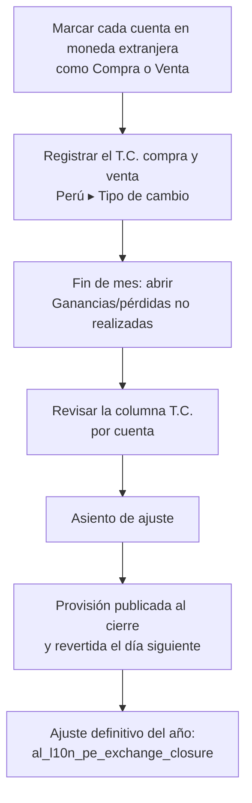

# Guía funcional — T.C. compra/venta en ganancias y pérdidas no realizadas

> Módulo técnico `al_l10n_pe_multicurrency_revaluation` · versión `5.20261009` · área `OL-ACCOUNTING`.
> Para consultores funcionales: qué resuelve, la norma que lo respalda y el
> proceso completo con un ejemplo que cuadra. Enlaces verificados el
> 10/10/2026 con `docs/validacion/verificar_enlaces.py`.

## 1. Para qué sirve

Al cierre de cada mes, los saldos en moneda extranjera (cuentas por cobrar y
por pagar, bancos en dólares) deben expresarse al tipo de cambio de cierre y
reconocerse la **diferencia de cambio**. En el Perú no se usa un único tipo de
cambio: los **activos** se valúan al tipo de **compra** y los **pasivos** al
tipo de **venta** publicados por la SBS.

Odoo Enterprise ya tiene el informe **Ganancias/pérdidas de moneda no
realizadas** con su asiento de provisión, pero con una sola tasa por moneda.
Este módulo hace que cada cuenta use **compra o venta**, muestra el **T.C.**
aplicado en una columna y en el asiento, y deja el informe en **Perú ▸ Tipo
de cambio ▸ Ganancias/pérdidas no realizadas**. Lo usa el contador al cierre.

**Fuera del alcance:** el ajuste **definitivo** del art. 61 de la LIR (lo hace
`al_l10n_pe_exchange_closure`); este módulo trabaja la provisión reversible de
Enterprise. Requiere Odoo Enterprise.

## 2. Marco normativo y conceptual

- **NIC 21**: las partidas monetarias en moneda extranjera se convierten al
  tipo de cambio de cierre y la diferencia va a resultados.
- **Ley del Impuesto a la Renta, art. 61**: las diferencias de cambio por
  operaciones en moneda extranjera son ganancias o pérdidas del ejercicio.
- **Reglamento de la LIR, art. 34**: tipo de cambio de cierre que publica la
  SBS — **compra** para activos y **venta** para pasivos.
- El tipo de cambio de cierre de un día lo publica SUNAT al día siguiente; el
  módulo toma la tasa registrada con fecha del día siguiente o, si no la hay,
  la última anterior.

| Término | Significado | Dónde aparece en Odoo |
|---|---|---|
| T.C. compra | Tasa para activos (por cobrar, bancos) | Cuenta ▸ pestaña Contabilidad ▸ Compra |
| T.C. venta | Tasa para pasivos (por pagar, préstamos) | Cuenta ▸ pestaña Contabilidad ▸ Venta |
| No realizada | Diferencia por valuar un saldo que sigue pendiente | Informe de ganancias/pérdidas no realizadas |
| Provisión reversible | Asiento de ajuste que Odoo revierte el día siguiente | Botón Asiento de ajuste del informe |

## 3. Proceso de inicio a fin

| # | Paso | Dónde en Odoo | Quién | Resultado |
|---|---|---|---|---|
| 1 | Elegir el tipo de cambio de la cuenta | Contabilidad ▸ Configuración ▸ Plan de cuentas ▸ cuenta ▸ pestaña Contabilidad | Contador | Compra o Venta (obligatorio en cuentas por cobrar/pagar y en moneda extranjera) |
| 2 | Tener el T.C. del día | Perú ▸ Tipo de cambio ▸ Tipos de cambio (`al_l10n_pe_currency`) | Automático / contador | Tasas de compra y venta |
| 3 | Revisar | Perú ▸ Tipo de cambio ▸ Ganancias/pérdidas no realizadas | Contador | Saldo, valor revaluado, diferencia y T.C. por cuenta |
| 4 | Contabilizar | Botón Asiento de ajuste | Contador | Provisión con la tasa citada en cada línea |

## 4. Ejemplo completo

Cierre del 30/09/2026 con T.C. SBS de **compra 3,72** y **venta 3,75**:

| Cuenta | Tipo | Saldo USD | Registrado (S/) | T.C. cierre | Revaluado (S/) | Diferencia |
|---|---|---|---|---|---|---|
| 1212 Facturas por cobrar | Compra | 10.000 | 37.000 (3,70) | 3,72 | 37.200 | +200 ganancia |
| 1041 Banco en dólares | Compra | 2.000 | 7.420 (3,71) | 3,72 | 7.440 | +20 ganancia |
| 4212 Facturas por pagar | Venta | 5.000 | 18.400 (3,68) | 3,75 | 18.750 | +350 de deuda: pérdida |

Asiento de ajuste (provisión al 30/09, revertida el 01/10). Las cuentas de
ganancia y pérdida son las que se eligen en el asistente; aquí 776 y 676:

| Cuenta | Descripción | Debe | Haber |
|---|---|---|---|
| 1212 | Provisión de USD (T.C. S/ 3.720) | 200,00 | |
| 1041 | Provisión de USD (T.C. S/ 3.720) | 20,00 | |
| 776 | Diferencia de cambio — ganancia | | 220,00 |
| 676 | Diferencia de cambio — pérdida | 350,00 | |
| 4212 | Provisión de USD (T.C. S/ 3.750) | | 350,00 |
| | **Totales** | **570,00** | **570,00** |

Cálculo: 10.000 × (3,72 − 3,70) = 200; 2.000 × (3,72 − 3,71) = 20;
5.000 × (3,75 − 3,68) = 350.

## 5. Configuración inicial

1. Instalar `al_l10n_pe_currency` (tasas de compra y venta) y tener las tasas
   al día.
2. En cada cuenta por cobrar, por pagar o en moneda extranjera: **Compra**
   (activos) o **Venta** (pasivos) en el grupo «Ganancias/pérdidas no
   realizadas (PE)».
3. Cuentas de diferencia de cambio en la compañía (Odoo) y diario de la
   provisión.

## 6. Reportes y libros relacionados

- Informe **Ganancias/pérdidas de moneda no realizadas** (también en
  Contabilidad ▸ Informes) con la columna **T.C.** y la cabecera
  «USD (1 USD = S/ 3.700)».
- **Cierre de tipo de cambio** (`al_l10n_pe_exchange_closure`): ajuste
  definitivo sobre saldos acumulados.
- Los asientos de provisión salen en el Libro Diario como cualquier asiento.

## 7. Casos especiales y errores frecuentes

| Situación | Qué pasa | Qué hacer |
|---|---|---|
| Cuenta por cobrar/pagar sin tipo | El campo es obligatorio | Elegir Compra o Venta |
| No hay tasa del día siguiente | Se usa la última anterior; si tampoco hay, el T.C. genérico | Cargar las tasas antes del cierre |
| Totales con tasas mezcladas | La columna T.C. queda en blanco | Es normal: cada cuenta muestra la suya |
| Compañía no peruana | Informe nativo sin columna T.C. | Nada |
| Provisión y cierre de T.C. en el mismo mes | Cada uno tiene su campo en la cuenta | Definir con el contador cuál se usa en cada cierre |

## 8. Preguntas frecuentes del consultor

**¿Por qué compra para activos y venta para pasivos?** Así lo dispone el
Reglamento de la LIR (art. 34) para el cierre tributario.

**¿El asiento se revierte?** Sí: es la provisión nativa de Enterprise y se
revierte el día siguiente. El ajuste que queda es el del cierre de T.C.

**¿Sirve para euros?** Sí, para cualquier moneda con tasas de compra y venta
registradas.

## 9. Referencias

Verificadas el 10/10/2026:

- NIC 21 — Efectos de las variaciones en las tasas de cambio (IFRS Foundation): https://www.ifrs.org/issued-standards/list-of-standards/ias-21-the-effects-of-changes-in-foreign-exchange-rates/
- Ley del Impuesto a la Renta, capítulo IX (art. 61): https://www.sunat.gob.pe/legislacion/renta/ley/capix.pdf
- Reglamento de la LIR, capítulo V (art. 34): https://www.sunat.gob.pe/legislacion/renta/regla/cap5.pdf
- SBS — Tipo de cambio promedio ponderado: https://www.sbs.gob.pe/app/pp/sistip_portal/paginas/publicacion/tipocambiopromedio.aspx
- Odoo 19 — Multimoneda: https://www.odoo.com/documentation/19.0/applications/finance/accounting/get_started/multi_currency.html
