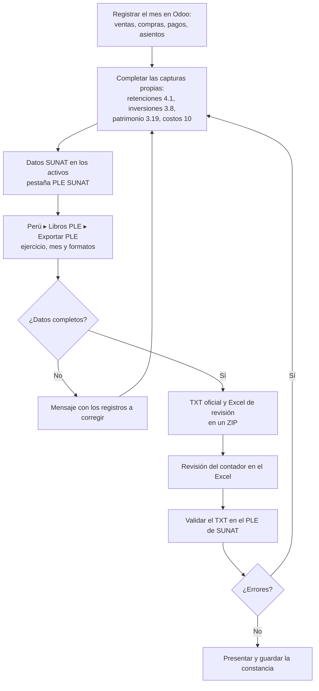

# Guía funcional — Libros Electrónicos PLE

> Módulo técnico `al_l10n_pe_ple` · versión `23.20261009` · área `OL-ACCOUNTING`.
> Para consultores funcionales: qué resuelve, la norma que lo respalda y el
> proceso completo con un ejemplo que cuadra. Enlaces verificados el
> 10/10/2026 con `docs/validacion/verificar_enlaces.py`.
> Guías por menú (detalle de cada libro): [`docs/README.md`](docs/README.md).

## 1. Para qué sirve

Los contribuyentes obligados deben llevar sus libros y registros contables de
forma **electrónica**: generar cada mes o cada año un archivo TXT con la
estructura que fija SUNAT, validarlo con el **Programa de Libros Electrónicos
(PLE)** y presentarlo. Odoo 19 (Enterprise, `l10n_pe_reports`) ya genera los
libros principales (Diario, Mayor, Caja y Bancos, Ventas, Compras,
Inventarios); este módulo **completa los que faltan** y los reúne en la app
**Perú ▸ Libros PLE**.

Lo usa el contador para el cierre mensual y anual. Cubre: Activos Fijos
(7.1, 7.3, 7.4), Retenciones art. 34 LIR (4.1), Consignaciones (9.1, 9.2),
complementos del Libro 3 (3.8, 3.9, 3.19, 3.23), Registro de Costos (10.1 a
10.4) y los formatos **simplificados** (5.2, 5.4, 8.3, 14.2), cada uno con un
Excel de revisión.

**Fuera del alcance:** la presentación en SUNAT (se hace con el PLE de SUNAT),
las regularizaciones de periodos anteriores (estados 8 y 9 de cada registro)
y los registros de compras y ventas que ya migraron al **SIRE** (ver la guía
de `al_l10n_pe_sire`).

## 2. Marco normativo y conceptual

- **R.S. 286-2009/SUNAT**: dispone el llevado electrónico de libros y
  registros; su **Anexo 2** fija la estructura de cada formato y el **Anexo 3**
  las tablas (códigos).
- **R.S. 196-2010/SUNAT**: amplía el sistema y reemplaza el Anexo 2.
- **R.S. 361-2015/SUNAT**: quiénes están obligados a llevar los registros de
  ventas y compras electrónicos.
- **R.S. 042-2018/SUNAT**: códigos de existencias (CUBSO) en los libros de
  inventarios.

| Término | Significado | Dónde aparece en Odoo |
|---|---|---|
| Formato | Cada libro o registro con su código (p. ej. 5.2 Libro Diario simplificado) | Casillas del asistente Exportar PLE |
| Nombre del archivo | 33 caracteres: LE + RUC + periodo + código del libro + oportunidad + indicadores | Lo arma el sistema |
| Indicador de operaciones | 1 empresa operativa, 2 cierre del libro, 0 baja de RUC | Asistente Exportar PLE |
| Oportunidad | Solo Libro 3: momento de presentación de los EEFF (01 al 31/12…) | Asistente Exportar PLE |
| Estado del registro | 1 = operación del periodo (el módulo emite siempre 1) | Dentro del TXT |
| Formatos simplificados | Para empresas del régimen que lleva libros simplificados (5.2, 5.4, 8.3, 14.2) | Ajustes ▸ Perú ▸ Libros PLE simplificados |

## 3. Proceso de inicio a fin



| # | Paso | Dónde en Odoo | Quién | Resultado |
|---|---|---|---|---|
| 1 | Cerrar el registro del mes | Contabilidad | Contabilidad | Asientos publicados |
| 2 | Capturar lo que no sale de asientos | Perú ▸ Libros PLE ▸ Retenciones 4.1 / Inversiones 3.8 / Patrimonio 3.19 / Costos (Libro 10) | Contador | Registros del periodo |
| 3 | Completar los datos SUNAT de los activos | Ficha del activo ▸ pestaña PLE SUNAT | Contador | Tablas 13, 18, 19 y 20, marca, modelo, placa |
| 4 | Generar | Perú ▸ Libros PLE ▸ Exportar PLE | Contador | TXT (o ZIP) con el nombre oficial y Excel de revisión |
| 5 | Libros nativos | Perú ▸ Libros PLE ▸ Reportes PLE nativos | Contador | Diario, Mayor, Caja y Bancos, Ventas, Compras, Inventarios |
| 6 | Validar y presentar | PLE de SUNAT (fuera de Odoo) | Contador | Constancia de recepción |

## 4. Ejemplo completo

Compañía con RUC 20512528458 del régimen que lleva libros simplificados;
periodo setiembre de 2026. Se registra una venta de S/ 1.000 + IGV:

| Cuenta | Descripción | Debe | Haber |
|---|---|---|---|
| 1212 | Facturas por cobrar — F001-00000123 | 1.180,00 | |
| 40111 | IGV — cuenta propia | | 180,00 |
| 7011 | Ventas de mercaderías | | 1.000,00 |
| | **Totales** | **1.180,00** | **1.180,00** |

En **Exportar PLE** se elige ejercicio 2026, mes 09, indicador de
operaciones 1 y los formatos 5.2 (Diario simplificado) y 14.2 (Ventas
simplificado). El asiento sale en el 5.2 con sus tres líneas y la factura en
el 14.2 con base 1.000,00, IGV 180,00 y total 1.180,00.

Nombre del archivo del 5.2 (33 caracteres, validado por el sistema):

```
LE2051252845820260900050200001111.txt
LE | 20512528458 | 2026 | 09 | 00 | 050200 | 00 | 1 | 1 | 1 | 1
   RUC           año    mes día   libro    oport. ind.op. con datos moneda(PEN) fijo
```

Como se marcaron dos formatos, el asistente entrega un ZIP con los dos TXT y
sus dos Excel de revisión.

## 5. Configuración inicial

1. RUC de 11 dígitos en la compañía (sin él, ninguna exportación avanza).
2. Si la empresa lleva libros simplificados: **Ajustes ▸ Perú ▸ Libros PLE
   simplificados** (habilita 5.2/5.4, 8.3 y 14.2 y excluye 5.1/5.3, 8.1 y 14.1).
3. Diarios: naturaleza (movimiento, apertura, cierre) y exclusión de libros en
   **Perú ▸ Configuración ▸ Contabilidad ▸ Diarios** (`al_account_base`).
4. Activos fijos (Enterprise): pestaña **PLE SUNAT** de cada activo.
5. Inventarios: tabla 5 (tipo de existencia) en las categorías o productos.

## 6. Reportes y libros relacionados

| Libro | Origen de los datos | Guía |
|---|---|---|
| 4.1 Retenciones art. 34 LIR | Captura mensual | [retenciones_4_1.md](docs/retenciones_4_1.md) |
| 3.8 / 3.19 / 3.23 | Captura / PDF de notas | [inversiones_3_8.md](docs/inversiones_3_8.md), [patrimonio_3_19.md](docs/patrimonio_3_19.md) |
| 3.9 Intangibles | Activos con cuenta 34 | [exportar_ple.md](docs/exportar_ple.md) |
| 7.1 / 7.3 / 7.4 | Activos (Enterprise) | [libro_7_activos_fijos.md](docs/libro_7_activos_fijos.md) |
| 9.1 / 9.2 | Transferencias marcadas como consignación | [consignaciones_libro_9.md](docs/consignaciones_libro_9.md) |
| 10.1 a 10.4 | Captura anual | [costos_libro_10.md](docs/costos_libro_10.md) |
| 12.1 / 13.1 | Kardex (`ol_stock_kardex_pe`) | [kardex.md](docs/kardex.md) |
| 5.x, 6.1, 1.x, 8.x, 14.x | Reportes nativos de Odoo | [reportes_nativos.md](docs/reportes_nativos.md) |

## 7. Casos especiales y errores frecuentes

| Situación | Qué pasa | Qué hacer |
|---|---|---|
| «…no tiene configurado un RUC válido…» | Falta el RUC de la compañía | Completarlo en la ficha de la compañía |
| «Indique el mes…» | Se marcó un libro mensual sin mes | Elegir el mes |
| «Los siguientes activos no tienen configurado…» | Falta un dato SUNAT en activos | Completar la pestaña PLE SUNAT |
| Los simplificados no aparecen | Falta la bandera en Ajustes | Activar «Libros PLE simplificados» |
| Corrección de un mes ya presentado | El módulo emite estado 1 | Ajustar los estados 8/9 a mano antes de validar |
| Mes sin movimientos | El nombre lleva indicador «sin información» | Presentar igual si la norma lo exige |

## 8. Preguntas frecuentes del consultor

**¿El Excel se presenta a SUNAT?** No. Solo el TXT; el Excel es para revisar.

**¿Por qué no aparecen el Registro de Ventas y Compras?** Para los
obligados al SIRE se llevan allí (módulo `al_l10n_pe_sire`); los formatos 14.1
y 8.1 siguen en los reportes nativos para quien todavía los use.

**¿Puedo generar varios libros a la vez?** Sí: marcando varios formatos sale
un ZIP con todos.

**¿Sirve para varias compañías?** Sí; cada una genera con su RUC.

## 9. Referencias

Verificadas el 10/10/2026:

- R.S. 286-2009/SUNAT — Libros electrónicos: https://www.sunat.gob.pe/legislacion/superin/2009/rs286.doc
- R.S. 196-2010/SUNAT — Modificación y Anexo 2: https://www.sunat.gob.pe/legislacion/superin/2010/196-10.pdf
- R.S. 361-2015/SUNAT — Obligados a registros electrónicos: https://www.sunat.gob.pe/legislacion/superin/2015/361-2015.pdf
- R.S. 042-2018/SUNAT — Códigos de existencias: https://www.sunat.gob.pe/legislacion/superin/2018/042-2018.pdf
- Odoo 19 — Localización peruana: https://www.odoo.com/documentation/19.0/applications/finance/fiscal_localizations/peru.html
