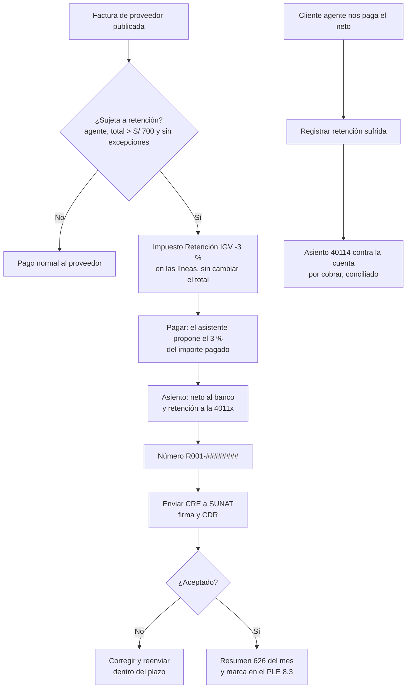

# Guía funcional — Retenciones del IGV

> Módulo técnico `al_l10n_pe_retention` · versión `18.20261009` · área `OL-ACCOUNTING`.
> Para consultores funcionales: qué resuelve, la norma que lo respalda y el
> proceso completo con un ejemplo que cuadra. Enlaces verificados el
> 10/10/2026 con `docs/validacion/verificar_enlaces.py`.

## 1. Para qué sirve

Las empresas que SUNAT designa **agentes de retención del IGV** deben quedarse
con el **3 % del importe total** de lo que pagan a ciertos proveedores,
entregarles un **comprobante de retención** (electrónico: CRE, tipo 20) y
declarar y pagar lo retenido en el **PDT 626**. A la vez, cuando la empresa es
proveedora de un cliente agente, recibe pagos netos y debe registrar ese
importe retenido como crédito contra su IGV.

Lo usan Tesorería (pagos), Contabilidad (asientos y declaración) y
Facturación electrónica (envío del CRE). El módulo lleva todo al flujo normal
de facturas y pagos de Odoo: decide si la factura está sujeta, propone el 3 %
en cada pago, numera y envía el CRE, registra las retenciones sufridas y
prepara el resumen del 626.

**Fuera del alcance:** la retención cuando el pago se hace con letras o por
compensación, el descuento de una nota de crédito posterior en la siguiente
retención y el Régimen de Percepciones. La reversión del CRE la añade el
módulo del operador The Factory HKA (`al_ose_factory_hka`).

## 2. Marco normativo y conceptual

- **Régimen de Retenciones del IGV**: R.S. 037-2002/SUNAT, que fija quién es
  agente, a qué operaciones se aplica, las excepciones, el momento de la
  retención (el pago) y el comprobante.
- **Flexibilización del régimen** (operaciones excluidas y monto mínimo):
  R.S. 061-2005/SUNAT.
- **Tasa del 3 %**: R.S. 033-2014/SUNAT (antes 6 %).
- **Comprobante de retención electrónico** en el Sistema de Emisión
  Electrónica: R.S. 274-2015/SUNAT.
- **Designación de agentes**: SUNAT publica resoluciones que incorporan o
  excluyen agentes (la más reciente revisada: R.S. 000367-2025/SUNAT).
- Resumen oficial del régimen en la página de orientación de SUNAT.

| Término | Significado | Dónde aparece en Odoo |
|---|---|---|
| Agente de retención | Empresa designada por SUNAT que debe retener | Perú ▸ Configuración ▸ Ajustes ▸ Retenciones del IGV |
| Operación sujeta | Factura gravada con IGV por más de S/ 700 a un proveedor no exceptuado | Factura de proveedor ▸ «Sujeta a retención de IGV» |
| Excepciones | Proveedor agente de retención, buen contribuyente o agente de percepción; boletas; operaciones con detracción; sin IGV | Casillas del contacto (padrón SUNAT) y tipo de documento |
| Monto mínimo | No se retiene si los comprobantes pagados juntos suman S/ 700 o menos | Asistente de pago |
| CRE | Comprobante de Retención Electrónico, serie R001 | Pago ▸ número de comprobante y botón «Enviar CRE a SUNAT» |
| Retención sufrida | Lo que un cliente agente nos retuvo; crédito contra el IGV | Perú ▸ Retenciones IGV ▸ Retenciones sufridas |
| PDT 626 | Declaración mensual de las retenciones efectuadas | Perú ▸ Retenciones IGV ▸ Resumen 626 |

## 3. Proceso de inicio a fin

| # | Paso | Dónde en Odoo | Quién | Resultado |
|---|---|---|---|---|
| 1 | Activar la empresa como agente | Perú ▸ Configuración ▸ Ajustes ▸ Retenciones del IGV | Contador | Tasa 3 %, mínimo S/ 700, impuesto de retención |
| 2 | Registrar y publicar la factura del proveedor | Contabilidad ▸ Proveedores ▸ Facturas | Contabilidad | La factura queda «Sujeta a retención de IGV»; el total no cambia |
| 3 | Pagar | Factura ▸ Pagar | Tesorería | Retención propuesta del 3 % sobre lo pagado; neto al banco |
| 4 | Revisar el número del CRE | Pago ▸ grupo Retención | Tesorería | Número R001-######## asignado al emitir el pago |
| 5 | Enviar el CRE | Pago ▸ Enviar CRE a SUNAT | Facturación electrónica | ZIP con el XML firmado y el CDR; estado «Enviado» |
| 6 | Consultar | Perú ▸ Retenciones IGV ▸ Retenciones efectuadas | Contabilidad | Lista con plazo de envío y estado (amarillo: fuera de plazo; rojo: rechazado) |
| 7 | Declarar | Perú ▸ Retenciones IGV ▸ Resumen 626 | Contador | TXT del mes con una línea por retención |
| 8 | Retenciones sufridas | Perú ▸ Retenciones IGV ▸ Retenciones sufridas ▸ Nuevo | Contabilidad | Asiento 40114 contra la factura de venta, conciliado |

**Caminos alternativos:** si el CRE es rechazado, el error queda en el pago y
se reenvía; si el pago se registró por error, se anula el pago y el CRE no se
envía (con el CRE ya aceptado hace falta la reversión, ver sección 7). Una
retención sufrida mal registrada se corrige con **Pasar a borrador**, que
deshace el asiento y la conciliación.

## 4. Ejemplo completo

Empresa agente de retención; proveedor sin excepciones; factura por un
servicio de S/ 5.000 + IGV 18 % S/ 900 = **S/ 5.900**.

**Factura del proveedor** (la retención aún no genera apunte):

| Cuenta | Descripción | Debe | Haber |
|---|---|---|---|
| 6311 | Servicios de terceros | 5.000,00 | |
| 40111 | IGV — cuenta propia | 900,00 | |
| 4212 | Facturas por pagar | | 5.900,00 |
| | **Totales** | **5.900,00** | **5.900,00** |

**Pago único** — retención 5.900 × 3 % = **S/ 177,00**; neto S/ 5.723,00:

| Cuenta | Descripción | Debe | Haber |
|---|---|---|---|
| 4212 | Facturas por pagar (proveedor) | 5.900,00 | |
| 1041 | Banco — neto pagado | | 5.723,00 |
| 40114 | IGV — retenciones por pagar (R001-00000001) | | 177,00 |
| | **Totales** | **5.900,00** | **5.900,00** |

Odoo añade además dos líneas iguales a la cuenta de gasto (base y
contrapartida) que se anulan entre sí: el marco nativo de retenciones las usa
para guardar la base del cálculo.

**Pago en dos partes** — cada pago retiene el 3 % de su importe:

| Pago | Pagado | Retención | Neto |
|---|---|---|---|
| Primero | 3.000,00 | 90,00 | 2.910,00 |
| Segundo | 2.900,00 | 87,00 | 2.813,00 |
| **Total** | **5.900,00** | **177,00** | **5.723,00** |

**Retención sufrida** — un cliente agente paga una factura de S/ 3.540 y
retiene 3.540 × 3 % = **S/ 106,20**:

| Cuenta | Descripción | Debe | Haber |
|---|---|---|---|
| 40114 | IGV — retenciones sufridas (R777-00000055) | 106,20 | |
| 1212 | Facturas por cobrar (cliente) | | 106,20 |
| | **Totales** | **106,20** | **106,20** |

## 5. Configuración inicial

1. **Perú ▸ Configuración ▸ Ajustes ▸ Retenciones del IGV**: marcar *Agente
   de retención del IGV*, revisar la tasa (3 %) y el mínimo (S/ 700).
2. **Contabilidad ▸ Configuración ▸ Impuestos**: impuesto de compras de
   -3 % con *Retención en el pago*, cuenta 40114 «IGV – Retenciones por pagar»
   y la secuencia R001 en *Opciones avanzadas*; elegirlo en Ajustes.
3. Si el método de pago no tiene cuenta propia: la **cuenta transitoria
   (retenciones)** en Ajustes.
4. Para las retenciones sufridas: **cuenta** (40114) y **diario** en el mismo
   bloque de Ajustes.
5. Contactos: las casillas *Agente de retención* y *Buen contribuyente* las
   mantiene el padrón SUNAT del módulo de consulta RUC/DNI.
6. Para enviar el CRE: el operador y el certificado de la facturación
   electrónica (Ajustes ▸ Contabilidad ▸ Facturación electrónica peruana).

## 6. Reportes y libros relacionados

- **Perú ▸ Retenciones IGV ▸ Comprobantes de proveedor**: facturas sujetas,
  con lo pendiente de pago.
- **Retenciones efectuadas**: un CRE por pago, con plazo de envío y estado.
- **Análisis de retenciones**: retenido por proveedor y mes.
- **Resumen 626**: TXT del mes (soporte del PDT 626).
- **PLE 8.3** (con `al_l10n_pe_ple`): marca de retención en el campo 26 del
  Registro de Compras Simplificado.
- El CRE impreso (PDF) sale desde el pago.

## 7. Casos especiales y errores frecuentes

| Situación | Qué pasa | Qué hacer |
|---|---|---|
| Factura de S/ 650 | No retiene: no supera el mínimo | Nada |
| Varias facturas pequeñas pagadas juntas por más de S/ 700 | Se retiene sobre el total pagado | Revisar la línea propuesta en el asistente |
| Proveedor agente o buen contribuyente | No retiene | Si el padrón está desactualizado, corregir la casilla del contacto |
| Factura en dólares | Se compara y retiene en soles al T.C. del pago | Revisar el T.C. del día |
| «Falta configurar el impuesto de retención» al publicar | La compañía es agente sin impuesto elegido | Elegirlo en Ajustes |
| El asistente no propone la retención | La factura se publicó antes de configurar | Pasar a borrador y volver a publicar |
| CRE fuera de plazo (7 días) | Alerta en el pago | Evaluar emitir uno nuevo con el asesor tributario |
| CRE aceptado que hay que anular | El módulo solo marca «Anulado» con la reversión | Usar la reversión de `al_ose_factory_hka` o hacerla en el portal del operador |

## 8. Preguntas frecuentes del consultor

**¿La retención cambia el total de la factura?** No. La deuda con el
proveedor es el total; la retención se practica al pagar.

**¿Se retiene sobre la base o sobre el total?** Sobre el **importe total**
(con IGV), como manda la norma.

**¿Qué pasa con las notas de crédito?** No retienen. Si reducen una factura
ya retenida, el ajuste en la siguiente retención queda fuera del alcance.

**¿Puedo usar el módulo si no soy agente?** Sí, para las retenciones
sufridas: basta configurar su cuenta y diario.

**¿Dónde se ve que un proveedor es buen contribuyente?** En su ficha, con las
casillas del padrón; se actualizan solas cada día.

## 9. Referencias

Verificadas el 10/10/2026:

- R.S. 037-2002/SUNAT — Régimen de Retenciones del IGV: https://www.sunat.gob.pe/legislacion/superin/2002/037.htm
- R.S. 061-2005/SUNAT — Flexibilización del régimen: https://www.sunat.gob.pe/legislacion/superin/2005/061.htm
- R.S. 033-2014/SUNAT — Tasa del 3 %: https://www.sunat.gob.pe/legislacion/superin/2014/033-2014.pdf
- R.S. 274-2015/SUNAT — Comprobante de retención electrónico: https://www.sunat.gob.pe/legislacion/superin/2015/274-2015.pdf
- R.S. 000367-2025/SUNAT — Designación de agentes de retención: https://www.sunat.gob.pe/legislacion/superin/2025/000367-2025.pdf
- SUNAT, orientación — Régimen de retenciones: https://orientacion.sunat.gob.pe/07-regimen-de-retenciones-informacion-general
- Odoo 19 — Localización peruana: https://www.odoo.com/documentation/19.0/applications/finance/fiscal_localizations/peru.html
