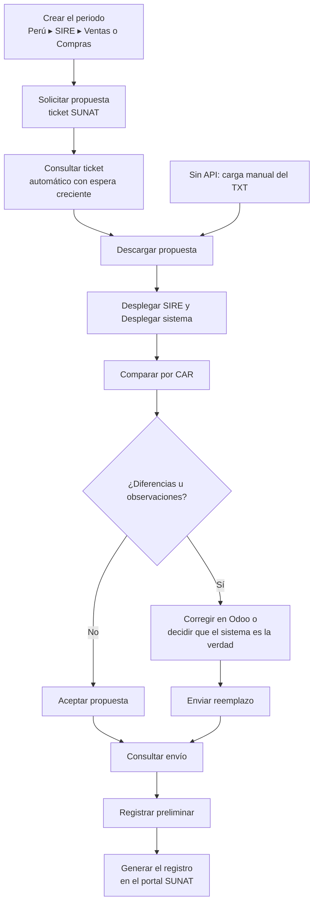

# Guía funcional — SIRE (RVIE y RCE)

> Módulo técnico `al_l10n_pe_sire` · versión `18.20261009` · área `OL-ACCOUNTING`.
> Para consultores funcionales: qué resuelve, la norma que lo respalda y el
> proceso completo con un ejemplo que cuadra. Enlaces verificados el
> 10/10/2026 con `docs/validacion/verificar_enlaces.py`.
> Guía detallada de cada pantalla: [`docs/guia_sire.md`](docs/guia_sire.md).

## 1. Para qué sirve

En el **SIRE** (Sistema Integrado de Registros Electrónicos) el Registro de
Ventas (**RVIE**) y el Registro de Compras (**RCE**) ya no los arma la empresa
desde cero: SUNAT prepara una **propuesta** con los comprobantes electrónicos
que conoce y la empresa la **acepta**, la **complementa** o la **reemplaza**
antes de generar el registro del periodo.

El problema es saber si la propuesta coincide con lo contabilizado. El módulo
descarga la propuesta (por la API de SUNAT o subiendo el TXT), la **compara
línea a línea** con las facturas de Odoo, muestra las diferencias, valida las
reglas de SUNAT y envía la aceptación o el reemplazo. Lo usa el contador cada
mes.

**Fuera del alcance:** la **generación del registro** (se completa en el
portal de SUNAT, no hay servicio web para ello) y los ajustes de periodos
anteriores en formato simplificado. El servicio API real no se ha probado con
credenciales de producción: el primer periodo conviene hacerlo de prueba.

## 2. Marco normativo y conceptual

- **R.S. 112-2021/SUNAT**: crea el SIRE y el módulo RVIE.
- **R.S. 040-2022/SUNAT**: incorpora el módulo RCE.
- **R.S. 000204-2023/SUNAT**: modifica el SIRE y el calendario.
- **R.S. 000392-2025/SUNAT**: posterga la obligación para principales
  contribuyentes con ingresos mayores a 2 300 UIT.
- Los manuales de servicios web API SIRE (v22) están en `docs/sire/oficial/`
  del repositorio.

| Término | Significado | Dónde aparece en Odoo |
|---|---|---|
| Propuesta | Registro que SUNAT arma con los comprobantes que conoce | Pestaña SIRE del periodo |
| Ticket | Número de una operación asíncrona de SUNAT | Pestaña SUNAT del periodo |
| CAR | Clave única de cada comprobante en el SIRE | Columna de cruce de la comparación |
| Aceptar propuesta | Dar por buena la propuesta tal cual | Botón, solo sin diferencias |
| Reemplazo | Enviar las líneas del sistema en lugar de la propuesta | Botón Enviar reemplazo |
| Preliminar | Registro previo a la generación | Botón Registrar preliminar |

## 3. Proceso de inicio a fin

| # | Paso | Dónde en Odoo | Quién | Resultado |
|---|---|---|---|---|
| 1 | Configurar credenciales | Ajustes ▸ Perú ▸ SIRE (RVIE / RCE) | Administrador | Usuario y clave SOL, client_id y client_secret |
| 2 | Crear el periodo | Perú ▸ SIRE ▸ Ventas (RVIE) o Compras (RCE) | Contador | Periodo en borrador |
| 3 | Solicitar y descargar la propuesta | Botones del periodo | Contador | TXT de la propuesta (el cron descarga solo al terminar el ticket) |
| 4 | Desplegar ambos lados | Desplegar SIRE / Desplegar sistema | Contador | Pestañas SIRE y Sistema |
| 5 | Comparar | Comparar | Contador | Cada línea: Correcto, No cuadran, Solo en SIRE, Solo en Sistema |
| 6 | Revisar | Pestañas Diferencias y Observaciones; XLSX | Contador | Lista de campos discrepantes con ambos valores |
| 7 | Enviar | Aceptar propuesta o Enviar reemplazo | Contador | Ticket del envío |
| 8 | Cerrar | Consultar envío ▸ Registrar preliminar | Contador | Periodo realizado |

## 4. Ejemplo completo

RVIE de setiembre de 2026. SUNAT propone **120 comprobantes**; en Odoo hay
**121**.

| Resultado de la comparación | Comprobantes | Base | IGV | Total |
|---|---|---|---|---|
| Correcto | 119 | 98.000,00 | 17.640,00 | 115.640,00 |
| No cuadran (tipo de cambio distinto) | 1 | 1.000,00 | 180,00 | 1.180,00 |
| Solo en Sistema (factura aún no informada a SUNAT) | 1 | 1.000,00 | 180,00 | 1.180,00 |
| **Total según el sistema** | **121** | **100.000,00** | **18.000,00** | **118.000,00** |

Comprobación: 98.000 + 1.000 + 1.000 = 100.000; IGV 18 % = 18.000;
total 118.000.

Como hay diferencias, **Aceptar propuesta** se niega y lo explica. Se revisa
la factura con otro tipo de cambio (el de Odoo es el correcto) y la factura que
faltaba (ya fue enviada a SUNAT). Se descarga el **XLSX** para el contador,
se pulsa **Validar** (sin observaciones) y **Enviar reemplazo**: sube el ZIP
`LE<RUC>20260900140400021112.zip` (patrón `LE<RUC><periodo>00<libro>021112`)
con las 121 líneas del sistema. Con el ticket
terminado, **Registrar preliminar**, y el registro se genera en el portal.

El SIRE **no genera asientos**: compara y declara lo ya contabilizado.

## 5. Configuración inicial

1. En SUNAT Operaciones en Línea: usuario secundario con permisos SIRE y
   credenciales de API (client_id y client_secret).
2. **Ajustes ▸ Perú ▸ SIRE (RVIE / RCE)**: usuario, clave, client_id y
   client_secret. Las credenciales se guardan en la compañía raíz (el RUC).
3. Sin credenciales: marcar **Carga manual** en cada periodo y subir el TXT
   exportado del portal.
4. Facturas de compra: tipo de documento y, en el RCE, fecha de vencimiento
   en los tipos que la exigen; destino de las compras gravadas según el grupo
   de impuesto (DG, DGNG, DNG).

## 6. Reportes y libros relacionados

- **XLSX de trabajo** con las hojas SIRE y Sistema en el formato de SUNAT.
- **TXT de reemplazo** (libros 140400 y 080400) para cargarlo a mano en el
  portal si se prefiere.
- Pestaña **SUNAT**: historial de operaciones, reportes de inconsistencias y
  constancia de recepción.
- No domiciliados (registro 8.5), tipo de cambio, complementos, exclusiones y
  ajustes posteriores: ver [`README.md`](README.md).
- El PLE 8.1/14.1 queda para quien no esté obligado al SIRE (`al_l10n_pe_ple`).

## 7. Casos especiales y errores frecuentes

| Situación | Qué pasa | Qué hacer |
|---|---|---|
| Aceptar con diferencias | Se niega con el motivo | Corregir o enviar reemplazo |
| Observaciones de validación (RUC, serie, IGV, fechas) | Enviar reemplazo se niega | Corregir las facturas y volver a desplegar el sistema |
| Ticket que no termina | El cron reintenta hasta 30 veces; luego deja una actividad | Consultar a mano o esperar |
| Segundo envío del mismo periodo | Se rechaza mostrando el primer ticket | Usar los ajustes posteriores |
| Reiniciar después de enviar | Bloqueado | Lo declarado no se deshace desde Odoo |
| Sin credenciales | La API no funciona | Carga manual del TXT |

## 8. Preguntas frecuentes del consultor

**¿Tengo que corregir en Odoo o en SUNAT?** Si el error es del registro en
Odoo, en Odoo; si Odoo tiene la verdad, se envía el reemplazo.

**¿La comparación revisa importes o también datos?** Todo: tipo de documento,
serie, número, fechas, RUC, moneda, tipo de cambio, bases, impuestos y total.

**¿Puedo usarlo solo para comparar, sin enviar?** Sí: el XLSX y el TXT se
descargan sin enviar nada.

**¿Qué pasa con las compras de no domiciliados?** Tienen su registro 8.5 en la
pestaña «No domiciliados» del RCE.

## 9. Referencias

Verificadas el 10/10/2026:

- R.S. 112-2021/SUNAT — SIRE y RVIE: https://www.sunat.gob.pe/legislacion/superin/2021/112-2021.pdf
- R.S. 040-2022/SUNAT — Módulo RCE: https://www.sunat.gob.pe/legislacion/superin/2022/040-2022.pdf
- R.S. 000204-2023/SUNAT — Modificación del SIRE: https://www.sunat.gob.pe/legislacion/superin/2023/000204-2023.pdf
- R.S. 000392-2025/SUNAT — Postergación de la obligación: https://www.sunat.gob.pe/legislacion/superin/2025/000392-2025.pdf
- Odoo 19 — Localización peruana: https://www.odoo.com/documentation/19.0/applications/finance/fiscal_localizations/peru.html
