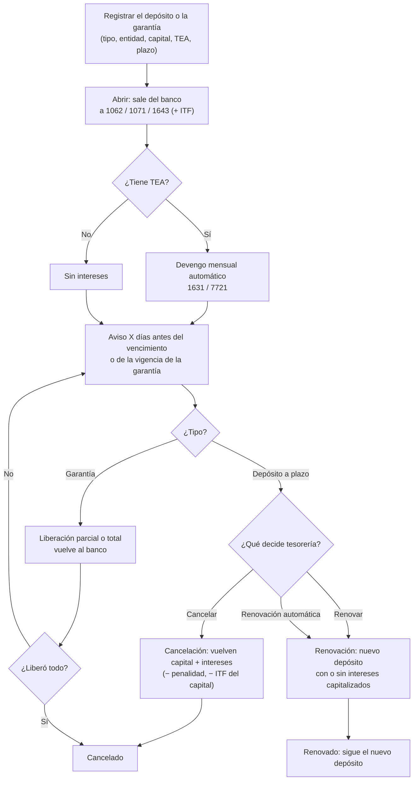

# Guía funcional — Depósitos a plazo y garantías

> Módulo técnico `al_l10n_pe_term_deposit` · versión `2.20261010` · área `OL-ACCOUNTING`.
> Para consultores funcionales: qué resuelve, la norma que lo respalda y el
> proceso completo con un ejemplo que cuadra. Enlaces verificados el
> 10/10/2026 con `docs/validacion/verificar_enlaces.py`.

## 1. Para qué sirve

Las empresas inmovilizan dinero de tres formas: lo **colocan a plazo** en un
banco para ganar intereses, lo dejan **retenido por el banco** como respaldo de
una carta fianza, o lo **entregan en garantía** a un tercero (típicamente el
arrendador de una oficina o un almacén). En los tres casos el dinero sigue
siendo de la empresa, pero ya no está en la cuenta corriente y hay que
controlar cuánto hay, dónde, hasta cuándo y cuánto rinde.

El módulo lleva ese ciclo completo con su contabilidad: apertura, devengo
mensual de intereses, aviso antes del vencimiento, cancelación (también
anticipada, con penalidad), renovación y liberación de garantías, con el ITF
opcional y dos reportes (cartera vigente e intereses devengados). Lo usan
tesorería (opera los depósitos) y contabilidad (revisa asientos y cierres).

**Fuera del alcance:**

- No se conecta con los bancos: los datos del certificado o del contrato se
  registran a mano.
- No calcula la diferencia de cambio de los depósitos en moneda extranjera:
  la calcula el cierre de tipo de cambio de la suite
  (`al_l10n_pe_exchange_closure`) o la revaluación de Odoo; el módulo avisa si
  las cuentas no están preparadas.
- No emite cartas fianza ni lleva la línea de crédito del banco: solo el
  dinero que la empresa deja como respaldo.
- No registra el alquiler en sí (eso es `al_l10n_pe_lease`): solo la garantía
  entregada al arrendador.

## 2. Marco normativo y conceptual

| Tema | Norma o criterio | Qué implica en el módulo |
|---|---|---|
| Depósito a plazo y su tasa | SBS: [Cuenta a plazo fijo](https://www.sbs.gob.pe/usuarios/informacion-financiera/productos-financieros/depositos-y-ahorros/cuenta-de-plazo-fijo) y [Compara y elige](https://www.sbs.gob.pe/usuarios/aprende-con-la-sbs/compara-y-elige) | El banco informa la **TEA** (tasa efectiva anual) y la TREA; un retiro antes del plazo puede reducir la tasa pactada. El módulo calcula con la TEA y deja registrar lo que el banco realmente pague. |
| Tasa efectiva | BCRP: [Glosario (T)](https://www.bcrp.gob.pe/publicaciones/glosario/t.html) | Interés compuesto: `capital × ((1 + TEA)^(días/base) − 1)` con base de 360 o 365 días según el contrato. |
| ITF | [TUO de la Ley 28194 (D.S. 150-2007-EF)](https://www.sunat.gob.pe/legislacion/itf/ds150_07.htm), [MEF: D.S. 150-2007-EF](https://www.gob.pe/institucion/mef/normas-legales/224960-150-2007-ef), [SUNAT: tasa del ITF](https://orientacion.sunat.gob.pe/07-la-tasa-del-impuesto-itf-empresas), [SUNAT: operaciones exoneradas](https://orientacion.sunat.gob.pe/11-operaciones-exoneradas-itf-empresas), [gob.pe: declarar y pagar el ITF](https://www.gob.pe/7963-impuesto-a-las-transacciones-financieras-itf-declarar-y-pagar-el-itf) | Alícuota del 0,005 % sobre débitos y créditos en cuentas del sistema financiero. Las exoneraciones del Apéndice exigen una declaración jurada ante el banco: por eso el ITF es **opcional por depósito**. |
| ITF de intereses y renovaciones | [Informe SUNAT N.° 025-2004-SUNAT/2B0000](https://www.sunat.gob.pe/legislacion/oficios/2004/oficios/i0252004.htm) | El pago o abono de intereses de un depósito a plazo, su capitalización y la renovación sin dinero nuevo **no pagan ITF**: el módulo lo calcula solo sobre el **capital**. |
| Cuentas contables | [PCGE modificado 2019 (MEF)](https://www.mef.gob.pe/contenidos/conta_publ/documentac/PCGE_2019.pdf), [Resolución CNC 002-2019-EF/30](https://www.gob.pe/institucion/mef/normas-legales/277088-002-2019-ef-30) | 1062 Depósitos a plazo, 1071 Fondos en garantía, 1643 Depósitos en garantía (alquileres), 1631 Intereses por cobrar, 7721 Rendimientos de depósitos, 6412 ITF. |
| Impuesto a la renta de los intereses | [TUO de la Ley del Impuesto a la Renta (SUNAT)](https://www.sunat.gob.pe/legislacion/renta/ley/) | Para una empresa los intereses son renta de **tercera categoría** y se reconocen por **devengo** (mes a mes), no cuando se cobran. El módulo no calcula retenciones sobre intereses: confirme con el asesor tributario cualquier caso especial (no domiciliados, personas naturales). |

**Conceptos clave**

| Término | Significado | Dónde aparece en Odoo |
|---|---|---|
| Depósito a plazo | Dinero colocado en un banco por un plazo fijo a una tasa pactada. | Tipo «Depósito a plazo» |
| Fondo en garantía | Dinero de la empresa que el banco retiene como respaldo (p. ej. de una carta fianza). | Tipo «Fondo en garantía» |
| Depósito en garantía entregado | Dinero entregado a un tercero que lo devolverá (p. ej. la garantía del alquiler). | Tipo «Depósito en garantía entregado» |
| TEA | Tasa efectiva anual del depósito. | Campo «TEA (%)» |
| Base de días | 360 (año comercial) o 365 (calendario) para el interés de los días. | Campo «Base de días» |
| Devengo | Reconocer el interés ganado en el mes aunque se cobre al vencimiento. | Cron mensual y botón «Devengar intereses» |
| Capitalizar | Sumar los intereses al capital del nuevo depósito al renovar. | «Capitalizar intereses» |
| Penalidad | Lo que el banco descuenta por cancelar antes del vencimiento. | Asistente «Cancelar el depósito» |
| ITF | Impuesto a las Transacciones Financieras (0,005 %). | Ajustes y «Afecto al ITF» |

## 3. Proceso de inicio a fin

| # | Paso | Dónde en Odoo | Quién | Resultado |
|---|---|---|---|---|
| 1 | Registrar el depósito o la garantía | Perú ▸ Tesorería ▸ Depósitos y garantías ▸ Nuevo | Tesorería | Borrador `DEP/AAAA/NNNN` con las cuentas propuestas por tipo y moneda |
| 2 | Abrir | Botón «Abrir» | Tesorería | Asiento de apertura (banco → cuenta del depósito, más el ITF si está afecto); estado «Vigente» |
| 3 | Devengar intereses | Automático (cron diario: devenga hasta el cierre del mes anterior) o botón «Devengar intereses» | Sistema / contabilidad | Un asiento por mes 1631 / 7721; nunca duplica ni pasa del vencimiento |
| 4 | Aviso de vencimiento | Automático: actividad para el «Responsable» | Sistema | Actividad «Vence DEP/…» X días antes (Ajustes) |
| 5a | Cancelar | Botón «Cancelar el depósito» (asistente) | Tesorería | Asiento de cancelación; estado «Cancelado» |
| 5b | Renovar | Botón «Renovar» (asistente) o renovación automática | Tesorería / sistema | Depósito nuevo vigente; el anterior queda «Renovado» y enlazado |
| 5c | Liberar una garantía | Botón «Liberar» (asistente) | Tesorería | Asiento de liberación; al liberar todo, se cancela |
| 6 | Revisar | Perú ▸ Tesorería ▸ Cartera vigente / Intereses devengados / Análisis de depósitos | Contabilidad | Saldos por entidad, moneda y vencimiento; intereses por mes |

**Caminos alternativos**

- **Vence sin decisión:** el cron lo pasa a «Vencido» (devengado hasta el
  vencimiento); se cancela o renueva después, con la fecha real.
- **Cancelación anticipada:** en el asistente se indica lo que pagó el banco
  por intereses y la penalidad; la diferencia con lo devengado ajusta el
  ingreso.
- **Error antes de abrir:** un borrador se edita o se elimina; abierto ya no se
  elimina (se cancela con su asiento).
- **Cierre de mes:** el devengo del mes anterior lo hace el cron el día 1; en
  moneda extranjera, el cierre de tipo de cambio ajusta el saldo de 1062/1631.

## 4. Ejemplo completo

**Empresa:** Comercial Demo Perú S.A.C. (soles), con el ITF activado en
Ajustes. El 01/01/2026 coloca **S/ 100 000** a plazo fijo en el banco por
**180 días** (vence el 30/06/2026) a una **TEA de 6 %**, base 360.

**Interés del plazo:** 100 000 × ((1,06)^(180/360) − 1) = **S/ 2 956,30**.

### 4.1 Apertura (01/01/2026)

ITF del capital: 100 000 × 0,005 % = S/ 5,00.

| Cuenta | Descripción | Debe | Haber |
|---|---|---|---|
| 1062 | Depósitos a plazo (Banco) | 100 000,00 | |
| 6412 | ITF | 5,00 | |
| 1041 | Banco — cuenta corriente | | 100 005,00 |
| | **Total** | **100 005,00** | **100 005,00** |

### 4.2 Devengo mensual de intereses

El interés acumulado se calcula a cada cierre de mes y se registra la
diferencia con lo ya devengado (cada asiento: Debe 1631 / Haber 7721).

| Cierre | Días desde la apertura | Acumulado | Devengo del mes |
|---|---|---|---|
| 31/01/2026 | 30 | 486,76 | 486,76 |
| 28/02/2026 | 58 | 943,20 | 456,44 |
| 31/03/2026 | 89 | 1 450,96 | 507,76 |
| 30/04/2026 | 119 | 1 944,78 | 493,82 |
| 31/05/2026 | 150 | 2 457,58 | 512,80 |
| 30/06/2026 | 180 | 2 956,30 | 498,72 |
| | | **Total** | **2 956,30** |

Asiento de enero:

| Cuenta | Descripción | Debe | Haber |
|---|---|---|---|
| 1631 | Intereses por cobrar | 486,76 | |
| 7721 | Rendimientos ganados — depósitos | | 486,76 |
| | **Total** | **486,76** | **486,76** |

### 4.3 Cancelación al vencimiento (30/06/2026)

Vuelven el capital y los intereses. El ITF se calcula solo sobre el capital
(los intereses están exonerados): 100 000 × 0,005 % = S/ 5,00.

| Cuenta | Descripción | Debe | Haber |
|---|---|---|---|
| 1041 | Banco — cuenta corriente | 102 951,30 | |
| 6412 | ITF | 5,00 | |
| 1062 | Depósitos a plazo | | 100 000,00 |
| 1631 | Intereses por cobrar | | 2 956,30 |
| | **Total** | **102 956,30** | **102 956,30** |

Resultado del depósito: ingreso 2 956,30 − ITF 10,00 = **S/ 2 946,30**.

### 4.4 Variante: cancelación anticipada (31/03/2026)

Al 31/03 hay S/ 1 450,96 devengados. El banco paga solo **S/ 1 000** de
intereses y descuenta una **penalidad de S/ 150** (sin ITF en este caso, para
ver solo el efecto de la penalidad). Sin cuenta de penalidad configurada, la
penalidad rebaja el ingreso: ajuste a 7721 = 1 450,96 − 1 000 + 150 = 600,96.

| Cuenta | Descripción | Debe | Haber |
|---|---|---|---|
| 1041 | Banco (100 000 + 1 000 − 150) | 100 850,00 | |
| 7721 | Ajuste de intereses | 600,96 | |
| 1062 | Depósitos a plazo | | 100 000,00 |
| 1631 | Intereses por cobrar | | 1 450,96 |
| | **Total** | **101 450,96** | **101 450,96** |

Con una cuenta de penalidad (p. ej. 6391 Gastos bancarios), la penalidad va a
esa cuenta y el ajuste a 7721 queda en 450,96 (Debe 6391 150,00 + 7721 450,96).

### 4.5 Variante: renovación capitalizando (30/06/2026)

Se renueva por otros 180 días con los intereses sumados al capital: nuevo
capital 102 956,30 (renovación sin dinero nuevo: sin ITF).

| Cuenta | Descripción | Debe | Haber |
|---|---|---|---|
| 1062 | Depósito nuevo | 102 956,30 | |
| 1062 | Depósito anterior | | 100 000,00 |
| 1631 | Intereses por cobrar | | 2 956,30 |
| | **Total** | **102 956,30** | **102 956,30** |

### 4.6 Garantía del alquiler de un almacén

Entrega de S/ 18 000 al arrendador (finalidad «Garantía de alquiler»,
documento «Contrato de arrendamiento ALQ-2026-003», vigencia hasta el fin del
contrato), sin intereses ni ITF. A los 7 meses el arrendador devuelve
S/ 6 000.

| Momento | Cuenta | Debe | Haber |
|---|---|---|---|
| Entrega | 1643 Depósitos en garantía — alquileres | 18 000,00 | |
| | 1041 Banco | | 18 000,00 |
| Devolución parcial | 1041 Banco | 6 000,00 | |
| | 1643 Depósitos en garantía — alquileres | | 6 000,00 |
| | **Totales** | **24 000,00** | **24 000,00** |

Saldo de la garantía: S/ 12 000; al devolver el resto, «Liberar» por 12 000
la cierra.

## 5. Configuración inicial

1. **Cuentas por tipo y moneda:** Perú ▸ Configuración ▸ Cuentas de la
   localización ▸ Depósitos y garantías. Las compañías peruanas reciben solas
   las del PCGE (1062/1071/1643, 1631, 7721). Agregue una fila por moneda si
   usa cuentas distintas en dólares, y la cuenta de penalidad si quiere
   separarla del ingreso.
2. **Ajustes ▸ Perú ▸ Depósitos y garantías:** días de aviso de vencimiento
   (7 por defecto); ITF (activar, tasa 0,005 %, cuenta 6412).
3. **Diarios:** un diario de banco por cuenta bancaria (de ahí sale y vuelve
   el dinero) y un diario varios para el devengo de intereses.
4. **Moneda extranjera:** en Contabilidad ▸ Configuración ▸ Plan contable,
   marque las cuentas 1062/1071/1643 y 1631 en dólares para el cierre de tipo
   de cambio («Cierre de tipo de cambio»), si usa `al_l10n_pe_exchange_closure`.
5. **Permisos:** los usuarios de contabilidad operan los depósitos; las cuentas
   las configura el responsable contable.

## 6. Reportes y libros relacionados

- **Cartera vigente** (Perú ▸ Tesorería): saldo por entidad, moneda y mes de
  vencimiento; sirve para el flujo de caja y para cuadrar 106/107/164.
- **Intereses devengados** (Perú ▸ Tesorería): ingreso por intereses por
  depósito y mes («Ingreso») y ajustes («Ajuste»), en soles; cuadra con la
  7721 del mes.
- **Análisis de depósitos:** saldo e intereses por tipo, entidad y estado.
- **Libros electrónicos (PLE) y estados financieros:** los asientos son
  asientos normales de Odoo: entran al Libro Diario y Mayor, y los saldos de
  1062/1071/164x al balance (efectivo y equivalentes o cuentas por cobrar
  según la cuenta).
- **ITF:** el gasto 6412 del mes ayuda a cuadrar lo que retiene el banco; el
  ITF lo declara y paga el banco como agente de retención (gob.pe).

## 7. Casos especiales y errores frecuentes

| Situación | Qué pasa | Qué hacer |
|---|---|---|
| «Configure las cuentas de …» al abrir | Falta la fila de cuentas del tipo (o moneda) | Créela en Perú ▸ Configuración ▸ Cuentas de la localización |
| El banco cobró un ITF distinto | El ITF propuesto es importe × tasa redondeado | Corríjalo en el depósito (apertura) o en el asistente (cancelación / liberación) |
| Cuenta exonerada del ITF | La empresa presentó declaración jurada al banco | Desmarque «Afecto al ITF» en el depósito |
| El banco pagó menos intereses al cancelar antes | Se reduce el ingreso por la diferencia | Registre en el asistente lo cobrado y la penalidad |
| Depósito en dólares sin ajuste al cierre | Aviso amarillo en el formulario | Marque sus cuentas para el cierre de tipo de cambio |
| La garantía no tiene vencimiento | No hay fecha de aviso | Llene «Vigencia de la garantía» |
| «Solo se liberan las garantías» | Un depósito a plazo no se libera | Cancélelo o renuévelo |
| Quiero borrar un depósito abierto | Solo se eliminan borradores | Cancélelo: su asiento revierte la posición |

## 8. Preguntas frecuentes del consultor

- **¿Los intereses se registran solos?** Sí: el cron diario devenga hasta el
  último cierre de mes; también puede hacerlo a la fecha con «Devengar
  intereses». No se duplica.
- **¿Puedo usar base 365?** Sí, por depósito (campo «Base de días»), según lo
  que diga el contrato del banco.
- **¿Qué pasa si el banco renueva solo?** Marque «Renovación automática»: al
  vencer, el sistema crea el nuevo depósito con el mismo plazo y tasa.
- **¿Una carta fianza va aquí?** Solo el dinero que el banco retiene como
  respaldo (fondo en garantía), con el documento y la vigencia; la fianza en sí
  y su comisión son de la línea del banco.
- **¿La garantía del alquiler genera intereses?** Normalmente no: deje la TEA
  en 0. Si el contrato pacta intereses, ponga la TEA.
- **¿Se paga ITF por los intereses?** No: el abono de intereses y la
  renovación sin dinero nuevo están exonerados (Informe SUNAT 025-2004); el
  módulo lo calcula sobre el capital.
- **¿Y el impuesto a la renta?** Los intereses son ingreso gravado de la
  empresa del mes en que se devengan; entran a sus pagos a cuenta y a la
  declaración anual como cualquier ingreso.

## 9. Referencias

Verificados el 10/10/2026 con `docs/validacion/verificar_enlaces.py`:

- SBS — Cuenta a plazo fijo: https://www.sbs.gob.pe/usuarios/informacion-financiera/productos-financieros/depositos-y-ahorros/cuenta-de-plazo-fijo
- SBS — Compara y elige: https://www.sbs.gob.pe/usuarios/aprende-con-la-sbs/compara-y-elige
- BCRP — Glosario (T): https://www.bcrp.gob.pe/publicaciones/glosario/t.html
- SUNAT — TUO de la Ley 28194 (D.S. 150-2007-EF): https://www.sunat.gob.pe/legislacion/itf/ds150_07.htm
- MEF — D.S. 150-2007-EF: https://www.gob.pe/institucion/mef/normas-legales/224960-150-2007-ef
- SUNAT Orientación — Tasa del ITF: https://orientacion.sunat.gob.pe/07-la-tasa-del-impuesto-itf-empresas
- SUNAT Orientación — Operaciones exoneradas del ITF: https://orientacion.sunat.gob.pe/11-operaciones-exoneradas-itf-empresas
- gob.pe — Declarar y pagar el ITF: https://www.gob.pe/7963-impuesto-a-las-transacciones-financieras-itf-declarar-y-pagar-el-itf
- SUNAT — Informe N.° 025-2004-SUNAT/2B0000 (ITF de intereses y renovaciones): https://www.sunat.gob.pe/legislacion/oficios/2004/oficios/i0252004.htm
- SUNAT — TUO de la Ley del Impuesto a la Renta: https://www.sunat.gob.pe/legislacion/renta/ley/
- MEF — Plan Contable General Empresarial modificado 2019: https://www.mef.gob.pe/contenidos/conta_publ/documentac/PCGE_2019.pdf
- MEF — Resolución CNC 002-2019-EF/30: https://www.gob.pe/institucion/mef/normas-legales/277088-002-2019-ef-30
- Odoo 19 — Contabilidad: https://www.odoo.com/documentation/19.0/applications/finance/accounting.html
- Odoo 19 — Multimoneda: https://www.odoo.com/documentation/19.0/applications/finance/accounting/get_started/multi_currency.html
