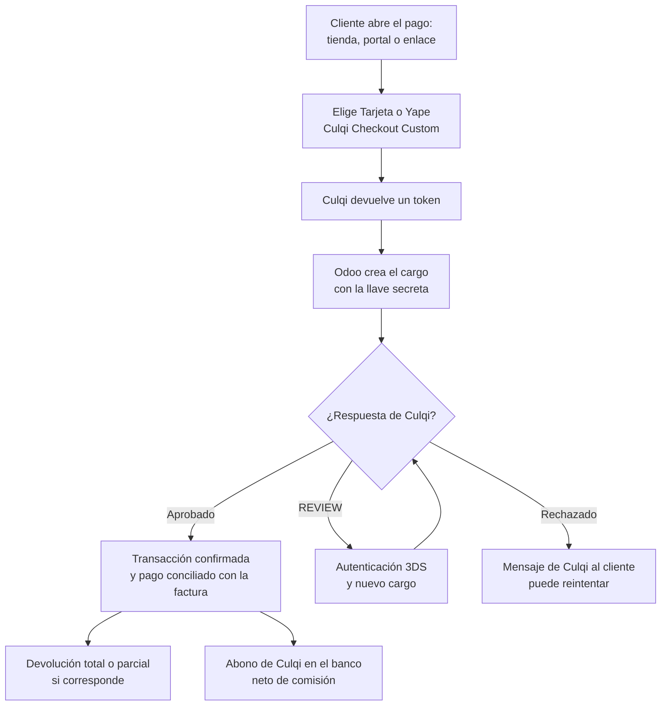

# Guía funcional — Pagos con Culqi

> Módulo técnico `al_payment_culqi` · versión `1.20261006` · área `OL-ACCOUNTING`.
> Para consultores funcionales: qué resuelve, el marco que lo respalda y el
> proceso completo con un ejemplo que cuadra. Enlaces verificados el
> 10/10/2026 con `docs/validacion/verificar_enlaces.py`.

## 1. Para qué sirve

Permite cobrar en línea con **Culqi** (pasarela de pagos peruana) **tarjetas**
y **Yape** desde la tienda en línea, el portal de clientes y los **enlaces de
pago** de facturas y pedidos de Odoo. El dinero queda registrado como una
**transacción** y, si está confirmada, como un **pago** conciliado con la
factura. Admite autenticación **3DS** y **devoluciones** totales o parciales.

Lo usan Ventas y Tesorería. Los datos de la tarjeta van del navegador a Culqi
y nunca pasan por Odoo.

**Fuera del alcance:** PagoEfectivo, billeteras distintas de Yape, Cuotéalo,
agentes, tarjeta guardada, captura manual y la **comisión de Culqi** (se
registra al conciliar el abono de la liquidación en el banco).

## 2. Marco normativo y conceptual

- **API v2 de Culqi** (cargos, devoluciones) y **Culqi Checkout Custom**: es
  la integración vigente; el Checkout v4 está en desuso según Culqi.
- **3DS** (3-D Secure): autenticación adicional que el banco puede pedir; Culqi
  responde `REVIEW` y el cliente se autentica antes de repetir el cargo.
- **Proveedores de pago de Odoo**: el módulo es un proveedor más, con sus
  métodos de pago y su diario.

| Término | Significado | Dónde aparece en Odoo |
|---|---|---|
| Llave pública / secreta | Credenciales de CulqiPanel (`pk_` / `sk_`) | Proveedor Culqi ▸ Credenciales |
| Modo de prueba | Llaves `pk_test` / `sk_test`, sin cobro real | Estado del proveedor |
| Transacción | Intento de pago con su estado | Contabilidad ▸ Configuración ▸ Transacciones de pago |
| Cargo | Cobro en Culqi por el importe exacto | Se crea desde Odoo con la llave secreta |
| Devolución | Reembolso total o parcial en Culqi | Transacción ▸ Reembolsar |

## 3. Proceso de inicio a fin

| # | Paso | Dónde en Odoo | Quién | Resultado |
|---|---|---|---|---|
| 1 | Configurar el proveedor | Contabilidad ▸ Configuración ▸ Proveedores de pago ▸ Culqi | Administrador | Llaves, modo, métodos Tarjeta y Yape |
| 2 | Publicar | Proveedor ▸ Publicar | Administrador | Visible en tienda y portal |
| 3 | Cobro | Portal / tienda / enlace de pago | Cliente | Transacción confirmada |
| 4 | Revisión | Transacciones de pago | Tesorería | Estado, mensajes de Culqi |
| 5 | Devolución | Transacción ▸ Reembolsar | Tesorería | Reembolso en Culqi y pago de salida en Odoo |
| 6 | Conciliación del abono | Contabilidad ▸ Banco | Tesorería | Abono neto y comisión registrada |

## 4. Ejemplo completo

Factura de S/ 500 + IGV S/ 90 = **S/ 590**, pagada con tarjeta desde el enlace
de pago. Culqi aprueba el cargo.

**Pago registrado al confirmar la transacción** (diario de Culqi, cuenta de
cobros pendientes):

| Cuenta | Descripción | Debe | Haber |
|---|---|---|---|
| 1041 | Cobros pendientes — Culqi | 590,00 | |
| 1212 | Facturas por cobrar (cliente) | | 590,00 |
| | **Totales** | **590,00** | **590,00** |

**Abono de la liquidación de Culqi** con una comisión de S/ 23,60 (importe de
ejemplo; depende del contrato con Culqi):

| Cuenta | Descripción | Debe | Haber |
|---|---|---|---|
| 1041 | Banco — abono neto | 566,40 | |
| 6391 | Gastos bancarios — comisión Culqi | 23,60 | |
| 1041 | Cobros pendientes — Culqi | | 590,00 |
| | **Totales** | **590,00** | **590,00** |

Si luego se devuelven S/ 100, Culqi reembolsa al cliente y Odoo registra un
pago de salida por 100; la nota de crédito al cliente se emite aparte.

## 5. Configuración inicial

1. En CulqiPanel ▸ Desarrollo ▸ API Keys: llaves de prueba (`pk_test_…`,
   `sk_test_…`) y de producción (`pk_live_…`, `sk_live_…`).
2. **Contabilidad ▸ Configuración ▸ Proveedores de pago ▸ Culqi**: llaves (Odoo
   comprueba que el prefijo corresponda al modo), opcional ID y llave RSA para
   cifrar el checkout.
3. Activar los métodos **Tarjeta** y **Yape**, elegir el diario y publicar.
4. Moneda: soles o dólares (Yape solo soles).

## 6. Reportes y libros relacionados

- **Transacciones de pago**: todas las operaciones con su estado y referencia.
- Los pagos salen en el **Libro Caja y Bancos** y concilian con la factura.
- Ventas: la factura cobrada queda pagada en el informe de antigüedad.

## 7. Casos especiales y errores frecuentes

| Situación | Qué pasa | Qué hacer |
|---|---|---|
| Llave que no corresponde al modo | Odoo no deja guardar | Usar `pk_test`/`sk_test` en prueba y `live` en producción |
| Tarjeta rechazada | El mensaje de Culqi queda en la transacción y se muestra al cliente | Reintentar con otro medio |
| Banco pide 3DS | El cliente se autentica y se repite el cargo | Nada |
| Importe alterado en el navegador | El cargo se rechaza | Nada: protección del servidor |
| Doble clic en pagar | El token de Culqi es de un solo uso; la fila se bloquea | Nada |
| Copia de la base para pruebas | Al neutralizarla se borran las llaves | Volver a poner las de prueba |

## 8. Preguntas frecuentes del consultor

**¿Odoo guarda los datos de la tarjeta?** No: van directo a Culqi.

**¿Se puede cobrar en dólares?** Sí, con tarjeta; Yape solo en soles.

**¿Cómo se registra la comisión?** Al conciliar el abono de Culqi en el banco
(la liquidación llega neta).

**¿Se probó con Culqi real?** Hay un script de validación contra el sandbox
(`docs/culqi/validar_sandbox.py`) que requiere las llaves de prueba del
cliente.

## 9. Referencias

Verificadas el 10/10/2026:

- Culqi — Documentación: https://docs.culqi.com/
- Culqi — API v2: https://apidocs.culqi.com/
- Odoo 19 — Proveedores de pago: https://www.odoo.com/documentation/19.0/applications/finance/payment_providers.html
