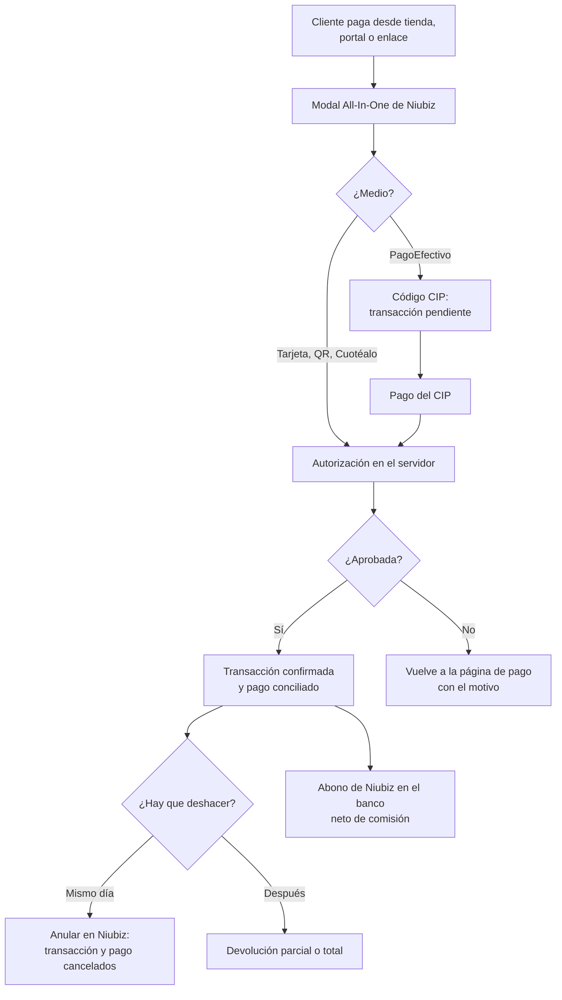

# Guía funcional — Pagos con Niubiz

> Módulo técnico `al_payment_niubiz` · versión `2.20261009` · área `OL-ACCOUNTING`.
> Para consultores funcionales: qué resuelve, el marco que lo respalda y el
> proceso completo con un ejemplo que cuadra. Enlaces verificados el
> 10/10/2026 con `docs/validacion/verificar_enlaces.py`.

## 1. Para qué sirve

Integra el **Checkout All-In-One de Niubiz** (VisaNet Perú) como proveedor de
pago de Odoo: en un solo modal el cliente paga con **tarjetas** (Visa,
Mastercard, American Express, Diners, UnionPay), **billeteras con QR** (Yape,
Plin…), **Cuotéalo BCP**, **PagoEfectivo** o puntos. Odoo guarda el código de
autorización, el número de traza y la marca de la tarjeta, y concilia el pago
con la factura. Permite **anular el mismo día** y **devolver** dentro de los
plazos de Niubiz.

Lo usan Ventas (tienda en línea, portal, enlaces de pago) y Tesorería. Los
datos de la tarjeta los procesa Niubiz (PCI DSS nivel 1).

**Fuera del alcance:** la **comisión de Niubiz** (se registra al conciliar el
abono en el banco) y el cobro recurrente con tarjeta guardada.

## 2. Marco normativo y conceptual

- **Checkout de Niubiz**: token de seguridad, sesión de pago, autorización en
  el servidor y reversa, según la documentación para desarrolladores.
- **Anulación (reversa)**: el mismo día, cancela el cargo antes de la
  liquidación; Niubiz responde «Voided».
- **Devolución**: requiere el RUC del comercio; Niubiz la admite desde 48 horas
  hábiles después del pago y hasta 6 meses.
- **PagoEfectivo**: genera un código CIP; la transacción queda pendiente hasta
  que el cliente paga.

| Término | Significado | Dónde aparece en Odoo |
|---|---|---|
| Código de comercio | Identificador del comercio en Niubiz | Proveedor Niubiz |
| Autorización / traza | Datos de la operación aprobada | Transacción de pago |
| Anular en Niubiz | Reversa el mismo día | Botón de la transacción |
| CIP | Código de pago de PagoEfectivo | Transacción pendiente |

## 3. Proceso de inicio a fin

| # | Paso | Dónde en Odoo | Quién | Resultado |
|---|---|---|---|---|
| 1 | Configurar | Contabilidad ▸ Configuración ▸ Proveedores de pago ▸ Niubiz | Administrador | Código de comercio, usuario y contraseña de la API, RUC |
| 2 | Cobro | Tienda / portal / enlace de pago | Cliente | Transacción confirmada con autorización y traza |
| 3 | Rechazo | Página de pago | Cliente | Motivo («Fondos insuficientes…») y nuevo intento |
| 4 | Anulación | Transacción ▸ Anular en Niubiz | Tesorería | Transacción y pago contable cancelados |
| 5 | Devolución | Transacción ▸ Reembolsar | Tesorería | Reembolso en Niubiz y pago de salida |
| 6 | Conciliación | Contabilidad ▸ Banco | Tesorería | Abono neto y comisión |

## 4. Ejemplo completo

Factura de S/ 1.000 + IGV S/ 180 = **S/ 1.180**, pagada con Visa. Niubiz
aprueba; la transacción guarda autorización, traza y marca VISA.

**Pago al confirmar la transacción:**

| Cuenta | Descripción | Debe | Haber |
|---|---|---|---|
| 1041 | Cobros pendientes — Niubiz | 1.180,00 | |
| 1212 | Facturas por cobrar (cliente) | | 1.180,00 |
| | **Totales** | **1.180,00** | **1.180,00** |

**Abono de la liquidación** con una comisión de S/ 41,30 (importe de ejemplo;
depende del contrato con Niubiz):

| Cuenta | Descripción | Debe | Haber |
|---|---|---|---|
| 1041 | Banco — abono neto | 1.138,70 | |
| 6391 | Gastos bancarios — comisión Niubiz | 41,30 | |
| 1041 | Cobros pendientes — Niubiz | | 1.180,00 |
| | **Totales** | **1.180,00** | **1.180,00** |

Si el mismo día el cliente desiste, **Anular en Niubiz** cancela la
transacción y el pago: la factura vuelve a quedar pendiente.

## 5. Configuración inicial

1. Datos de Niubiz: código de comercio, usuario y contraseña de la API, RUC
   del comercio (para las devoluciones).
2. **Contabilidad ▸ Configuración ▸ Proveedores de pago ▸ Niubiz**: cargar los
   datos (la contraseña solo la ven los administradores), elegir el diario y
   los métodos de pago y publicar.
3. En **Modo de prueba** se usan el sandbox y las credenciales públicas de
   Niubiz que muestra la propia pantalla.
4. Moneda: soles o dólares.

## 6. Reportes y libros relacionados

- **Transacciones de pago** con autorización, traza, fecha y marca.
- Pagos en el **Libro Caja y Bancos**, conciliados con las facturas.

## 7. Casos especiales y errores frecuentes

| Situación | Qué pasa | Qué hacer |
|---|---|---|
| Tarjeta rechazada (116, fondos insuficientes) | Vuelve a la página de pago con el motivo | Reintentar sin crear otro pedido |
| PagoEfectivo sin pagar | La transacción queda pendiente | Esperar el pago del CIP |
| Devolución antes de 48 h hábiles | Niubiz la rechaza | Anular el mismo día o esperar el plazo |
| Devolución sin RUC del comercio | No se puede pedir | Completar el RUC en el proveedor |
| Corte de conexión TLS con Niubiz | El token y la sesión se reintentan; la autorización no | Revisar la transacción antes de reintentar |
| Copia de la base | Al neutralizarla se borra la contraseña | Volver a configurarla |

## 8. Preguntas frecuentes del consultor

**¿Cuál es la diferencia entre anular y devolver?** Anular es el mismo día y
cancela el cargo; devolver es posterior y reembolsa al cliente.

**¿Se probó con Niubiz real?** Sí, contra el sandbox el 06/10/2026: pagos
aprobados con Visa, Mastercard y Amex, rechazo 116 y anulación.

**¿Odoo registra la comisión?** No; se registra al conciliar el abono.

## 9. Referencias

Verificadas el 10/10/2026:

- Niubiz — Portal de desarrolladores: https://desarrolladores.niubiz.com.pe/
- Odoo 19 — Proveedores de pago: https://www.odoo.com/documentation/19.0/applications/finance/payment_providers.html
