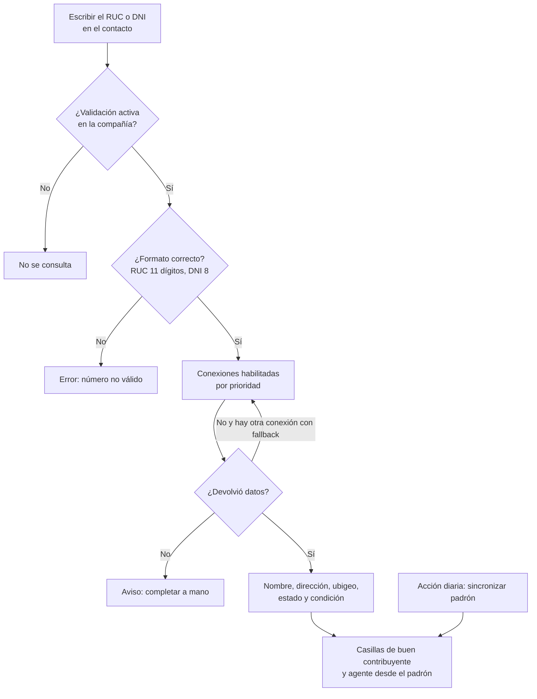

# Guía funcional — Consulta de RUC y DNI

> Módulo técnico `l10n_pe_vat_sunat` · versión `17.20261009` · área `OL-ACCOUNTING`.
> Para consultores funcionales: qué resuelve, la norma que lo respalda y el
> proceso completo con un ejemplo. Enlaces verificados el 10/10/2026 con
> `docs/validacion/verificar_enlaces.py`.

## 1. Para qué sirve

Registrar clientes y proveedores copiando a mano la razón social y la
dirección produce errores que luego aparecen en los comprobantes
electrónicos; además, el **estado** (activo, baja) y la **condición** (habido,
no habido) de un RUC cambian sin aviso, y las **retenciones del IGV** dependen
de si el proveedor es **agente de retención** o **buen contribuyente**.

El módulo autocompleta el contacto al escribir el RUC o el DNI, consultando
una lista de servicios configurables (SUNAT, Decolecta, apiperu.dev, json.pe,
apis.net.pe…) por orden de prioridad, y guarda en la base los **padrones de
SUNAT** de buenos contribuyentes y agentes de retención, que se recargan cada
día. Lo usan Ventas, Compras y Contabilidad al crear contactos.

**Fuera del alcance:** no valida en línea el estado del RUC en cada factura
(lo hace al crear o actualizar el contacto) y no trae otros padrones (por
ejemplo, agentes de percepción).

## 2. Marco normativo y conceptual

- **Ley del RUC** (D. Leg. 943): el RUC es el identificador de los
  contribuyentes; su estado y condición los publica SUNAT.
- **Régimen de Retenciones del IGV** (R.S. 037-2002/SUNAT y R.S.
  061-2005/SUNAT): exceptúa a los proveedores que son agentes de retención o
  buenos contribuyentes, por eso importan los padrones.
- **Designación de agentes de retención**: SUNAT la actualiza por resolución
  (la más reciente revisada: R.S. 000367-2025/SUNAT).

| Término | Significado | Dónde aparece en Odoo |
|---|---|---|
| Estado SUNAT | Activo, baja de oficio, suspensión temporal… | Cabecera del contacto |
| Condición | Habido o No habido (domicilio fiscal verificado) | Cinta del contacto |
| Buen contribuyente | Incluido en el padrón; exceptuado de retenciones | Casilla del contacto |
| Agente de retención | Designado por SUNAT; exceptuado de que le retengan | Casilla del contacto |
| Conexión | Un servicio de consulta con su URL, autenticación y mapeo | Perú ▸ Configuración ▸ Consultas RUC / DNI ▸ Conexiones RUC/DNI |
| Fallback en cascada | Si una conexión falla, probar la siguiente | Ajustes ▸ Validación RUC/DNI (PE) |
| Ubigeo | Código de departamento, provincia y distrito | Dirección del contacto |

## 3. Proceso de inicio a fin

| # | Paso | Dónde en Odoo | Quién | Resultado |
|---|---|---|---|---|
| 1 | Activar la validación | Perú ▸ Configuración ▸ Ajustes ▸ Validación RUC/DNI (PE) | Administrador | Validar RUC / Validar DNI / Fallback |
| 2 | Revisar las conexiones y su token | Perú ▸ Configuración ▸ Consultas RUC / DNI ▸ Conexiones RUC/DNI | Administrador | Prioridad y credenciales |
| 3 | Crear el contacto | Contactos ▸ Nuevo ▸ Número de identificación | Usuario | Datos completados solos |
| 4 | Volver a consultar | Contacto ▸ Actualizar desde API | Usuario | Datos al día o el motivo del fallo |
| 5 | Consultar el padrón | Perú ▸ Configuración ▸ Consultas RUC / DNI ▸ Padrón SUNAT | Contabilidad | RUC de ambos padrones con su fecha |

## 4. Ejemplo completo

1. Ventas crea un cliente y escribe el RUC de **NOR AUTOS CHICLAYO S.A.C.**
   (caso de la base de demostración).
2. La primera conexión habilitada con token responde: el contacto toma la
   razón social, la dirección fiscal con su distrito, provincia y
   departamento (resueltos desde el ubigeo), el **Estado SUNAT: ACTIVO** y la
   condición **Habido**.
3. El padrón guardado lo marca como **agente de retención**: si la empresa es
   también agente, sus facturas a este proveedor **no** se retienen.
4. Otro usuario escribe un RUC de 10 dígitos: el sistema lo rechaza antes de
   consultar.
5. Un contacto cuya consulta falló muestra «No hay conexión con SUNAT/API o
   los datos no existen» y se completa a mano; el aviso desaparece en la
   siguiente consulta correcta.

El módulo **no genera asientos**: solo completa datos del contacto.

## 5. Configuración inicial

1. Ajustes: **Validar RUC**, **Validar DNI** y, si se quiere, **Fallback en
   cascada**.
2. Conexiones: el sistema siembra cinco por compañía; poner el **token** de
   las que se usarán (sin token, la conexión se salta). El de **Decolecta** lo
   reutiliza el módulo de tipo de cambio.
3. Para un servicio nuevo: crear la conexión (URL, endpoint con `{doc}`,
   autenticación) y su **Mapeo de campos** (ruta en la respuesta → campo del
   contacto), sin programar.
4. Padrón: la acción planificada **SUNAT: Sincronizar padrón** debe estar
   activa (Ajustes ▸ Técnico ▸ Acciones planificadas).

## 6. Reportes y libros relacionados

- **Padrón SUNAT**: filtros por tipo de padrón y búsqueda por RUC.
- Las casillas del padrón las usan las **Retenciones del IGV**
  (`al_l10n_pe_retention`).
- El nombre y la dirección completados son los que salen en los comprobantes
  electrónicos y en los libros (PLE/SIRE).

## 7. Casos especiales y errores frecuentes

| Situación | Qué pasa | Qué hacer |
|---|---|---|
| Ninguna conexión con token | No se consulta nada | Configurar al menos un token o la conexión SUNAT oficial |
| Plan del servicio vencido | La consulta falla | El botón «Actualizar desde API» muestra el motivo; renovar o cambiar de prioridad |
| Proveedor recién designado agente | El padrón descargado aún no lo incluye | Marcar la casilla a mano |
| RUC con estado BAJA o No habido | Se muestra en el contacto | Evaluar con el contador antes de facturar o deducir crédito |
| Descarga del padrón fallida | Se conserva el padrón anterior y se anota el error | Ejecutar la acción a mano más tarde |

## 8. Preguntas frecuentes del consultor

**¿Hay que pagar por la consulta?** Depende del servicio: la consulta SUNAT
oficial no usa token; las APIs comerciales sí.

**¿Puedo agregar otro proveedor de datos?** Sí, como registro de conexión con
su mapeo, sin desarrollo.

**¿El DNI trae la dirección?** Trae el nombre (RENIEC); la dirección depende
del servicio.

**¿Cada cuánto se actualiza el padrón?** Cada día, con la acción planificada.

## 9. Referencias

Verificadas el 10/10/2026:

- Ley del RUC, D. Leg. 943: https://www.sunat.gob.pe/legislacion/ruc/dleg943.htm
- R.S. 037-2002/SUNAT — Régimen de Retenciones del IGV: https://www.sunat.gob.pe/legislacion/superin/2002/037.htm
- R.S. 061-2005/SUNAT — Flexibilización del régimen: https://www.sunat.gob.pe/legislacion/superin/2005/061.htm
- R.S. 000367-2025/SUNAT — Designación de agentes de retención: https://www.sunat.gob.pe/legislacion/superin/2025/000367-2025.pdf
- SUNAT, orientación — Régimen de retenciones: https://orientacion.sunat.gob.pe/07-regimen-de-retenciones-informacion-general
- Odoo 19 — Localización peruana: https://www.odoo.com/documentation/19.0/applications/finance/fiscal_localizations/peru.html
