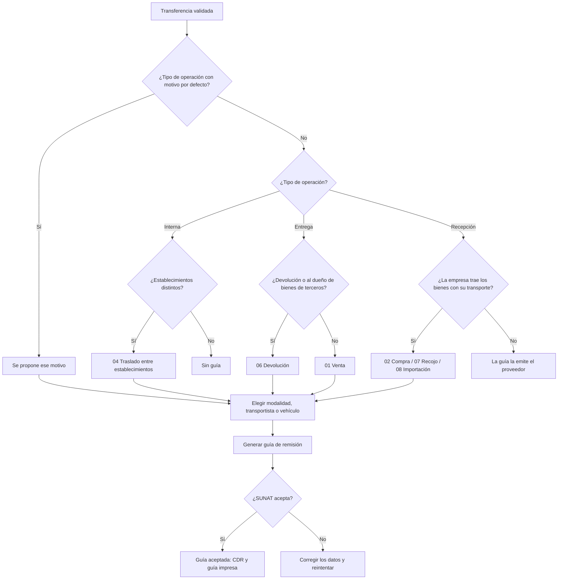

# Guía funcional — Traslados internos y bienes de terceros

> Módulo técnico `al_l10n_pe_stock_transfer` · versión `2.20261010` · área `OL-INVENTORY`.
> Para consultores funcionales: qué resuelve, la norma que lo respalda y el
> proceso completo con un ejemplo que cuadra. Enlaces verificados el
> 10/10/2026 con `docs/validacion/verificar_enlaces.py`.

## 1. Para qué sirve

Toda empresa que mueve bienes en el Perú debe sustentar el traslado con una
**guía de remisión remitente**. Odoo 19 la emite (módulo `l10n_pe_edi_stock`),
pero solo en las **entregas a clientes** y con parte de los motivos de SUNAT.
Este módulo completa el proceso para los traslados que hace la propia empresa:

- entre sus establecimientos (planta → obra, almacén central → tienda);
- compras que recoge con su transporte, recojo de bienes mandados a
  transformar, importaciones desde el puerto y exportaciones;
- devoluciones al proveedor o al dueño de bienes de terceros;
- **bienes de terceros** (equipos alquilados, mercadería en consignación):
  identificados en el almacén y en la guía, sin valorizarlos.

Lo usan almacén y logística (emiten la guía) y contabilidad (revisa que los
bienes de terceros no entren a la valorización).

**Fuera del alcance:** el motivo 19 «Traslado de mercancía extranjera» (exige
datos del terminal portuario y del almacén aduanero), la guía de remisión
**transportista** (la emite la empresa de transporte) y el envío real a SUNAT
de cada motivo nuevo sin validarlo antes en el ambiente de pruebas.

## 2. Marco normativo y conceptual

- **Reglamento de Comprobantes de Pago, artículos 17 a 21** (capítulo V): quién
  emite la guía, sus datos y los motivos del traslado (venta, compra,
  transformación, consignación, devolución, traslado entre establecimientos,
  emisor itinerante, importación, exportación y otros). Exige que los
  establecimientos de partida y llegada estén declarados en el RUC.
- **R.S. N.° 123-2022/SUNAT**: guía de remisión electrónica (GRE) remitente y
  transportista, que se envía a SUNAT y devuelve un CDR.
- **Catálogo 20 «Motivo de traslado»** (anexo de la **R.S. N.° 240-2024/SUNAT**):
  códigos vigentes 01, 02, 03, 04, 05, 06, 07, 08, 09, 13, 14, 17, 18 y 19.
- **R.S. N.° 000108-2026/SUNAT**: ajustes recientes de la GRE (fecha de entrega
  al transportista y documentos relacionados del comercio exterior). Desde el
  01/06/2026 SUNAT valida el RUC y el código del establecimiento de partida y
  llegada.

| Término | Significado | Dónde aparece en Odoo |
|---|---|---|
| Remitente | Quien envía los bienes y emite la guía (aquí, la empresa) | Compañía |
| Destinatario | Quien los recibe; en el motivo 04 y en las compras que recoge la empresa es la misma empresa | Datos del destinatario de la guía |
| Punto de partida / llegada | Direcciones de origen y destino, con su ubigeo | Transferencia ▸ Logística PE |
| Establecimiento anexo | Código que SUNAT asigna a cada local declarado en el RUC (0000 el domicilio fiscal) | Contacto de la dirección ▸ «Establecimiento anexo» |
| Motivo de traslado | Código del catálogo 20 | Transferencia ▸ Logística PE ▸ Motivo de traslado |
| Bienes de terceros | Bienes que están en el almacén pero son de otro (consignación) | «Propietario» de la transferencia o de la línea |
| Modalidad | 01 transporte público (empresa de transportes) o 02 privado (vehículo propio) | Modalidad de traslado |

## 3. Proceso de inicio a fin

| # | Paso | Dónde en Odoo | Quién | Resultado |
|---|---|---|---|---|
| 1 | Crear y validar la transferencia | Inventario ▸ Operaciones ▸ Traslados ▸ Interno / Recepciones / Entregas | Almacén | Transferencia «Hecho» |
| 2 | Elegir la modalidad de traslado | Transferencia ▸ Logística PE ▸ Modalidad de traslado | Logística | Se propone el motivo y la fecha de inicio |
| 3 | Revisar motivo, partida y llegada | Transferencia ▸ Logística PE ▸ Guía de remisión | Logística | Con 13 «Otros», escribir la descripción; con 08/09, la DAM o DS |
| 4 | Completar el transporte | Logística PE ▸ Transporte | Logística | Transportista (público) o vehículo y conductor (privado) |
| 5 | Emitir | Botón «Generar guía de remisión» | Logística | Número T001-…, ticket y CDR de SUNAT |
| 6 | Imprimir | Botón «Guía de remisión» (guía aceptada) | Logística | Representación impresa para el transportista |

**Caminos alternativos:**

- **Mismo establecimiento** (de un estante a otro): no hay botón; si se fuerza,
  el sistema avisa que no lleva guía.
- **Recepción sin motivo de ingreso**: si el proveedor trae los bienes, la guía
  es suya; el sistema no deja emitirla con 01.
- **Error de SUNAT**: el detalle queda en la transferencia; se corrige el dato
  (dirección, distrito, transportista…) y se vuelve a enviar.
- **Guía rechazada o anulada**: se gestiona como en el estándar de Odoo
  (`l10n_pe_edi_stock`).

## 4. Ejemplo completo

Datos de demostración «DEMO TRAS» (`tools/stock_transfer_demo_data.py`) en la
compañía Comercial Demo Perú S.A.C., RUC 20512528458:

| Establecimiento | Dirección | Anexo |
|---|---|---|
| DEMO TRAS Planta Ate (almacén DTP) | Av. Nicolás Ayllón 4200 | 0001 |
| DEMO TRAS Obra Surco (almacén DTO) | Av. Primavera 1550 | 0002 |

Bienes: andamios tubulares propios (18 kg) y andamios multidireccionales
alquilados a DEMO TRAS Alquiler de Equipos S.A.C., RUC 20611111119 (25 kg),
con el transportista DEMO TRAS Transportes Rápidos S.A.C. (RUC 20633333336,
MTC 1512345CNG).

**a) Traslado de 8 andamios alquilados de la planta a la obra** (DTP/INT/00002)

| Dato de la guía | Valor |
|---|---|
| Motivo | 04 Traslado entre establecimientos de la misma empresa (propuesto) |
| Destinatario | Comercial Demo Perú S.A.C. (la misma empresa) |
| Partida | Av. Nicolás Ayllón 4200 · RUC 20512528458 · anexo 0001 |
| Llegada | Av. Primavera 1550 · RUC 20512528458 · anexo 0002 |
| Peso bruto | 8 × 25 kg = **200 kg** |
| Observaciones | «Bienes de propiedad de DEMO TRAS Alquiler de Equipos S.A.C. (20611111119).» |

**b) Compra de 15 andamios tubulares que la empresa recoge** (DTP/IN/00001,
factura del proveedor F001-00004521)

| Dato de la guía | Valor |
|---|---|
| Motivo | 02 Compra (propuesto en la recepción) |
| Destinatario | Comercial Demo Perú S.A.C. |
| Partida | Av. Argentina 2100 (proveedor, RUC 20622222222, anexo 0) |
| Llegada | Av. Nicolás Ayllón 4200 (anexo 0001) |
| Documento relacionado | Factura F001-00004521 |
| Peso bruto | 15 × 18 kg = **270 kg** |

**c) Devolución de 4 andamios alquilados a su dueño** (DTP/OUT/00001)

| Dato de la guía | Valor |
|---|---|
| Motivo | 06 Devolución (propuesto: el destinatario es el dueño de los bienes) |
| Destinatario | DEMO TRAS Alquiler de Equipos S.A.C. |
| Peso bruto | 4 × 25 kg = **100 kg** |

**Efecto en inventario y contabilidad.** El módulo no genera asientos: la guía
es un documento de traslado, no contable.

| Movimiento | Existencias físicas | Valorización y kardex valorizado | Asiento |
|---|---|---|---|
| a) 8 alquilados planta → obra | Planta −8, obra +8 (de terceros) | No entran (propietario ajeno) | Ninguno |
| b) Compra de 15 propios | Planta +15 | Sí, como cualquier recepción | El de la recepción estándar, si la categoría tiene valorización automática |
| c) Devolución de 4 alquilados | Planta −4 (de terceros) | No entran | Ninguno |

Los bienes de terceros quedan en el filtro «De terceros» de existencias: tras
los tres movimientos, 8 en la obra y 0 en la planta (12 recibidos − 8
trasladados − 4 devueltos).

## 5. Configuración inicial

1. **Direcciones de los establecimientos:** en el contacto de cada almacén
   (Inventario ▸ Configuración ▸ Gestión del almacén ▸ Almacenes ▸ Dirección):
   calle, distrito (ubigeo) y «Establecimiento anexo» SUNAT de la ficha RUC.
2. **Compañía:** RUC y tipo de documento RUC en su contacto (requisito del
   estándar).
3. **Consignación** (bienes de terceros): Inventario ▸ Configuración ▸ Ajustes ▸
   Consignación, para ver el campo «Propietario».
4. **Transporte:** vehículos en Inventario ▸ Configuración ▸ Perú ▸ Vehículos y,
   para transporte público, el transportista con RUC y número MTC.
5. **Motivo por defecto (opcional):** Inventario ▸ Configuración ▸ Gestión del
   almacén ▸ Tipos de operaciones ▸ «Motivo de traslado (guía)», p. ej. un tipo
   «Envío en consignación» con 05.
6. **Conexión con SUNAT** de la guía electrónica: la del estándar
   (`l10n_pe_edi_stock`, Ajustes de Inventario ▸ Perú).

## 6. Reportes y libros relacionados

- **Guías de remisión**: menú Perú ▸ Guías de remisión
  (`al_l10n_pe_delivery_guide_report`), con su estado ante SUNAT y la guía
  impresa.
- **Kardex SUNAT** (`ol_stock_kardex_pe`): los bienes de terceros no entran a
  las cantidades valorizadas; los traslados internos entre almacenes se ven
  como salida y entrada del mismo producto.
- **Existencias de terceros**: Inventario ▸ Reportes ▸ Ubicaciones ▸ Filtros ▸
  De terceros (también «Propios»); en movimientos, «De terceros»; en
  transferencias, «Con bienes de terceros».

## 7. Casos especiales y errores frecuentes

| Situación | Qué pasa | Qué hacer |
|---|---|---|
| Transferencia interna sin botón de guía | Origen y destino son el mismo establecimiento (mismo anexo o misma dirección) | Es correcto: no sale del local. Si sí sale, revise la dirección de los almacenes |
| «Con el motivo 13…describa el traslado» | Falta la descripción | Complete «Descripción del motivo» (p. ej. «Exhibición en feria») |
| «Con importación o exportación indique la declaración aduanera» | Motivo 08/09 sin DAM o DS | Documento relacionado 50 (DAM) o 52 (DS) y su número |
| «Los motivos 02, 07 y 08 son de ingreso» | Se eligió un motivo de ingreso en una entrega | Use el motivo de la salida (01, 06, 05…) |
| Recepción que no deja emitir guía | El motivo es de venta | Si la empresa trajo los bienes, elija 02/07/08; si no, la guía es del proveedor |
| El propietario no aparece en la guía | La transferencia y sus líneas no tienen propietario | Indique el propietario al recibir los bienes de terceros |
| Motivo 04 «Translados…» en pantalla | Errata de la traducción del estándar | Solo es el texto; el código enviado es 04 |

## 8. Preguntas frecuentes del consultor

**¿La guía de un traslado a una obra necesita que la obra esté en el RUC?**
Sí: el Reglamento exige que los puntos de partida y llegada entre
establecimientos de la empresa estén declarados en el RUC; su código de anexo
va en la guía.

**¿Los equipos alquilados afectan el costo del inventario?** No. Con
propietario ajeno no se valorizan ni entran al kardex valorizado; solo se
controlan en cantidades.

**¿Puedo cambiar el motivo propuesto?** Sí, antes de enviar. La propuesta solo
reemplaza el 01 que Odoo pone al crear la transferencia.

**¿Qué motivo uso para llevar equipos alquilados a la obra?** 04 si la obra es
un establecimiento de la empresa; el propietario va en las observaciones.

**¿Y si el proveedor nos trae la compra?** Él emite su guía (motivo 01 Venta en
la suya); la empresa no emite guía en esa recepción.

**¿Se puede emitir la guía de exportación?** Sí, con motivo 09 y la DAM o DS en
el documento relacionado. Verifique el primer envío en el ambiente de pruebas
de SUNAT.

## 9. Referencias

Verificadas el 10/10/2026.

- [Reglamento de Comprobantes de Pago, capítulo V (guías de remisión)](https://www.sunat.gob.pe/legislacion/comprob/regla/capituloV.pdf) — SUNAT.
- [R.S. N.° 123-2022/SUNAT, guía de remisión electrónica](https://www.sunat.gob.pe/legislacion/superin/2022/123-2022.pdf) — SUNAT.
- [R.S. N.° 240-2024/SUNAT](https://www.sunat.gob.pe/legislacion/superin/2024/000240-2024.pdf) y [su anexo con el catálogo 20](https://www.sunat.gob.pe/legislacion/superin/2024/anexo1-000240-2024.pdf) — SUNAT.
- [R.S. N.° 000108-2026/SUNAT](https://www.sunat.gob.pe/legislacion/superin/2026/000108-2026.pdf) — SUNAT.
- [R.S. N.° 097-2012/SUNAT, sistema de emisión electrónica (catálogos)](https://www.sunat.gob.pe/legislacion/superin/2012/097-2012.pdf) — SUNAT.
- [Guía de remisión remitente — orientación SUNAT](https://orientacion.sunat.gob.pe/02-guia-de-remision-remitente).
- [GRE: traslado de mercancía extranjera](https://www.gob.pe/institucion/sunat/informes-publicaciones/6189305-gre-traslado-de-mercancia-extranjera) — gob.pe.
- [Localización Perú en Odoo 19 (guía de remisión)](https://www.odoo.com/documentation/19.0/applications/finance/fiscal_localizations/peru.html) — Odoo.
- [Consignación: existencias de terceros en Odoo 19](https://www.odoo.com/documentation/19.0/applications/inventory_and_mrp/inventory/shipping_receiving/daily_operations/owned_stock.html) — Odoo.
