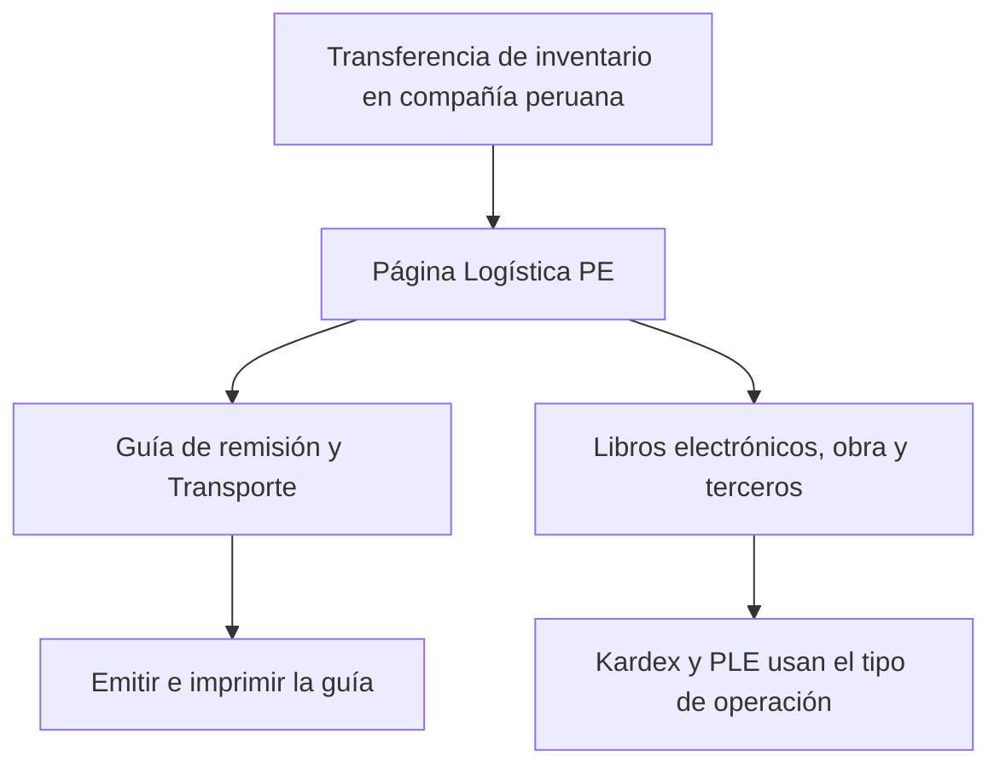

# Guía funcional — Base de Inventario Perú (página Logística PE)

> Módulo técnico `al_stock_base` · versión `1.20261008` · área `OL-INVENTORY`.
> Para consultores funcionales: qué resuelve y dónde encontrar cada dato.
> Enlaces verificados el 10/10/2026 con `docs/validacion/verificar_enlaces.py`.

## 1. Para qué sirve

Varios módulos peruanos añaden datos a las transferencias de inventario (guía
de remisión, transporte, libros electrónicos, requerimiento de obra, bienes de
terceros). Sin un orden común, esos campos se mezclan con los de Odoo en la
cabecera. Este módulo liviano crea la página **Logística PE** en la
transferencia, el **único lugar** donde la suite muestra lo peruano, agrupado
por tema (como «Facturación PE» en la factura).

No tiene lógica de negocio propia: la aportan los módulos que cuelgan de él.
**Fuera del alcance:** cualquier cálculo o envío (lo hacen los módulos de cada
grupo).

## 2. Marco normativo y conceptual

Los datos que se ordenan en la página responden a normas de otros módulos:

- Guía de remisión electrónica (R.S. 123-2022/SUNAT):
  <https://www.sunat.gob.pe/legislacion/superin/2022/123-2022.pdf>.
- Tipo de operación del inventario (tabla 12 de SUNAT), que usa el registro de
  inventario permanente; estructura del formato 13.1 electrónico en el anexo
  de la R.S. 042-2018/SUNAT:
  <https://www.sunat.gob.pe/legislacion/superin/2018/anexo-042-2018.pdf>.
- Inventario en Odoo 19: <https://www.odoo.com/documentation/19.0/es/applications/inventory_and_mrp/inventory.html>.

| Grupo de la página | Módulo que lo llena | Contenido |
|---|---|---|
| Guía de remisión | `al_l10n_pe_delivery_guide_report` (con `l10n_pe_edi_stock`) | Estado, número, ticket, modalidad, motivo, fecha de inicio |
| Transporte | `al_l10n_pe_delivery_guide_report` | Vehículo, conductor, documento relacionado, observaciones |
| Libros electrónicos (PLE) | `al_l10n_pe_ple` | Tipo de operación (tabla 12), consignación |
| Requerimiento de obra | `al_construction_material_request` | Requerimiento que originó la transferencia |
| Bienes de terceros | `al_l10n_pe_stock_transfer` | Propietarios y aviso de no valorización |

## 3. Proceso de inicio a fin

| # | Paso | Dónde en Odoo | Resultado |
|---|---|---|---|
| 1 | Abrir la transferencia | Inventario ▸ Operaciones ▸ Transferencias | Cabecera limpia |
| 2 | Completar los datos peruanos | Transferencia ▸ página **Logística PE** | Cada grupo aparece solo si su módulo está instalado |

## 4. Ejemplo completo

Una entrega a obra con guía de remisión: en **Logística PE ▸ Guía de remisión**
se ve la guía T001-00000101 con motivo venta y modalidad privada; en
**Transporte**, el vehículo y su conductor; en **Libros electrónicos**, el tipo
de operación 01 (venta); y si viene de un requerimiento, en **Requerimiento de
obra** el documento de origen. La página no aparece en compañías de otros
países.

No genera asientos contables.

## 5. Configuración inicial

Ninguna: se instala como dependencia de los módulos de la suite.

## 6. Reportes y libros relacionados

Indirectamente: la guía de remisión impresa, el kardex SUNAT y el PLE de
inventarios toman sus datos de los grupos de esta página.

## 7. Casos especiales y errores frecuentes

| Situación | Qué pasa | Qué hacer |
|---|---|---|
| No veo la página | La compañía no es peruana | Revisar el país de la compañía |
| Falta un grupo | Su módulo no está instalado | Instalar el módulo correspondiente |
| Busco la pestaña «EDI PE» nativa | Queda oculta: sus datos están en Logística PE | Usar Logística PE |

## 8. Preguntas frecuentes del consultor

- **¿Tiene ajustes?** No.
- **¿Puedo desinstalarlo?** No mientras lo usen los módulos de la suite.

## 9. Referencias

Enlaces verificados el 10/10/2026:

- R.S. 123-2022/SUNAT: <https://www.sunat.gob.pe/legislacion/superin/2022/123-2022.pdf>
- Anexo de la R.S. 042-2018/SUNAT (formato 13.1 electrónico):
  <https://www.sunat.gob.pe/legislacion/superin/2018/anexo-042-2018.pdf>
- Odoo 19, inventario: <https://www.odoo.com/documentation/19.0/es/applications/inventory_and_mrp/inventory.html>
