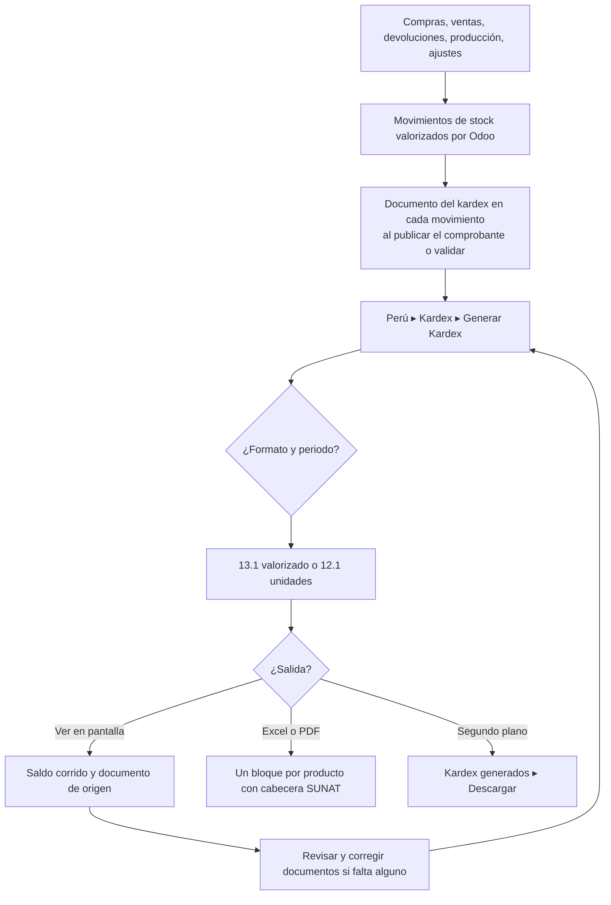

# Guía funcional — Kardex SUNAT (formatos 13.1 y 12.1)

> Módulo técnico `ol_stock_kardex_pe` · versión `12.20261009` · área `OL-INVENTORY`.
> Para consultores funcionales: qué resuelve, la norma que lo respalda y el
> proceso completo con un ejemplo que cuadra. Enlaces verificados el
> 10/10/2026 con `docs/validacion/verificar_enlaces.py`.

## 1. Para qué sirve

Los contribuyentes obligados a llevar el **Registro de Inventario Permanente**
deben presentarlo en el formato **13.1** (valorizado) o **12.1** (unidades
físicas): un bloque por existencia, con cabecera y cada movimiento clasificado
por tipo de comprobante (tabla 10) y tipo de operación (tabla 12). Odoo 19
valoriza el inventario, pero no presenta el registro con ese diseño.

El módulo genera el kardex a partir de los movimientos de stock de Odoo:

- **en pantalla**, con saldo corrido y acceso al documento de origen;
- en **Excel y PDF** con la cabecera SUNAT;
- **consolidado** de la compañía o **por almacén**;
- en **segundo plano** para periodos largos;
- guardando en cada movimiento su **comprobante** (tipo, serie y número), que
  también usa el TXT del PLE de inventarios de Enterprise.

Lo usan contabilidad y almacén. **Fuera del alcance:** los asientos de
valorización (los hace `stock_account`) y el TXT del PLE en sí (lo genera
`l10n_pe_reports_stock` de Enterprise; este módulo le corrige el documento de
cada fila).

## 2. Marco normativo y conceptual

- **R.S. 234-2006/SUNAT**: libros y registros vinculados a asuntos tributarios,
  formatos 12.1 y 13.1 del registro de inventario permanente:
  <https://www.sunat.gob.pe/legislacion/superin/2006/234.htm>.
- **Libros electrónicos (PLE)**: R.S. 286-2009/SUNAT
  (<https://www.sunat.gob.pe/legislacion/superin/2009/rs286.doc>) y la
  estructura vigente del formato 13.1 en la R.S. 042-2018/SUNAT y su anexo:
  <https://www.sunat.gob.pe/legislacion/superin/2018/042-2018.pdf> ·
  <https://www.sunat.gob.pe/legislacion/superin/2018/anexo-042-2018.pdf>.
- Presentación del MEF sobre libros electrónicos:
  <https://www.mef.gob.pe/contenidos/conta_publ/capacitaciones/seminario_may2013/diapositivas/libros_electronicos_mef17052013_parte1.pdf>.
- **Obligación**: el art. 35 del Reglamento de la Ley del Impuesto a la Renta
  define, según los ingresos brutos del ejercicio anterior, quién lleva el
  inventario permanente valorizado y quién en unidades físicas; verifique los
  umbrales vigentes con el contador del cliente.
- Inventario en Odoo 19: <https://www.odoo.com/documentation/19.0/es/applications/inventory_and_mrp/inventory.html>.

| Término | Significado | Dónde aparece |
|---|---|---|
| Formato 13.1 | Registro de inventario permanente valorizado | Generar Kardex ▸ Formato |
| Formato 12.1 | Registro en unidades físicas | Generar Kardex ▸ Formato |
| Tabla 5 | Tipo de existencia (mercadería, producto terminado…) | Producto |
| Tabla 6 | Unidad de medida SUNAT | Unidad de medida |
| Tabla 10 | Tipo de comprobante (01 factura, 03 boleta, 07 nota de crédito, 09 guía, 00 otros) | Columna del kardex |
| Tabla 12 | Tipo de operación (01 venta, 02 compra, 16 saldo inicial, 11/21 traslados…) | Transferencia (Logística PE) |
| Promedio ponderado | Costo unitario = valor del saldo / cantidad del saldo | Método de valuación |

## 3. Proceso de inicio a fin

| # | Paso | Dónde en Odoo | Quién | Resultado |
|---|---|---|---|---|
| 1 | Registrar operaciones | Compras, Ventas, TPV, Inventario | Usuarios | Movimientos valorizados con su documento |
| 2 | Generar | Perú ▸ Kardex (12.1 / 13.1) ▸ Generar Kardex (también Inventario ▸ Reportes ▸ Kardex SUNAT) | Contabilidad | Formato, periodo (por mes o rango), almacenes, productos, categorías, **Kardex por almacén**, **Incluir productos sin movimientos** |
| 3 | Revisar | **Ver en pantalla** | Contabilidad | Movimientos con tabla 10 y 12, entradas, salidas y saldo |
| 4 | Descargar | **PDF** / **Exportar Excel** | Contabilidad | Formato SUNAT por producto |
| 5 | Periodos largos | **Generar en segundo plano** ▸ Perú ▸ Kardex ▸ Kardex generados | Contabilidad | Archivo **Listo** para descargar |
| 6 | Corregir el documento de un movimiento | Transferencia ▸ **Documento del kardex** o historial de movimientos | Contabilidad | Corrección manual que el llenado automático respeta |
| 7 | Acceso rápido | Producto o categoría ▸ **Ver Kardex** | Almacén | Asistente con el filtro cargado |

## 4. Ejemplo completo

Arroz Superior 5 kg, método **promedio ponderado**, sin saldo al 1 de julio de
2026 (formato 13.1):

| Fecha | Documento (T.10) | Op. (T.12) | Entrada | Salida | Costo unitario | Saldo | Costo del saldo |
|---|---|---|---|---|---|---|---|
| 02/07/2026 | 01 F001-00000201 | 02 Compra | 100 × 22,00 | — | 22,00 | 100 | 2 200,00 |
| 06/07/2026 | 01 F001-00000205 | 02 Compra | 50 × 25,00 | — | 23,00 | 150 | 3 450,00 |
| 10/07/2026 | 01 F001-00000206 | 01 Venta | — | 40 × 23,00 | 23,00 | 110 | 2 530,00 |
| 14/07/2026 | 03 B001-00000201 | 01 Venta | — | 10 × 23,00 | 23,00 | 100 | 2 300,00 |

Cálculos:

- Tras la segunda compra: (2 200,00 + 50 × 25,00) / (100 + 50) =
  3 450,00 / 150 = **23,00**.
- Las salidas se valoran al promedio vigente: 40 × 23 = 920,00 y
  10 × 23 = 230,00.
- Totales del mes: entradas 150 unidades por **3 450,00**; salidas 50 por
  **1 150,00**; saldo final 100 por **2 300,00** (3 450,00 – 1 150,00).

El kardex no genera asientos: el costo de ventas del mes (1 150,00) y el
ingreso del inventario (3 450,00) los contabiliza la valorización de Odoo con
las cuentas de la categoría del producto.

## 5. Configuración inicial

1. Productos almacenables con **tipo de existencia** (tabla 5) y unidades de
   medida con **código SUNAT** (tabla 6).
2. **Código de establecimiento anexo** en los almacenes.
3. **Tipo de operación** (tabla 12) en las transferencias (página Logística PE);
   si falta, se deduce de las ubicaciones.
4. Comprobantes publicados en los diarios correctos (el documento del kardex se
   llena solo al publicar y al validar).
5. Para documentos antiguos: acciones masivas **completar vacíos** y
   **recalcular** (respeta las correcciones manuales).

## 6. Reportes y libros relacionados

- **Kardex en pantalla**, **PDF A4 horizontal** y **Excel** con la estructura de
  la plantilla SUNAT.
- **Kardex generados**: archivos preparados en segundo plano.
- **TXT del PLE de inventarios** (Enterprise): usa el mismo documento por
  movimiento que el kardex; con los datos de prueba corrige la serie duplicada
  de facturas y las ventas del TPV que salían como guía 09.

## 7. Casos especiales y errores frecuentes

| Situación | Qué pasa | Qué hacer |
|---|---|---|
| Sin movimientos ni saldos en el periodo | No se genera nada y se avisa | Revisar filtros y periodo |
| Entrega facturada en partes | Se empareja en orden (primera entrega con la primera factura) | Verificar; corregir a mano si el orden real fue otro |
| Venta del TPV | Se vincula con su boleta o factura, no con el nombre interno de la transferencia | Nada |
| Movimiento sin comprobante (traslado, ajuste) | Tipo 09 (guía) en ventas o compras sin comprobante y 00 en el resto | Revisar si corresponde un documento |
| Kardex por almacén | El costo por almacén es aproximado; los traslados internos aparecen como operaciones 11 y 21 | Usar el consolidado para el valor oficial |
| Bienes de terceros (propietario distinto) | No se valorizan en Odoo y no van al kardex valorizado | Controlarlos con `al_l10n_pe_stock_transfer` |

## 8. Preguntas frecuentes del consultor

- **¿El costo del kardex es el de Odoo?** Sí, en el consolidado es el de la
  valorización de Odoo con el método del producto.
- **¿Reemplaza al TXT del PLE?** No: es la versión revisable e imprimible; el
  TXT lo genera Enterprise y el módulo le corrige el documento.
- **¿Guarda una copia por cada consulta?** No: la vista se calcula al
  consultar; solo los archivos de segundo plano quedan guardados.
- **¿Qué pasa si corrijo un documento a mano?** El llenado automático nunca lo
  cambia; se puede volver al automático con la acción masiva.

## 9. Referencias

Enlaces verificados el 10/10/2026:

- R.S. 234-2006/SUNAT: <https://www.sunat.gob.pe/legislacion/superin/2006/234.htm>
- R.S. 286-2009/SUNAT: <https://www.sunat.gob.pe/legislacion/superin/2009/rs286.doc>
- R.S. 042-2018/SUNAT: <https://www.sunat.gob.pe/legislacion/superin/2018/042-2018.pdf>
- Anexo de la R.S. 042-2018/SUNAT:
  <https://www.sunat.gob.pe/legislacion/superin/2018/anexo-042-2018.pdf>
- MEF, libros electrónicos:
  <https://www.mef.gob.pe/contenidos/conta_publ/capacitaciones/seminario_may2013/diapositivas/libros_electronicos_mef17052013_parte1.pdf>
- Odoo 19, inventario:
  <https://www.odoo.com/documentation/19.0/es/applications/inventory_and_mrp/inventory.html>
- Plan y análisis del módulo (repositorio): `docs/kardex/`
