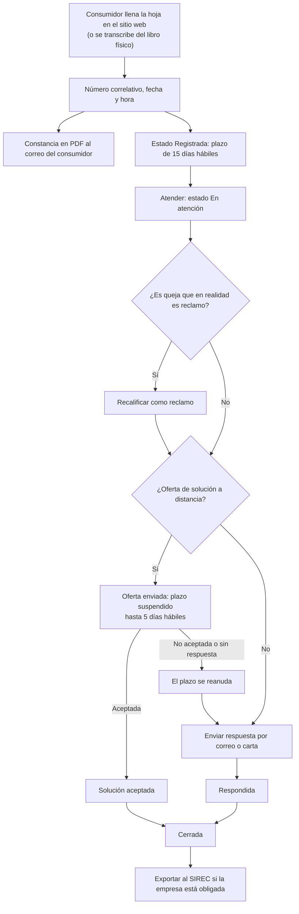

# Guía funcional — Libro de Reclamaciones

> Módulo técnico `al_l10n_pe_complaints_book` · versión `7.20261009` · área `OL-INVOICING`.
> Para consultores funcionales: qué resuelve, la norma que lo respalda y el
> proceso completo con un ejemplo que cuadra. Enlaces verificados el
> 10/10/2026 con `docs/validacion/verificar_enlaces.py`.

## 1. Para qué sirve

Todo proveedor que atiende a consumidores en un establecimiento abierto al
público o por internet debe tener un **Libro de Reclamaciones** (físico o
virtual), entregar constancia de cada hoja, responder en **15 días hábiles** y
conservar todo **dos años**. El módulo lleva ese libro dentro de Odoo: el
consumidor llena la hoja en el sitio web sin registrarse, recibe su constancia
en PDF por correo y el equipo de atención controla plazos, ofertas de solución
y respuestas.

Lo usan: atención al cliente (responde), el responsable del libro (supervisa y
exporta al SIREC) y el área legal (conservación).

**Fuera del alcance:** la atención de denuncias ante Indecopi (procedimiento
administrativo) y el arbitraje de consumo. El reporte al SIREC se entrega como
archivo de carga masiva; la carga en el portal de Indecopi la hace el usuario.

## 2. Marco normativo y conceptual

- **Código de Protección y Defensa del Consumidor (Ley 29571)**, art. 150 y
  siguientes: obligación de tener el libro y de exhibir el aviso. Texto
  actualizado en el Diario Oficial El Peruano:
  <https://diariooficial.elperuano.pe/Normas/obtenerDocumento?idNorma=17>.
- **Reglamento del Libro de Reclamaciones (D.S. 011-2011-PCM)**, modificado por
  el **D.S. 006-2014-PCM** (formato de la hoja, numeración, libro virtual,
  SIREC): <https://faolex.fao.org/docs/pdf/per130742.pdf>.
- **D.S. 101-2022-PCM**: plazo de **15 días hábiles improrrogables** para
  reclamos y quejas (artículo 6-B), formato vigente del Anexo I:
  <https://www.gob.pe/institucion/pcm/normas-legales/3346742-101-2022-pcm> y
  su publicación en El Peruano:
  <https://busquedas.elperuano.pe/dispositivo/NL/2095978-1>.
- **Indecopi** (autoridad que supervisa el libro y el SIREC):
  <https://www.gob.pe/indecopi>.

| Término | Significado | Dónde aparece en Odoo |
|---|---|---|
| Reclamo | Disconformidad con el producto o servicio adquirido | Tipo de la hoja |
| Queja | Disconformidad con la atención, no con el producto | Tipo de la hoja; se puede **recalificar como reclamo** |
| Hoja de reclamación | Formato del Anexo I, numerado `000000001-AAAA` por libro y año | Hoja de reclamación (formulario e informe PDF) |
| Libro virtual / físico / de respaldo | Canales del libro; el de respaldo se usa si falla el principal | Canal de la hoja |
| Oferta de solución a distancia | Propuesta al consumidor que suspende el plazo hasta 5 días hábiles | Botón **Oferta de solución** |
| SIREC | Sistema de Reportes de Reclamaciones de Indecopi, obligatorio con ingresos ≥ 3 000 UIT | **Informes ▸ Exportar al SIREC** |

## 3. Proceso de inicio a fin

| # | Paso | Dónde en Odoo | Quién | Resultado |
|---|---|---|---|---|
| 1 | Llenar la hoja | Sitio web ▸ Libro de Reclamaciones (enlace en el pie de todas las páginas) | Consumidor | Hoja **Registrada** con número, fecha y hora; constancia en PDF por correo y enlace firmado de seguimiento |
| 1b | Registrar una hoja del libro físico o de respaldo | Libro de reclamaciones ▸ Hojas de reclamación ▸ Nuevo | Atención | Hoja con canal «Libro físico», «Libro de respaldo» o «Teléfono» y, si aplica, el N.º de hoja de respaldo |
| 2 | Tomar la hoja | Hoja ▸ **Atender** | Atención | Estado **En atención**; responsable asignado |
| 3 | Recalificar (si corresponde) | Hoja ▸ **Recalificar como reclamo** | Atención | Tipo cambia a reclamo con constancia en el historial |
| 4a | Ofrecer una solución a distancia | Hoja ▸ **Oferta de solución** | Atención | Estado **Oferta de solución enviada**; el plazo se suspende hasta 5 días hábiles |
| 4b | Registrar la aceptación | Hoja ▸ **Oferta aceptada** | Atención | Estado **Solución aceptada**; la hoja imprime «ACUERDO ACEPTADO PARA SOLUCIONAR EL RECLAMO» |
| 4c | Registrar el rechazo | Hoja ▸ **Oferta no aceptada** (o el proceso automático al vencer los 5 días) | Atención | El plazo se reanuda sumando los días suspendidos |
| 5 | Responder | Hoja ▸ **Enviar respuesta** | Atención | Correo al consumidor con la hoja completada (o carta impresa); estado **Respondida** |
| 6 | Cerrar | Hoja ▸ **Cerrar** | Responsable | Estado **Cerrada**; se puede **Reabrir** si hace falta |
| 7 | Reportar al SIREC | Libro de reclamaciones ▸ Informes ▸ Exportar al SIREC | Responsable | Archivo de carga masiva (18 campos separados por `|`) y hojas marcadas como reportadas |

**Caminos alternativos:** hojas vencidas (menú **Vencidas** y alertas al
responsable); reapertura de una hoja cerrada; impresión de la hoja en cualquier
momento (**Imprimir hoja**).

## 4. Ejemplo completo

Comercial Demo Perú S.A.C. tiene un libro virtual con código `LR-WEB`.

| Fecha | Hecho | Resultado en Odoo |
|---|---|---|
| Lunes 05/10/2026, 18:42 | Una consumidora reclama por una licuadora defectuosa; monto reclamado S/ 249,90; pide respuesta por correo | Hoja `000000001-2026`, canal «Libro virtual (web)», estado **Registrada**; constancia en PDF a su correo |
| 05/10/2026 | Cálculo del plazo | 15 días hábiles desde el día siguiente (lunes a viernes, sin feriados): del 06/10 al **27/10/2026** (el 08/10, Combate de Angamos, no cuenta) |
| Viernes 09/10/2026 | Atención ofrece cambiar el producto por correo | **Oferta de solución enviada**; plazo suspendido |
| Martes 13/10/2026 | La consumidora no acepta (2 días hábiles suspendidos: 12 y 13/10) | **Oferta no aceptada**; el plazo se mueve 2 días hábiles: vence el **29/10/2026** |
| Martes 20/10/2026 | Se responde por correo: devolución del importe | **Respondida** (dentro del plazo, con 7 días hábiles de margen) |
| 31/10/2026 | Se cierra la hoja | **Cerrada**; se conservará hasta octubre de 2028 |

Cálculo del plazo: 15 días hábiles contados desde el 06/10 → 06, 07, 09, 12,
13, 14, 15, 16, 19, 20, 21, 22, 23, 26 y 27 de octubre. Con los 2 días
suspendidos, el vencimiento pasa al 29/10.

El módulo no genera asientos contables: la devolución del importe se registra
con una nota de crédito en Contabilidad, como cualquier otra devolución.

## 5. Configuración inicial

1. **Libro de reclamaciones ▸ Configuración ▸ Libros**: un libro por
   establecimiento o canal, con **Código de identificación** (único por
   compañía), **Tipo** (virtual o físico), **Domicilio**, **Sitios web** donde se
   publica, **Responsables** que reciben las hojas y alertas y, si aplica,
   **Código de sede SIREC** (6 caracteres).
2. **Libro de reclamaciones ▸ Configuración ▸ Ajustes**: calendario laboral con
   los feriados nacionales (sin él, el plazo solo descuenta sábados y
   domingos) y la casilla **Obligada al SIREC** (se define en la compañía
   principal: las sucursales toman su valor).
3. Permisos: asigne los grupos **Atención de reclamos** y **Responsable** (solo
   ellos ven las hojas; la IP de origen solo el responsable).
4. Servidor de correo saliente configurado (constancias y respuestas).
5. Imprima el **aviso del Anexo II** de cada libro (botón **Imprimir aviso
   (Anexo II)** en el libro) y colóquelo en cada establecimiento.

## 6. Reportes y libros relacionados

- **Hojas de reclamación** y **Vencidas**: listas con días hábiles restantes y
  estado.
- **Hoja de reclamación (PDF)**: formato del Anexo I con las dos notas legales.
- **Aviso del Anexo II**: A4 por libro, con «(virtual)» o «(físico)».
- **Exportar al SIREC**: archivo de carga masiva para Indecopi.

No alimenta libros contables ni tributarios.

## 7. Casos especiales y errores frecuentes

| Situación | Qué pasa | Qué hacer |
|---|---|---|
| El consumidor no indica correo ni domicilio | El formulario no permite enviar: sin esos datos la hoja «no se tiene por presentada» (art. 5) | Pedir uno de los dos |
| Menor de edad | Se piden los datos del padre, madre o representante | Completar la sección del representante |
| Hoja duplicada por error | No se puede borrar antes de 2 años | Cerrarla con una nota en el historial |
| Muchas hojas desde la misma conexión | Máximo 5 por conexión y hora (protección contra robots, sin captcha) | Registrar las siguientes desde el backend |
| El plazo vence | La hoja aparece en **Vencidas** y se crea una actividad al responsable | Responder de inmediato; el vencimiento es un incumplimiento sancionable |
| Feriado no considerado | El plazo se calculó sin ese día | Revisar el calendario laboral configurado en Ajustes |

## 8. Preguntas frecuentes del consultor

- **¿15 o 30 días?** 15 días hábiles improrrogables desde el D.S. 101-2022-PCM,
  para reclamos y quejas.
- **¿Se puede exigir registro al consumidor?** No: el libro debe ser de fácil
  acceso; el formulario no pide cuenta.
- **¿Un libro por empresa?** Uno por establecimiento o canal, cada uno con su
  código y numeración.
- **¿Qué empresas reportan al SIREC?** Las de ingresos anuales de 3 000 UIT o
  más, salvo excepciones de sectores regulados; verifique la situación del
  cliente con Indecopi.
- **¿Se pueden borrar hojas?** Solo el responsable y después de 2 años.

## 9. Referencias

Enlaces verificados el 10/10/2026:

- Código de Protección y Defensa del Consumidor (El Peruano, texto actualizado):
  <https://diariooficial.elperuano.pe/Normas/obtenerDocumento?idNorma=17>
- D.S. 006-2014-PCM (modifica el Reglamento del Libro de Reclamaciones,
  D.S. 011-2011-PCM): <https://faolex.fao.org/docs/pdf/per130742.pdf>
- D.S. 101-2022-PCM (gob.pe):
  <https://www.gob.pe/institucion/pcm/normas-legales/3346742-101-2022-pcm>
- D.S. 101-2022-PCM (El Peruano):
  <https://busquedas.elperuano.pe/dispositivo/NL/2095978-1>
- Indecopi: <https://www.gob.pe/indecopi>
- Requisitos legales del módulo (repositorio):
  `docs/reclamaciones/REQUISITOS_LEGALES.md`
