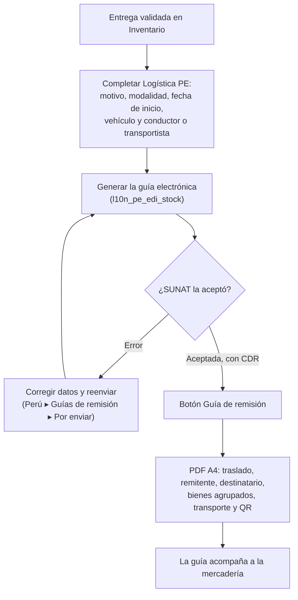

# Guía funcional — Guía de remisión impresa

> Módulo técnico `al_l10n_pe_delivery_guide_report` · versión `11.20261008` · área `OL-INVOICING`.
> Para consultores funcionales: qué resuelve, la norma que lo respalda y el
> proceso completo con un ejemplo que cuadra. Enlaces verificados el
> 10/10/2026 con `docs/validacion/verificar_enlaces.py`.

## 1. Para qué sirve

La mercadería que sale del almacén viaja con su **guía de remisión remitente
electrónica (GRE)**. Odoo 19 Enterprise (`l10n_pe_edi_stock`) genera y envía la
GRE a SUNAT, pero el albarán estándar no muestra lo que la representación
impresa debe tener (motivo y modalidad del traslado, conductor y vehículo o
transportista, peso bruto, número de guía y QR). Este módulo añade:

- la **representación impresa A4** de la GRE desde la entrega;
- una línea por **bien transportado** (agrupa los movimientos del mismo
  producto y junta sus lotes o series);
- el **peso bruto** de respaldo cuando los productos no tienen peso;
- el menú **Perú ▸ Guías de remisión** (guías, pendientes, vehículos y
  análisis).

Lo usan almacén y despacho (emiten e imprimen) y contabilidad (seguimiento).

**Fuera del alcance:** el envío a SUNAT, la gestión de vehículos y conductores
y el QR del CDR son de `l10n_pe_edi_stock`. Las guías de traslados internos y
de bienes de terceros las amplía `al_l10n_pe_stock_transfer`. No emite guía de
remisión transportista.

## 2. Marco normativo y conceptual

- **R.S. 123-2022/SUNAT**: guía de remisión electrónica remitente y
  transportista (estructura, motivos, modalidades) y su anexo:
  <https://www.sunat.gob.pe/legislacion/superin/2022/123-2022.pdf> ·
  <https://www.sunat.gob.pe/legislacion/superin/2022/anexo-123-2022.pdf>.
- **Reglamento de Comprobantes de Pago (R.S. 007-99/SUNAT)**, arts. 17 a 21:
  cuándo se emite la guía de remisión y sus requisitos:
  <https://www.sunat.gob.pe/legislacion/superin/1999/007.pdf>.
- Orientación SUNAT sobre la guía de remisión remitente:
  <https://orientacion.sunat.gob.pe/02-guia-de-remision-remitente>.
- Localización peruana de Odoo 19 (guía electrónica nativa):
  <https://www.odoo.com/documentation/19.0/es/applications/finance/fiscal_localizations/peru.html>.

| Término | Significado | Dónde aparece en Odoo |
|---|---|---|
| GRE remitente | Guía que emite el dueño o remitente de los bienes | Entrega ▸ Logística PE ▸ Guía de remisión |
| Motivo de traslado | Catálogo 20 de SUNAT: venta, compra, traslado entre establecimientos… | Campo motivo en la entrega |
| Modalidad | Transporte privado (vehículo y conductor propios) o público (transportista) | Campo modalidad |
| CDR | Constancia de recepción de SUNAT; trae el QR | Adjunto de la entrega |
| Representación impresa | Versión en papel o PDF que acompaña a la mercadería | Botón **Guía de remisión** |

## 3. Proceso de inicio a fin

| # | Paso | Dónde en Odoo | Quién | Resultado |
|---|---|---|---|---|
| 1 | Validar la entrega | Inventario ▸ Operaciones ▸ Entregas | Almacén | Entrega **Hecha** |
| 2 | Datos del traslado | Entrega ▸ página **Logística PE** (grupos Guía de remisión y Transporte) | Despacho | Motivo, modalidad, fecha de inicio, vehículo y conductor o transportista |
| 3 | Emitir la GRE | Entrega ▸ generar guía (flujo nativo) | Despacho | Número de guía y ticket de SUNAT |
| 4 | Revisar pendientes y errores | Perú ▸ Guías de remisión ▸ Por enviar / Guías de remisión | Despacho | En amarillo las por enviar, en rojo las con error |
| 5 | Imprimir | Entrega ▸ **Guía de remisión** (o ⚙ ▸ Imprimir) | Despacho | PDF `GUIA_REMISION - <cliente> - <referencia>` |
| 6 | Analizar | Perú ▸ Guías de remisión ▸ Análisis de guías | Jefatura | Guías por motivo y mes |

## 4. Ejemplo completo

Entrega de demostración «DEMO GRE Obra Ate», transporte privado, guía
`T001-00000101`:

| N° | Código | Descripción | Series / lotes | Cantidad |
|---|---|---|---|---|
| 1 | CEM-425 | Cemento Portland Tipo I 42.5 kg | — | 120 |
| 2 | FIE-012 | Fierro corrugado 1/2" x 9 m | DEMO-L2607-01 · DEMO-L2607-02 | 90 |
| 3 | LAD-KK18 | Ladrillo King Kong 18 huecos | — | 1 500 |

- El fierro salió en dos movimientos por lote (60 + 30 = 90): la guía declara
  **un solo bien** con sus dos lotes, como exige SUNAT (una línea por bien).
- Los productos no tienen peso configurado: el peso bruto total declarado es el
  **peso para envío** de la entrega, 4 870 kg, en lugar de 0 KGM (también en el
  XML).
- Con el CDR recibido, el pie muestra el QR de SUNAT.

El módulo no genera asientos: la salida de mercadería la contabiliza la
valorización de inventario de Odoo.

## 5. Configuración inicial

1. Tener instalada la guía electrónica peruana (`l10n_pe_edi_stock`, Enterprise)
   y sus credenciales de la API de SUNAT.
2. Completar calle y **distrito** del almacén (o de la compañía) y de los
   clientes.
3. Registrar los vehículos con placa y operador en **Perú ▸ Configuración ▸
   Comprobantes electrónicos ▸ Vehículos (guías de remisión)** (también en
   **Perú ▸ Guías de remisión ▸ Vehículos**).
4. Configurar el peso de los productos o indicar el peso para envío en la
   entrega.

## 6. Reportes y libros relacionados

- **Guía de remisión (PDF A4)**.
- **Perú ▸ Guías de remisión**: lista con estado SUNAT, filtros «Por enviar»,
  «Enviadas», «Con error» y por modalidad; **Análisis de guías** por motivo y
  mes.
- El kardex SUNAT (`ol_stock_kardex_pe`) usa el tipo 09 (guía de remisión) en
  movimientos sin comprobante de pago.

## 7. Casos especiales y errores frecuentes

| Situación | Qué pasa | Qué hacer |
|---|---|---|
| No aparece el botón **Guía de remisión** | La entrega no está hecha o la guía aún no tiene ticket de SUNAT | Validar la entrega y emitir la GRE; mientras tanto se imprime desde ⚙ ▸ Imprimir |
| La guía no muestra QR | No hay CDR todavía | Esperar la respuesta de SUNAT o reenviar desde **Por enviar** |
| Peso bruto distinto de la suma de productos | Los productos no tienen peso y se usó el peso para envío | Configurar pesos de producto si se quiere el detalle |
| Transporte público | Se imprimen razón social, RUC y registro MTC del transportista en lugar de conductor y vehículo | Completar el transportista en Logística PE |
| SUNAT rechaza por dirección | Falta distrito (ubigeo) en almacén o cliente | Completar el distrito y reenviar |

## 8. Preguntas frecuentes del consultor

- **¿El módulo envía la guía a SUNAT?** No; lo hace la localización nativa. Este
  módulo imprime y organiza.
- **¿Sirve para traslados entre almacenes?** Sí, con `al_l10n_pe_stock_transfer`
  (motivo 04), que habilita la guía en transferencias internas.
- **¿Por qué una línea por producto?** La guía declara bienes transportados, no
  movimientos internos de stock.
- **¿Puedo usar mi propio formato de papel?** El módulo trae un formato A4
  propio; otros tamaños requieren personalización.

## 9. Referencias

Enlaces verificados el 10/10/2026:

- R.S. 123-2022/SUNAT: <https://www.sunat.gob.pe/legislacion/superin/2022/123-2022.pdf>
- Anexo de la R.S. 123-2022/SUNAT:
  <https://www.sunat.gob.pe/legislacion/superin/2022/anexo-123-2022.pdf>
- Reglamento de Comprobantes de Pago:
  <https://www.sunat.gob.pe/legislacion/superin/1999/007.pdf>
- Orientación SUNAT, guía de remisión remitente:
  <https://orientacion.sunat.gob.pe/02-guia-de-remision-remitente>
- Odoo 19, localización peruana:
  <https://www.odoo.com/documentation/19.0/es/applications/finance/fiscal_localizations/peru.html>
- Envíos y recepciones en Odoo 19:
  <https://www.odoo.com/documentation/19.0/es/applications/inventory_and_mrp/inventory/shipping_receiving.html>
