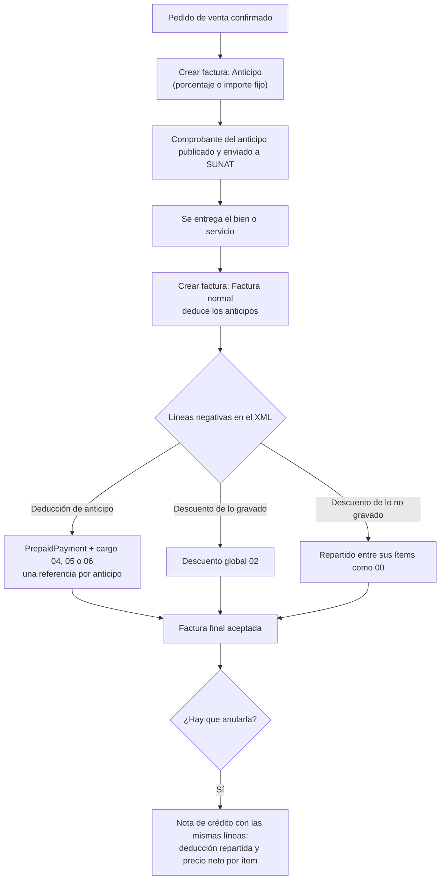

# Guía funcional — Anticipos y descuentos globales en el CPE

> Módulo técnico `al_l10n_pe_edi_downpayment_discount` · versión `3.20261008` · área `OL-INVOICING`.
> Para consultores funcionales: qué resuelve, la norma que lo respalda y el
> proceso completo con un ejemplo que cuadra. Enlaces verificados el
> 10/10/2026 con `docs/validacion/verificar_enlaces.py`.

## 1. Para qué sirve

Cuando una venta se cobra por adelantado, primero se emite el **comprobante del
anticipo** y luego la **factura final**, que **deduce** lo anticipado. Odoo 19
resuelve bien el caso simple (anticipo gravado), pero SUNAT rechaza el XML
cuando:

- el anticipo incluye partes **exoneradas o inafectas** (Odoo las informa como
  descuento gravado);
- el mismo comprobante de anticipo aparece **varias veces** (error 2365);
- hay un **descuento global** sobre partes no gravadas;
- se emite una **nota de crédito** de una factura con anticipos o descuentos
  (Odoo no la deja publicar).

El módulo corrige el XML en esos casos. **No cambia la contabilidad**: todo
ocurre al generar el archivo que va a SUNAT.

Lo usan facturación y ventas. Sin configuración: se instala y funciona.

**Fuera del alcance:** anticipos de compras (los emite el proveedor) y la
percepción o detracción del anticipo (los resuelven sus propios módulos).

## 2. Marco normativo y conceptual

- **Reglamento de Comprobantes de Pago (R.S. 007-99/SUNAT)**: la obligación de
  emitir comprobante en la fecha del cobro del anticipo y la deducción posterior:
  <https://www.sunat.gob.pe/legislacion/superin/1999/007.pdf>.
- **SEE-OSE y requisitos del comprobante electrónico (R.S. 117-2017/SUNAT y su
  Anexo I)**: <https://www.sunat.gob.pe/legislacion/superin/2017/117-2017.pdf> ·
  <https://www.sunat.gob.pe/legislacion/superin/2017/anexoI-117-2017.pdf>.
- **Guías de elaboración del XML UBL 2.1 y reglas de validación de SUNAT**
  (26.08.2026): copias oficiales en el repositorio, `docs/anticipos/oficial/`
  (guía de factura, boleta y nota de crédito, `Reglas_de_validacion_20260826.xlsx`).
- Anticipos en Ventas de Odoo 19:
  <https://www.odoo.com/documentation/19.0/es/applications/sales/sales/invoicing/down_payment.html>.

| Término | Significado | En el XML |
|---|---|---|
| Comprobante de anticipo | Factura o boleta emitida al cobrar el anticipo | Referenciado en la factura final |
| Deducción del anticipo | Línea negativa de la factura final que resta lo anticipado | `PrepaidPayment` y cargo/descuento global |
| Código 04 / 05 / 06 | Catálogo 53: anticipo gravado / exonerado / inafecto | `AllowanceCharge` |
| Código 02 | Descuento global que afecta la base gravada | `AllowanceCharge` |
| Código 00 | Descuento de línea (ítem) | En cada ítem |
| Regla 2365 | SUNAT rechaza un comprobante de anticipo repetido | Una referencia por anticipo |

## 3. Proceso de inicio a fin

| # | Paso | Dónde en Odoo | Quién | Resultado |
|---|---|---|---|---|
| 1 | Confirmar el pedido | Ventas ▸ Pedidos | Ventas | Pedido confirmado |
| 2 | Facturar el anticipo | Pedido ▸ **Crear factura** ▸ Anticipo (porcentaje o importe fijo) | Facturación | Comprobante del anticipo (factura o boleta) |
| 3 | Publicar y enviar | Contabilidad ▸ Clientes ▸ Facturas | Facturación | Anticipo aceptado por SUNAT |
| 4 | Facturar el saldo | Pedido ▸ **Crear factura** ▸ Factura normal | Facturación | Factura final con la sección **Anticipos** restando lo cobrado |
| 5 | Publicar y enviar | Factura final | Facturación | XML con anticipos y descuentos corregidos |
| 6 | Anular (si corresponde) | Factura ▸ **Nota de crédito** | Facturación | Nota publicada sin rehacer las líneas |

## 4. Ejemplo completo

Contrato de una constructora: diseño de planos **gravado** (S/ 10 000 + IGV) y
capacitación **exonerada** (S/ 5 000). Total del contrato S/ 16 800. Anticipo
del 20 %.

**Cálculos** (IGV 18 %):

| Concepto | Contrato | Anticipo 20 % | Factura final (saldo) |
|---|---|---|---|
| Base gravada (diseño) | 10 000,00 | 2 000,00 | 8 000,00 |
| IGV 18 % | 1 800,00 | 360,00 | 1 440,00 |
| Exonerado (capacitación) | 5 000,00 | 1 000,00 | 4 000,00 |
| **Total** | **16 800,00** | **3 360,00** | **13 440,00** |

En el XML de la factura final, la deducción sale como **cargo 04** (anticipo
gravado, S/ 2 000 de base) y **cargo 05** (anticipo exonerado, S/ 1 000), con
**un solo** `PrepaidPayment` de S/ 3 360 referido al comprobante del anticipo.
Sin el módulo, Odoo informaría los dos como descuento gravado y repetiría la
referencia: SUNAT rechaza (2365 y descuadres de la base).

**Asientos** (cuenta de anticipos de Ventas configurada como 122 Anticipos de
clientes; el módulo no los cambia):

Comprobante del anticipo:

| Cuenta | Descripción | Debe | Haber |
|---|---|---|---|
| 1212 | Facturas por cobrar emitidas en cartera | 3 360,00 | |
| 40111 | IGV – cuenta propia | | 360,00 |
| 122 | Anticipos de clientes | | 3 000,00 |
| | **Totales** | **3 360,00** | **3 360,00** |

Factura final (deduce el anticipo):

| Cuenta | Descripción | Debe | Haber |
|---|---|---|---|
| 1212 | Facturas por cobrar emitidas en cartera | 13 440,00 | |
| 122 | Anticipos de clientes (deducción) | 3 000,00 | |
| 70321 | Servicios – local – terceros: diseño 10 000 + capacitación 5 000 | | 15 000,00 |
| 40111 | IGV neto (1 800 – 360) | | 1 440,00 |
| | **Totales** | **16 440,00** | **16 440,00** |

**Nota de crédito** de la factura final: se publica con las mismas líneas; en el
XML la deducción del anticipo se reparte entre los ítems del mismo impuesto y
cada ítem lleva su precio neto (regla 3271 de la nota). El asiento es el
inverso del de la factura final.

## 5. Configuración inicial

1. Instalar el módulo (requiere `l10n_pe_edi` y Ventas, Enterprise).
2. Revisar en **Ventas ▸ Configuración ▸ Ajustes** el producto y la cuenta de
   anticipos.
3. Para descuentos globales, usar una línea negativa con el impuesto de lo que
   se descuenta (p. ej. el producto de descuento de Ventas).

No hay ajustes propios del módulo.

## 6. Reportes y libros relacionados

- Registro de Ventas (RVIE/PLE): la factura final y la nota se registran con sus
  importes contables, que no cambian.
- El comprobante impreso (`al_l10n_pe_invoice`) muestra la sección de anticipos.

## 7. Casos especiales y errores frecuentes

| Situación | Qué pasa | Qué hacer |
|---|---|---|
| Anticipo solo gravado | Sale igual que en Odoo estándar | Nada |
| Varios anticipos del mismo pedido | Una referencia y un `PrepaidPayment` por cada comprobante de anticipo | Nada |
| Anticipo emitido con boleta | El tipo del anticipo (03) se toma del propio comprobante | Nada |
| Descuentos de un impuesto mayores que sus ítems | Aviso al publicar: el XML no puede cuadrar | Revisar las líneas negativas |
| Anticipos en dólares o con IGV incluido | Cubiertos en los 20 escenarios de prueba | Nada |

## 8. Preguntas frecuentes del consultor

- **¿Cambia la contabilidad?** No: solo el XML.
- **¿Qué pasa si desinstalo el módulo?** Odoo vuelve a generar el XML estándar.
- **¿Cómo se comprobó?** Con las reglas de validación oficiales de SUNAT del
  26.08.2026 en 20 escenarios (anticipos simples, dobles, en dólares, con IGV
  incluido, en boletas, mixtos y notas de crédito), todos con el mismo total
  que el asiento.

## 9. Referencias

Enlaces verificados el 10/10/2026:

- Reglamento de Comprobantes de Pago:
  <https://www.sunat.gob.pe/legislacion/superin/1999/007.pdf>
- R.S. 117-2017/SUNAT (SEE-OSE):
  <https://www.sunat.gob.pe/legislacion/superin/2017/117-2017.pdf>
- Anexo I de la R.S. 117-2017/SUNAT:
  <https://www.sunat.gob.pe/legislacion/superin/2017/anexoI-117-2017.pdf>
- Odoo 19, anticipos en Ventas:
  <https://www.odoo.com/documentation/19.0/es/applications/sales/sales/invoicing/down_payment.html>
- Copias oficiales de las guías XML y reglas de validación (repositorio):
  `docs/anticipos/oficial/` y `docs/anticipos/REGLAS_SUNAT_ANTICIPOS_DESCUENTOS.md`
