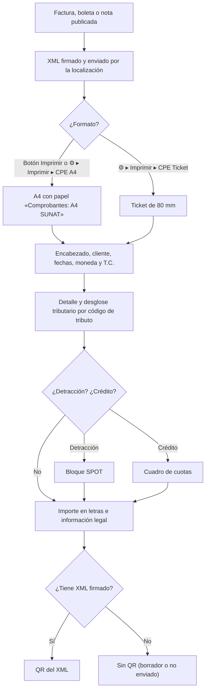

# Guía funcional — Comprobantes electrónicos impresos

> Módulo técnico `al_l10n_pe_invoice` · versión `18.20261008` · área `OL-INVOICING`.
> Para consultores funcionales: qué resuelve, la norma que lo respalda y el
> proceso completo con un ejemplo que cuadra. Enlaces verificados el
> 10/10/2026 con `docs/validacion/verificar_enlaces.py`.

## 1. Para qué sirve

El comprobante electrónico (factura, boleta, nota de crédito o débito) que se
entrega al cliente es su **representación impresa**: debe mostrar lo mismo que
el XML enviado a SUNAT. Este módulo genera esa representación en **A4** y en
**ticket de 80 mm** con:

- RUC, tipo y número del comprobante en el recuadro SUNAT;
- desglose de **operaciones gravadas, exoneradas e inafectas**, ISC, IGV e
  ICBPER (solo las filas con importe);
- **importe en letras**, moneda y tipo de cambio si no es en soles;
- bloque de **detracción** (SPOT) y cuadro de **cuotas** en ventas al crédito;
- **código QR** tomado del XML firmado (no recalculado);
- pedido de venta, orden de compra del cliente, firmas y cuentas bancarias.

Lo usan facturación y ventas. El módulo **no firma ni envía** nada a SUNAT: lo
hace la localización nativa (`l10n_pe_edi`).

**Fuera del alcance:** la emisión electrónica y el envío (localización nativa u
operador OSE como `al_ose_factory_hka`), y el ticket del punto de venta
(`al_l10n_pe_edi_pos` usa el formato de ticket de este módulo).

## 2. Marco normativo y conceptual

- **Reglamento de Comprobantes de Pago (R.S. 007-99/SUNAT)**: tipos de
  comprobante y requisitos mínimos:
  <https://www.sunat.gob.pe/legislacion/superin/1999/007.pdf>.
- **R.S. 340-2017/SUNAT**: obligación de incluir el **código QR** en la
  representación impresa de la factura, boleta y notas electrónicas (modifica
  las R.S. 097-2012 y 117-2017):
  <https://www.sunat.gob.pe/legislacion/superin/2017/340-2017.pdf>; su prórroga,
  R.S. 309-2018/SUNAT:
  <https://www.sunat.gob.pe/legislacion/superin/2018/309-2018.pdf>.
- **R.S. 193-2020/SUNAT**: información de la forma de pago (contado o crédito),
  monto neto pendiente y cuotas en la factura:
  <https://www.sunat.gob.pe/legislacion/superin/2020/193-2020.pdf>.
- **Anexo I de la R.S. 117-2017/SUNAT** (requisitos del comprobante
  electrónico): <https://www.sunat.gob.pe/legislacion/superin/2017/anexoI-117-2017.pdf>.
- Localización peruana de Odoo 19:
  <https://www.odoo.com/documentation/19.0/es/applications/finance/fiscal_localizations/peru.html>.

| Término | Significado | En el comprobante |
|---|---|---|
| Op. gravadas / exoneradas / inafectas | Bases según la afectación del IGV (códigos de tributo 1000, 9997, 9998) | Filas de totales |
| ICBPER | Impuesto al consumo de bolsas plásticas (tributo 7152) | Fila ICBPER |
| SPOT | Sistema de detracciones: porcentaje depositado en el Banco de la Nación | Bloque «Información de la detracción — SPOT» |
| Forma de pago crédito | Factura con vencimiento posterior a la emisión | «CRÉDITO» y cuadro de cuotas |
| QR | Datos del comprobante y del XML firmado, para verificarlo | Pie del comprobante |

## 3. Proceso de inicio a fin

| # | Paso | Dónde en Odoo | Quién | Resultado |
|---|---|---|---|---|
| 1 | Configurar firma, eslogan y representante | Perú ▸ Configuración ▸ Ajustes ▸ Comprobantes electrónicos | Administrador | Bloque de firmas opcional en el A4 |
| 2 | Revisar certificados digitales | Perú ▸ Configuración ▸ Comprobantes electrónicos ▸ Certificados digitales | Administrador | Acceso al certificado con el que se firma el XML |
| 3 | Registrar y publicar la venta | Contabilidad ▸ Clientes ▸ Facturas | Facturación | Comprobante publicado y enviado |
| 4 | Imprimir A4 | Factura ▸ **Imprimir** (o ⚙ ▸ Imprimir ▸ CPE A4) | Facturación | PDF A4 nombrado con número y cliente |
| 5 | Imprimir ticket | ⚙ ▸ Imprimir ▸ **CPE Ticket** | Caja o facturación | Ticket de 80 mm |
| 6 | Orden de compra del cliente | Ventas ▸ Pedidos ▸ **OC. externa** | Ventas | Se imprime como «O/C externa» |

## 4. Ejemplo completo

**Boleta B001-00000001** con productos gravados, uno exonerado, fruta inafecta
y una bolsa plástica:

| Fila del comprobante | Importe |
|---|---|
| Op. gravadas | 52,20 |
| Op. exoneradas | 25,00 |
| Op. inafectas | 12,00 |
| IGV 18 % (52,20 × 0,18 = 9,396) | 9,40 |
| ICBPER | 0,50 |
| **Total** | **99,10** |

Asiento de la boleta (cuentas de ingreso según los productos; la del ICBPER es
la configurada en su impuesto, p. ej. 40189 Otros impuestos):

| Cuenta | Descripción | Debe | Haber |
|---|---|---|---|
| 1212 | Facturas, boletas y otros comprobantes por cobrar | 99,10 | |
| 70121 | Mercaderías – venta local (52,20 + 25,00 + 12,00) | | 89,20 |
| 40111 | IGV – cuenta propia | | 9,40 |
| 40189 | Otros impuestos (ICBPER) | | 0,50 |
| | **Totales** | **99,10** | **99,10** |

**Factura con detracción** F001-00000002 de S/ 2 301,00, servicio sujeto al
12 % (código 022): 2 301,00 × 12 % = 276,12 → el comprobante muestra
**S/ 276,00** a depositar en el Banco de la Nación (SUNAT exige el monto de
detracción sin decimales). El bloque SPOT muestra la cuenta del Banco de la
Nación solo si la compañía la tiene registrada.

**Venta al crédito** desde el pedido «DEMO FAC», términos «30 % ahora, el resto
en 60 días» sobre S/ 3 351,20: cuota 1 = 1 005,36 y cuota 2 = 2 345,84
(1 005,36 + 2 345,84 = 3 351,20). La forma de pago pasa a **CRÉDITO** y se
imprime **Información del crédito** con cada cuota.

## 5. Configuración inicial

1. **Perú ▸ Configuración ▸ Ajustes ▸ Comprobantes electrónicos**: casilla
   **Firma y eslogan en el reporte**, **Representante** (persona) y **Eslogan**.
2. Logo y datos de la compañía (dirección con distrito, teléfono, correo).
3. Cuenta en el Banco de la Nación en la compañía si vende servicios con
   detracción.
4. Certificado digital vigente (lo usa la localización para firmar el XML).

## 6. Reportes y libros relacionados

- Informes **CPE A4** y **CPE Ticket** (menú Imprimir de la factura).
- El desglose tributario se guarda en la factura y coincide con el Registro de
  Ventas (RVIE/PLE).
- El ticket de 80 mm lo reutiliza el punto de venta peruano.

## 7. Casos especiales y errores frecuentes

| Situación | Qué pasa | Qué hacer |
|---|---|---|
| Comprobante en borrador | Sin número en el recuadro y sin QR | Publicar y enviar |
| Sin XML firmado | No se imprime un QR falso; la información legal ocupa todo el ancho | Esperar el envío o revisar el EDI |
| Factura en dólares | Desglose en la moneda del documento y tipo de cambio de la factura (tres decimales) | Nada |
| Falta la cuenta del Banco de la Nación | El bloque SPOT sale sin número de cuenta | Registrar la cuenta en la compañía |
| Nota de crédito | Muestra «Modifica a» con el documento de origen; el ticket no imprime detracción | Nada |
| No quiero firmas | Desmarcar **Firma y eslogan en el reporte** | — |

## 8. Preguntas frecuentes del consultor

- **¿El QR se calcula en Odoo?** No: se toma del XML firmado con el método de la
  localización, para que coincida con lo enviado a SUNAT.
- **¿Puedo usar el PDF estándar de Odoo?** Sí, sigue disponible en Imprimir; el
  botón **Imprimir** usa el CPE A4.
- **¿Funciona con un OSE?** Sí: el formato no depende del operador.
- **¿Por qué no sale la fila Op. inafectas?** Solo se imprimen filas con importe.

## 9. Referencias

Enlaces verificados el 10/10/2026:

- Reglamento de Comprobantes de Pago:
  <https://www.sunat.gob.pe/legislacion/superin/1999/007.pdf>
- R.S. 340-2017/SUNAT: <https://www.sunat.gob.pe/legislacion/superin/2017/340-2017.pdf>
- R.S. 309-2018/SUNAT: <https://www.sunat.gob.pe/legislacion/superin/2018/309-2018.pdf>
- R.S. 193-2020/SUNAT: <https://www.sunat.gob.pe/legislacion/superin/2020/193-2020.pdf>
- Anexo I de la R.S. 117-2017/SUNAT:
  <https://www.sunat.gob.pe/legislacion/superin/2017/anexoI-117-2017.pdf>
- Odoo 19, localización peruana:
  <https://www.odoo.com/documentation/19.0/es/applications/finance/fiscal_localizations/peru.html>
- Odoo 19, facturas de cliente:
  <https://www.odoo.com/documentation/19.0/es/applications/finance/accounting/customer_invoices.html>
