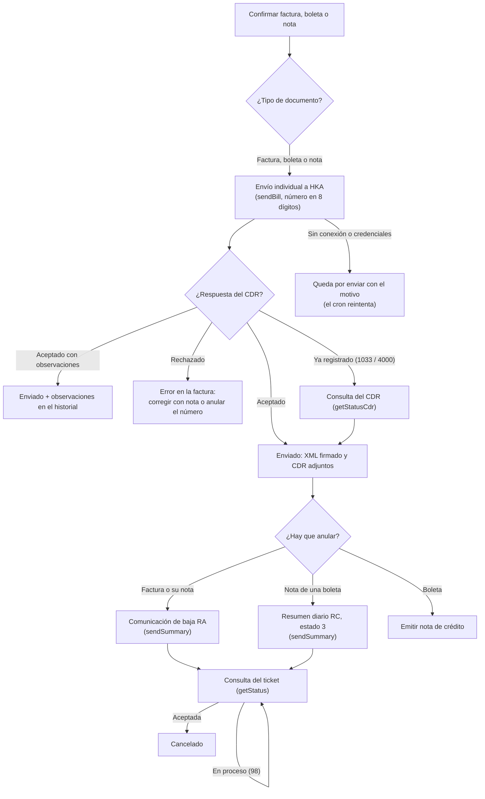

# Guía funcional — OSE The Factory HKA

> Módulo técnico `al_ose_factory_hka` · versión `2.20261010` · área `OL-INVOICING`.
> Para consultores funcionales: qué resuelve, la norma que lo respalda y el
> proceso completo con un ejemplo que cuadra. Enlaces verificados el
> 10/10/2026 con `docs/validacion/verificar_enlaces.py`.

## 1. Para qué sirve

Una empresa obligada a la facturación electrónica puede enviar sus
comprobantes directamente a SUNAT o a través de un **Operador de Servicios
Electrónicos (OSE)**, que los valida y le devuelve la constancia de recepción
(CDR). Odoo 19 trae como operadores IAP, SUNAT directo y Estela. Este módulo
añade **The Factory HKA**, para las empresas que contrataron ese OSE.

Lo usan el área de facturación (emite y envía), contabilidad (bajas y notas) y
tesorería (comprobantes de retención). El usuario factura igual que siempre:
el módulo solo cambia **por dónde sale** el comprobante.

**Cubre:** facturas, boletas, notas de crédito y débito (también las del punto
de venta), comunicaciones de baja, baja de notas de boleta por resumen diario,
consulta del CDR, el comprobante de retención (CRE) y su reversión.

**Queda fuera del alcance:**

- La **guía de remisión electrónica (GRE)**: SUNAT la recibe por su propia API
  REST (módulo `l10n_pe_edi_stock`), no por el OSE.
- Los **comprobantes de contingencia** (emitidos en papel ante una caída), que
  se informan aparte a SUNAT.
- El **resumen diario de boletas para informarlas** (estado 1): Odoo envía cada
  boleta de forma individual, que SUNAT también admite.
- Las credenciales reales: el módulo se probó con el servicio simulado; la
  primera emisión en producción hay que validarla con las credenciales que
  entrega HKA.

## 2. Marco normativo y conceptual

- **SEE – OSE** (R.S. N.° 117-2017/SUNAT): crea el sistema de emisión
  electrónica a través de un OSE. El OSE comprueba cada comprobante con las
  reglas de SUNAT y le envía el resultado.
  [Texto oficial](https://www.sunat.gob.pe/legislacion/superin/2017/117-2017.pdf).
- **SEE – Del contribuyente** (R.S. N.° 097-2012/SUNAT): regula los
  documentos, sus formatos y los plazos de envío.
  [Texto oficial](https://www.sunat.gob.pe/legislacion/superin/2012/097-2012.pdf).
- **Plazo de envío de la factura** (R.S. N.° 000003-2023/SUNAT): la factura y
  su nota se envían a SUNAT o al OSE hasta el **tercer día calendario
  siguiente** a la emisión. Fuera de plazo no tienen calidad de factura.
  [Texto oficial](https://www.sunat.gob.pe/legislacion/superin/2023/000003-2023.pdf).
- **Baja de boletas y notas vinculadas** (R.S. N.° 117-2017/SUNAT, art. 17.4,
  según la R.S. N.° 000048-2026/SUNAT): se comunica incluyéndolas en un
  **resumen diario** del día de emisión, hasta el **sétimo día calendario
  siguiente** a su generación, y solo si no se entregaron al cliente.
  [Texto oficial](https://www.sunat.gob.pe/legislacion/superin/2026/000048-2026.pdf).
- **Formato del resumen diario** (Guía de elaboración del resumen diario de
  boletas y notas, SUNAT):
  [guía oficial](https://cpe.sunat.gob.pe/sites/default/files/inline-files/GUIA_Resumen_de_Boletas_11-01-2018%20%282%29_2_0%20%281%29_0.pdf).

| Término | Significado | En Odoo |
|---|---|---|
| OSE | Operador que valida los comprobantes en nombre de SUNAT | Operador «The Factory HKA» en Ajustes |
| CDR | Constancia de recepción: aceptado, aceptado con observaciones o rechazado | Adjunto `CDR-…xml` en el ZIP de la factura |
| Comunicación de baja (RA) | Anula facturas y sus notas ya aceptadas | Botón «Solicitar cancelación de EDI» |
| Resumen diario (RC) | Informa o da de baja boletas y sus notas, por fecha de emisión | Se arma solo al anular una nota de boleta |
| Ticket | Número que devuelve el OSE al recibir un resumen o una baja | Campo «Número de CDR de cancelación» |
| CRE / RR | Comprobante de retención y su resumen de reversiones | Pago con retención ▸ «Revertir CRE» |

## 3. Proceso de inicio a fin

| # | Paso | Dónde en Odoo | Quién | Resultado |
|---|---|---|---|---|
| 1 | Elegir el operador y cargar credenciales | Ajustes ▸ Contabilidad ▸ Facturación electrónica peruana | Administrador | The Factory HKA activo para la compañía |
| 2 | Emitir el comprobante | Contabilidad ▸ Clientes ▸ Facturas ▸ Confirmar | Facturación | Asiento contable y documento EDI «por enviar» |
| 3 | Enviar | Botón «Procesar ahora» o el cron de envíos | Automático | XML firmado y CDR adjuntos; estado «Enviado» |
| 4 | Revisar observaciones | Historial de la factura | Facturación | Lista de observaciones del CDR, si las hay |
| 5 | Anular una factura o nota | Factura ▸ Motivo de cancelación ▸ «Solicitar cancelación de EDI» | Contabilidad | Comunicación de baja enviada y ticket guardado |
| 5b | Anular una nota de boleta | Igual que el paso 5 | Contabilidad | Resumen diario RC con estado 3 y ticket |
| 6 | Confirmar la baja | «Procesar ahora» o el cron | Automático | CDR de la baja adjunto; estado «Cancelado» |
| 7 | CRE y su reversión | Perú ▸ Retenciones IGV ▸ Retenciones efectuadas | Tesorería | CRE aceptado o revertido con resumen RR |

Caminos alternativos:

- **Rechazo del OSE:** el número queda registrado como inválido en SUNAT; se
  corrige emitiendo otro comprobante (o una nota si el original fue aceptado).
- **Documento ya registrado** (códigos 1033 o 4000): Odoo consulta el CDR y, si
  el cliente y el número coinciden, lo da por enviado.
- **Sin credenciales o sin WSDL de producción:** el documento queda por enviar
  con el motivo; nunca se envía al ambiente de demostración por error.

## 4. Ejemplo completo

**Datos:** Comercial Demo Perú S.A.C. vende a un cliente con RUC 5 kg de un
producto a S/ 2 000 por kg, con 20 % de descuento, gravado con IGV 18 %. Emite
la factura **F001-11** el 06/10/2026.

1. **Valor de venta:** 5 × 2 000 × (1 − 0,20) = **8 000,00**.
   **IGV:** 8 000,00 × 18 % = **1 440,00**. **Total:** **9 440,00**.
2. **Asiento de la factura:**

| Cuenta | Descripción | Debe | Haber |
|---|---|---:|---:|
| 1212 | Facturas, boletas y otros comprobantes por cobrar – Emitidas en cartera | 9 440,00 | |
| 40111 | IGV – Cuenta propia | | 1 440,00 |
| 70121 | Mercaderías – Venta local – Terceros | | 8 000,00 |
| | **Totales** | **9 440,00** | **9 440,00** |

3. **Envío a HKA:** el archivo se llama `RUC-01-F001-00000011.zip` (el número
   va con 8 dígitos, aunque la factura se llame F001-11). HKA devuelve el CDR
   con código 0 y la factura queda «Enviada» con el XML firmado y el CDR en un
   ZIP adjunto.
4. **Plazo:** debía enviarse hasta el **09/10/2026** (tercer día calendario
   siguiente a la emisión). Si se enviara el 12/10/2026, el historial mostraría
   el aviso de envío fuera de plazo.
5. **Anulación de una nota de boleta:** la boleta B001-21 (mismos importes)
   tiene una nota de crédito BNC-21 de S/ 9 440,00 que no se entregó al
   cliente. Al anular la nota, el módulo envía el resumen diario
   `RUC-RC-20261006-1` con una línea: tipo 07, número BNC-21, referencia a la
   boleta B001-21 (tipo 03), estado 3, total 9 440,00, gravadas 8 000,00 e IGV
   1 440,00. HKA devuelve un ticket y la consulta posterior confirma la baja.

## 5. Configuración inicial

1. **Certificado digital** de la compañía: Ajustes ▸ Contabilidad ▸
   Facturación electrónica peruana ▸ Certificado (PE).
2. **Operador:** marcar «The Factory HKA».
3. **Credenciales de Factory HKA:** usuario, contraseña, WSDL de demostración
   (viene cargado) y WSDL de producción. Solo los administradores las ven.
4. **Entorno de prueba:** activo para validar con HKA antes de producción;
   desactivarlo al pasar a producción.
5. **Funciones de Factory HKA:** «Comprobantes de retención (CRE)» y
   «Reversión del CRE» (activas por defecto). Si se desactiva el CRE, se envía
   directo a SUNAT con la clave SOL.
6. **Diarios de venta** con documentos (series F y B) y tipos de documento de
   la localización.

## 6. Reportes y libros relacionados

- **Facturas y estado EDI:** la lista de facturas muestra el estado
  electrónico; los ZIP con XML y CDR quedan en cada comprobante.
- **Libros electrónicos (PLE) y SIRE:** se generan con los comprobantes
  aceptados; las bajas aceptadas dejan los documentos como anulados.
- **Comprobantes de retención:** Perú ▸ Retenciones IGV (módulo
  `al_l10n_pe_retention`).

## 7. Casos especiales y errores frecuentes

| Situación | Qué pasa | Qué hacer |
|---|---|---|
| Faltan usuario o contraseña de HKA | El documento queda por enviar con el motivo | Cargar las credenciales y «Procesar ahora» |
| Producción sin WSDL de producción | No se envía | Pedir a HKA el WSDL y cargarlo, o activar el entorno de prueba |
| Factura enviada después del tercer día | Aviso en el historial | Evaluar con el contador: fuera de plazo no vale como factura |
| CDR aceptado con observaciones | Válido; observaciones en el historial | Corregir el dato en los siguientes comprobantes |
| Rechazo del OSE | El número queda inválido | Emitir un nuevo comprobante con otro número |
| Anular una boleta | Odoo no lo permite | Emitir una nota de crédito |
| Anular juntas una factura y una nota de boleta | Error: van por caminos distintos | Solicitar la cancelación por separado |
| Anular notas de boleta de fechas distintas | Error: un resumen es de una sola fecha | Anular cada fecha por separado |
| Ticket en proceso (código 98) | La baja sigue pendiente | Volver a procesar más tarde (el cron lo hace solo) |

## 8. Preguntas frecuentes del consultor

**¿Cambia algo para el usuario que factura?** No. Confirma la factura como
siempre; el envío y la respuesta los gestiona el EDI de Odoo.

**¿Por qué el archivo se llama distinto al número de la factura?** HKA exige el
número con 8 dígitos en el nombre del archivo; el número del comprobante y su
XML no cambian.

**¿Las boletas se envían en resumen diario?** Se envían una por una, que SUNAT
también acepta. El resumen diario se usa solo para dar de baja las notas de
boleta.

**¿Se puede anular una boleta?** Solo con nota de crédito. SUNAT permite la
baja por resumen solo si la boleta no se entregó al cliente, y Odoo opta por la
nota de crédito en todos los casos.

**¿Y la guía de remisión?** No pasa por el OSE: se envía a SUNAT por su API
REST con el módulo de guías.

**¿Cómo se prueba sin afectar SUNAT?** Con el entorno de prueba activo se usa
el WSDL de demostración de HKA y las credenciales de prueba que entrega HKA.

## 9. Referencias

Enlaces verificados el 10/10/2026:

- R.S. N.° 117-2017/SUNAT (SEE – OSE): https://www.sunat.gob.pe/legislacion/superin/2017/117-2017.pdf
- R.S. N.° 097-2012/SUNAT (SEE – Del contribuyente): https://www.sunat.gob.pe/legislacion/superin/2012/097-2012.pdf
- R.S. N.° 000003-2023/SUNAT (plazo de envío de la factura): https://www.sunat.gob.pe/legislacion/superin/2023/000003-2023.pdf
- R.S. N.° 000048-2026/SUNAT (baja con resumen diario): https://www.sunat.gob.pe/legislacion/superin/2026/000048-2026.pdf
- Guía SUNAT del resumen diario de boletas y notas: https://cpe.sunat.gob.pe/sites/default/files/inline-files/GUIA_Resumen_de_Boletas_11-01-2018%20%282%29_2_0%20%281%29_0.pdf
- Orientación SUNAT, operatividad de la emisión electrónica: https://orientacion.sunat.gob.pe/3529-operatividad
- R.S. N.° 123-2022/SUNAT (guía de remisión electrónica): https://www.sunat.gob.pe/legislacion/superin/2022/123-2022.pdf
- SUNAT en gob.pe: https://www.gob.pe/sunat
- The Factory HKA Perú: https://www.thefactoryhka.com/pe/
- Localización peruana de Odoo 19: https://www.odoo.com/documentation/19.0/applications/finance/fiscal_localizations/peru.html
