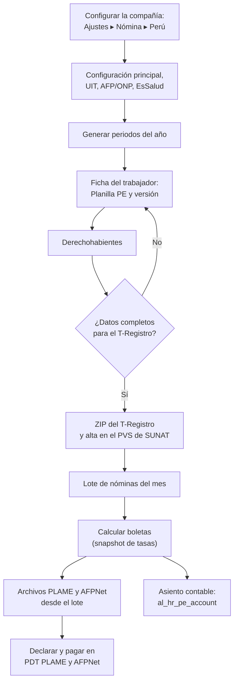

# Guía funcional — Planillas Perú: núcleo

> Módulo técnico `al_hr_pe` · versión `34.20261010` · área `OL-PAYROLL`.
> Para consultores funcionales: qué resuelve, la norma que lo respalda y el
> proceso completo con un ejemplo que cuadra. Enlaces verificados el
> 10/10/2026 con `docs/validacion/verificar_enlaces.py`.

## 1. Para qué sirve

Odoo 19 trae un motor de nómina genérico, pero no la norma laboral peruana:
ni los catálogos de la Planilla Electrónica, ni las tasas de AFP y ONP, ni la
asignación familiar, ni los archivos que exige SUNAT. Este módulo es la
**base de toda la suite de planillas**: la ficha laboral del trabajador con
los códigos del T-Registro, la seguridad social (AFP, ONP, EsSalud, EPS,
SCTR, Vida Ley), los derechohabientes, la estructura salarial peruana con
sus códigos SUNAT y los archivos **PLAME**, **AFPNet** y **T-Registro**
listos para subir.

Lo usan el área de Recursos Humanos (ficha y derechohabientes) y el
responsable de planillas (cálculo y declaraciones).

**Fuera del alcance de este módulo** (lo hacen otros de la suite o los
aplicativos del Estado): beneficios sociales —CTS, gratificaciones,
vacaciones, liquidación, quinta categoría— (`al_hr_pe_benefits`), el asiento
contable (`al_hr_pe_account`), asistencia y tareaje (`al_hr_pe_attendance`),
boletas impresas y pagos masivos (`al_hr_pe_reports`). La presentación de
los archivos se hace en el PDT PLAME, el PVS del T-Registro y AFPNet; el
módulo no los envía.

## 2. Marco normativo y conceptual

- **Régimen laboral de la actividad privada**: TUO del D. Leg. 728 (D.S.
  003-97-TR). [Normas legales actualizadas — El Peruano](https://diariooficial.elperuano.pe/Normas/obtenerDocumento?idNorma=35).
- **Planilla Electrónica** (D.S. 018-2007-TR): tiene dos componentes, el
  **T-Registro** (registro de trabajadores y derechohabientes) y la **PLAME**
  (planilla mensual de pagos). La PLAME se elabora a partir del T-Registro.
  [SUNAT — Planilla Electrónica](https://orientacion.sunat.gob.pe/informacion-general-planilla-electronica) ·
  [SUNAT — PDT PLAME](https://orientacion.sunat.gob.pe/pdt-plame) ·
  [SUNAT — Utilización de la PLAME](https://orientacion.sunat.gob.pe/node/1280) ·
  [Guía SUNAT de T-Registro y PLAME (PDF)](https://orientacion.sunat.gob.pe/sites/default/files/inline-files/PDF%20de%20T-Registro%20y%20PLAME.pdf).
- **Remuneración Mínima Vital (RMV)**: S/ 1 130 desde el 01/01/2025 (D.S.
  006-2024-TR). [El Peruano](https://busquedas.elperuano.pe/dispositivo/NL/2357884-10).
- **Asignación familiar** (Ley 25129 y D.S. 035-90-TR): 10 % de la RMV
  vigente para quien tiene hijos menores de 18 años o hasta 24 si cursan
  estudios superiores (y mayores con discapacidad severa, Ley 31600).
- **Sistema Privado de Pensiones**: aporte al fondo (10 %), comisión sobre
  flujo o mixta y prima de seguro hasta la remuneración máxima asegurable,
  publicadas por la SBS. [SBS — comisiones y primas](https://www.sbs.gob.pe/app/spp/empleadores/comisiones_spp/Paginas/comision_prima.aspx) ·
  [AFPnet](https://www.afpnet.com.pe/).
- **Sistema Nacional de Pensiones**: 13 % del trabajador. [ONP](https://www.gob.pe/onp).
- **EsSalud** (Ley 26790): 9 % a cargo del empleador sobre la remuneración
  (con EPS, la tasa correspondiente). [EsSalud — Ley 26790](https://www.gob.pe/institucion/essalud/informes-publicaciones/4936482-ley-n-26790).
- **Seguro Vida Ley** (D. Leg. 688, desde el inicio del vínculo): prima a
  cargo del empleador.
- **SCTR** (Ley 26790, D.S. 003-98-SA): seguro complementario de salud y de
  pensión para actividades de riesgo; en la PLAME se informa con los códigos
  0806/0810 (salud) y 0813/0814 (pensión).

**Conceptos clave**

| Término | Significado | Dónde aparece en Odoo |
|---|---|---|
| Versión del empleado | En Odoo 19 reemplaza al contrato: guarda régimen, afiliación, tipo de trabajador, etc., con su histórico | Nómina ▸ Empleados ▸ Registros de los empleados |
| Configuración principal | Un registro por compañía con reglas de referencia y la clasificación de conceptos | Nómina ▸ Configuración ▸ Perú ▸ Parámetros |
| Snapshot | Valores que la boleta fotografía al calcular: RMV, asignación familiar, tasas AFP y tope | Boleta ▸ Planilla PE ▸ Cálculo |
| Código SUNAT (tabla 22) | Código PLAME de cada concepto (0121 básico, 0201 asignación familiar…) | Regla salarial |
| Periodo | Mes declarado (AAAAMM) y, si aplica, sus semanas (AAAAMM-S01…) | Configuración ▸ Perú ▸ Periodos y suspensiones |
| Suspensión T21 | Día sin labor (perfecta o imperfecta) que va al archivo .snl | Periodos y suspensiones ▸ Suspensiones de labores |

## 3. Proceso de inicio a fin

| # | Paso | Dónde en Odoo | Quién | Resultado |
|---|---|---|---|---|
| 1 | SCTR, representante y firma | Ajustes ▸ Nómina ▸ Perú | Jefe de planillas | Valores por compañía |
| 2 | Reglas de referencia y clasificación de conceptos | Nómina ▸ Configuración ▸ Perú ▸ Parámetros ▸ Configuración principal | Jefe de planillas | La boleta y los exportadores saben qué es neto, ingreso afecto, día laborado… |
| 3 | UIT del año, tasas AFP/ONP, seguros y aportes | Configuración ▸ Perú ▸ Parámetros / Seguridad social | Jefe de planillas | Tasas vigentes |
| 4 | Generar periodos | Configuración ▸ Perú ▸ Periodos y suspensiones ▸ Generar periodos | Jefe de planillas | 12 periodos AAAAMM (y semanas) |
| 5 | Completar la ficha | Empleados ▸ ficha ▸ Planilla PE (Identificación, T-Registro, Domicilio) | RR. HH. | Datos E04, E05, E17, E29, E30 |
| 6 | Registrar derechohabientes | Empleados ▸ ficha ▸ botón Derechohab. | RR. HH. | Asignación familiar y Excel del T-Registro |
| 7 | Alta en el T-Registro | Empleados ▸ lista ▸ Acciones ▸ T-Registro: generar alta | RR. HH. | ZIP `RP_<RUC>` validado |
| 8 | Calcular la planilla | Nómina ▸ Recibos de nómina ▸ Periodos de nómina | Planillas | Boletas con snapshot y totales PLAME |
| 9 | Exportar PLAME y AFPNet | Menú ⋮ del lote | Planillas | `.rem`, `.jor`, `.snl`, `.toc`, AFPNet `.xlsx` |
| 10 | Baja del trabajador | Acciones ▸ T-Registro: generar baja | RR. HH. | Archivo `.per` con fecha de cese y motivo T17 |

**Caminos alternativos**: si falta un dato del T-Registro, el módulo no
genera el archivo y lista qué falta por trabajador; si cambia una tasa AFP,
las boletas ya calculadas conservan la suya (snapshot); una suspensión
(falta, licencia, subsidio) se registra en **Suspensiones de labores** y
sale en el `.snl` del lote de ese periodo.

## 4. Ejemplo completo

Compañía **Comercial Demo Perú S.A.C.**, planilla de **julio de 2026**,
RMV S/ 1 130, tres trabajadores con distinto sistema de pensiones (datos de
demostración «DEMO FICHA HR1»; cifras tomadas de las boletas calculadas).

| Concepto | Salazar (AFP INTEGRA, flujo) | Huamán (ONP) | Rivas (AFP PRIMA, mixta) |
|---|---:|---:|---:|
| Básico | 2 800,00 | 1 800,00 | 4 500,00 |
| Asignación familiar (10 % RMV) | 113,00 | — | — |
| **Total ingresos** | **2 913,00** | **1 800,00** | **4 500,00** |
| Aporte al fondo 10 % / ONP 13 % | 291,30 | 234,00 | 450,00 |
| Comisión AFP (1,55 % flujo / 0 % mixta) | 45,15 | — | 0,00 |
| Prima de seguro 1,70 % | 49,52 | — | 76,50 |
| **Total aportes del trabajador** | **385,97** | **234,00** | **526,50** |
| **Neto a pagar** | **2 527,03** | **1 566,00** | **3 973,50** |
| EsSalud 9 % (empleador) | 262,17 | 162,00 | 405,00 |

Cálculos (Salazar): 2 913,00 × 10 % = 291,30; × 1,55 % = 45,15; × 1,70 % =
49,52; total 385,97; neto 2 913,00 − 385,97 = 2 527,03; EsSalud 2 913,00 ×
9 % = 262,17. La prima se calcula hasta el tope asegurable de S/ 11 981,55.

**Asientos**: este módulo no genera asientos. El asiento de la planilla lo
arma `al_hr_pe_account` con las cuentas de cada regla (ver su guía). Con las
cuentas de la base de demostración, la boleta de Salazar aporta estas líneas
al asiento del lote:

| Cuenta | Descripción | Debe | Haber |
|---|---|---:|---:|
| 6211000 | Básico | 2 800,00 | |
| 6211000 | Asignación familiar | 113,00 | |
| 4111000 | Remuneraciones por pagar (ingresos) | | 2 913,00 |
| 4111000 | AFP: aporte, comisión y prima (se descuentan al trabajador) | 385,97 | |
| 4032000 | AFP INTEGRA (cuenta de la afiliación) | | 385,97 |
| 6271000 | EsSalud | 262,17 | |
| 4031000 | EsSalud por pagar | | 262,17 |
| | **Totales** | **3 561,14** | **3 561,14** |

El saldo de la 4111000 queda en S/ 2 527,03 al haber: el neto a pagar.

**Asignación familiar**: el derecho se evalúa en la fecha de fin de la
boleta. Una hija de 10 años da derecho; un hijo de 20 años da derecho solo si
cursa estudios superiores; el cónyuge no da derecho.

**Archivos del lote de julio**: `0601202607<RUC>.rem` (una línea por
trabajador y código SUNAT), `.jor` (horas ordinarias y extras), `.snl`
(suspensiones por tipo T21), `.toc` (trabajadores con Vida Ley) y la plantilla
AFPNet con CUSPP y remuneración asegurable.

## 5. Configuración inicial

1. Instalar el módulo (requiere Nómina de Odoo Enterprise y la localización peruana).
2. **Ajustes ▸ Nómina ▸ Perú**, por compañía: SCTR de salud y de pensión con su tasa, representante legal y firma.
3. **Nómina ▸ Configuración ▸ Perú ▸ Parámetros ▸ Configuración principal**: regla del neto, regla de ingresos afectos AFP, y la pestaña **Boleta** (tipos de entrada de trabajo laborados, no laborados, subsidiados, sobretiempo y ausencias; categorías de ingresos, descuentos y aportes).
4. **UIT** del año, tasas de **Afiliaciones (AFP/ONP)**, **Seguros sociales** y **Aportes** (Vida Ley).
5. **Generar periodos** del ejercicio (con semanas si hay régimen semanal).
6. **Código de establecimiento** en los lugares de trabajo y **Entidad SUNAT (T36)** en los bancos.
7. Completar la ficha **Planilla PE** de cada trabajador y registrar sus **derechohabientes**.
8. Asignar la estructura **BASE** (o la propia) y calcular el primer lote.

## 6. Reportes y libros relacionados

| Salida | Contenido | Dónde |
|---|---|---|
| PLAME `.rem`, `.jor`, `.snl`, `.toc` | Remuneraciones por código SUNAT, horas, suspensiones y condición Vida Ley | Lote ▸ menú ⋮ |
| AFPNet `.xlsx` | Afiliados AFP, CUSPP y remuneración asegurable | Lote ▸ menú ⋮ |
| T-Registro `RP_<RUC>.ide/.tra/.per/.est/.edu/.cta` | Altas y bajas (E04, E05, E11, E17, E29, E30) | Empleados ▸ Acciones |
| Derechohabientes `.xlsx` | Hojas Altas y Bajas para la macro de SUNAT | Derechohabientes ▸ Exportar para el T-Registro |
| Totales PLAME de la boleta | Aportes del trabajador, descuentos al neto, aportes del empleador | Boleta ▸ Planilla PE ▸ Cálculo |

## 7. Casos especiales y errores frecuentes

| Situación | Qué pasa | Qué hacer |
|---|---|---|
| Falta un dato del T-Registro | No genera el ZIP y lista lo que falta por trabajador | Completar sexo, documento, establecimiento, estudios o cuenta de abono |
| Cambió la tasa de una AFP | Las boletas anteriores conservan la tasa de su snapshot | Nada: las nuevas toman la tasa vigente |
| Régimen semanal (construcción civil) | Las semanas se cortan en el fin de mes | Generar periodos con semanas; el lote semanal declara su mes |
| Boleta antigua sin un concepto nuevo | El concepto ausente vale cero | Calcular normalmente |
| Trabajador sin derechohabientes registrados | Se usa el número de hijos de la ficha | Registrar los derechohabientes para el control por edad |
| Dos compañías en la base | Cada una tiene su configuración principal | Cambiar de compañía arriba a la derecha y configurar |
| Mayor de 65 años en AFP | La prima de seguro vale cero | Nada: lo hace la regla |

## 8. Preguntas frecuentes del consultor

- **¿Dónde se registra la AFP, el CUSPP o el seguro social?** En la versión del empleado; se editan en masa en Nómina ▸ Empleados ▸ Registros de los empleados o se importan con `al_hr_pe_import`.
- **¿El módulo presenta la PLAME?** No: genera los archivos con el nombre oficial; se importan en el PDT PLAME y se presentan con Clave SOL.
- **¿Se generan las estructuras 13 y 24 de derechohabientes?** No hay especificación pública campo a campo; se genera el Excel que consume la macro oficial de carga masiva.
- **¿Cuándo se pierde la asignación familiar?** El mes en que el hijo cumple 18 (o 24 si estudia); se evalúa a la fecha de fin de cada boleta.
- **¿Puedo manejar EPS?** Sí: el seguro social EPS tiene su tasa (6,75 %) y la regla de EsSalud la aplica.
- **¿Y el SCTR?** Se configura por compañía en Ajustes; la entidad elegida fija el código PLAME (0806/0810 salud, 0813/0814 pensión).

## 9. Referencias

Verificadas el 10/10/2026:

- TUO del D. Leg. 728 (D.S. 003-97-TR) — normas legales actualizadas, El Peruano: https://diariooficial.elperuano.pe/Normas/obtenerDocumento?idNorma=35
- SUNAT — Planilla Electrónica: https://orientacion.sunat.gob.pe/informacion-general-planilla-electronica
- SUNAT — PDT PLAME: https://orientacion.sunat.gob.pe/pdt-plame
- SUNAT — Utilización de la PLAME: https://orientacion.sunat.gob.pe/node/1280
- SUNAT — Guía de T-Registro y PLAME (PDF): https://orientacion.sunat.gob.pe/sites/default/files/inline-files/PDF%20de%20T-Registro%20y%20PLAME.pdf
- D.S. 006-2024-TR, RMV S/ 1 130 — El Peruano: https://busquedas.elperuano.pe/dispositivo/NL/2357884-10
- SBS — comisiones y primas del SPP: https://www.sbs.gob.pe/app/spp/empleadores/comisiones_spp/Paginas/comision_prima.aspx
- AFPnet: https://www.afpnet.com.pe/
- ONP: https://www.gob.pe/onp
- EsSalud — Ley 26790: https://www.gob.pe/institucion/essalud/informes-publicaciones/4936482-ley-n-26790
- MTPE — normas y documentos legales: https://www.gob.pe/institucion/mtpe/normas-legales
- Odoo 19 — Nómina: https://www.odoo.com/documentation/19.0/applications/hr/payroll.html
- Formatos del T-Registro (documento interno): `docs/planillas/TREGISTRO_ESTRUCTURAS.md`
