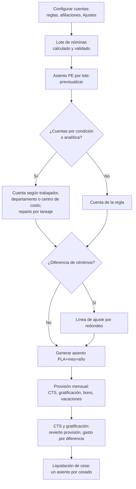

# Guía funcional — Planillas Perú: contabilización

> Módulo técnico `al_hr_pe_account` · versión `11.20261010` · área `OL-PAYROLL`.
> Para consultores funcionales: qué resuelve, la norma que lo respalda y el
> proceso completo con un ejemplo que cuadra. Enlaces verificados el
> 10/10/2026 con `docs/validacion/verificar_enlaces.py`.

## 1. Para qué sirve

La planilla genera gasto (sueldos, cargas sociales, beneficios) y pasivos
(remuneraciones por pagar, AFP, ONP, EsSalud, CTS, gratificaciones). Este
módulo construye **los asientos contables de la planilla y de los beneficios
sociales** con las cuentas configuradas por compañía:

- **Asiento de planilla por lote**: un asiento por periodo, agrupado por
  regla y cuenta, con el bloque AFP en la cuenta de cada administradora.
- **Asientos de beneficios sociales**: CTS, gratificación, provisión mensual
  y liquidación de cese, con reversión de la provisión acumulada.
- **Cuentas por condición**: otra cuenta según el tipo de trabajador, el
  departamento o el centro de costo, sin duplicar estructuras salariales.
- **Distribución analítica** opcional: de la regla, del **tareaje** (días u
  horas por obra) o de la ficha del trabajador.

Lo usan el contador y el responsable de planillas.

**Fuera del alcance**: el pago de la planilla (lo hace `al_hr_pe_reports` o
el registro de pagos de Contabilidad), la declaración PLAME y el cálculo de
los beneficios (`al_hr_pe_benefits`). El asiento no se genera solo al validar
boletas: se lanza a pedido.

## 2. Marco normativo y conceptual

- **Plan Contable General Empresarial (PCGE)**: cuentas 62 (gastos de
  personal: 621 remuneraciones, 627 seguridad y previsión social, 629
  beneficios sociales), 40 (tributos y aportes: 4031 EsSalud, 4032 ONP), 41
  (remuneraciones y participaciones por pagar: 4111 sueldos, 4114
  gratificaciones, 4115 vacaciones, 4151 CTS) y 417 (administradoras de
  fondos de pensiones). Las cuentas exactas las define cada empresa en su
  plan de cuentas.
- **Devengo**: CTS, gratificaciones y vacaciones se devengan mes a mes; la
  **provisión mensual** reconoce ese gasto y el pago o depósito revierte la
  provisión acumulada. Base legal de los beneficios: CTS (D.S. 001-97-TR),
  gratificaciones (Ley 27735), vacaciones (D. Leg. 713) — ver la guía de
  `al_hr_pe_benefits`.
- **Aportes**: el aporte AFP/ONP es del trabajador (se descuenta y se paga
  por cuenta suya); EsSalud es del empleador (gasto). [SBS — SPP](https://www.sbs.gob.pe/app/spp/empleadores/comisiones_spp/Paginas/comision_prima.aspx) ·
  [ONP](https://www.gob.pe/onp) · [EsSalud — Ley 26790](https://www.gob.pe/institucion/essalud/informes-publicaciones/4936482-ley-n-26790).
- **Contabilidad de nómina en Odoo 19**: [Nómina](https://www.odoo.com/documentation/19.0/applications/hr/payroll.html) ·
  [Contabilidad analítica](https://www.odoo.com/documentation/19.0/applications/finance/accounting/reporting/analytic_accounting.html).

| Término | Significado | Dónde aparece en Odoo |
|---|---|---|
| Cuenta de débito / crédito de la regla | Cargo y abono de cada concepto | Regla salarial ▸ Contabilidad |
| Cuenta de la afiliación | Pasivo por aportes de cada AFP/ONP | Afiliaciones (AFP/ONP) ▸ Cuenta contable |
| Cuentas por condición | Excepciones a la cuenta de la regla | Regla ▸ Contabilidad ▸ Cuentas por condición |
| Prov. acumulada | Lo provisionado en el semestre por trabajador | CTS / Gratificación ▸ líneas |
| Ajuste por redondeo | Línea para descuadres de céntimos | Asistentes de asiento |

## 3. Proceso de inicio a fin

| # | Paso | Dónde en Odoo | Quién | Resultado |
|---|---|---|---|---|
| 1 | Cuentas de cada regla | Nómina ▸ Configuración ▸ Salario ▸ Reglas ▸ Contabilidad | Contador | Cargo y abono por concepto |
| 2 | Cuenta de cada AFP/ONP | Configuración ▸ Perú ▸ Seguridad social ▸ Afiliaciones | Contador | Abono AFP por administradora |
| 3 | Diario, contacto, analítica y cuentas de beneficios | Ajustes ▸ Nómina ▸ Perú: contabilidad de planillas | Contador | Valores por compañía |
| 4 | Reglas de aportes AFP | Configuración principal ▸ Contabilidad | Contador | Qué reglas van a la cuenta de la afiliación |
| 5 | Cuentas por condición (opcional) | Regla ▸ Contabilidad o Nómina ▸ Contabilidad ▸ Cuentas por condición | Contador | Excepciones por tipo de trabajador, departamento o centro de costo |
| 6 | Asiento del lote | Lote ▸ ⋮ ▸ Asiento PE por lote | Planillas / contador | Asiento publicado y enlazado al lote |
| 7 | Provisión mensual | Beneficios sociales ▸ Provisiones ▸ Generar asiento | Planillas | Provisión en Hecho con su asiento |
| 8 | CTS y gratificación | Beneficios sociales ▸ CTS / Gratificación ▸ Obtener provisiones ▸ Generar asiento | Planillas | Reversión de la provisión y pasivo por pagar |
| 9 | Liquidación | Liquidación de cese ▸ Asientos contables | Planillas | Un asiento por cesado |

**Caminos alternativos**: un lote con asiento no genera otro hasta anular y
eliminar el anterior; si falta la cuenta de una afiliación, el asistente
lista los trabajadores afectados; si la nómina nativa ya contabilizó las
boletas una por una, el asiento por lote se bloquea para no duplicar el
gasto; las boletas en borrador bloquean el asiento y las anuladas no entran.

## 4. Ejemplo completo

### 4.1 Asiento de la planilla (abril de 2026, 10 boletas)

Resumen agrupado del asiento real `PLA042026` (55 líneas). Las faltas y
tardanzas tienen importe negativo y cambian de columna.

| Cuenta | Descripción | Debe | Haber |
|---|---|---:|---:|
| 6211000 | Básico | 38 133,94 | |
| 6211000 | Asignación familiar | 565,00 | |
| 6211000 | Horas extras 25 % y 35 % | 1 186,08 | |
| 6211000 | Subsidio por enfermedad | 450,00 | |
| 6211000 | Comisiones | 1 500,00 | |
| 4111000 | Remuneraciones por pagar — ingresos (por trabajador) | | 41 835,02 |
| 4111000 | Faltas y tardanzas | 4 933,79 | |
| 6211000 | Faltas y tardanzas (por trabajador) | | 4 933,79 |
| 4111000 | ONP | 1 279,98 | |
| 4032000 | ONP | | 1 279,98 |
| 4111000 | AFP aporte, comisión y prima | 3 161,88 | |
| 4032000 | AFP HABITAT | | 236,30 |
| 4032000 | AFP INTEGRA | | 956,48 |
| 4032000 | AFP PRIMA | | 1 968,63 |
| 4032000 | AFP PROFUTURO | | 0,47 |
| 4111000 | Adelanto, retención judicial y préstamo | 1 000,00 | |
| 4191 | Adelanto, retención judicial y préstamo (por trabajador) | | 1 000,00 |
| 6271000 | EsSalud | 3 012,55 | |
| 4031000 | EsSalud | | 3 012,55 |
| 6271000 | EPS 2,25 % | 267,75 | |
| 4031000 | EPS 2,25 % | | 267,75 |
| | **Totales** | **55 490,97** | **55 490,97** |

Comprobaciones: ingresos 38 133,94 + 565,00 + 1 186,08 + 450,00 + 1 500,00 =
41 835,02; bloque AFP 236,30 + 956,48 + 1 968,63 + 0,47 = 3 161,88. (En la
base de demostración las AFP usan la 4032000; el PCGE prevé la 417 para las
administradoras de fondos de pensiones: se configura en cada afiliación.)

### 4.2 Cuentas por condición y reparto por obra

Un obrero con básico de **S/ 3 000** trabaja en el periodo 60 % en la obra A
y 40 % en la obra B (por su distribución analítica o por el tareaje, ver
`al_hr_pe_attendance`). La regla «Básico» tiene la cuenta 6211000 y una fila
por condición: centro de costo **Obra A** → cuenta de cargo **621300 Sueldos
obra A**.

| Cuenta | Analítica | Debe | Haber |
|---|---|---:|---:|
| 621300 Sueldos obra A | Obra A 100 % | 1 800,00 | |
| 6211000 Sueldos (cuenta de la regla) | Obra B 100 % | 1 200,00 | |
| 4111000 Remuneraciones por pagar | | | 3 000,00 |
| | **Totales** | **3 000,00** | **3 000,00** |

El importe se parte por centro de costo (3 000 × 60 % = 1 800; × 40 % =
1 200) antes de elegir la cuenta. Si además existiera una fila por **tipo de
trabajador = obrero** con otra cuenta, ganaría la fila que cumpla **más
condiciones**; a igualdad, la de menor secuencia. Una fila con la cuenta de
cargo vacía conserva la de la regla.

### 4.3 Provisión mensual (julio de 2026, sueldo S/ 2 800)

| Cuenta | Descripción | Debe | Haber |
|---|---|---:|---:|
| 6291000 | Provisión de CTS | 233,33 | |
| 4151000 | Provisión de CTS por pagar | | 233,33 |
| 6214000 | Provisión de gratificación | 466,67 | |
| 4114000 | Provisión de gratificación por pagar | | 466,67 |
| 6214000 | Provisión del bono extraordinario | 42,00 | |
| 4114000 | Provisión del bono extraordinario por pagar | | 42,00 |
| 6215000 | Provisión de vacaciones | 233,33 | |
| 4115000 | Provisión de vacaciones por pagar | | 233,33 |
| | **Totales** | **975,33** | **975,33** |

Cálculo: 2 800 ÷ 12 = 233,33 (CTS y vacaciones); 2 800 ÷ 6 = 466,67
(gratificación); 466,67 × 9 % = 42,00 (bono extraordinario).

### 4.4 Liquidación de cese (31/08/2026)

Se revierte lo provisionado en julio y solo la diferencia de los truncos va a
gasto. Truncos: gratificación 933,33 + bono 84,00, CTS 466,67, vacaciones
466,67 (con ONP 60,67).

| Cuenta | Descripción | Debe | Haber |
|---|---|---:|---:|
| 4151000 | Reversión provisión de CTS | 233,33 | |
| 4114000 | Reversión provisión de gratificación y bono | 508,67 | |
| 4115000 | Reversión provisión de vacaciones | 233,33 | |
| 6214000 | Gratificación trunca (diferencia) | 508,66 | |
| 6291000 | CTS trunca (diferencia) | 233,34 | |
| 6215000 | Vacaciones truncas (diferencia) | 233,34 | |
| 4111000 | Liquidaciones por pagar | | 1 890,00 |
| 4033000 | ONP (cuenta de la afiliación en la base de pruebas) | | 60,67 |
| | **Totales** | **1 950,67** | **1 950,67** |

Por pagar: 1 017,33 + 466,67 + (466,67 − 60,67) = 1 890,00.

## 5. Configuración inicial

1. Cuentas de débito y crédito en cada regla salarial; marcar **Asignar empleado en la línea de la cuenta** en las que deban detallarse por trabajador.
2. Cuenta contable de cada **afiliación (AFP/ONP)** por compañía.
3. **Ajustes ▸ Nómina ▸ Perú: contabilidad de planillas**: diario, contacto para líneas sin trabajador, «Asiento de lote con analítica», cuentas de gasto, provisión y por pagar de CTS, gratificación, bono y vacaciones, liquidaciones por pagar y cuenta de ajuste por redondeo.
4. **Configuración principal ▸ Contabilidad**: reglas de aportes AFP.
5. Si se usa el asiento por lote, dejar **sin diario** la estructura salarial para que la validación de boletas no genere asientos propios.
6. Opcional: **cuentas por condición** y distribución analítica en reglas o fichas.

## 6. Reportes y libros relacionados

- El asiento queda en el **Libro Diario** y el **Libro Mayor** (y en los
  libros electrónicos del PLE, `al_l10n_pe_ple`).
- Con analítica, el gasto de personal se ve por centro de costo en los
  informes analíticos y alimenta los **asientos de destino** 9x/79
  (`al_account_destinations`).
- Cada asiento queda enlazado a su documento: lote y boletas, CTS,
  gratificación, provisión o fila de liquidación.

## 7. Casos especiales y errores frecuentes

| Situación | Qué pasa | Qué hacer |
|---|---|---|
| Falta la cuenta de una afiliación | El asistente lista los trabajadores afectados | Asignar la cuenta en la afiliación y volver a elegir el lote |
| Debe y haber difieren en céntimos | Se pide cuenta de ajuste y se añade «Ajuste por Redondeo» | Indicar la cuenta de ajuste |
| Descuadre real (falta una cuenta) | No se ajusta: el asistente avisa | Completar la cuenta de la regla |
| Boletas en borrador en el lote | Bloquean el asiento | Validar o retirar las boletas |
| La nómina nativa ya contabilizó las boletas | Se bloquea el asiento por lote | Quitar el diario de la estructura salarial |
| CTS sin provisiones obtenidas | Todo el importe va a gasto | Pulsar Obtener provisiones antes de generar |
| Varias compañías | Cada asiento usa las cuentas de la compañía del documento | Configurar cada compañía con ella activa |

## 8. Preguntas frecuentes del consultor

- **¿El asiento se genera al validar la planilla?** No: se lanza desde el lote con «Asiento PE por lote», después de previsualizarlo.
- **¿Puedo tener cuentas distintas para empleados y obreros sin duplicar la estructura?** Sí, con cuentas por condición por tipo de trabajador (T08).
- **¿Cómo cargo el sueldo de un obrero a dos obras?** Con «Asiento de lote con analítica»: la distribución sale de la regla, del tareaje (días u horas por obra) o de la ficha, en ese orden; con una fila por centro de costo, cada parte va además a su cuenta.
- **¿Por qué la liquidación tiene un asiento por trabajador?** Cada cese tiene su fecha, importes y contacto; al generarlo la fila queda marcada «No recalcular».
- **¿Las cuentas por condición aplican a los asientos de beneficios?** No: solo al asiento de planilla por lote.

## 9. Referencias

Verificadas el 10/10/2026:

- SBS — comisiones y primas del SPP: https://www.sbs.gob.pe/app/spp/empleadores/comisiones_spp/Paginas/comision_prima.aspx
- ONP: https://www.gob.pe/onp
- EsSalud — Ley 26790: https://www.gob.pe/institucion/essalud/informes-publicaciones/4936482-ley-n-26790
- TUO de la Ley de CTS (D.S. 001-97-TR) — normas legales actualizadas, El Peruano: https://diariooficial.elperuano.pe/Normas/obtenerDocumento?idNorma=37
- SERVIR — Informe técnico sobre gratificaciones (Ley 27735): https://cdn.www.gob.pe/uploads/document/file/5690429/5053106-informe-tecnico-482-2017-servir-gpgsc.pdf
- Odoo 19 — Nómina: https://www.odoo.com/documentation/19.0/applications/hr/payroll.html
- Odoo 19 — Contabilidad analítica: https://www.odoo.com/documentation/19.0/applications/finance/accounting/reporting/analytic_accounting.html
