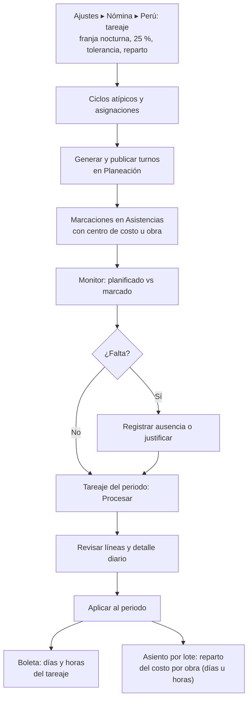

# Guía funcional — Planillas Perú: asistencia, turnos y tareaje

> Módulo técnico `al_hr_pe_attendance` · versión `19.20261010` · área `OL-PAYROLL`.
> Para consultores funcionales: qué resuelve, la norma que lo respalda y el
> proceso completo con un ejemplo que cuadra. Enlaces verificados el
> 10/10/2026 con `docs/validacion/verificar_enlaces.py`.

## 1. Para qué sirve

El empleador debe controlar la asistencia y pagar el sobretiempo, la jornada
nocturna y el trabajo en descanso o feriado con sus sobretasas. Contar esas
horas a mano desde las marcaciones es lento y propenso a errores. Este módulo:

- define **ciclos de jornada atípica** (14×7, 4×3…) con control legal y genera
  los **turnos** en Planeación;
- compara en un **monitor** lo planificado con lo marcado, día por día;
- arma el **tareaje** del periodo: clasifica cada día (laborado, descanso,
  feriado o descanso laborado, falta, tardanza, horas extras al 25 %, 35 % y
  100 %, horas nocturnas) y lo lleva a la boleta;
- registra la **obra o centro de costo** de cada día para repartir el costo
  del trabajador en el asiento de la planilla;
- imprime el **fotocheck** del personal.

Lo usan RR. HH., los supervisores de obra o planta y el responsable de
planillas.

**Fuera del alcance**: el marcado en reloj o biométrico (se usa la app
Asistencias de Odoo o la importación de marcaciones), el cálculo de la
remuneración (lo hace la boleta con la estructura de `al_hr_pe`) y el asiento
contable (`al_hr_pe_account`, que usa el reparto de este módulo).

## 2. Marco normativo y conceptual

- **Jornada, horario y sobretiempo** (TUO del D. Leg. 854, D.S. 007-2002-TR y
  su reglamento D.S. 008-2002-TR): jornada máxima de 8 h diarias o 48 h
  semanales; jornadas atípicas o acumulativas con promedio no mayor de 48 h
  en el ciclo (art. 4); jornada nocturna entre las 22:00 y las 06:00 (art. 8);
  sobretiempo voluntario con sobretasa mínima de 25 % las dos primeras horas y
  35 % las siguientes (art. 10); excluidos de la jornada máxima el personal de
  dirección y el no sujeto a fiscalización inmediata (art. 5).
  [SERVIR — trabajo intermitente y horas extras](https://cdn.www.gob.pe/uploads/document/file/5687401/5050761-informe-tecnico-693-2018-servir-gpgsc.pdf).
- **Registro de control de asistencia** (D.S. 004-2006-TR y modificatorias):
  ingreso y salida de cada trabajador, en soporte físico o digital, sin
  posibilidad de adulteración. [El Peruano — registro de asistencia](https://elperuano.pe/noticia/292443).
- **Descansos y feriados** (D. Leg. 713): el trabajo en feriado o en el día de
  descanso sin descanso sustitutorio se paga con 100 % de sobretasa.
  [Feriados 2026 — gob.pe](https://www.gob.pe/feriados).
- **Fiscalización**: [SUNAFIL](https://www.gob.pe/sunafil).
- Odoo 19: [Asistencias](https://www.odoo.com/documentation/19.0/applications/hr/attendances.html) ·
  [Planeación](https://www.odoo.com/documentation/19.0/applications/services/planning.html).

| Término | Significado | Dónde aparece en Odoo |
|---|---|---|
| Ciclo atípico N×M | N días de trabajo por M de descanso | Nómina ▸ Asistencia ▸ Ciclos atípicos |
| Promedio semanal | Horas por día × días de trabajo × 7 ÷ días del ciclo | Ficha del ciclo |
| Tareaje | Clasificación de las horas del periodo para la boleta | Nómina ▸ Asistencia ▸ Tareaje |
| Tolerancia | Retraso que no se computa; superada, la tardanza cuenta desde la hora programada | Ajustes y cada tareaje |
| Entradas de trabajo DLAB, DOM, FER, FAL, TAR, HE25, HE35, HE100 | Conceptos que recibe la boleta | Configuración principal ▸ Tareaje |
| Centro de costo del día | Obra o área donde trabajó ese día | Marcación y detalle diario del tareaje |

## 3. Proceso de inicio a fin

| # | Paso | Dónde en Odoo | Quién | Resultado |
|---|---|---|---|---|
| 1 | Parámetros del tareaje | Ajustes ▸ Nómina ▸ Perú ▸ Perú — tareaje | Jefe de planillas | Franja nocturna, horas al 25 %, tolerancia, redondeo, reparto por días u horas |
| 2 | Entradas de trabajo destino | Configuración principal ▸ pestaña Tareaje | Jefe de planillas | DLAB, DOM, FER, FAL, TAR, HE25, HE35, HE100 (y nocturna) |
| 3 | Sujeto a horas extras | Nómina ▸ Empleados ▸ Registros de los empleados | RR. HH. | Quién puede generar sobretiempo |
| 4 | Ciclos y asignaciones | Nómina ▸ Asistencia ▸ Ciclos atípicos / Asignaciones de ciclo | RR. HH. | Control de 48 h y 12 h; turnos generados |
| 5 | Publicar turnos | Asignación ▸ botón Turnos ▸ Planeación | Supervisor | Turnos visibles para el monitor |
| 6 | Marcar asistencia | Asistencias (con centro de costo u obra) | Trabajador / supervisor | Entradas y salidas |
| 7 | Monitor | Nómina ▸ Asistencia ▸ Monitor de asistencia | Supervisor | Faltas detectadas; Reg. ausencia |
| 8 | Tareaje | Nómina ▸ Asistencia ▸ Tareaje ▸ Procesar | Planillas | Líneas por trabajador y detalle diario |
| 9 | Aplicar | Tareaje ▸ Aplicar al periodo | Planillas | La boleta toma los días y horas; el asiento reparte por obra |

**Caminos alternativos**: un ciclo que supera 48 h semanales o 12 h diarias no
se guarda; si los turnos chocan con otros, no se crea ninguno y se listan las
fechas; un tareaje aplicado se corrige con **Reabrir**, se vuelve a aplicar y
se recalcula la boleta; las ausencias aprobadas no son faltas.

## 4. Ejemplo completo

**Tareaje del 1 al 14 de septiembre de 2026**, horario lunes a viernes 08:00 a
17:00 y sábado 08:00 a 13:00, tolerancia 5 minutos (datos de demostración).

| Día | Horario | Marcaciones | Clasificación |
|---|---|---|---|
| Mié 02/09 (Rivas) | 08:00–17:00 | 08:00–19:30 | Laborado + 2:00 HE 25 % + 0:30 HE 35 % |
| Dom 06/09 (Rivas) | Sin turno | 08:00–18:00 | Descanso laborado + 2:00 HE 100 % (exceso sobre 8 h) |
| Mar 08/09 (Salazar) | 08:00–17:00 | 08:25–17:00 | Laborado + 0:25 de tardanza |
| Jue 10/09 (Salazar) | 08:00–17:00 | Sin marcaciones | Falta |
| Dom 13/09 (ambas) | Sin turno | Sin marcaciones | Día de descanso |

Totales que recibe la boleta:

| Trabajadora | Laborados | Descansos | Descanso laborado | Faltas | Tardanzas | HE 25 % | HE 35 % | HE 100 % |
|---|---:|---:|---:|---:|---:|---:|---:|---:|
| Rivas | 12 | 1 | 1 | 0 | 0:00 | 4:00 | 0:30 | 2:00 |
| Salazar | 11 | 2 | 0 | 1 | 0:25 | 0:00 | 0:00 | 0:00 |

Salazar no está sujeta a horas extras, por eso no tiene sobretiempo. La boleta
de Rivas recibe DLAB 12 días (90 h), DOM 1, FER 1, HE25 4 h, HE35 0,5 h y HE100
2 h. Las reglas de horas extras de `al_hr_pe` valoran cada hora como
(remuneración + asignación familiar) ÷ 30 ÷ 8 × 1,25 / 1,35 / 2.

**Control de ciclos**: 14×7 de 10 h → 10 × 14 × 7 ÷ 21 = 46:40 h semanales
(se admite); 4×3 de 12 h → 48:00 (en el límite); 14×7 de 12 h → 56:00 (se
rechaza).

**Reparto del costo por obra**: un obrero con básico de **S/ 2 500** trabaja
en marzo 3 días en la obra A y 2 días en la obra B (tareaje aplicado, reparto
**por días**). La distribución es 3 ÷ 5 = 60 % y 2 ÷ 5 = 40 %. Con «Asiento de
lote con analítica», el básico entra al asiento así:

| Cuenta | Analítica | Debe | Haber |
|---|---|---:|---:|
| 6211000 Básico | Obra A 60 %, Obra B 40 % (1 500,00 / 1 000,00) | 2 500,00 | |
| 4111000 Remuneraciones por pagar | | | 2 500,00 |
| | **Totales** | **2 500,00** | **2 500,00** |

Con reparto **por horas** se suman las horas diurnas, nocturnas y extras: 10 h
en la obra A (8 + 2 al 25 %) y 10 h en la obra B dan 50 % / 50 %. Los días sin
obra van a la distribución de la ficha del trabajador (por ejemplo, 2 días en
la obra A y 2 sin obra con ficha «Oficina» → 50 % obra A, 50 % oficina).

## 5. Configuración inicial

1. Instalar el módulo (requiere Planeación, Asistencias, Nómina y el calendario de feriados `al_hr_pe_public_holidays`).
2. **Ajustes ▸ Nómina ▸ Perú ▸ Perú — tareaje**: franja nocturna (22:00–06:00), primeras horas al 25 % (2:00), tolerancia, redondeo y **Reparto del costo por obra** (por días o por horas).
3. **Configuración principal ▸ Tareaje**: tipos de entrada de trabajo de destino (incluida la jornada nocturna si se paga).
4. Marcar **Sujeto a horas extras (PE)** en la versión de quienes tienen sobretiempo.
5. Si hay jornadas atípicas: ciclos, asignaciones, generar y publicar turnos.
6. Marcar **Es vacaciones (Perú)** en los tipos de ausencia de vacaciones.
7. Para repartir por obra: centro de costo u obra en las marcaciones (o en el detalle diario) y «Asiento de lote con analítica» en la contabilidad de planillas.
8. Para el carné: **Configuración de fotocheck** de la compañía.

## 6. Reportes y libros relacionados

- **Monitor de asistencia** (lista y tabla dinámica): planificado frente a marcado.
- **Tareaje** con detalle diario: base de la boleta y del archivo PLAME `.jor` (horas ordinarias y de sobretiempo, en `al_hr_pe`).
- **Asiento de planilla por lote** con el reparto por obra (`al_hr_pe_account`).
- **Fotocheck (Perú)** en PDF.

## 7. Casos especiales y errores frecuentes

| Situación | Qué pasa | Qué hacer |
|---|---|---|
| Un trabajador no aparece en el tareaje | Solo entran quienes marcaron en el periodo | Revisar el monitor y las marcaciones |
| No se calculan horas extras | Faltan el interruptor del tareaje o «Sujeto a horas extras (PE)» | Activar ambos |
| Marcación solo de entrada o de salida | Se señala como inconsistencia y no se clasifica | Completar la marcación |
| Feriado trabajado pagado como día normal | Falta el calendario de feriados | Instalar y mantener `al_hr_pe_public_holidays` |
| Sobretiempo compensado con descanso | Se registra en «Horas a compensar» | Descuenta HE 25 % y luego HE 35 % en la boleta |
| Tareaje en borrador | La boleta y el asiento no lo usan | Aplicar al periodo |
| Nocturnidad no llega a la boleta | Falta el tipo de entrada «jornada nocturna» | Configurarlo en la Configuración principal |

## 8. Preguntas frecuentes del consultor

- **¿El tareaje lee los turnos de Planeación?** No: compara las marcaciones con el horario de trabajo; los turnos alimentan el monitor.
- **¿Las ausencias aprobadas cuentan como falta?** No: llegan a la boleta por sus propias entradas de trabajo.
- **¿Puedo cambiar de obra a un obrero de una semana a otra o de un día a otro?** Sí: indique la obra en la marcación de cada día; el asiento reparte el costo por días u horas del periodo.
- **¿Funciona con varias compañías?** Sí: cada compañía tiene su franja, tolerancia, reparto y tipos de entrada; tareajes y asignaciones son por compañía.
- **¿Cómo justifico una falta?** Desde el monitor, botón Reg. ausencia en la fila de la falta.

## 9. Referencias

Verificadas el 10/10/2026:

- SERVIR — Informe técnico sobre trabajo intermitente y horas extras (cita el D.S. 007-2002-TR): https://cdn.www.gob.pe/uploads/document/file/5687401/5050761-informe-tecnico-693-2018-servir-gpgsc.pdf
- El Peruano — Registro de control de asistencia: https://elperuano.pe/noticia/292443
- Feriados 2026 — gob.pe: https://www.gob.pe/feriados
- SUNAFIL: https://www.gob.pe/sunafil
- Odoo 19 — Asistencias: https://www.odoo.com/documentation/19.0/applications/hr/attendances.html
- Odoo 19 — Planeación: https://www.odoo.com/documentation/19.0/applications/services/planning.html
