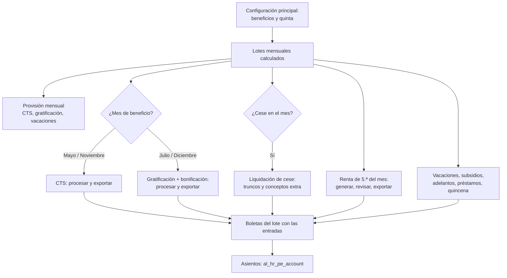

# Guía funcional — Planillas Perú: beneficios sociales

> Módulo técnico `al_hr_pe_benefits` · versión `22.20261008` · área `OL-PAYROLL`.
> Para consultores funcionales: qué resuelve, la norma que lo respalda y el
> proceso completo con un ejemplo que cuadra. Enlaces verificados el
> 10/10/2026 con `docs/validacion/verificar_enlaces.py`.

## 1. Para qué sirve

Casi ningún beneficio peruano se calcula sobre el sueldo, sino sobre la
**remuneración computable**: lo fijo se suma y lo variable se promedia solo si
apareció suficientes veces. Este módulo calcula, desde las boletas de Odoo y
con la configuración de cada compañía:

- **CTS** semestral (depósitos de mayo y noviembre);
- **gratificaciones** de julio y diciembre con la **bonificación extraordinaria**;
- **retención de renta de 5.ª categoría** del mes, con proyección anual;
- **liquidación de cese** (truncos y conceptos extra);
- **provisiones** mensuales de CTS, gratificación y vacaciones;
- **subsidios** de EsSalud (enfermedad y maternidad);
- **utilidades** (D. Leg. 892);
- **vacaciones**: récord, saldos, goce y venta;
- **adelantos, préstamos al personal y adelanto quincenal**.

Todos siguen el mismo circuito: documento del periodo → **Procesar** →
revisar → **Exportar** a las boletas del lote.

Lo usa el responsable de planillas.

**Fuera del alcance**: los asientos contables (los genera `al_hr_pe_account`
desde estos mismos documentos), el depósito bancario de la CTS y los pagos
masivos (`al_hr_pe_reports`), la declaración anual de renta del trabajador y
la presentación de la PLAME.

## 2. Marco normativo y conceptual

- **CTS** — TUO del D. Leg. 650 (D.S. 001-97-TR) y reglamento D.S. 004-97-TR:
  depósitos en los primeros 15 días de mayo (periodo noviembre–abril) y de
  noviembre (mayo–octubre); 1/12 de la remuneración computable por mes y
  1/360 por día; la remuneración computable incluye 1/6 de la gratificación
  del semestre. [Normas legales actualizadas — El Peruano](https://diariooficial.elperuano.pe/Normas/obtenerDocumento?idNorma=37).
- **Gratificaciones** — Ley 27735 y D.S. 005-2002-TR: una remuneración en julio
  y otra en diciembre (1/6 por mes completo del semestre), pagaderas en la
  primera quincena. Ley 30334: inafectas de aportes y con **bonificación
  extraordinaria** igual al aporte de EsSalud (9 %, o 6,75 % con EPS).
  [SERVIR — Informe técnico sobre la Ley 27735](https://cdn.www.gob.pe/uploads/document/file/5690429/5053106-informe-tecnico-482-2017-servir-gpgsc.pdf).
- **Vacaciones** — D. Leg. 713 (modificado por el D. Leg. 1405): 30 días
  calendario por año completo de servicios; vacaciones truncas al cese.
  [Normas legales actualizadas — El Peruano](https://diariooficial.elperuano.pe/Normas/obtenerDocumento?idNorma=42).
- **Renta de 5.ª categoría** — TUO de la LIR y art. 40 del Reglamento:
  proyección anual, deducción de 7 UIT, tasas de 8 %, 14 %, 17 %, 20 % y 30 %
  por tramos de 5, 20, 35 y 45 UIT, y divisores del mes (enero a marzo 12;
  abril 9; mayo a julio 8; agosto 5; setiembre a noviembre 4; diciembre
  regularización). [SUNAT — Cálculo del impuesto](https://orientacion.sunat.gob.pe/3071-02-calculo-del-impuesto) ·
  [TUO de la LIR](https://www.sunat.gob.pe/legislacion/renta/tuo.html).
- **Subsidios** — Ley 26790 y D.S. 013-2019-TR: los primeros 20 días de
  incapacidad del año los paga el empleador; desde el día 21, EsSalud.
  [EsSalud — Ley 26790](https://www.gob.pe/institucion/essalud/informes-publicaciones/4936482-ley-n-26790).
- **Utilidades** — D. Leg. 892 y D.S. 009-98-TR: porcentaje de la renta anual
  antes de impuestos según la actividad, 50 % por remuneraciones y 50 % por
  días laborados. [SUNAT — Informe 033-2012 sobre la participación en utilidades](https://www.sunat.gob.pe/legislacion/oficios/2012/informe-oficios/i033-2012.pdf).
- **RMV y asignación familiar**: [D.S. 006-2024-TR](https://busquedas.elperuano.pe/dispositivo/NL/2357884-10).

| Término | Significado | Dónde aparece en Odoo |
|---|---|---|
| Remuneración computable | Fijos + asignación familiar + promedio de variables | Línea de CTS, gratificación o liquidación |
| Regla de las tres apariciones | Un variable entra al promedio si aparece en 3 o más boletas del semestre | Motor de la Configuración principal |
| No recalcular | Protege una línea editada a mano al volver a procesar | Línea del documento |
| Exportar | Escribe el importe como entrada de la boleta del lote | Botón del documento |
| Excluidos de 5.ª | Trabajadores sin retención en el mes | Renta de 5.ª ▸ Trabajadores sin retención |

## 3. Proceso de inicio a fin

| # | Paso | Dónde en Odoo | Quién | Resultado |
|---|---|---|---|---|
| 1 | Configurar el motor | Configuración principal ▸ Beneficios sociales | Jefe de planillas | Entradas, reglas para promedios y tipos de días |
| 2 | Quincena y vacaciones | Ajustes ▸ Nómina ▸ Perú: quincena y beneficios sociales | Jefe de planillas | Modo de quincena, asignación familiar en vacaciones |
| 3 | Tramos de 5.ª | Configuración principal ▸ Quinta categoría | Jefe de planillas | Tramos en soles desde la UIT del año |
| 4 | CTS | Nómina ▸ Beneficios sociales ▸ CTS | Planillas | Una línea por trabajador; exportada a la boleta |
| 5 | Gratificación | Beneficios sociales ▸ Gratificación | Planillas | Gratificación y bonificación en la boleta |
| 6 | Renta de 5.ª | Beneficios sociales ▸ Renta de 5ta categoría | Planillas | Retención (QUINTA) en la boleta |
| 7 | Liquidación | Beneficios sociales ▸ Liquidación de cese | Planillas | Truncos del cesado en su boleta |
| 8 | Provisiones | Beneficios sociales ▸ Provisiones | Planillas | Devengo del mes (y su asiento con `al_hr_pe_account`) |
| 9 | Subsidios | Beneficios sociales ▸ Subsidios | Planillas | Subsidio por periodos desde las suspensiones T21 21/22 |
| 10 | Utilidades | Beneficios sociales ▸ Utilidades | Planillas | Reparto 50/50 y exportación |
| 11 | Vacaciones | Beneficios sociales ▸ Vacaciones | Planillas / RR. HH. | Récord, saldos y liquidación vacacional |
| 12 | Adelantos, préstamos, quincena | Beneficios sociales ▸ Adelantos y préstamos / Adelantos quincenales | Planillas | Cuotas y adelantos descontados en la boleta |

**Caminos alternativos**: procesar de nuevo regenera las líneas salvo las
marcadas **No recalcular**; un trabajador con menos de un mes en el semestre
no deposita CTS (pasa al siguiente); en el mes de cese la quinta se regulariza
como en diciembre y, si se retuvo de más, se devuelve en la boleta; un
periodo de subsidio ya importado se devuelve con **Cambiar a no pagado**.

## 4. Ejemplo completo

Trabajador del régimen general con **sueldo S/ 2 500 y asignación familiar
S/ 113**, sin variables, asegurado en EsSalud. En el semestre computa **5
meses y 26 días** con **4 faltas** (cifras de la ficha y los tests).

**CTS noviembre–abril**

| Concepto | Cálculo | S/ |
|---|---|---:|
| Remuneración computable | 2 500,00 + 113,00 | 2 613,00 |
| Importe por mes | 2 613,00 ÷ 12 | 217,75 |
| Importe por día | 217,75 ÷ 30 | 7,2583 |
| Meses completos | 217,75 × 5 | 1 088,75 |
| Días | 7,2583 × 26 | 188,72 |
| Faltas | 7,2583 × 4 | −29,03 |
| **Total CTS** | | **1 248,44** |

**Gratificación de Fiestas Patrias**

| Concepto | Cálculo | S/ |
|---|---|---:|
| Importe por mes | 2 613,00 ÷ 6 | 435,50 |
| Meses completos | 435,50 × 5 | 2 177,50 |
| Faltas | 435,50 ÷ 30 × 4 | −58,07 |
| **Gratificación** | | **2 119,43** |
| Bonificación extraordinaria 9 % | 2 119,43 × 9 % | 190,75 |
| **Total a pagar** | | **2 310,18** |

**Renta de 5.ª categoría** (otra trabajadora, sueldo constante de S/ 6 000,
UIT 2026 = S/ 5 500, gratificaciones de S/ 6 540 con su bonificación):

| Paso | Cálculo | S/ |
|---|---|---:|
| Renta bruta anual | 6 000 × 12 + 6 540 × 2 | 85 080,00 |
| Deducción 7 UIT | 7 × 5 500 | −38 500,00 |
| Renta neta | | 46 580,00 |
| Hasta 5 UIT al 8 % | 27 500 × 8 % | 2 200,00 |
| Exceso al 14 % | (46 580 − 27 500) × 14 % | 2 671,20 |
| **Impuesto anual proyectado** | | **4 871,20** |
| Retención de enero a marzo | 4 871,20 ÷ 12 | 405,93 c/u |
| Retención de abril | (4 871,20 − 1 217,79) ÷ 9 | 405,93 |
| Retención de junio | (4 871,20 − 1 623,72 retenido de enero a abril) ÷ 8 | 405,94 |

Con el sueldo constante, la retención de los 12 meses suma exactamente
4 871,20 (diciembre regulariza la diferencia de céntimos).

**Liquidación de cese** (sueldo S/ 2 800, ONP, cese 31/08/2026, 2 meses
computables en cada trunco):

| Concepto | Cálculo | S/ |
|---|---|---:|
| Gratificación trunca | 2 800 ÷ 6 × 2 | 933,33 |
| Bonificación extraordinaria | 933,33 × 9 % | 84,00 |
| CTS trunca | 2 800 ÷ 12 × 2 | 466,67 |
| Vacaciones truncas | 2 800 ÷ 12 × 2 | 466,67 |
| ONP de las vacaciones | 466,67 × 13 % | −60,67 |
| **Total por pagar** | | **1 890,00** |

**Asientos** (los genera `al_hr_pe_account`; cuentas de la base de
demostración). Depósito de la CTS anterior sin provisión previa:

| Cuenta | Descripción | Debe | Haber |
|---|---|---:|---:|
| 6291000 | Gasto de CTS | 1 248,44 | |
| 4151000 | CTS por pagar — trabajador | | 1 248,44 |
| | **Totales** | **1 248,44** | **1 248,44** |

Pago de la gratificación:

| Cuenta | Descripción | Debe | Haber |
|---|---|---:|---:|
| 6214000 | Gasto de gratificación y bonificación | 2 310,18 | |
| 4114000 | Gratificación por pagar — trabajador | | 2 310,18 |
| | **Totales** | **2 310,18** | **2 310,18** |

**Utilidades**: renta de S/ 500 000 al 10 % = S/ 50 000; S/ 25 000 por
remuneraciones (S/ 230 386,83 en el año → 0,108513 por sol) y S/ 25 000 por
días (1 716 días → 14,5688 por día). Un trabajador con S/ 15 344,67 y 173 días
recibe 1 665,10 + 2 520,40 = **S/ 4 185,50**.

**Préstamo**: S/ 1 500 en 3 cuotas de S/ 500 que vencen a fin de mes
(30/09, 31/10 y 30/11/2026) y se descuentan en cada boleta.

## 5. Configuración inicial

1. **Ajustes ▸ Nómina ▸ Perú: quincena y beneficios sociales**: modo y fracción de la quincena, asignación familiar en vacaciones, encargado de la liquidación.
2. **Configuración principal ▸ Beneficios sociales**: entradas de trabajo y de boleta de cada beneficio, reglas cuyos importes se promedian y tipos de días (laborados, faltas, descanso médico).
3. Registrar la **UIT** del año y **generar los tramos** de la renta de 5.ª.
4. Revisar los **tipos de préstamo y de adelanto**.
5. Calcular los **lotes mensuales con su periodo** antes de procesar CTS, gratificación, provisiones o utilidades.

## 6. Reportes y libros relacionados

- Cada documento tiene su lista por trabajador (y Excel en vacaciones) y queda
  enlazado a las boletas del lote.
- Las entradas exportadas salen en la **boleta impresa** y en la **PLAME**
  (códigos SUNAT de gratificación, CTS, quinta, vacaciones, subsidios).
- Los asientos de CTS, gratificación, provisión y liquidación se generan con
  `al_hr_pe_account`.
- Saldos de vacaciones por trabajador y año.

## 7. Casos especiales y errores frecuentes

| Situación | Qué pasa | Qué hacer |
|---|---|---|
| El 1/6 de gratificación sale en cero en la CTS | No hay gratificación liquidada en el semestre | Procesar la gratificación del semestre |
| La CTS no muestra trabajadores | Falta el lote del mes de cierre o la configuración no apunta a las reglas de la estructura | Revisar lote, periodo y Configuración principal |
| Ajuste manual perdido al reprocesar | La línea no estaba protegida | Marcar **No recalcular** |
| Pequeña empresa | CTS ÷ 24 y gratificación ÷ 12; provisiones a la mitad | Régimen correcto en la versión |
| Trabajador cesado en la provisión | No se provisiona: se liquida | Usar la liquidación de cese |
| Descanso médico mayor a 60 días | El exceso se descuenta de la CTS | Nada: lo hace el motor |
| Retención de 5.ª en exceso al cese o en diciembre | Se devuelve en la boleta | Revisar la línea de quinta |

## 8. Preguntas frecuentes del consultor

- **¿El módulo genera asientos?** No: los genera `al_hr_pe_account` desde estos documentos.
- **¿Cómo se promedian las comisiones?** Si aparecen en 3 o más boletas del semestre, se suman y se dividen entre 6 (o entre los meses trabajados si ingresó a mitad del semestre).
- **¿La bonificación extraordinaria es 9 % siempre?** Es el porcentaje del seguro social del trabajador: 9 % EsSalud o el de su EPS.
- **¿Cómo maneja la quinta los ingresos de otro empleador?** Se registran en la línea («Rem. otros empleadores», «Retenido otros empleadores») y entran a la proyección.
- **¿Puedo cambiar la compañía de un documento?** No: se toma de la compañía activa al crearlo.

## 9. Referencias

Verificadas el 10/10/2026:

- TUO de la Ley de CTS (D.S. 001-97-TR) — normas legales actualizadas, El Peruano: https://diariooficial.elperuano.pe/Normas/obtenerDocumento?idNorma=37
- SERVIR — Informe técnico sobre gratificaciones (Ley 27735): https://cdn.www.gob.pe/uploads/document/file/5690429/5053106-informe-tecnico-482-2017-servir-gpgsc.pdf
- D. Leg. 713, descansos remunerados — normas legales actualizadas, El Peruano: https://diariooficial.elperuano.pe/Normas/obtenerDocumento?idNorma=42
- SUNAT — Renta de 5.ª categoría, cálculo del impuesto: https://orientacion.sunat.gob.pe/3071-02-calculo-del-impuesto
- SUNAT — TUO de la Ley del Impuesto a la Renta: https://www.sunat.gob.pe/legislacion/renta/tuo.html
- EsSalud — Ley 26790: https://www.gob.pe/institucion/essalud/informes-publicaciones/4936482-ley-n-26790
- SUNAT — Informe 033-2012 (participación en las utilidades): https://www.sunat.gob.pe/legislacion/oficios/2012/informe-oficios/i033-2012.pdf
- D.S. 006-2024-TR, RMV — El Peruano: https://busquedas.elperuano.pe/dispositivo/NL/2357884-10
