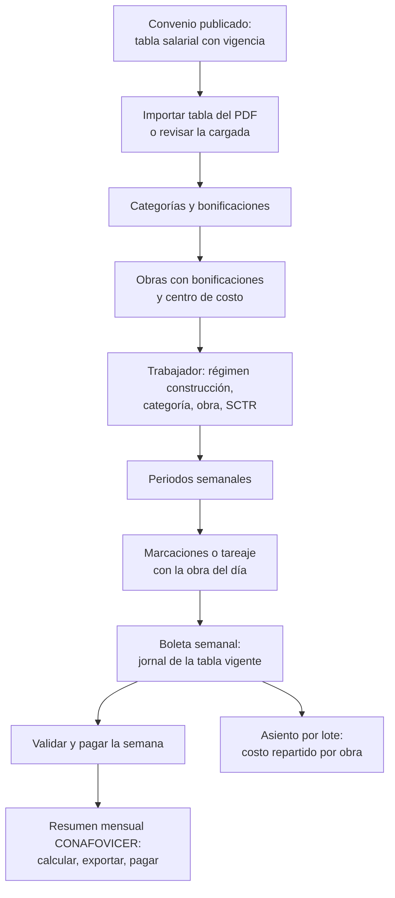

# Guía funcional — Planillas de construcción civil

> Módulo técnico `al_hr_pe_construction` · versión `22.20261010` · área `OL-PAYROLL`.
> Para consultores funcionales: qué resuelve, la norma que lo respalda y el
> proceso completo con un ejemplo que cuadra. Enlaces verificados el
> 10/10/2026 con `docs/validacion/verificar_enlaces.py`.

## 1. Para qué sirve

En construcción civil se paga por **jornal diario** fijado por la convención
colectiva por rama (CAPECO–FTCCP) según la **categoría** (operario, oficial,
peón), con planilla **semanal**. La CTS y las vacaciones se pagan en cada
planilla (15 % y 10 %), la gratificación es de **40 jornales**, las horas
extras van al **60 % y 100 %** y el trabajador aporta el 2 % al **CONAFOVICER**.
Este módulo modela el régimen tal cual:

- **tablas salariales** del convenio con su vigencia (trae la de 2026) e
  importación desde el PDF publicado;
- **categorías**, **bonificaciones** (BAE, altitud, agua, cota cero, altura) y
  **obras** que activan las suyas;
- estructura salarial **CONSTRUCCIÓN CIVIL** con 29 reglas y su boleta impresa;
- **resumen mensual del CONAFOVICER** con su Excel para el depósito;
- **obra o centro de costo del día** para repartir el costo del obrero entre
  obras en el asiento de la planilla.

Lo usan el responsable de planillas de obra y RR. HH.

**Fuera del alcance**: la inscripción en el registro de trabajadores de
construcción civil (RETCC) y el depósito del CONAFOVICER (se hacen fuera de
Odoo con el Excel del módulo), el asiento contable (`al_hr_pe_account`) y la
PLAME (`al_hr_pe`).

## 2. Marco normativo y conceptual

- **Régimen de construcción civil**: régimen especial con condiciones fijadas
  cada año por la negociación colectiva por rama entre CAPECO y la FTCCP, que
  el MTPE difunde por resolución ministerial (para 2026, la R.M. 197-2025-TR,
  vigente del 01/01/2026 al 31/12/2026).
  [El Peruano — aumentos salariales 2026](https://elperuano.pe/noticia/285414-trabajas-en-construccion-civil-conoce-los-nuevos-aumentos-salariales-para-2026) ·
  [El Peruano — beneficios de construcción civil 2026](https://elperuano.pe/noticia/284624-los-beneficios-de-construccion-civil-2026) ·
  [El Peruano — negociación colectiva 2027](https://elperuano.pe/noticia/305897-construccion-civil-negociacion-colectiva-2027-se-inicia-con-proyecto-presentado-por-los-trabajadores-al-mtpe).
- **Conceptos del régimen**: jornal básico, descanso semanal obligatorio
  (D.S.O.), bonificación unificada de construcción (BUC, 32 % operario y
  30 % oficial y peón), movilidad, bonificación por alta especialización
  (BAE), indemnización por tiempo de servicios del 15 % (CTS del régimen),
  vacaciones del 10 %, gratificación de 40 jornales en julio y en diciembre,
  asignación escolar, horas extras al 60 % y 100 %.
- **Gratificación y bonificación extraordinaria**: Ley 30334 (9 %, o el
  porcentaje de la EPS). [SERVIR — Ley 27735](https://cdn.www.gob.pe/uploads/document/file/5690429/5053106-informe-tecnico-482-2017-servir-gpgsc.pdf).
- **CONAFOVICER**: fondo para vivienda y centros recreacionales de los
  trabajadores de construcción civil (D. Ley 21067); el empleador retiene el
  2 % del jornal más D.S.O. y lo deposita mensualmente.
  [El Peruano — comité del CONAFOVICER](https://busquedas.elperuano.pe/dispositivo/NL/2418872-1).
- **Pensiones y salud**: SPP/SNP y EsSalud como en el régimen general; SCTR
  obligatorio en obra (Ley 26790). [EsSalud — Ley 26790](https://www.gob.pe/institucion/essalud/informes-publicaciones/4936482-ley-n-26790) ·
  [SBS — SPP](https://www.sbs.gob.pe/app/spp/empleadores/comisiones_spp/Paginas/comision_prima.aspx).

| Término | Significado | Dónde aparece en Odoo |
|---|---|---|
| Tabla salarial | Jornales por categoría con su vigencia | Configuración ▸ Perú ▸ Construcción civil ▸ Tablas salariales |
| Categoría | Operario, oficial, peón (con su % de BUC) | Construcción civil ▸ Categorías |
| Obra | Lugar de trabajo con sus bonificaciones y centro de costo | Empleados ▸ Obras |
| Jornal congelado | La boleta guarda el jornal vigente al fin del periodo | Boleta |
| TREM | Remuneración computable para aportes (jornal + D.S.O. + BUC + BAE + bonificaciones + extras + asignación escolar) | Regla TREM |

## 3. Proceso de inicio a fin

| # | Paso | Dónde en Odoo | Quién | Resultado |
|---|---|---|---|---|
| 1 | Tabla salarial vigente | Nómina ▸ Configuración ▸ Perú ▸ Construcción civil ▸ Tablas salariales | Jefe de planillas | Jornales por categoría |
| 2 | Importar el convenio | Tablas salariales ▸ Importar tabla del convenio | Jefe de planillas | Tabla nueva (archivada hasta revisarla) |
| 3 | Tasas de la compañía | Ajustes ▸ Usuarios y empresas ▸ Empresas ▸ Construcción civil (PE) | Contador | SCTR y cuenta del CONAFOVICER |
| 4 | Obras | Empleados ▸ Empleados ▸ Obras | RR. HH. | Bonificaciones y centro de costo de la obra |
| 5 | Ficha del obrero | Empleados ▸ ficha ▸ Planilla PE ▸ Construcción civil | RR. HH. | Categoría, obra, especialidad |
| 6 | Periodos semanales | Configuración ▸ Perú ▸ Generar periodos (con semanas) | Jefe de planillas | Semanas colgadas de su mes |
| 7 | Obra del día | Marcación o detalle diario del tareaje | Supervisor | Centro de costo de cada día |
| 8 | Boleta semanal | Nómina ▸ Recibos de nómina | Planillas | Cálculo con la estructura CONSTRUCCIÓN CIVIL |
| 9 | CONAFOVICER | Configuración ▸ Perú ▸ Construcción civil ▸ CONAFOVICER | Planillas | Resumen mensual, Excel y pago |

**Caminos alternativos**: un convenio nuevo se carga como otra tabla con su
vigencia (las boletas antiguas conservan su jornal); dos tablas activas
solapadas no se pueden guardar; el jornal se puede ajustar a mano en una
boleta puntual; la revisión mensual busca convenios nuevos desde la dirección
de CAPECO.

## 4. Ejemplo completo

**Operador de equipo pesado** (operario, BAE 10 %) en una obra con
bonificación por riesgo bajo la cota cero (S/ 1,90 por día), semana del 3 al 9
de agosto de 2026 con 6 días, afiliado a la ONP, jornal 2026 de S/ 89,30.

| Código | Concepto | Cálculo | S/ |
|---|---|---|---:|
| JOR | Jornal básico | 89,30 × 6 | 535,80 |
| DSO | Descanso semanal obligatorio | 535,80 ÷ 6 | 89,30 |
| BUC | Bonificación unificada | 32 % de 535,80 | 171,46 |
| MOV | Movilidad | 8,60 × 6 | 51,60 |
| BAE | Alta especialización | 10 % de 535,80 | 53,58 |
| BCOTA | Riesgo bajo la cota cero | 1,90 × 6 | 11,40 |
| INDEM | Indemnización 15 % (CTS) | 15 % de 535,80 | 80,37 |
| VAC10 | Vacaciones 10 % | 10 % de 535,80 | 53,58 |
| GRAT | Gratificación proporcional | 89,30 × 40 ÷ 150 × 7 días | 166,69 |
| BEXT | Bonificación Ley 30334 | 9 % de 166,69 | 15,00 |
| | **Total ingresos** | | **1 228,78** |
| CONAF | CONAFOVICER | 2 % de (535,80 + 89,30) | −12,50 |
| ONP | ONP | 13 % de 861,54 (TREM) | −112,00 |
| | **Neto a pagar** | 1 228,78 − 12,50 − 112,00 | **1 104,28** |
| ESSALUD | EsSalud (empleador) | 9 % de 861,54 | 77,54 |

TREM = 535,80 + 89,30 + 171,46 + 53,58 + 11,40 = 861,54. En agosto la
gratificación se devenga en la ventana de Navidad (150 días); con el mismo
jornal, hasta julio saldría 119,07.

**Asiento de esa boleta** (lo genera `al_hr_pe_account` con las cuentas de
cada regla; cuentas ilustrativas del PCGE):

| Cuenta | Descripción | Debe | Haber |
|---|---|---:|---:|
| 6211 | Jornal, D.S.O., BUC, movilidad, BAE y cota cero | 913,14 | |
| 6291 | Indemnización 15 % (CTS) | 80,37 | |
| 6215 | Vacaciones 10 % | 53,58 | |
| 6214 | Gratificación y bonificación extraordinaria | 181,69 | |
| 4111 | Remuneraciones por pagar (ingresos) | | 1 228,78 |
| 4111 | Descuentos al trabajador (ONP y CONAFOVICER) | 124,50 | |
| 4032 | ONP por pagar | | 112,00 |
| — | CONAFOVICER por pagar (cuenta de la regla CONAF) | | 12,50 |
| 6271 | EsSalud | 77,54 | |
| 4031 | EsSalud por pagar | | 77,54 |
| | **Totales** | **1 430,82** | **1 430,82** |

El saldo de la 4111 es el neto: 1 228,78 − 124,50 = 1 104,28.

**Reparto por obra**: si ese operario trabajó 4 días en la obra «Cota cero» y
2 en otra obra (obra del día en la marcación), el gasto se distribuye 66,67 %
/ 33,33 % por días; los días sin obra van a la obra de su ficha.

**Semana completa de las tres categorías** (6 días, sin bonificaciones de
obra ni extras), reproduciendo la tabla oficial:

| Categoría | Jornal | D.S.O. | BUC | Movilidad | Total salarios | CONAFOVICER 2 % |
|---|---:|---:|---:|---:|---:|---:|
| Operario | 535,80 | 89,30 | 171,46 | 51,60 | 848,16 | 12,50 |
| Oficial | 418,50 | 69,75 | 125,55 | 51,60 | 665,40 | 9,77 |
| Peón | 376,80 | 62,80 | 113,04 | 51,60 | 604,24 | 8,79 |

**Horas extras**: valor hora del operario 89,30 ÷ 8 = 11,1625; cuatro horas
al 60 % = 4 × 11,1625 × 1,6 = 71,44.

**CONAFOVICER de agosto de 2026**: operario 4 × 625,10 = 2 500,40 (retenido
50,00); oficial 3 × 488,25 + 406,88 = 1 871,63 (37,45); peón 4 × 439,60 =
1 758,40 (35,16). Total base 6 130,43 y retenido 122,61, vence el 15/09/2026.

## 5. Configuración inicial

1. Revisar la **tabla salarial** vigente (o importar la del convenio desde su PDF y activarla tras revisarla).
2. Contrastar los importes de las **bonificaciones** con el convenio de la empresa.
3. **Ajustes ▸ Usuarios y empresas ▸ Empresas ▸ Construcción civil (PE)**: tasas del SCTR de la póliza y cuenta del CONAFOVICER.
4. **Generar los periodos** del año con **Generar también semanas**.
5. Crear las **obras** (bonificaciones y centro de costo) y, en cada obrero, régimen Construcción civil, categoría, obra y cobertura SCTR.
6. Para repartir el costo por obra: obra del día en las marcaciones y «Asiento de lote con analítica» en la contabilidad de planillas.

## 6. Reportes y libros relacionados

- **Boleta impresa del régimen** (jornal básico, categoría, obra, especialidad).
- **Resumen CONAFOVICER** mensual con Excel adjunto para el depósito.
- Archivos **PLAME** del lote semanal (declarado en su mes) — `al_hr_pe`.
- **Asiento de planilla por lote** con el costo repartido por obra — `al_hr_pe_account`.

## 7. Casos especiales y errores frecuentes

| Situación | Qué pasa | Qué hacer |
|---|---|---|
| Entra un convenio nuevo | Las boletas antiguas conservan su jornal | Cargar la nueva tabla con su vigencia |
| La tabla importada no se usa | Llega archivada a propósito | Revisarla contra el PDF y activarla |
| Diferencia de céntimos con la tabla oficial | El periodo se redondea una sola vez, no día por día | Nada: reproduce el convenio |
| Obra de otra compañía | Odoo lo impide | Crear la obra en la compañía del trabajador |
| Semana que cruza el fin de mes | La semana se corta en el fin de mes | Generar periodos con semanas |
| Trabajador sin SCTR | Solo EsSalud sobre TREM | Marcar la cobertura en la ficha |

## 8. Preguntas frecuentes del consultor

- **¿Puedo cambiar de obra a un obrero de un día a otro?** Sí: la obra del día en la marcación o en el tareaje fija el centro de costo; el asiento reparte por días u horas.
- **¿Qué aportes se calculan sobre la movilidad?** Ninguno: movilidad, indemnización, vacaciones y gratificación no forman la base de aportes (TREM).
- **¿El CONAFOVICER se calcula solo sobre el jornal?** No: sobre jornal + D.S.O., como publica la tabla oficial.
- **¿Funciona con varias compañías?** Las tablas, categorías y bonificaciones sin compañía son nacionales; obras y resúmenes CONAFOVICER son de cada compañía.

## 9. Referencias

Verificadas el 10/10/2026:

- El Peruano — Construcción civil: nuevos aumentos salariales 2026: https://elperuano.pe/noticia/285414-trabajas-en-construccion-civil-conoce-los-nuevos-aumentos-salariales-para-2026
- El Peruano — Los beneficios de construcción civil 2026: https://elperuano.pe/noticia/284624-los-beneficios-de-construccion-civil-2026
- El Peruano — Negociación colectiva 2027: https://elperuano.pe/noticia/305897-construccion-civil-negociacion-colectiva-2027-se-inicia-con-proyecto-presentado-por-los-trabajadores-al-mtpe
- El Peruano — Comité Nacional del CONAFOVICER: https://busquedas.elperuano.pe/dispositivo/NL/2418872-1
- SERVIR — Informe técnico sobre gratificaciones: https://cdn.www.gob.pe/uploads/document/file/5690429/5053106-informe-tecnico-482-2017-servir-gpgsc.pdf
- EsSalud — Ley 26790: https://www.gob.pe/institucion/essalud/informes-publicaciones/4936482-ley-n-26790
- SBS — comisiones y primas del SPP: https://www.sbs.gob.pe/app/spp/empleadores/comisiones_spp/Paginas/comision_prima.aspx
- Análisis interno del régimen: `docs/planillas/CONSTRUCCION_CIVIL_ANALISIS.md`
