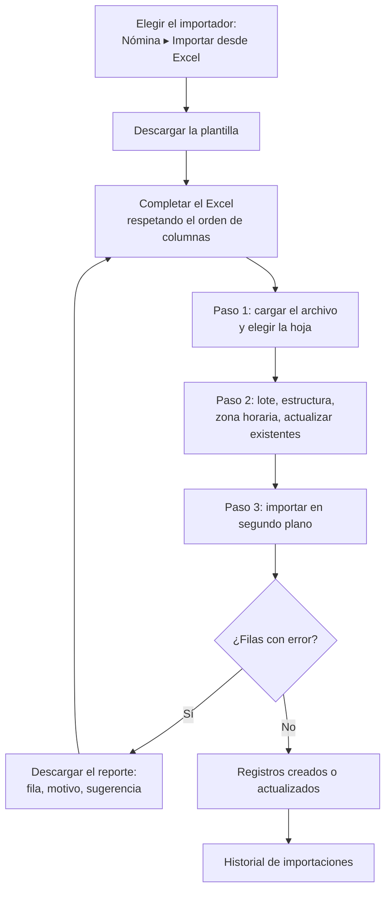

# Guía funcional — Planillas Perú: importadores Excel

> Módulo técnico `al_hr_pe_import` · versión `9.20261008` · área `OL-PAYROLL`.
> Para consultores funcionales: qué resuelve, la norma que lo respalda y el
> proceso completo con un ejemplo que cuadra. Enlaces verificados el
> 10/10/2026 con `docs/validacion/verificar_enlaces.py`.

## 1. Para qué sirve

Cada mes llegan comisiones, bonos, adelantos o préstamos en hojas de cálculo,
y al arrancar con el sistema hay que cargar los datos laborales y los saldos
de vacaciones de toda la planilla. Este módulo ofrece **seis importadores de
planilla** con el mismo asistente de tres pasos (cargar, configurar, ver el
resultado):

| Importador | Qué carga |
|---|---|
| Inputs de boletas (novedades) | Comisiones, bonos, adelantos, préstamos… en las boletas del lote |
| Datos PE de versiones | Régimen, AFP/ONP, CUSPP, seguro social, catálogos del T-Registro |
| Récord vacacional (saldos) | Saldo inicial de vacaciones en días y soles |
| Adelantos | Adelantos con su tipo y fecha de descuento |
| Asistencias | Marcaciones de entrada y salida (relojes, biométricos) |
| Reglas salariales | Reglas exportadas de la versión 18, adaptadas a Odoo 19 |

Cada fila se valida contra la localización y el resultado se entrega en un
Excel con el número de fila, el motivo y una sugerencia de corrección.

Lo usa el responsable de planillas en la puesta en marcha y cada cierre.

**Fuera del alcance**: importar préstamos con cronograma (se registran en
`al_hr_pe_benefits`), importar sobre boletas validadas y la carga de maestros
contables o de productos (se usa el importador estándar de Odoo).

## 2. Marco normativo y conceptual

- Los datos que se importan son los mismos que exige la **Planilla
  Electrónica** (T-Registro y PLAME): catálogos SUNAT del trabajador y
  conceptos de la boleta con su código de la tabla 22.
  [SUNAT — Planilla Electrónica](https://orientacion.sunat.gob.pe/informacion-general-planilla-electronica) ·
  [SUNAT — PDT PLAME](https://orientacion.sunat.gob.pe/pdt-plame).
- **Registro de control de asistencia** (D.S. 004-2006-TR): las marcaciones
  importadas forman parte de ese registro y deben conservar hora y fecha
  reales. [El Peruano — registro de asistencia](https://elperuano.pe/noticia/292443).
- **Redondeo**: los importes se redondean a dos decimales «medio hacia
  arriba» (180,255 → 180,26), como en la planilla.
- Importación genérica de Odoo 19: [Exportar e importar datos](https://www.odoo.com/documentation/19.0/applications/essentials/export_import_data.html).

| Término | Significado | Dónde aparece en Odoo |
|---|---|---|
| Plantilla | Excel con las columnas exactas y una fila de ejemplo | Botón del asistente |
| Proceso por lotes | Se confirma cada 100 filas (configurable) | Paso Configurar |
| Actualizar existentes | Vuelve a escribir las filas ya importadas | Paso Configurar |
| Zona horaria del archivo | Huso de las horas de las marcaciones | Importador de asistencias |
| Historial | Registro de cada importación con su reporte | Nómina ▸ Importar desde Excel ▸ Historial de importaciones |

## 3. Proceso de inicio a fin

| # | Paso | Dónde en Odoo | Quién | Resultado |
|---|---|---|---|---|
| 1 | Abrir el importador | Nómina ▸ Importar desde Excel (o el botón en las listas de Asistencias y Reglas) | Planillas | Asistente |
| 2 | Descargar la plantilla | Asistente ▸ Descargar plantilla | Planillas | Excel con columnas y ejemplo |
| 3 | Cargar el archivo | Paso 1 | Planillas | Hoja propuesta |
| 4 | Configurar | Paso 2 | Planillas | Lote, estructura, opciones |
| 5 | Importar | Paso 3 | Planillas | Progreso en vivo |
| 6 | Corregir y reintentar | Reporte de errores | Planillas | Solo las filas que fallaron |

**Caminos alternativos**: se puede cerrar la ventana durante la importación
(el resultado queda en el historial); con **Actualizar existentes** las filas
ya cargadas se actualizan, sin él se omiten; el récord vacacional reemplaza el
saldo inicial en lugar de sumarlo.

## 4. Ejemplo completo

**Novedades de agosto de 2026** sobre el lote «DEMO FICHA HR1 Novedades
agosto 2026»:

| Fila | N.º documento | Código de input | Monto |
|---|---|---|---:|
| 2 | 72418305 | COMI | 350 |
| 3 | 70935214 | ADELANTO | 400 |
| 4 | 75102846 | BONI_EX | 500 |
| 5 | 75102846 | PREST | 180,255 |
| 6 | 70935214 | HEX25 | 150,50 |
| 7 | 40000001 | COMI | 120 |

Resultado:

| Fila | Estado | Detalle | Sugerencia |
|---|---|---|---|
| 2 | CREADO | COMI = 350,00 en la boleta de Salazar | — |
| 3 | CREADO | ADELANTO = 400,00 en la boleta de Huamán | — |
| 4 | CREADO | BONI_EX = 500,00 en la boleta de Rivas | — |
| 5 | CREADO | PREST = 180,26 en la boleta de Rivas (redondeo de 180,255) | — |
| 6 | ERROR | No existe el tipo de input «HEX25» | Revisar el código en Nómina ▸ Configuración ▸ Tipos de entrada de boleta |
| 7 | ERROR | No hay boleta en el lote para el documento 40000001 | Verificar la boleta y el documento de la versión vigente |

Importado: 350,00 + 400,00 + 500,00 + 180,26 = **S/ 1 430,26** en cuatro
entradas; las dos filas con error se corrigen y se vuelven a subir solas.

**Otros importadores**: la carga de versiones actualiza 8 y 6 campos de dos
trabajadoras y rechaza el régimen «CAS» (valores aceptados: general, small,
micro, practicante, construccion); el récord vacacional crea un saldo de 12,5
días / S/ 1 166,67 y rechaza la fecha escrita como texto «01/01/2026» (debe ser
fecha de Excel o ISO 2026-01-01); en asistencias, la entrada de las 14:00 en
Lima se guarda como 19:00 UTC.

**Asientos**: este módulo no genera asientos; los importes cargados en las
boletas se contabilizan con el asiento de planilla (`al_hr_pe_account`).

## 5. Configuración inicial

1. Instalar el módulo (requiere la biblioteca Python `openpyxl` en el servidor).
2. Verificar que los trabajadores tengan su **número de documento** en la versión vigente.
3. Para novedades: crear el lote del mes y permitir los códigos de input en la estructura salarial.
4. Para adelantos: crear los **tipos de adelanto** de la compañía con el nombre que usará el Excel.
5. Partir siempre de la **plantilla descargada** (las columnas se leen por posición).

## 6. Reportes y libros relacionados

- **Reporte de importación** (Excel) con el estado de cada fila.
- **Historial de importaciones** con archivo, fecha, usuario y totales.
- Lo importado alimenta la boleta, la PLAME y el asiento de planilla.

## 7. Casos especiales y errores frecuentes

| Situación | Qué pasa | Qué hacer |
|---|---|---|
| Input no permitido en la estructura | Fila rechazada | Añadir el input a la estructura salarial |
| Boleta validada | No se importa | Solo boletas en borrador o por verificar |
| Fecha escrita como texto | Fila rechazada | Usar fecha de Excel o formato ISO |
| Columnas en otro orden | Datos en campos equivocados | Usar la plantilla del asistente |
| Trabajador de otra compañía | El servidor lo rechaza | Cambiar la compañía activa antes de abrir el asistente |
| Archivo `.xls` antiguo | No se lee | Guardarlo como `.xlsx` o `.xlsm` |

## 8. Preguntas frecuentes del consultor

- **¿Puedo importar para otra compañía?** Sí: cambie la compañía activa antes de abrir el asistente.
- **¿Qué pasa si subo dos veces el mismo archivo?** Con «Actualizar existentes» se actualiza; sin él, se omite.
- **¿Puedo cerrar la ventana?** Sí: el proceso sigue y el resultado queda en el historial.
- **¿Cómo localiza al trabajador?** Por su número de documento, como en los reportes de bancos y biométricos.
- **¿Las reglas de la versión 18 sirven?** Sí: el importador adapta el código (contrato → versión) y anota cada cambio.

## 9. Referencias

Verificadas el 10/10/2026:

- SUNAT — Planilla Electrónica: https://orientacion.sunat.gob.pe/informacion-general-planilla-electronica
- SUNAT — PDT PLAME: https://orientacion.sunat.gob.pe/pdt-plame
- El Peruano — Registro de control de asistencia: https://elperuano.pe/noticia/292443
- Odoo 19 — Exportar e importar datos: https://www.odoo.com/documentation/19.0/applications/essentials/export_import_data.html
