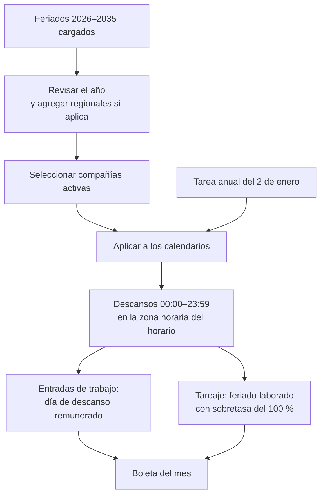

# Guía funcional — Feriados del Perú

> Módulo técnico `al_hr_pe_public_holidays` · versión `10.20261008` · área `OL-PAYROLL`.
> Para consultores funcionales: qué resuelve, la norma que lo respalda y el
> proceso completo con un ejemplo que cuadra. Enlaces verificados el
> 10/10/2026 con `docs/validacion/verificar_enlaces.py`.

## 1. Para qué sirve

Si los feriados no están en el horario de trabajo, Odoo los trata como días
laborables: las ausencias descuentan días que no correspondían, la planilla no
reconoce el descanso remunerado y el tareaje no detecta el feriado trabajado.
Este módulo:

- trae **160 feriados nacionales de 2026 a 2035** (16 por año, incluida la
  Semana Santa de fecha móvil);
- los **aplica como descansos** en los horarios de trabajo de las compañías
  activas, en la zona horaria de cada horario;
- asigna a cada feriado el **tipo de entrada de trabajo** con el que la nómina
  lo paga (días de descanso, por defecto);
- admite **medio día** y se **renueva cada año** con una tarea programada.

Lo usan RR. HH. y el responsable de planillas.

**Fuera del alcance**: los días no laborables que decreta el Gobierno para el
sector público (se pueden registrar a mano como feriado si la empresa los
adopta) y los feriados regionales o locales (también se agregan a mano).

## 2. Marco normativo y conceptual

- **Feriados y descansos remunerados** (D. Leg. 713 y modificatorias): los
  feriados nacionales son días de descanso remunerado; si se trabajan sin
  descanso sustitutorio, se pagan con una sobretasa del 100 %.
  [D. Leg. 713 — normas legales actualizadas, El Peruano](https://diariooficial.elperuano.pe/Normas/obtenerDocumento?idNorma=42).
- **Calendario oficial**: [Feriados 2026 — gob.pe](https://www.gob.pe/feriados).
- En Odoo 19 los descansos globales del horario de trabajo son los «días
  festivos» que leen Vacaciones y las entradas de trabajo.
  [Odoo 19 — Vacaciones](https://www.odoo.com/documentation/19.0/applications/hr/time_off.html).

| Término | Significado | Dónde aparece en Odoo |
|---|---|---|
| Feriado | Fecha y nombre del feriado nacional | Vacaciones ▸ Feriados de Perú ▸ Feriados |
| Descanso global | Bloqueo del horario de trabajo ese día | Horario de trabajo ▸ descansos |
| Tipo de entrada de trabajo | Concepto con que la nómina paga el feriado | Ficha del feriado |
| Medio día | Descanso desde las 00:00 hasta la hora indicada | Ficha del feriado |

## 3. Proceso de inicio a fin

| # | Paso | Dónde en Odoo | Quién | Resultado |
|---|---|---|---|---|
| 1 | Revisar los feriados | Vacaciones ▸ Feriados de Perú ▸ Feriados | RR. HH. | Lista del año, filtrable |
| 2 | Agregar uno propio o de medio día | Feriados ▸ Nuevo | RR. HH. | Feriado adicional |
| 3 | Aplicar | Seleccionar ▸ Aplicar a los calendarios | RR. HH. | Descansos en los horarios |
| 4 | Revisar descansos | Feriado ▸ botón Calendarios | RR. HH. | Un descanso por horario |
| 5 | Planilla | Nómina ▸ Entradas de trabajo | Planillas | Feriado como día de descanso |
| 6 | Renovación | Tarea programada «Feriados de Perú: aplicación anual» | Automático | Año en curso y siguiente |

**Caminos alternativos**: aplicar dos veces actualiza, no duplica; si se
elimina un feriado, se eliminan sus descansos; si cambia la zona horaria de un
horario, se vuelve a aplicar y el descanso se recalcula.

## 4. Ejemplo completo

**Julio de 2026**: feriados el jueves 23 (Día de la Fuerza Aérea del Perú), el
martes 28 (Día de la Independencia) y el miércoles 29 (Día de la Gran Parada
Militar). Aplicados al horario de Lima (UTC−5):

| Feriado | Configuración | Inicio en Lima | Fin en Lima | Guardado en UTC |
|---|---|---|---|---|
| Batalla de Junín (06/08) | Día completo | 06/08 00:00 | 06/08 23:59 | 06/08 05:00 → 07/08 04:59 |
| Feriado de medio día | Medio día, hora 13:00 | 00:00 | 13:00 | 05:00 → 18:00 |

En las **entradas de trabajo de julio** los días 23, 28 y 29 aparecen como días
de descanso para los trabajadores; la **boleta de julio** los cuenta como 3
días de descanso remunerado (24 horas), sin descuento.

Un trabajador con sueldo mensual de **S/ 3 000** cobra en julio sus S/ 3 000
completos (el feriado no laborado está remunerado dentro del sueldo mensual).
Si trabaja el 28 de julio sin descanso sustitutorio, el tareaje lo clasifica
como **feriado laborado** y la boleta paga además ese día con la sobretasa del
100 % según la regla configurada (valor día = 3 000 ÷ 30 = 100,00).

**Asientos**: este módulo no genera asientos; el feriado solo cambia los días
y horas que calcula la boleta.

**Semana Santa calculada**: 2026 jueves 02/04 y viernes 03/04; 2027 25/03 y
26/03; 2028 13/04 y 14/04; 2030 18/04 y 19/04; 2035 22/03 y 23/03.

## 5. Configuración inicial

1. Instalar el módulo (requiere Vacaciones y Entradas de trabajo).
2. Revisar que cada **horario de trabajo** tenga la zona horaria correcta (America/Lima).
3. Elegir en el selector las compañías cuyos horarios se quieren afectar.
4. Seleccionar los feriados y pulsar **Aplicar a los calendarios**.
5. Con la planilla peruana, comprobar que el tipo de entrada de trabajo sea el de días de descanso.

## 6. Reportes y libros relacionados

- **Días festivos** en Vacaciones y en el calendario de cada horario.
- **Entradas de trabajo** y **días trabajados** de la boleta.
- **Tareaje** (`al_hr_pe_attendance`): reconoce el feriado laborado solo si está como descanso en el horario.

## 7. Casos especiales y errores frecuentes

| Situación | Qué pasa | Qué hacer |
|---|---|---|
| El feriado se corre un día | Zona horaria del horario incorrecta | Corregir la zona y volver a aplicar |
| Un feriado laborado se pagó como día normal | El feriado no estaba aplicado al horario | Aplicar y reprocesar el tareaje |
| Compañía creada después de instalar | No tiene descansos | La tarea anual las recorre todas; o aplicar a mano |
| Feriado regional o día no laborable adoptado | No viene cargado | Crearlo como feriado y aplicarlo |
| Horarios de otra compañía | No se tocan | Activar esa compañía y aplicar |

## 8. Preguntas frecuentes del consultor

- **¿Aplicar dos veces duplica?** No: actualiza el descanso existente.
- **¿Tengo que cargar el año nuevo?** No: la tarea del 2 de enero aplica el año en curso y el siguiente.
- **¿Funciona sin la planilla peruana?** Sí: sirve a Vacaciones; con `al_hr_pe` toma por defecto el concepto de días de descanso.
- **¿Se pueden registrar medios días?** Sí, con la hora de fin del descanso (13:00 por defecto).

## 9. Referencias

Verificadas el 10/10/2026:

- Feriados 2026 — gob.pe: https://www.gob.pe/feriados
- D. Leg. 713, descansos remunerados — normas legales actualizadas, El Peruano: https://diariooficial.elperuano.pe/Normas/obtenerDocumento?idNorma=42
- Odoo 19 — Vacaciones: https://www.odoo.com/documentation/19.0/applications/hr/time_off.html
