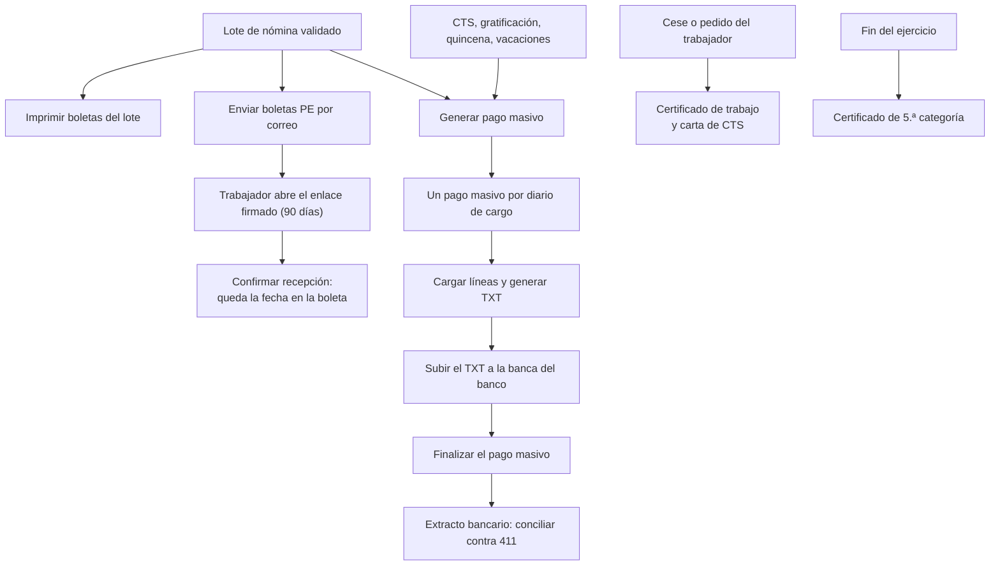

# Guía funcional — Planillas Perú: documentos y bancos

> Módulo técnico `al_hr_pe_reports` · versión `21.20261009` · área `OL-PAYROLL`.
> Para consultores funcionales: qué resuelve, la norma que lo respalda y el
> proceso completo con un ejemplo que cuadra. Enlaces verificados el
> 10/10/2026 con `docs/validacion/verificar_enlaces.py`.

## 1. Para qué sirve

Cerrada la planilla, hay que entregar la boleta a cada trabajador y poder
probar que la recibió. Hay que pagar en el banco con un archivo de ancho fijo
propio de cada entidad y emitir los certificados y contratos de cada caso.
Este módulo genera todo eso desde Nómina:

- **Boleta de pago legal**: la sacan el Imprimir nativo, el lote, el adjunto
  y el correo, y siempre es la misma.
- **Envío por correo con confirmación de recepción**: enlace firmado que vale
  90 días y, si se activa, PDF cifrado con el número de documento.
- **Certificado de trabajo**, **carta de retiro de CTS** y **certificado de
  rentas y retenciones de 5.ª categoría**, para uno o varios trabajadores.
- **Contratos desde plantilla** con marcadores `{{…}}` y periodo de prueba.
- **TXT de pago masivo** de haberes y CTS para BCP, BBVA, Interbank,
  Scotiabank y BanBif.

Lo usan el responsable de planillas, RR. HH. y tesorería.

**Fuera del alcance**:

- **La boleta electrónica firmada digitalmente con un proveedor externo**: el
  envío por correo con confirmación es la constancia que ofrece el módulo.
- **El asiento del pago**: el TXT no contabiliza. El pago se registra con el
  extracto bancario contra la cuenta 411 que deja el asiento de planilla
  (`al_hr_pe_account`).
- **El reporte de rentas y retenciones que el trabajador descarga de SUNAT
  Operaciones en Línea**.

## 2. Marco normativo y conceptual

- **Boleta de pago** (D.S. N.° 001-98-TR, arts. 18 y 19):
  - Contenido mínimo: datos del empleador y del trabajador, periodo, ingresos,
    descuentos y aportes del empleador.
  - Plazo de entrega: hasta el tercer día hábil siguiente al pago.
  - Con el D. Leg. 1310, puede entregarse por medios electrónicos si el
    empleador prueba el envío.
- **Códigos de concepto**: los de la tabla 22 de la PLAME.
  [SUNAT — PDT PLAME](https://orientacion.sunat.gob.pe/pdt-plame).
- **Certificado de rentas y retenciones de 5.ª categoría** (art. 45 del
  Reglamento de la LIR):
  - El formato es el de la R.S. 010-2006/SUNAT.
  - Hoy el trabajador acredita sus rentas ante un nuevo empleador con el
    reporte de SUNAT (R.S. 350-2017/SUNAT).
  - [R.S. 010-2006/SUNAT](https://www.sunat.gob.pe/legislacion/superin/2006/010.htm) ·
    [SUNAT — preguntas frecuentes de 5.ª categoría](https://orientacion.sunat.gob.pe/node/27) ·
    [SUNAT — cálculo del impuesto](https://orientacion.sunat.gob.pe/3071-02-calculo-del-impuesto).
- **CTS** (D. Leg. 650): la carta autoriza al banco depositario a liberar el
  saldo al cese.
  [D. Leg. 650 — normas legales actualizadas, El Peruano](https://diariooficial.elperuano.pe/Normas/obtenerDocumento?idNorma=37).
- **Periodo de prueba** (art. 10 del TUO del D. Leg. 728): 3 meses en general,
  hasta 6 para trabajadores calificados o de confianza y hasta 12 para personal
  de dirección.
  [TUO D. Leg. 728 — normas legales actualizadas, El Peruano](https://diariooficial.elperuano.pe/Normas/obtenerDocumento?idNorma=35).

| Término | Significado | Dónde aparece en Odoo |
|---|---|---|
| Boleta PE | Reporte de la estructura salarial, el único que imprime el botón | Recibo de nómina ▸ Imprimir |
| Recepción confirmada | El trabajador pulsó «Confirmar recepción» en la página del enlace | Recibo ▸ campo y fecha de confirmación |
| Pago masivo | Documento con las líneas y el TXT de un banco | Nómina ▸ Pagos masivos bancarios |
| Diario de pago masivo | Cuenta de cargo; su banco define el formato TXT | Ajustes ▸ Nómina ▸ Perú |
| Regla de neto a pagar | Regla de donde sale el importe de cada abono | Configuración principal |

## 3. Proceso de inicio a fin

| # | Paso | Dónde en Odoo | Quién | Resultado |
|---|---|---|---|---|
| 1 | Configurar firma, cifrado y diarios | Ajustes ▸ Nómina ▸ Perú | Planillas | Parámetros por compañía |
| 2 | Imprimir la boleta | Recibos de nómina ▸ Imprimir (o ⋮ del lote) | Planillas | PDF legal |
| 3 | Enviar por correo | Recibo ▸ Enviar boleta, o Acciones ▸ Enviar boletas PE por correo | Planillas | Correo con PDF y enlace |
| 4 | Confirmar la recepción | Correo ▸ Confirmar recepción | Trabajador | Fecha de confirmación |
| 5 | Generar el pago masivo | Lote, quincena, CTS, gratificación o vacaciones ▸ Generar pago masivo | Tesorería | Un documento por diario |
| 6 | Generar el TXT | Pago masivo ▸ Generar TXT | Tesorería | Archivo adjunto |
| 7 | Finalizar | Pago masivo ▸ Finalizar | Tesorería | Datos de solo lectura |
| 8 | Certificados y carta de CTS | Empleados ▸ Acción | RR. HH. | PDF, uno por página |
| 9 | Contrato | Ficha ▸ Planilla PE ▸ Contrato de trabajo ▸ Imprimir contrato | RR. HH. | Contrato rellenado |

**Caminos alternativos**:

- Generar de nuevo el TXT reemplaza el anterior.
- Las boletas sin correo laboral o no validadas se omiten y se listan en el
  aviso final.
- Un pago masivo finalizado vuelve a borrador para corregirlo.
- Una estructura salarial con boleta propia (construcción civil) se imprime
  con su reporte.

## 4. Ejemplo completo

**Boleta de junio de 2026**: trabajadora en AFP con comisión sobre el flujo,
sueldo de S/ 2 500,00 y asignación familiar.

| Bloque | Código | Concepto | Importe |
|---|---|---|---:|
| Ingresos | 0121 | Remuneración básica | 2 500,00 |
| Ingresos | 0201 | Asignación familiar | 113,00 |
| **Total ingresos** | | | **2 613,00** |
| Descuentos | 0608 | Aporte obligatorio AFP (10 %) | 261,30 |
| Descuentos | 0601 | Comisión AFP (1,55 %) | 40,50 |
| Descuentos | 0606 | Prima de seguros (1,70 %) | 44,42 |
| **Total descuentos** | | | **346,22** |
| **Neto a pagar** | | dos mil doscientos sesenta y seis con 78/100 soles | **2 266,78** |
| Aportes del empleador | 0804 | EsSalud (9 % de 2 613,00) | 235,17 |

Comprobación: 2 613,00 − 346,22 = 2 266,78. La boleta muestra además
24,5 días laborados y 196:00 horas ordinarias.

**Pago masivo** PM-000007: planilla de abril de 2026 en formato BCP, con 10
abonos por **S/ 31 459,37**. El TXT no genera asiento. Al llegar el extracto,
la conciliación deja este movimiento:

| Cuenta | Debe | Haber |
|---|---:|---:|
| 4111000 Remuneraciones por pagar | 31 459,37 | |
| 1041 Cuenta corriente (banco de cargo) | | 31 459,37 |
| **Total** | **31 459,37** | **31 459,37** |

**Certificado de 5.ª categoría del ejercicio 2026** (UIT 2026 = S/ 5 500).
Corresponde a un trabajador con S/ 6 000 al mes y dos gratificaciones de
S/ 6 540 (incluida la bonificación extraordinaria):

| Concepto | Importe |
|---|---:|
| Renta bruta: 6 000 × 12 + 6 540 × 2 | 85 080,00 |
| Deducción de 7 UIT | −38 500,00 |
| Renta neta imponible | 46 580,00 |
| Impuesto: 8 % × 27 500 + 14 % × 19 080 | 4 871,20 |
| Retenciones del año (ene–abr 405,93; may–jul 405,94; ago–nov 405,93; dic 405,94) | 4 871,20 |
| Saldo por regularizar | 0,00 |

**Contrato desde plantilla**:

- El marcador `S/ {{salario}} ({{salario_letras}} {{moneda}})` se imprime como
  «S/ 2800.00 (DOS MIL OCHOCIENTOS CON 00/100 Soles)».
- Con ingreso el 01/03/2025 y prueba de 3 meses, el periodo de prueba termina
  el 01/06/2025.

## 5. Configuración inicial

1. En **Ajustes ▸ Nómina ▸ Perú**, con cada compañía activa, configure:
   - el representante que firma y su firma;
   - el cifrado de la boleta enviada;
   - los diarios de pago masivo. El banco de la cuenta del diario debe tener
     su formato TXT.
2. En **Configuración principal** (botón «Abrir configuración principal»),
   indique las categorías de la boleta y la **regla de neto a pagar** (y la de
   neto quincenal).
3. En **Contactos ▸ Configuración ▸ Cuentas bancarias**, registre el tipo de
   cuenta y, en el banco, su formato y sus datos propios:
   - BCP: subtipo e IDC;
   - BBVA: tipo y hora de proceso;
   - Interbank: códigos de empresa y servicio;
   - Scotiabank: forma y tipo de cargo;
   - BanBif: subtipo.
4. En cada trabajador, registre sus cuentas de haberes y de CTS y su correo
   laboral.
5. En **Nómina ▸ Configuración ▸ Perú ▸ Documentos ▸ Plantillas de contrato**,
   cree o revise las plantillas y asígnelas en la ficha del trabajador.
6. Configure el servidor de correo saliente de Odoo para el envío de boletas.

## 6. Reportes y libros relacionados

- **Boleta de pago** (PDF) por recibo o por lote.
- **TXT bancario** de haberes y CTS, guardado como adjunto del pago masivo.
- **Certificado de trabajo**, **carta de retiro de CTS** y **certificado de
  5.ª categoría**.
- **Contrato de trabajo** impreso desde la plantilla.
- Lista de boletas con la columna **Recepción confirmada**.

## 7. Casos especiales y errores frecuentes

| Situación | Qué pasa | Qué hacer |
|---|---|---|
| Trabajador sin correo laboral | Su boleta no se envía y aparece en el aviso final | Registrar el correo y reenviar |
| Enlace de confirmación vencido (más de 90 días) | La página no confirma | Reenviar la boleta: el enlace se renueva |
| Pago masivo con importes en cero | No está configurada la regla de neto | Indicarla en Configuración principal |
| Lote abierto o boletas en borrador | No se genera el TXT | Validar el lote primero |
| Cuenta del trabajador en otra moneda que la de cargo | Queda fuera del archivo | Registrar una cuenta en la moneda del diario |
| Banco sin diario de pago masivo | Se lista en el aviso tras generar | Agregar el diario en Ajustes |
| Neto negativo (adelanto o préstamo mayor que el ingreso) | La boleta se imprime y se envía | Revisar el saldo con el trabajador |
| Falta la UIT del ejercicio | El certificado de 5.ª avisa antes de imprimir | Registrar la UIT en el catálogo |
| Marcador desconocido en la plantilla | Queda sin sustituir y se anota en el registro del servidor | Corregir el nombre del marcador |

## 8. Preguntas frecuentes del consultor

- **¿Por qué no hay un botón «Boleta PE» aparte?** El Imprimir nativo ya
  saca la boleta peruana. Así el PDF impreso, el adjunto y el enviado por
  correo son el mismo documento.
- **¿La confirmación prueba la entrega?** Deja la fecha en que el trabajador
  pulsó el botón de la página. El enlace va firmado con HMAC, así que nadie
  puede confirmar una boleta ajena.
- **¿El certificado de 5.ª copia la retención?** No. Calcula el impuesto con
  la escala progresiva sobre la renta imponible y muestra la diferencia con
  lo retenido, incluso con otros empleadores.
- **¿Puedo pagar la CTS en dólares?** Sí, si la cuenta de cargo y la cuenta
  CTS del trabajador están en dólares.
- **¿Funciona con varias compañías?** Sí. Cada compañía tiene su propia
  configuración, y los asistentes rechazan trabajadores de otra compañía.

## 9. Referencias

Verificadas el 10/10/2026:

- SUNAT — PDT PLAME: https://orientacion.sunat.gob.pe/pdt-plame
- R.S. 010-2006/SUNAT, certificados de rentas y retenciones: https://www.sunat.gob.pe/legislacion/superin/2006/010.htm
- SUNAT — preguntas frecuentes de rentas de 5.ª categoría: https://orientacion.sunat.gob.pe/node/27
- SUNAT — cálculo del impuesto de 5.ª categoría: https://orientacion.sunat.gob.pe/3071-02-calculo-del-impuesto
- D. Leg. 650, CTS — normas legales actualizadas, El Peruano: https://diariooficial.elperuano.pe/Normas/obtenerDocumento?idNorma=37
- TUO del D. Leg. 728 — normas legales actualizadas, El Peruano: https://diariooficial.elperuano.pe/Normas/obtenerDocumento?idNorma=35
