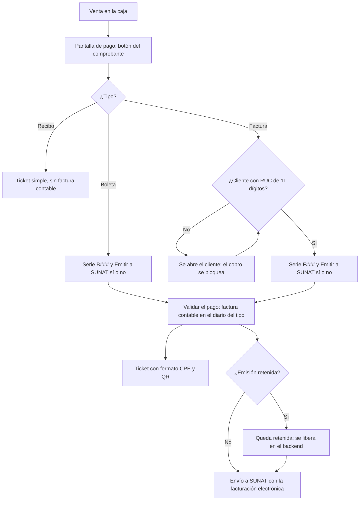

# Guía funcional — Boleta y factura electrónica en el TPV

> Módulo técnico `al_l10n_pe_edi_pos` · versión `12.20261008` · área `OL-POS`.
> Para consultores funcionales: qué resuelve, la norma que lo respalda y el
> proceso completo con un ejemplo que cuadra. Enlaces verificados el
> 10/10/2026 con `docs/validacion/verificar_enlaces.py`.

## 1. Para qué sirve

En Perú cada venta de la caja se respalda con un **comprobante de pago**:
**boleta de venta** para el consumidor final y **factura** cuando el cliente
tiene RUC, cada una con su serie (B### o F###) y numeración. El punto de venta
estándar solo ofrece un interruptor de «factura» y un único diario. Con este
módulo:

- el cajero elige **Recibo**, **Boleta electrónica** (por defecto) o **Factura
  electrónica** y su **serie** en un solo diálogo de la pantalla de pago;
- cada tipo se registra en su **diario** (boletas o facturas) y se envía a SUNAT
  con la facturación electrónica de Odoo;
- el ticket sale con el **formato del comprobante** (RUC, tipo y número,
  desglose tributario, importe en letras y QR);
- se puede **retener la emisión** a SUNAT y liberarla después desde el backend.

Lo usan cajeros, supervisores de tienda y contabilidad.

**Fuera del alcance:** notas de crédito desde la caja (se emiten en
Contabilidad), resúmenes diarios de boletas fuera de lo que hace la
localización nativa, y la impresión física (ver `al_pos_network_printer`).

## 2. Marco normativo y conceptual

- **Reglamento de Comprobantes de Pago (R.S. 007-99/SUNAT)**: boleta y
  factura, cuándo exigir RUC, requisitos:
  <https://www.sunat.gob.pe/legislacion/superin/1999/007.pdf>.
- **R.S. 340-2017/SUNAT**: código QR obligatorio en la representación impresa:
  <https://www.sunat.gob.pe/legislacion/superin/2017/340-2017.pdf>.
- **Anexo I de la R.S. 117-2017/SUNAT** (requisitos del comprobante
  electrónico): <https://www.sunat.gob.pe/legislacion/superin/2017/anexoI-117-2017.pdf>.
- Comunicados de SUNAT sobre factura electrónica:
  <https://orientacion.sunat.gob.pe/node/754>.
- Punto de venta en Odoo 19:
  <https://www.odoo.com/documentation/19.0/es/applications/sales/point_of_sale.html>.

| Término | Significado | Dónde aparece |
|---|---|---|
| Recibo | Ticket interno sin comprobante electrónico ni factura contable | Diálogo **Comprobante** |
| Boleta electrónica | Comprobante para consumidor final (DNI opcional), serie B### | Diálogo y ticket |
| Factura electrónica | Comprobante para cliente con RUC de 11 dígitos, serie F### | Diálogo y ticket |
| Serie fija | Serie que la caja aplica sola en cada venta (estrella) | Diálogo, por caja y tipo |
| Emisión SUNAT retenida | El comprobante se genera pero no se envía hasta liberarlo | Factura ▸ Otra información |

## 3. Proceso de inicio a fin

| # | Paso | Dónde en Odoo | Quién | Resultado |
|---|---|---|---|---|
| 1 | Configurar diarios del TPV | Punto de venta ▸ Configuración ▸ Ajustes ▸ Comprobantes electrónicos (Perú) | Administrador | Diario de boletas y de facturas por caja |
| 2 | Abrir la caja y vender | TPV ▸ Registrar | Cajero | Orden con productos |
| 3 | Elegir comprobante y serie | TPV ▸ Pago ▸ botón del comprobante | Cajero | Tipo, serie (estrella para fijarla) y emisión |
| 4 | Validar | TPV ▸ **Validar** | Cajero | Factura contable publicada en el diario del tipo y ticket CPE |
| 5 | Revisar la orden | Punto de venta ▸ Órdenes ▸ Órdenes | Supervisor | **Tipo de comprobante (PE)**, **Serie CPE** y **Emitir a SUNAT** |
| 6 | Liberar una retenida | Contabilidad ▸ Clientes ▸ Facturas ▸ Otra información ▸ desmarcar **Emisión SUNAT retenida** | Contabilidad | La envía el proceso automático o **Procesar ahora** |
| 7 | Cerrar la sesión | TPV ▸ Cerrar | Cajero | Asientos de la sesión (pagos y diferencias de caja) |

## 4. Ejemplo completo

Caja «DEMO TPV Vendedores», venta de gaseosas, una bolsa plástica y un libro
exonerado, con **boleta B002-00000004** por S/ 34,00:

| Fila del ticket | Importe |
|---|---|
| Op. gravadas | 7,20 |
| Op. exoneradas | 25,00 |
| ICBPER | 0,50 |
| IGV 18 % (7,20 × 0,18 = 1,296) | 1,30 |
| **Total** | **34,00** |

QR de la boleta (nueve datos separados por `|`: RUC, tipo, serie, número, IGV,
total, fecha, tipo y número de documento del cliente):
`20512528458|03|B002|00000004|1.30|34.00|2026-09-14|1|00000000`.

Asiento de la boleta (diario de boletas):

| Cuenta | Descripción | Debe | Haber |
|---|---|---|---|
| 1212 | Facturas, boletas y otros comprobantes por cobrar | 34,00 | |
| 70121 | Mercaderías – venta local (7,20 + 25,00) | | 32,20 |
| 40111 | IGV – cuenta propia | | 1,30 |
| 40189 | Otros impuestos (ICBPER, según su impuesto) | | 0,50 |
| | **Totales** | **34,00** | **34,00** |

Cobro en efectivo (el TPV lo concilia contra la boleta):

| Cuenta | Descripción | Debe | Haber |
|---|---|---|---|
| 101 | Caja | 34,00 | |
| 1212 | Facturas, boletas y otros comprobantes por cobrar | | 34,00 |
| | **Totales** | **34,00** | **34,00** |

Qué ocurre según lo elegido:

| Elección | ¿Factura contable? | Diario | Requisito | Ticket |
|---|---|---|---|---|
| Recibo | No | — | — | Recibo estándar |
| Boleta electrónica | Sí | Diario de boletas | Ninguno (DNI opcional) | BOLETA DE VENTA ELECTRÓNICA |
| Factura electrónica | Sí | Diario de facturas | Cliente con RUC de 11 dígitos | FACTURA ELECTRÓNICA |

## 5. Configuración inicial

1. Diarios de venta de **boletas** y de **facturas** con sus series CPE
   publicadas (la numeración por serie la puede llevar
   `al_account_move_name_sequence`).
2. **Punto de venta ▸ Configuración ▸ Ajustes**, sección Contabilidad,
   **Comprobantes electrónicos (Perú)**: diario de boletas y de facturas de cada
   TPV. Con los dos configurados se activa el flujo.
3. Compañía peruana con la facturación electrónica configurada (certificado y
   operador).
4. En la primera venta de cada caja, fijar la serie con la estrella.

## 6. Reportes y libros relacionados

- Órdenes del TPV con tipo, serie y marca de emisión.
- Las boletas y facturas van al **Registro de Ventas** (RVIE/PLE) como cualquier
  comprobante.
- El kardex SUNAT (`ol_stock_kardex_pe`) vincula las salidas del TPV con su
  boleta o factura.

## 7. Casos especiales y errores frecuentes

| Situación | Qué pasa | Qué hacer |
|---|---|---|
| No aparece el botón del comprobante | Faltan los dos diarios o la compañía no es peruana | Configurar los diarios del TPV |
| No se puede confirmar el diálogo | El diario tiene series y no se eligió ninguna | Elegir la serie o fijarla con la estrella |
| Factura sin RUC | Aviso **Factura electrónica** y el cobro no procede | Completar el RUC del cliente |
| Venta sin conexión | El TPV guarda la orden y la sincroniza al volver la conexión | Revisar luego que la factura se haya enviado |
| Facturar varias órdenes juntas al cierre | Se usa el diario estándar del TPV (pueden mezclar tipos) | Preferir la facturación por orden |
| Boleta retenida | No la envía ni el proceso automático ni **Procesar ahora** | Desmarcar **Emisión SUNAT retenida** |

## 8. Preguntas frecuentes del consultor

- **¿La serie fija se comparte entre cajas?** No: se guarda por caja y por tipo
  en el navegador de esa caja.
- **¿El QR espera a SUNAT?** No: está disponible en cuanto la factura se publica.
- **¿Puedo seguir emitiendo recibos sin comprobante?** Sí, con **Recibo**;
  evalúe con el cliente si corresponde según su régimen.
- **¿Cómo anulo una boleta?** Con una nota de crédito en Contabilidad (o
  comunicación de baja según el caso), como cualquier comprobante.

## 9. Referencias

Enlaces verificados el 10/10/2026:

- Reglamento de Comprobantes de Pago:
  <https://www.sunat.gob.pe/legislacion/superin/1999/007.pdf>
- R.S. 340-2017/SUNAT: <https://www.sunat.gob.pe/legislacion/superin/2017/340-2017.pdf>
- Anexo I de la R.S. 117-2017/SUNAT:
  <https://www.sunat.gob.pe/legislacion/superin/2017/anexoI-117-2017.pdf>
- Comunicados de factura electrónica (SUNAT):
  <https://orientacion.sunat.gob.pe/node/754>
- Odoo 19, punto de venta:
  <https://www.odoo.com/documentation/19.0/es/applications/sales/point_of_sale.html>
- Odoo 19, localización peruana:
  <https://www.odoo.com/documentation/19.0/es/applications/finance/fiscal_localizations/peru.html>
