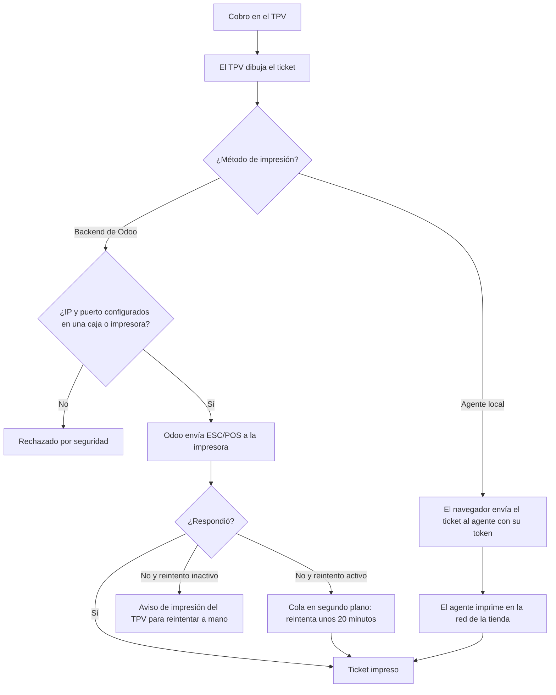

# Guía funcional — Impresora de red ESC/POS para el TPV

> Módulo técnico `al_pos_network_printer` · versión `4.20261009` · área `OL-POS`.
> Para consultores funcionales: qué resuelve, en qué se basa y el proceso
> completo con un ejemplo. Enlaces verificados el 10/10/2026 con
> `docs/validacion/verificar_enlaces.py`.

## 1. Para qué sirve

El punto de venta de Odoo 19 imprime por red sin IoT Box **solo en impresoras
Epson** (protocolo ePOS). Las térmicas genéricas más comunes y económicas
(Xprinter, Zjiang, Gainscha, MUNBYN…) hablan **ESC/POS por el puerto 9100**,
que el navegador no puede abrir. Sin este módulo la única salida es comprar una
IoT Box.

El módulo agrega un tercer tipo de impresora:

- **Backend de Odoo**: el servidor envía el ticket a la impresora (Odoo en la
  tienda o con acceso a su red).
- **Agente local**: con Odoo en la nube, un programa pequeño en una PC de la
  tienda recibe el ticket del navegador y lo imprime.
- Sirve para el **recibo** de cada caja y para las **impresoras de
  preparación** (cocina, barra) por categoría de producto.
- **Reintento automático** en segundo plano si la impresora no responde (unos
  20 minutos).

Lo usan el administrador del TPV (configura) y los cajeros (imprimen).

**Fuera del alcance:** impresoras USB o Bluetooth directas (requieren el agente
o una IoT Box), el diseño del ticket (lo genera el TPV estándar; el formato CPE
peruano lo pone `al_l10n_pe_edi_pos`) y la apertura del cajón en cola de
reintentos.

## 2. Marco normativo y conceptual

No hay una norma legal específica: es infraestructura de impresión. El ticket
que se imprime sí debe cumplir el Reglamento de Comprobantes de Pago cuando es
boleta o factura (ver la guía de `al_l10n_pe_edi_pos`).

- Impresoras Epson por red en el TPV de Odoo 19 (lo nativo):
  <https://www.odoo.com/documentation/19.0/es/applications/sales/point_of_sale/configuration/epos_ssc.html>.
- Conexión con IoT Box en el TPV de Odoo 19 (la alternativa nativa):
  <https://www.odoo.com/documentation/19.0/es/applications/sales/point_of_sale/configuration/pos_iot.html>.
- Cola de trabajos en segundo plano (`queue_job`, OCA), usada para los
  reintentos: <https://github.com/OCA/queue>.

| Término | Significado | Dónde aparece |
|---|---|---|
| ESC/POS | Lenguaje de comandos de las impresoras térmicas de tickets | Tipo de impresora |
| Puerto 9100 (RAW) | Puerto de red por el que se envían los comandos | Campo puerto |
| Backend de Odoo | El servidor de Odoo imprime | Método de impresión |
| Agente local | Programa en la tienda que imprime en nombre de Odoo en la nube | Método de impresión, URL y token |
| Impresora de preparación | Imprime comandas por categoría (cocina, barra) | Punto de venta ▸ Configuración |

## 3. Proceso de inicio a fin

| # | Paso | Dónde en Odoo | Quién | Resultado |
|---|---|---|---|---|
| 1 | Activar la impresora de la caja | Punto de venta ▸ Configuración ▸ Ajustes ▸ **Impresora ESC/POS de red** (elegir la caja arriba) | Administrador | IP, puerto (9100) y método |
| 2 | Probar | Ajustes ▸ **Probar impresora** | Administrador | Ticket de prueba y aviso verde |
| 3 | (Nube) Instalar el agente | PC de la tienda: carpeta `agent/` del módulo (Windows o Linux) | Soporte | Agente con su token y, con Odoo en HTTPS, también en HTTPS |
| 3b | (Nube) Configurar el agente | Ajustes ▸ Método de impresión ▸ **Agente local**: URL y Token ▸ **Probar agente** | Administrador | Conexión comprobada |
| 4 | Impresoras de cocina o barra | Punto de venta ▸ Configuración ▸ Impresoras de preparación ▸ Nuevo ▸ tipo **Usar una impresora ESC/POS genérica de red** | Administrador | IP, puerto y categorías; asignarla a la caja |
| 5 | Vender e imprimir | TPV ▸ Pago ▸ Validar | Cajero | Recibo y comandas impresas |
| 6 | Opciones | **Imprimir automáticamente al pagar**, **Reintentar impresión fallida en segundo plano**, **Bloquear pago hasta autorizar el agente** | Administrador | Comportamiento de la caja |

## 4. Ejemplo completo

Restaurante con Odoo en la nube y dos impresoras térmicas en su red local:

| Equipo | IP | Uso |
|---|---|---|
| Térmica de caja (Xprinter 80 mm) | 192.168.1.50:9100 | Recibo del cliente |
| Térmica de cocina | 192.168.1.51:9100 | Comandas de las categorías «Platos» y «Entradas» |
| PC de la caja con el agente local | 192.168.1.10:8443 (HTTPS) | Recibe los tickets del navegador y los imprime |

1. En la caja «Salón», método **Agente local**, URL del agente en `192.168.1.10:8443` (con HTTPS) y
   el token del agente; **Probar agente** responde correcto.
2. Impresora de preparación «Cocina», tipo ESC/POS genérica, IP
   192.168.1.51:9100, categorías Platos y Entradas; asignada a la caja.
3. Un pedido de 2 lomos saltados y 1 gaseosa: la cocina recibe la comanda con
   los 2 lomos (la gaseosa no es de sus categorías) y, al cobrar, la caja
   imprime el recibo.

Si el restaurante tuviera el servidor de Odoo en el local, el método sería
**Backend de Odoo** y no haría falta el agente; con **Reintentar impresión
fallida** activo, un ticket que no sale por un corte de la impresora se imprime
solo cuando vuelve.

El módulo no genera asientos contables.

## 5. Configuración inicial

1. Impresoras con IP fija en la red de la tienda y puerto RAW 9100 habilitado.
2. Para reintentos en segundo plano: el servidor de Odoo debe cargar
   `queue_job` como módulo global (`--load=base,web,queue_job`); es parte de la
   instalación del servidor.
3. Por caja: activar **Impresora ESC/POS de red**, IP, puerto y método. Es
   **excluyente** con la impresora ePos (Epson) nativa de la misma caja.
4. Con Odoo en la nube: instalar el agente local (guía en `agent/README.md` del
   módulo) y configurar URL y token.
5. Impresoras de preparación por categoría, si aplica.

## 6. Reportes y libros relacionados

No genera reportes ni libros. El contenido impreso es el recibo del TPV (con
formato CPE si está `al_l10n_pe_edi_pos`).

## 7. Casos especiales y errores frecuentes

| Situación | Qué pasa | Qué hacer |
|---|---|---|
| «Probar impresora» falla | La impresora no responde en esa IP y puerto | Revisar IP fija, cable y que el puerto 9100 esté abierto |
| Odoo en la nube con método Backend | El servidor no alcanza la red de la tienda | Usar **Agente local** |
| Odoo en HTTPS y agente en HTTP | El navegador bloquea la conexión | Publicar el agente con HTTPS |
| Se intenta imprimir en una IP no configurada | Rechazado por seguridad (no se abre ninguna IP arbitraria) | Configurar la IP en la caja o en una impresora |
| Impresora apagada un rato | Con reintento activo, imprime sola al volver (unos 20 minutos) | Activar **Reintentar impresión fallida** |
| Caja con ePos Epson y ESC/POS a la vez | No se permite | Elegir una sola |

## 8. Preguntas frecuentes del consultor

- **¿Necesito IoT Box?** No, para térmicas ESC/POS de red.
- **¿Cambia el diseño del ticket?** No: solo cómo llega a la impresora.
- **¿Funciona con varias cajas?** Sí, una impresora por caja y las de
  preparación que hagan falta.
- **¿Es seguro?** Solo imprime en IP y puertos configurados por un
  administrador; el agente se protege con un token.

## 9. Referencias

Enlaces verificados el 10/10/2026:

- Odoo 19, impresoras Epson por red en el TPV:
  <https://www.odoo.com/documentation/19.0/es/applications/sales/point_of_sale/configuration/epos_ssc.html>
- Odoo 19, IoT Box en el TPV:
  <https://www.odoo.com/documentation/19.0/es/applications/sales/point_of_sale/configuration/pos_iot.html>
- Odoo 19, punto de venta:
  <https://www.odoo.com/documentation/19.0/es/applications/sales/point_of_sale.html>
- OCA queue (`queue_job`): <https://github.com/OCA/queue>
- Guías del módulo (repositorio): `agent/README.md`,
  `docs/CONFIGURACION_ODOO_PASO_A_PASO.md`,
  `docs/IMPRESORAS_RECOMENDADAS_PARA_PRUEBAS.md`
