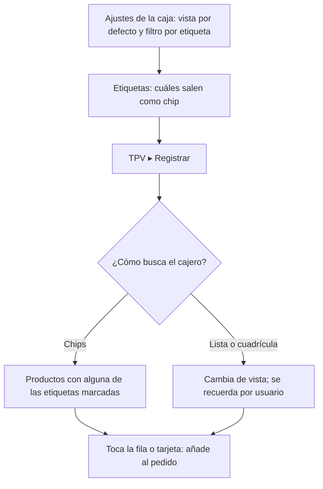

# Guía funcional — Catálogo del TPV con etiquetas y vista de lista

> Módulo técnico `al_pos_product_view` · versión `6.20261009` · área `OL-POS`.
> Para consultores funcionales: qué resuelve y cómo se usa, con un ejemplo.
> Enlaces verificados el 10/10/2026 con `docs/validacion/verificar_enlaces.py`.

## 1. Para qué sirve

El catálogo estándar del TPV filtra solo por categoría y texto y muestra
tarjetas grandes. En tiendas con muchos productos parecidos el cajero necesita
otros cortes y más datos a la vista. El módulo añade:

- **chips de etiquetas** sobre el catálogo para filtrar por una o varias
  etiquetas (promoción, línea, marca…);
- un conmutador entre **cuadrícula** y **lista compacta** (código, código de
  barras, etiquetas, stock, cantidad en el carrito y precio final);
- botón de **información** del producto sin añadirlo al pedido;
- la **vista preferida** de cada cajero.

Usa las **etiquetas de producto estándar** de Odoo: no hay modelos nuevos ni nada
que migrar. **Fuera del alcance:** precios, impuestos y stock (los calcula el TPV
estándar; el módulo solo los muestra).

## 2. Marco normativo y conceptual

No responde a una norma: es una mejora de usabilidad.

- Punto de venta en Odoo 19: <https://www.odoo.com/documentation/19.0/es/applications/sales/point_of_sale.html>
- Precios y tarifas en el TPV de Odoo 19: <https://www.odoo.com/documentation/19.0/es/applications/sales/point_of_sale/pricing.html>

| Término | Significado |
|---|---|
| Etiqueta de producto | Marca libre del backend (Promoción, Bebidas…) con color |
| Chip | Botón de la etiqueta sobre el catálogo |
| Vista por defecto | La de la caja; cada usuario puede tener la suya |

## 3. Proceso de inicio a fin

| # | Paso | Dónde en Odoo | Resultado |
|---|---|---|---|
| 1 | Elegir vista y activar el filtro | Punto de venta ▸ Configuración ▸ Ajustes ▸ Interfaz de PdV: **Vista de productos por defecto** y **Filtrar productos por etiqueta** | Configuración por caja |
| 2 | Elegir los chips | Punto de venta ▸ Productos ▸ Etiquetas de producto: **Mostrar en la barra de filtros del TPV** | Solo esas etiquetas salen como chip |
| 3 | Filtrar | TPV ▸ Registrar ▸ chips (**Limpiar** quita todas) | Catálogo reducido |
| 4 | Cambiar de vista | TPV ▸ Registrar ▸ **Lista** / **Cuadrícula** | Se guarda en las preferencias del usuario |
| 5 | Actualizar etiquetas | Botón de recarga (↻) | Etiquetas nuevas sin cerrar la sesión |

## 4. Ejemplo completo

TPV de demostración con etiquetas Bebidas, Textil, Abarrotes, Servicios y
Promoción. Al tocar **Promoción** el catálogo muestra Gaseosa 500ml y Fruta
fresca (kg). En vista de lista, el pedido de 2 Gaseosa 500ml (S/ 4,13 c/u) y 1
Libro educativo (S/ 25,00) muestra en cada fila la cantidad en el carrito y el
total es S/ 33,26 (2 × 4,13 + 25,00). El precio de la fila coincide con el de la
línea porque aplica la tarifa y los impuestos de la caja.

No genera asientos contables.

## 5. Configuración inicial

1. Etiquetas de producto con color y orden en el backend.
2. Ajustes de la caja (vista por defecto, filtro por etiqueta).
3. Marcar qué etiquetas salen como chip (editable en bloque en la lista).

## 6. Reportes y libros relacionados

Ninguno.

## 7. Casos especiales y errores frecuentes

| Situación | Qué pasa | Qué hacer |
|---|---|---|
| No veo un chip | La etiqueta no la usa ningún producto de la caja o está desmarcada | Revisar la etiqueta |
| Pantalla pequeña | La fila de chips se oculta | Usar búsqueda o categorías |
| El filtro deja el catálogo vacío | Los chips siguen visibles | Desmarcar o **Limpiar** |
| Stock en rojo | Producto almacenable sin existencias | Revisar inventario |

## 8. Preguntas frecuentes del consultor

- **¿Filtra antes del tope de 100 productos del TPV?** Sí, no se pierden
  resultados.
- **¿Convive con la búsqueda y las categorías?** Sí.
- **¿Necesito crear etiquetas nuevas?** No: usa las estándar; al instalar se
  crean algunas de ejemplo.

## 9. Referencias

Enlaces verificados el 10/10/2026:

- Odoo 19, punto de venta: <https://www.odoo.com/documentation/19.0/es/applications/sales/point_of_sale.html>
- Odoo 19, precios en el TPV: <https://www.odoo.com/documentation/19.0/es/applications/sales/point_of_sale/pricing.html>
