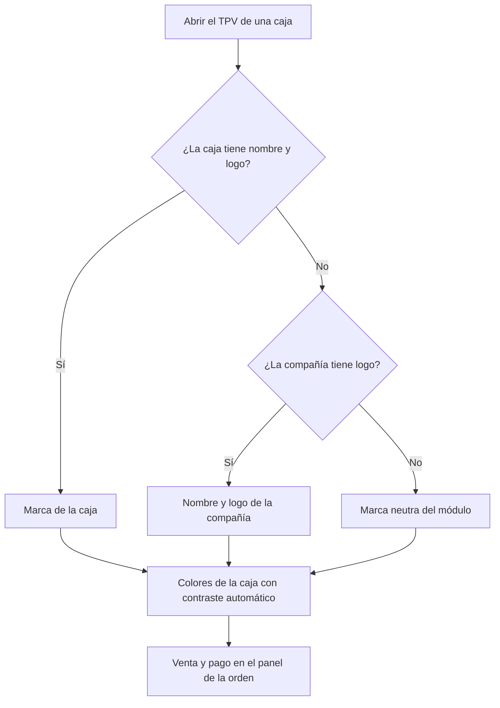

# Guía funcional — Tema y marca blanca del TPV

> Módulo técnico `al_pos_theme` · versión `2.20261008` · área `OL-POS`.
> Para consultores funcionales: qué resuelve y cómo se configura, con un
> ejemplo. Enlaces verificados el 10/10/2026 con
> `docs/validacion/verificar_enlaces.py`.

## 1. Para qué sirve

El TPV estándar muestra el nombre, el logo y el morado de Odoo en la pestaña
del navegador, la pantalla de bloqueo, el recibo y los mensajes. Para una cadena
o franquicia la caja es la cara de la marca. El módulo permite, **por caja**:

- nombre, logo, icono de pestaña y **cuatro colores** (primario, secundario,
  acento y fondo) con contraste automático y modo oscuro;
- un diseño más limpio con el **pago dentro del panel de la orden** (escritorio y
  tablet horizontal);
- **sin rastros de Odoo** en pestaña, app instalable, bloqueo, recibo y mensajes.

**Solo cambia la apariencia**: precios, impuestos, pagos, comprobantes,
sincronización y modo sin conexión funcionan igual que en el TPV estándar.
**Fuera del alcance:** el contenido fiscal del ticket (lo pone
`al_l10n_pe_edi_pos`).

## 2. Marco normativo y conceptual

No responde a una norma legal.

- Configuración del punto de venta en Odoo 19: <https://www.odoo.com/documentation/19.0/es/applications/sales/point_of_sale/configuration.html>
- Punto de venta en Odoo 19: <https://www.odoo.com/documentation/19.0/es/applications/sales/point_of_sale.html>

| Término | Significado |
|---|---|
| Marca de la caja | Nombre, logo e icono que ve el cajero y el cliente |
| Marca neutra | Sin configurar: nombre y logo de la compañía con paleta azul y pizarra |

## 3. Proceso de inicio a fin

| # | Paso | Dónde en Odoo | Resultado |
|---|---|---|---|
| 1 | Configurar la marca | Punto de venta ▸ Configuración ▸ Ajustes ▸ Apariencia (elegir la caja arriba): **Nombre**, **Logo**, **Icono de pestaña**; colores **Primario**, **Secundario**, **Acento**, **Fondo** (#RRGGBB) | Marca por caja |
| 2 | Abrir la caja | Punto de venta ▸ Abrir caja | Bloqueo y venta con la marca |
| 3 | Cobrar | Pantalla de venta ▸ **Pago** | Pago en el panel derecho; el catálogo queda bloqueado |
| 4 | Modo oscuro | Menú ☰ ▸ Cambiar al modo oscuro (Enterprise) | Recordado por navegador |

## 4. Ejemplo completo

Cadena «Bodegas Andinas» con dos cajas: «Miraflores» con primario `#0F766E` y
logo propio, y «Surco» sin configurar. Miraflores abre con su nombre, logo y
verde azulado; Surco usa el nombre y logo de la compañía con la paleta neutra.
En ambas, al pulsar **Pago** el panel derecho muestra total, métodos de pago,
cambio, cliente y teclado; los botones de vendedor (`al_pos_vendedor`) y de
comprobante (`al_l10n_pe_edi_pos`) siguen ahí.

No genera asientos contables.

## 5. Configuración inicial

1. Logo e icono en buena resolución por caja (o de la compañía).
2. Colores en formato `#RRGGBB` (un valor no válido se rechaza).
3. Reabrir el TPV para ver los cambios (no requiere actualizar el módulo).

## 6. Reportes y libros relacionados

Ninguno.

## 7. Casos especiales y errores frecuentes

| Situación | Qué pasa | Qué hacer |
|---|---|---|
| Color primario poco legible en modo oscuro | Se aclara solo | Nada |
| Teléfono o tablet vertical | El pago sigue en su propia pantalla | Comportamiento estándar |
| No se ven los cambios | El TPV tiene la versión anterior cargada | Cerrar y volver a abrir la caja |

## 8. Preguntas frecuentes del consultor

- **¿Cambia algún cálculo?** No, solo la apariencia.
- **¿Una marca por caja o por compañía?** Por caja; lo que falte se completa con
  la compañía.
- **¿Funciona sin conexión?** Igual que el TPV estándar.

## 9. Referencias

Enlaces verificados el 10/10/2026:

- Odoo 19, configuración del punto de venta: <https://www.odoo.com/documentation/19.0/es/applications/sales/point_of_sale/configuration.html>
- Odoo 19, punto de venta: <https://www.odoo.com/documentation/19.0/es/applications/sales/point_of_sale.html>
