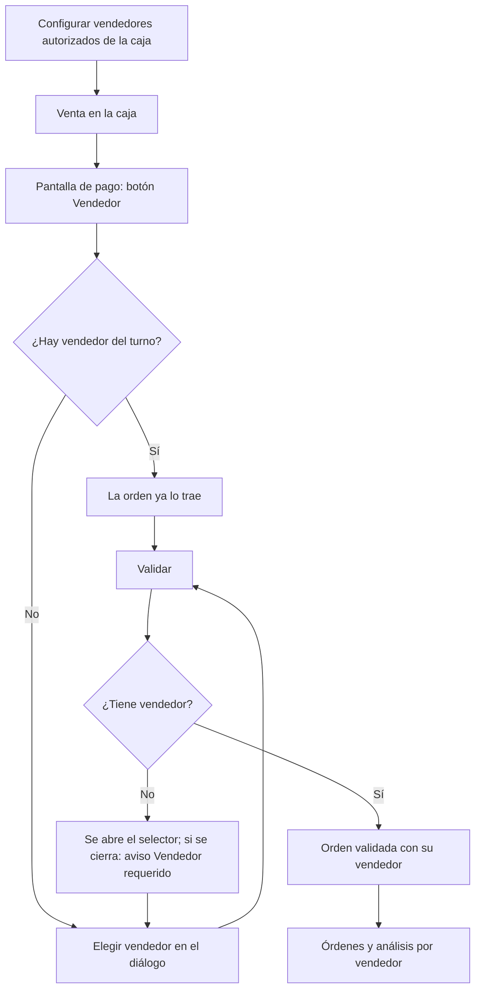

# Guía funcional — Vendedor por orden en el TPV

> Módulo técnico `al_pos_vendedor` · versión `3.20261008` · área `OL-POS`.
> Para consultores funcionales: qué resuelve y cómo se usa, con un ejemplo que
> cuadra. Enlaces verificados el 10/10/2026 con
> `docs/validacion/verificar_enlaces.py`.

## 1. Para qué sirve

Odoo registra en cada orden del TPV al **cajero** (quien tiene la sesión), no a
quien atendió al cliente. En tiendas con vendedores de piso y una caja, todas
las ventas quedan a nombre del cajero y las comisiones se calculan aparte. El
módulo:

- asigna a cada orden el **vendedor** (empleado) que la atendió, elegido en la
  pantalla de pago entre los **vendedores autorizados** de la caja;
- exige el vendedor al validar (si la opción está activa);
- permite un **vendedor predeterminado del turno**;
- suma las ventas **por vendedor** en las órdenes y en el análisis del TPV.

**Fuera del alcance:** el cálculo de comisiones (se hace con los reportes o con
el módulo de comisiones de Ventas) y la planilla.

## 2. Marco normativo y conceptual

No responde a una norma legal; ayuda al control comercial y al cálculo de
comisiones.

- Punto de venta en Odoo 19: <https://www.odoo.com/documentation/19.0/es/applications/sales/point_of_sale.html>
- Configuración del TPV en Odoo 19: <https://www.odoo.com/documentation/19.0/es/applications/sales/point_of_sale/configuration.html>

| Término | Significado | Dónde aparece |
|---|---|---|
| Cajero | Usuario o empleado con la sesión abierta | Orden (estándar) |
| Vendedor | Empleado que atendió la venta | Orden, recibo y análisis |
| Vendedores autorizados | Lista por caja de quienes pueden recibir ventas | Punto de venta ▸ Configuración |
| Vendedor del turno | Predeterminado de la sesión (estrella) | Diálogo del vendedor |

## 3. Proceso de inicio a fin

| # | Paso | Dónde en Odoo | Quién | Resultado |
|---|---|---|---|---|
| 1 | Autorizar vendedores | Punto de venta ▸ Configuración ▸ Punto de venta ▸ pestaña Configuración: **Vendedores autorizados** y **Vendedores** | Administrador | Lista por caja (solo empleados de la compañía; la casilla se cambia con la sesión cerrada) |
| 2 | Elegir vendedor | TPV ▸ Pago ▸ **Vendedor** | Cajero | Tarjetas con buscador; **Quitar** o **Cancelar** |
| 3 | Fijar el del turno | Diálogo ▸ estrella | Cajero | Las órdenes nuevas de la sesión lo traen |
| 4 | Validar | TPV ▸ **Validar** | Cajero | Orden con vendedor; «Vendedor:» en el recibo |
| 5 | Revisar | Punto de venta ▸ Órdenes ▸ Órdenes (Agrupar por ▸ Vendedor) | Supervisor | Ventas por vendedor |
| 6 | Analizar | Punto de venta ▸ Reportes ▸ Órdenes (dimensión **Vendedor**) | Gerencia | Órdenes, cantidades y total por vendedor |

## 4. Ejemplo completo

Sesión de la caja «DEMO TPV Vendedores» con un mismo cajero:

| Orden | Productos | Vendedor | Total |
|---|---|---|---|
| 000001 | 2 Gaseosa 500ml + 1 Libro educativo | Quispe Mamani Juan Carlos | S/ 33,26 |
| 000002 | 3 Bolsa plástica + 4 Gaseosa 500ml | Flores Huamán María Elena | S/ 18,73 |
| 000003 | 2 Libro educativo | Torres Quiroz Ana Lucía | S/ 50,00 |
| | | **Total de la sesión** | **S/ 101,99** |

En el análisis cada vendedor suma su propia venta (1 orden y su total); la suma
33,26 + 18,73 + 50,00 = 101,99 coincide con el total de la sesión.

No genera asientos contables propios: los asientos de la sesión son los del TPV
estándar.

## 5. Configuración inicial

1. Empleados creados (Empleados) en la compañía de la caja.
2. En cada punto de venta, activar **Vendedores autorizados** (con la sesión
   cerrada) y elegir los **Vendedores**.
3. Recargar la interfaz del TPV para que llegue la lista.

No requiere «Iniciar sesión como empleado»: vender no es lo mismo que cobrar.

## 6. Reportes y libros relacionados

- Lista de órdenes con la columna **Vendedor** y búsqueda por su nombre.
- Análisis de órdenes del TPV con la dimensión **Vendedor**.

## 7. Casos especiales y errores frecuentes

| Situación | Qué pasa | Qué hacer |
|---|---|---|
| Opción desactivada | No hay botón Vendedor; la venta se valida como siempre | — |
| Se cierra el selector sin elegir | Aviso **Vendedor requerido**; la venta sigue abierta | Elegir un vendedor |
| «Ninguno» en el análisis | Órdenes anteriores a activar la opción o de cajas sin vendedores | Normal |
| Un vendedor nuevo no aparece | La caja no recargó la lista | Recargar la interfaz del TPV |

## 8. Preguntas frecuentes del consultor

- **¿El vendedor tiene que poder abrir la caja?** No.
- **¿Se pierde el vendedor del turno al recargar?** No, mientras la sesión siga
  abierta.
- **¿Sirve para comisiones?** Da el dato por vendedor; el cálculo se hace con
  los reportes o el módulo de comisiones.

## 9. Referencias

Enlaces verificados el 10/10/2026:

- Odoo 19, punto de venta: <https://www.odoo.com/documentation/19.0/es/applications/sales/point_of_sale.html>
- Odoo 19, configuración del TPV: <https://www.odoo.com/documentation/19.0/es/applications/sales/point_of_sale/configuration.html>
