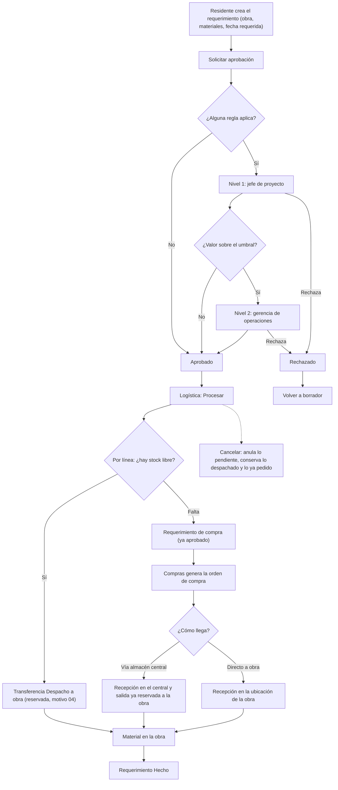

# Guía funcional — Requerimientos de materiales de obra

> Módulo técnico `al_construction_material_request` · versión `9.20261009` · área `OL-PROJECTS`.
> Para consultores funcionales: qué resuelve, la norma que lo respalda y el
> proceso completo con un ejemplo que cuadra. Enlaces verificados el
> 10/10/2026 con `docs/validacion/verificar_enlaces.py`.

## 1. Para qué sirve

En una constructora el material se pide en la obra, pero el stock y las
compras se manejan en la oficina. Sin un documento común el pedido viaja por
correo o Excel, nadie sabe si se aprobó, el almacén despacha sin reservar y
compras vuelve a comprar lo que ya había.

El **requerimiento de obra** es ese documento común: el residente pide
materiales para una obra, el pedido se aprueba por niveles y Logística lo
procesa con un botón. Por cada material, **lo que hay libre en el almacén
central sale a la obra** por transferencia interna y **lo que falta pasa a
compras** como requerimiento de compra ya aprobado.

Lo usan: residentes y personal de obra (piden), jefes de proyecto y gerencia
de operaciones (aprueban), Logística (procesa y despacha) y Compras (compra).

**Fuera del alcance:** el consumo del material en la obra (salida de la
ubicación de obra a gasto o a costo de la obra), el control de presupuesto
por partida y la aprobación de las órdenes de compra. Un traslado interno
almacén central → obra no genera asiento contable en Odoo 19: la analítica
viaja en el movimiento solo como trazabilidad.

## 2. Marco normativo y conceptual

- **Guía de remisión (SUNAT).** Todo traslado de bienes entre
  establecimientos de la misma empresa debe sustentarse con guía de remisión
  remitente, motivo **04 «Traslado entre establecimientos de la misma
  empresa»**. El despacho a obra lleva ese motivo para que la guía electrónica
  salga correcta ([orientación SUNAT](https://orientacion.sunat.gob.pe/02-guia-de-remision-remitente)).
- **Plan Contable General Empresarial (PCGE).** Las compras se registran en la
  clase 6 y el IGV en la 40; la cuenta exacta la da la categoría de producto
  ([PCGE en el MEF](https://www.mef.gob.pe/es/consejo-normativo-de-contabilidad/plan-contable)).
- **Inventario por ubicaciones.** Cada obra es una ubicación interna bajo
  `OBRAS`; el stock de cada obra se ve por separado
  ([ubicaciones en Odoo 19](https://www.odoo.com/documentation/19.0/applications/inventory_and_mrp/inventory/warehouses_storage/inventory_management/use_locations.html)).
- **Requerimiento de compra (OCA `purchase_request`)** y **aprobación por
  niveles (OCA `base_tier_validation`)**: módulos de la comunidad sobre los que
  se apoya este
  ([purchase_request](https://github.com/OCA/purchase-workflow/tree/19.0/purchase_request),
  [base_tier_validation](https://github.com/OCA/tier-validation/tree/19.0/base_tier_validation)).

| Término | Significado | Dónde aparece |
|---|---|---|
| Obra | Proyecto marcado como obra; tiene su ubicación `OBRAS/<obra>` | Proyecto ▸ Ajustes ▸ Obra |
| Origen / almacén central | Existencias desde las que se despacha (incluye sus sububicaciones) | Requerimientos de obra ▸ Configuración ▸ Ajustes |
| Disponible en central | Stock libre hoy (no reservado), en la unidad de la línea | Línea del requerimiento |
| Disponible al procesar | Foto del stock libre en el momento de procesar | Línea, tras «Procesar» |
| Vía almacén central / Directo a obra | Cómo llega lo que se compra | Línea, «Si hay que comprar» |
| Valor estimado | Cantidad × costo del material; lo usan las reglas de aprobación | Cabecera |

## 3. Proceso de inicio a fin

| # | Paso | Dónde en Odoo | Quién | Resultado |
|---|---|---|---|---|
| 1 | Crear el requerimiento | Requerimientos de obra ▸ Requerimientos ▸ Nuevo | Residente (Solicitante) | Borrador `RQO/AAAA/#####` con la obra, la ubicación de obra y la analítica |
| 2 | Solicitar aprobación | Requerimiento ▸ Solicitar aprobación | Residente | «En aprobación» con las revisiones de cada nivel; sin reglas aplicables pasa directo a «Aprobado» |
| 3 | Validar o rechazar | Requerimiento ▸ Validar / Rechazar (filtro «Necesita mi revisión») | Jefe de proyecto, gerencia | «Aprobado» con la última validación; un rechazo deja «Rechazado» |
| 4 | Procesar | Requerimiento ▸ Procesar | Logística | División por línea; transferencia reservada y requerimiento de compra; estado «En proceso» |
| 5 | Despachar | Requerimiento ▸ Transferencias ▸ Validar | Almacén | Material en `OBRAS/<obra>`; guía de remisión con motivo 04 |
| 6 | Comprar | Requerimiento ▸ Req. de compra ▸ crear orden de compra | Compras | Orden de compra con la fecha requerida y la analítica de la línea |
| 7 | Recibir | Orden de compra ▸ Recepción | Almacén | Vía central: entra al central y la salida a la obra queda reservada; directo a obra: entra a la obra |
| 8 | Cierre automático | — | Sistema | «Hecho» cuando todo lo pedido está en la ubicación de la obra |

**Caminos alternativos:**
- **Rechazo:** «Volver a borrador» borra las revisiones y permite corregir.
- **Otro pedido se llevó el stock:** si al reservar se obtiene menos de lo
  calculado, la diferencia pasa a compra y el chatter lo anota.
- **Cancelar** (solo Logística): anula transferencias pendientes y líneas de
  compra que aún no están en una orden; lo despachado se queda en la obra y lo
  ya pedido al proveedor no se toca (el chatter avisa).
- **Devolución de la obra al almacén:** resta de «Recibido en obra».

## 4. Ejemplo completo

Datos de demostración «DEMO RQO»: obra **Colegio A**, almacén central con
60 bolsas de cemento libres. Requerimiento `RQO/2026/00245`:

| Material | Pedido | Costo | Libre al procesar | Transferencia | Compra | Llega |
|---|---|---|---|---|---|---|
| Cemento bolsa 42.5 kg | 100 | 29,50 | 60 | 60 | 40 | Vía almacén central |
| Fierro 1/2" | 50 | 46,00 | 200 | 50 | 0 | — |
| Arena gruesa | 8 m³ | 65,00 | 5 m³ | 5 m³ | 3 m³ | Directo a obra |

**Valor estimado:** 100 × 29,50 + 50 × 46,00 + 8 × 65,00 = 2 950,00 +
2 300,00 + 520,00 = **S/ 5 770,00**. Con la regla de demostración (umbral
S/ 10 000) solo revisa el jefe de proyecto; un pedido de 400 bolsas
(400 × 29,50 = S/ 11 800,00) pasa además por gerencia.

1. **Procesar:** se crea `ACL/OBRA/…` «Despacho a obra» con 60 bolsas, 50
   fierros y 5 m³ de arena, reservada; un requerimiento de compra con 40 bolsas
   (vía central) y 3 m³ (directo a obra); y una transferencia central → obra de
   40 bolsas **en espera** de la compra.
2. **Despacho:** el almacén valida la transferencia. Es un traslado interno:
   **no hay asiento contable**; la guía sale con motivo 04.
3. **Compra:** la orden de compra pide 40 bolsas (destino almacén central) y
   3 m³ con destino final la obra (no se mezclan en una misma línea).
4. **Factura del proveedor** (asiento de Odoo, fuera del módulo; ilustrativo,
   la cuenta de compra la da la categoría del producto):

| Cuenta | Descripción | Debe | Haber |
|---|---|---|---|
| 6031 | Compras: 40 × 29,50 + 3 × 65,00 | 1 375,00 | |
| 40111 | IGV 18 % sobre 1 375,00 | 247,50 | |
| 4212 | Facturas por pagar al proveedor | | 1 622,50 |
| | **Totales** | **1 622,50** | **1 622,50** |

5. **Recepción:** las 40 bolsas entran al central y la salida a la obra queda
   reservada con exactamente lo recibido; los 3 m³ entran directo a la obra.
6. **Cierre:** con las 100 bolsas, 50 fierros y 8 m³ en `OBRAS/Colegio A`, el
   requerimiento pasa solo a **Hecho**.

## 5. Configuración inicial

1. Instalar el módulo (trae `purchase_request` y `base_tier_validation`, OCA).
2. **Requerimientos de obra ▸ Configuración ▸ Ajustes:** origen (existencias
   del almacén central), padre `OBRAS`, tipo «Despacho a obra» y recepción de
   compras. «Completar configuración» rellena lo que falte.
3. **Proyecto ▸ (proyecto) ▸ Ajustes:** marcar **Es obra** (crea la ubicación)
   y asignar el **jefe de proyecto**.
4. **Requerimientos de obra ▸ Configuración ▸ Reglas de aprobación:** niveles,
   revisores, dominio por monto y «Aprobar por secuencia».
5. Grupos: **Solicitante** (obra), **Aprobador** (jefes), **Logística**
   (almacén), **Administrador**, y **Gerencia de operaciones** para el nivel
   por monto.
6. Categorías de producto con su cuenta de compra (lo hace Contabilidad).

## 6. Reportes y libros relacionados

- **Vale de requerimiento** (PDF A4): materiales, división, aprobaciones,
  documentos relacionados y firmas.
- **Materiales pedidos** (Logística): todas las líneas con su situación.
- Lista, tablero, calendario por fecha requerida y actividades.
- Stock por obra: Inventario ▸ Informes ▸ Existencias, filtrando la ubicación
  de la obra. El kardex SUNAT (`ol_stock_kardex_pe`) registra los traslados.

## 7. Casos especiales y errores frecuentes

| Situación | Qué pasa | Qué hacer |
|---|---|---|
| No se pidió aprobación | Ninguna regla aplicó (sin jefe de proyecto o bajo el umbral) | Revisar las reglas y el jefe de proyecto de la obra |
| Disponible en central en 0 aunque hay stock | El stock está reservado por otro documento o fuera del origen | Revisar reservas y sububicaciones del origen |
| Pedido en una unidad distinta | Se divide en la unidad de la línea (p. ej. docenas) | Ninguna: es el comportamiento esperado |
| Se instaló `purchase_request_tier_validation` | Los requerimientos de compra pedirían otra aprobación | Dominio `[('construction_request_id', '=', False)]` en sus reglas |
| El residente no ve el requerimiento | Solo ve los suyos y los de obras que sigue o dirige | Hacerlo seguidor de la obra o asignarlo |

## 8. Preguntas frecuentes del consultor

- **¿El requerimiento de compra se vuelve a aprobar?** No: nace aprobado
  porque el de obra ya pasó su aprobación.
- **¿Se puede comprar directo a la obra?** Sí, por línea («Directo a obra»).
- **¿Afecta a la contabilidad el despacho a obra?** No en Odoo 19 (traslado
  interno); el costo se reconoce cuando se registre el consumo, fuera de este
  módulo.
- **¿Funciona en el celular?** Sí, el formulario y las líneas como tarjetas.
- **¿Multicompañía?** Sí, cada compañía con su configuración y sus reglas.

## 9. Referencias

Verificadas el 10/10/2026:

- SUNAT — Guía de remisión remitente: https://orientacion.sunat.gob.pe/02-guia-de-remision-remitente
- MEF — Plan Contable General Empresarial: https://www.mef.gob.pe/es/consejo-normativo-de-contabilidad/plan-contable
- Odoo 19 — Inventario: https://www.odoo.com/documentation/19.0/applications/inventory_and_mrp/inventory.html
- Odoo 19 — Ubicaciones: https://www.odoo.com/documentation/19.0/applications/inventory_and_mrp/inventory/warehouses_storage/inventory_management/use_locations.html
- Odoo 19 — Compras: https://www.odoo.com/documentation/19.0/applications/inventory_and_mrp/purchase.html
- Odoo 19 — Contabilidad analítica: https://www.odoo.com/documentation/19.0/applications/finance/accounting/reporting/analytic_accounting.html
- OCA — purchase_request: https://github.com/OCA/purchase-workflow/tree/19.0/purchase_request
- OCA — base_tier_validation: https://github.com/OCA/tier-validation/tree/19.0/base_tier_validation
