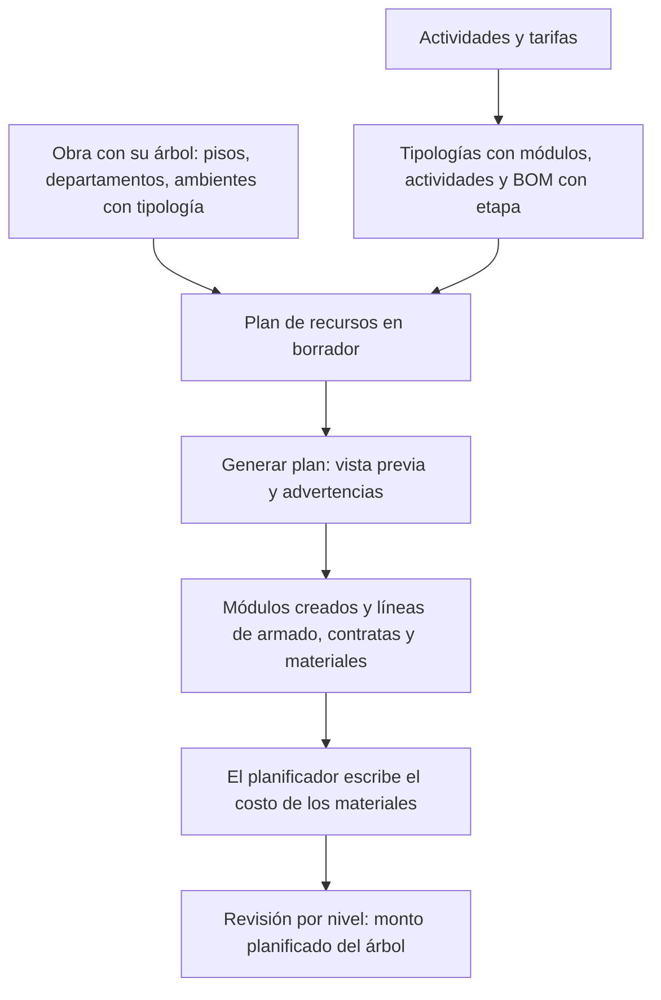

# Guía funcional — Planificación de obra (AL)

> Módulo técnico `al_construction_planner` · versión `1.20261010` · área `OL-PROJECTS`.
> Para consultores funcionales: qué resuelve, los conceptos que usa y el
> proceso de la fase 1 con un ejemplo que cuadra. Enlaces verificados el
> 10/10/2026 con `docs/validacion/verificar_enlaces.py`.

## 1. Para qué sirve

Una obra de muebles a medida (cocinas, closets) se costea en un maestro de
Excel por tipología: módulos, metros lineales, materiales y contratas. El
planificador lleva ese maestro a Odoo y genera el **plan de recursos** de la
obra sobre su propio árbol de tareas (piso › departamento › ambiente ›
módulo), con el monto planificado de cada nivel. Lo usan Oficina Técnica
(planificador) y Jefatura de Proyectos.

Fuera del alcance de la fase 1: aprobación del plan, requerimientos,
asignación de contratas, avances, liquidaciones, producción e ingresos (fases
2 a 8, ver `docs/planificador/DISENO_TECNICO.md`).

## 2. Marco normativo y conceptual

No hay norma que obligue el proceso: es planificación de gestión. Conceptos:

| Término | Significado | Dónde en Odoo |
|---|---|---|
| Tipología | Plantilla de un ambiente (p. ej. «Cocina 01»): módulos, actividades y lista de materiales | Configuración ▸ Tipologías |
| Módulo | Mueble unitario (tornillo, tarugo, campana, cajonera…). Se paga el armado por módulo | Tarea de nivel Módulo |
| Driver | Unidad con la que se paga una contrata: und, ML (metro lineal) o módulo | Actividad de obra |
| ML bajo / alto | Suma de anchos de los módulos bajos o altos | Tipología |
| Etapa | Producción, Armado, Instalación, Acabado y entrega | Línea del plan, componente de la BOM |
| Tarifa | Precio del driver, por obra y contrata, con vigencia y retención | Configuración ▸ Tarifas de contrata |

Prioridad de la tarifa: obra y contrata › solo obra › solo contrata › tarifa
base › precio de la actividad.

## 3. Proceso de inicio a fin

| # | Paso | Dónde en Odoo | Quién | Resultado |
|---|---|---|---|---|
| 1 | Cargar actividades y tarifas | Planificación de obra ▸ Configuración ▸ Actividades de obra / Tarifas de contrata | Administrador | Catálogo con drivers y precios |
| 2 | Indicar la etapa de consumo de cada componente | Fabricación ▸ Lista de materiales ▸ Componentes | Planificador | Columna «Etapa de consumo» |
| 3 | Crear las tipologías | Configuración ▸ Tipologías | Planificador | Módulos, actividades por ambiente y BOM |
| 4 | Crear el árbol de la obra | Proyecto ▸ Tareas (campo «Nivel de obra»; subtareas) | Planificador | Pisos, departamentos y ambientes con tipología |
| 5 | Crear el plan | Obras ▸ Planes de recursos ▸ Nuevo | Planificador | PLR/2026/##### · v1 en borrador |
| 6 | Generar | Plan ▸ Generar plan | Planificador | Módulos (estado Planificado) y líneas |
| 7 | Aplicar costos | Plan ▸ Líneas (columna Costo unitario) | Planificador | Monto total del plan |
| 8 | Revisar por nivel | Obras ▸ Árbol de la obra | Todos | Monto planificado de cada nivel |

Caminos alternativos: **volver a generar** (modo «Reemplazar lo generado»)
borra solo las líneas generadas de esos ambientes, conserva las manuales y
los costos escritos, y no duplica módulos. **Cancelar** un plan que no se
aprobó y **Volver a borrador** desde cancelado.

## 4. Ejemplo completo

Datos de demostración «DEMO PLAN MOMEN-35-26», piso 05 (script
`tools/planner_demo_data.py`). Tipología 01 (Dpto 501), de la especificación:

| Concepto | Driver | Tarifa | Monto S/ |
|---|---|---|---|
| Armado: 1 tornillo, 3 tarugo, microondas, campana, cajonera | 7 módulos | 6 · 8 · 10 · 7 · 7 | 54.00 |
| Colocación de puertas | 1.93 und | 3.00 | 5.79 |
| Entarugado de muebles | 8.5 und | 3.00 | 25.50 |
| **Armado de la tipología** | | | **85.29** |
| Instalación mueble bajo / alto | 2.12 / 2.10 ML | 18.00 (tarifa de la obra) | 38.16 + 37.80 |

Piso completo tras generar y aplicar costos:

| Nivel | Módulos | ML | Material | Contrata | Total |
|---|---|---|---|---|---|
| Dpto 501 | 7 | 4.22 | 735.29 | 258.37 | 993.66 |
| Dpto 502 | 8 | 5.00 | 795.84 | 272.80 | 1,068.64 |
| Dpto 503 | 10 | 5.52 | 897.68 | 307.30 | 1,204.98 |
| Dptos 504 a 508 | 41 | 26.59 | 4,214.10 | 1,463.06 | 5,677.16 |
| **Piso 05** | **66** | **41.33** | **6,642.91** | **2,301.53** | **8,944.44** |

La instalación del piso suma S/ 941.17 (instalación, regulación, tapas,
recortes, pines y push), como en P-05 de la especificación. El reparto entre
las tipologías 04 a 08 y los precios de material son de ejemplo y cuadran con
una línea de ajuste marcada «(ajuste demo)».

## 5. Configuración inicial

1. Instalar el módulo desde Aplicaciones.
2. Marcar la obra con **Es obra** (Proyecto ▸ Ajustes ▸ Obra).
3. Asignar grupos en Ajustes ▸ Usuarios: **Planificador** a Oficina Técnica,
   **Administrador** a Jefatura de Proyectos, **Reporte de avance** a
   capataces y supervisores.
4. Cargar actividades, tarifas y tipologías (pasos 1 a 3).

## 6. Reportes y libros relacionados

- Planes de recursos (lista con montos por tipo y estado).
- Recursos planificados (pivote por departamento y etapa).
- Árbol de la obra (lista de niveles con su monto planificado).

No alimenta libros PLE ni archivos SUNAT.

## 7. Casos especiales y errores frecuentes

| Situación | Qué pasa | Qué hacer |
|---|---|---|
| Ambiente sin tipología | No se genera; se avisa | Asignar la tipología al ambiente |
| Componente sin etapa de consumo | La línea se genera «sin etapa» y se avisa | Indicar la etapa en la BOM y regenerar |
| Líneas de material sin costo | Se avisa | Escribir el costo unitario |
| Tipología sin anchos | La instalación por ML queda en el ambiente; se avisa | Cargar los anchos del ETO por módulo |
| El ambiente ya tiene módulos del ETO | Se usan por código; los que faltan se avisan | Crear el módulo faltante o corregir el código |
| «Debe colgar de un …» | Un nivel no cuelga del nivel inmediato superior | Corregir la tarea padre |
| «Ya tiene un plan en preparación» | Solo un borrador o en aprobación por obra | Usar el existente o cancelarlo |
| Editar una línea de un plan aprobado | Bloqueado (salvo la fecha de necesidad) | Crear una versión nueva (fase 2) |

## 8. Preguntas frecuentes del consultor

- **¿Por qué el material sale sin costo?** La especificación pide que lo
  escriba el planificador tras revisar los precios de compra; al regenerar se
  conserva el ya escrito.
- **¿Las contratas tienen costo?** Sí: la tarifa vigente de la obra como
  referencia.
- **¿Puedo tener tarifas distintas por contrata?** Sí, con la combinación
  obra + contrata; sin superponer vigencias.

## 9. Referencias

- Especificación v1.4: [`docs/planificador/ESPECIFICACION_v1.4.md`](../../docs/planificador/ESPECIFICACION_v1.4.md)
- Diseño técnico: [`docs/planificador/DISENO_TECNICO.md`](../../docs/planificador/DISENO_TECNICO.md)
- Odoo 19, Proyecto: https://www.odoo.com/documentation/19.0/applications/services/project.html
- Odoo 19, Fabricación (listas de materiales): https://www.odoo.com/documentation/19.0/applications/inventory_and_mrp/manufacturing.html
