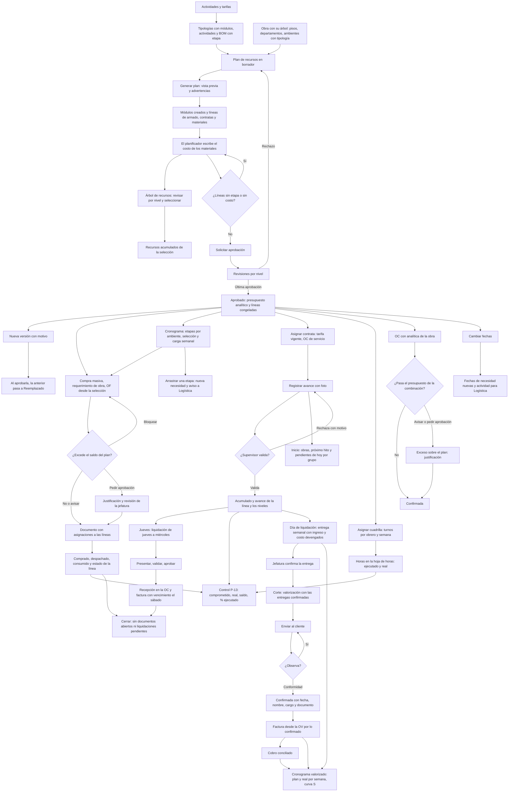

# Guía funcional — Planificación de obra (AL)

> Módulo técnico `al_construction_planner` · versión `10.20261010` · área `OL-PROJECTS`.
> Para consultores funcionales: qué resuelve, los conceptos que usa y el
> proceso completo de las fases 1 a 11 (plan, árbol, línea base,
> asignaciones y compras, contratas, liquidación semanal, control y personal
> propio, cronograma con recursos, productos, precios y abastecimiento, ruta
> del ingreso, cronograma valorizado e inicio) con un ejemplo que cuadra y el
> mapa de las 22 pantallas (P-01 a P-22) y los 14 asistentes (W-01 a W-14).
> Enlaces verificados el 10/10/2026 con `docs/validacion/verificar_enlaces.py`.

## 1. Para qué sirve

Una obra de muebles a medida (cocinas, closets) se costea en un maestro de
Excel por tipología: módulos, metros lineales, materiales y contratas. El
planificador lleva ese maestro a Odoo y genera el **plan de recursos** de la
obra sobre su propio árbol de tareas (piso › departamento › ambiente ›
módulo), con el monto planificado de cada nivel. Lo usan Oficina Técnica
(planificador) y Jefatura de Proyectos.

Desde la fase 4 el plan también abastece: la compra masiva, los
requerimientos de obra y las órdenes de fabricación nacen de la selección
del árbol y descuentan el saldo de cada línea, con control de exceso.

Desde las fases 5 y 6 el plan también paga a las contratas a destajo: se
asignan desde el árbol con su tarifa vigente (y su OC de servicio), reportan
unidades de su driver con foto, el supervisor valida, cada jueves se prepara
la liquidación de la semana y, aprobada, se recibe en la OC y se factura con
vencimiento el sábado.

Desde la fase 7 el plan controla lo real: cada línea guarda su estado y sus
montos de control (comprometido, real, saldo, % ejecutado), el análisis de
control (P-13) los muestra por etapa y tipo de recurso, la OC con la
analítica de la obra se contrasta con el presupuesto al confirmarla, las
cuadrillas de personal propio se asignan con turnos y sus horas son el real,
y «Cambiar fechas» mueve la selección y avisa a Logística.

Desde la fase 9 el planificador fija el costo mirando los **precios de
compra** del producto en soles (P-16), crea desde la línea el producto que
no existe (P-17) y Logística compra desde el **abastecimiento de la obra**
(P-18) lo que falta para las próximas semanas, con alertas de precio y de
necesidad sin OC.

Desde la fase 10 el plan también cobra: cada semana la **entrega** devenga
el ingreso de cada partida del contrato (precio × avance de la partida, con
el material consumido), la **valorización** agrupa las entregas
confirmadas, el cliente la observa y la confirma, y Administración y
Finanzas factura lo confirmado desde la orden de venta, con las fechas del
**calendario de la obra** (P-21).

Desde la fase 11 la obra se lee de un vistazo: el **cronograma valorizado**
(P-22) muestra por semana el costo, el ingreso, el margen, lo valorizado,
facturado y cobrado, en plan y real, con la curva S; y el **inicio** de la
aplicación (P-01) lista las obras con su próximo hito y lo que cada usuario
tiene que atender hoy.

## 2. Marco normativo y conceptual

No hay norma que obligue el proceso: es planificación de gestión. Conceptos:

| Término | Significado | Dónde en Odoo |
|---|---|---|
| Tipología | Plantilla de un ambiente (p. ej. «Cocina 01»): módulos, actividades y lista de materiales | Configuración ▸ Tipologías |
| Módulo | Mueble unitario (tornillo, tarugo, campana, cajonera…). Se paga el armado por módulo | Tarea de nivel Módulo |
| Driver | Unidad con la que se paga una contrata: und, ML (metro lineal) o módulo | Actividad de obra |
| ML bajo / alto | Suma de anchos de los módulos bajos o altos | Tipología |
| Etapa | Producción, Armado, Instalación, Acabado y entrega | Línea del plan, componente de la BOM |
| Tarifa | Precio del driver, por obra y contrata, con vigencia y retención | Configuración ▸ Tarifas de contrata |
| Línea base | Versión aprobada del plan: sus montos quedan congelados como presupuesto | Plan aprobado y su presupuesto analítico |
| Base del costo | Qué miró el planificador al fijar el costo (manual, último precio, ponderado de 3 o 6 meses) y su fecha | Línea del plan |
| Versión | Copia del plan para replanificar; la vigente sigue en uso hasta aprobar la nueva | Plan ▸ Nueva versión |
| Asignación | Parte de un documento (compra masiva, requerimiento, OF, OC de servicio, turno) que corresponde a una línea del plan | Plan ▸ Asignaciones |
| Fecha de necesidad | Inicio de la tarea menos la anticipación del tipo de recurso; ordena el reparto de lo hecho | Línea del plan |
| Saldo del plan | Planificado menos lo ya pedido (requerimientos de obra y OF) | Línea del plan; columna del requerimiento de obra |
| Política de exceso | Qué pasa al pedir más que el saldo más la tolerancia: avisar, pedir aprobación o bloquear | Plan ▸ Políticas |
| Compra masiva con analítica / stock general | Compra para la obra con su cuenta analítica, o para el almacén central descontando lo libre | Plan ▸ Compra masiva |
| OC de servicio | Orden de compra de la contrata en la obra (una por contrata y obra) con una línea por actividad y tarifa; recibe cada liquidación | Contratas ▸ OC de servicio |
| Avance reportado | Unidades de driver que la contrata dice haber hecho en un módulo o ambiente, con foto; solo lo validado suma | Avance ▸ Avances |
| Avance valorizado | Σ ejecutado × costo ÷ Σ planificado de las contratas y el personal propio de un nivel: pondera por valor porque las unidades no se suman | Árbol (medida «Avance»), tarea ▸ Recursos y avance |
| Semana de liquidación | Del día de inicio de la obra (jueves) al día anterior (miércoles); se liquida el jueves siguiente y se paga el sábado | Proyecto ▸ Ajustes; Ajustes ▸ Planificación de obra |
| Retención | Porcentaje de la tarifa que se retiene a la contrata en cada liquidación | Tarifa de contrata; línea de la OC |
| Rezagado | Avance validado de una semana ya liquidada: entra a la liquidación siguiente | Liquidación |
| Comprometido | Lo que ya está pedido y aún no es real: requerimientos y compras sin consumir, OC de servicio sin recibir, turnos sin horas registradas | Línea del plan; Plan ▸ Control |
| Real | Lo consumido al costo del plan, lo recibido en la OC de servicio y las horas registradas por el costo hora del empleado | Línea del plan; Plan ▸ Control |
| % ejecutado | Real entre planificado | Plan ▸ Control |
| Cuadrilla | Obreros propios con un rol, asignados por semanas a niveles de la obra con turnos | Plan ▸ Asignar cuadrilla; Planificación (turnos) |
| Presupuesto de la combinación | Línea del presupuesto analítico del plan que cubre las cuentas analíticas de una línea de compra | Contabilidad ▸ Presupuestos |
| Partida | Línea de producto de la orden de venta del contrato (cantidad 1); su familia (cocina, closet…) dice qué ambientes le pertenecen | Obra ▸ Calendario e ingresos; línea de la OV |
| Avance de la partida | (contratas a tarifa + horas a costo + material consumido a costo del plan) ÷ planificado de la partida | Entrega semanal |
| Entrega semanal | Ingreso y costo devengados de la semana por partida; la confirma la Jefatura | Ingresos ▸ Entregas semanales |
| Valorización | Lo entregado y no confirmado hasta un corte, que el cliente observa y confirma; con fondo de garantía y amortización del adelanto | Ingresos ▸ Valorizaciones |
| Fondo de garantía | Porcentaje de cada valorización que el cliente retiene y paga al cierre de la obra | Obra ▸ Calendario e ingresos |
| Cronograma valorizado | Costo, ingreso devengado, margen, valorización, facturado y cobrado por semana de la obra | Reportes ▸ Cronograma valorizado |
| Escenario plan / real | Plan: lo que dicen el plan, sus etapas y el calendario; real: lo ejecutado, confirmado, facturado y cobrado | Cronograma valorizado |
| Curva S | Costo, ingreso y cobrado acumulados por semana: muestra la brecha de caja de la obra | Cronograma valorizado |
| Supervisor de obra | Usuario responsable de la obra o en «Supervisores de obra»: su inicio muestra solo los avances y liquidaciones de sus obras | Proyecto ▸ Ajustes ▸ Supervisión de obra |
| Pendientes de hoy | Lo que el usuario tiene que atender según sus grupos; cada fila abre la lista filtrada | Inicio (P-01) |

Prioridad de la tarifa: obra y contrata › solo obra › solo contrata › tarifa
base › precio de la actividad.

## 3. Proceso de inicio a fin

| # | Paso | Dónde en Odoo | Quién | Resultado |
|---|---|---|---|---|
| 1 | Cargar actividades y tarifas | Planificación de obra ▸ Configuración ▸ Actividades de obra / Tarifas de contrata | Administrador | Catálogo con drivers y precios |
| 2 | Indicar la etapa de consumo de cada componente | Fabricación ▸ Lista de materiales ▸ Componentes | Planificador | Columna «Etapa de consumo» |
| 3 | Crear las tipologías | Configuración ▸ Tipologías | Planificador | Módulos, actividades por ambiente y BOM |
| 4 | Crear el árbol de la obra | Proyecto ▸ Tareas (campo «Nivel de obra»; subtareas) | Planificador | Pisos, departamentos y ambientes con tipología |
| 5 | Crear el plan | Obras ▸ Planes de recursos ▸ Nuevo | Planificador | PLR/2026/##### · v1 en borrador |
| 6 | Generar | Plan ▸ Generar plan | Planificador | Módulos (estado Planificado) y líneas |
| 7 | Aplicar costos | Plan ▸ Aplicar costo (o Líneas ▸ seleccionar ▸ Aplicar costo) | Planificador | Costo y base en las líneas del producto |
| 8 | Revisar por nivel | Obras ▸ Árbol de recursos (o botón «Árbol de recursos» del plan) | Todos | Módulos, ML y montos de cada nivel |
| 9 | Seleccionar y revisar los recursos | Árbol de recursos: casillas de piso, departamento, ambiente o módulo | Planificador | Barra de selección y panel de recursos acumulados |
| 10 | Revisar el resumen por etapa | Plan ▸ pestaña Resumen por etapa | Planificador | Ninguna fila «Sin etapa» |
| 11 | Solicitar aprobación | Plan ▸ Solicitar aprobación | Planificador | En aprobación, con sus revisiones |
| 12 | Aprobar o rechazar | Plan ▸ Validar / Rechazar (bloque de revisiones) | Jefatura; gerencia sobre S/ 100 000 (reglas de ejemplo) | Aprobado con presupuesto, o de vuelta a borrador |
| 13 | Replanificar | Plan aprobado ▸ Nueva versión | Planificador | Versión nueva en borrador |
| 14 | Comprar en bloque | Árbol de recursos (selección) o plan ▸ Compra masiva | Planificador con requerimientos de compra | Requerimiento de compra (OCA) en borrador; sube el comprado |
| 15 | Pedir a la obra | Árbol de recursos o plan ▸ Requerimiento de obra | Planificador / residente | Requerimiento de obra en borrador con saldo y control por línea |
| 16 | Solicitar la aprobación del requerimiento | Requerimiento ▸ Solicitar aprobación | Residente | Según la política: sigue, pide justificación y revisión de la jefatura, o se bloquea |
| 17 | Fabricar | Árbol de recursos o plan ▸ Orden de fabricación; OF ▸ Confirmar | Planificador / planta | OF por piso con la BOM; al confirmar se controla el saldo; al cerrar sube lo consumido |
| 18 | Asignar la contrata | Árbol de recursos (selección) o plan ▸ Asignar contrata | Planificador (Proyectos) | Contrata en las líneas; alcance sumado a su OC de servicio en la obra |
| 19 | Confirmar la OC de servicio | Contratas ▸ OC de servicio ▸ Confirmar | Compras | OC confirmada (requisito para aprobar liquidaciones) |
| 20 | Registrar el avance | Avance ▸ Registrar avance, el plan, el árbol o la tarea ▸ Recursos y avance | Capataz de la contrata o supervisor | Avances en «Reportado», con fotos |
| 21 | Validar o rechazar | Avance ▸ Avances por validar | Supervisor (Planificador) | Validado: sube el acumulado y el avance; rechazado con motivo |
| 22 | Preparar la liquidación | Automático cada día de liquidación (jueves), o «Actualizar avances» | Sistema | Liquidación en borrador de la semana con los rezagados |
| 23 | Presentar y validar | Contratas ▸ Liquidaciones semanales | Supervisor (en nombre de la contrata) | Presentada › Validada; o devuelta con motivo |
| 24 | Aprobar | Liquidación ▸ Validar (bloque de revisiones) | Jefatura de Proyectos | Recepción en la OC y factura con vencimiento el sábado |
| 25 | Pagar | Contabilidad ▸ Facturas de proveedor ▸ Registrar pago | Tesorería | Liquidación «Pagada» al quedar pagada la factura |
| 26 | Comprar con la analítica de la obra | Compras ▸ OC ▸ Confirmar | Compras | Se contrasta con el presupuesto de la combinación: confirmada, aviso (W-10), justificación y confirmación de la jefatura, o bloqueo |
| 27 | Asignar la cuadrilla propia | Árbol de recursos (selección) o plan ▸ Asignar cuadrilla | Planificador | Turnos por obrero y semana con la tarea y la línea del plan |
| 28 | Registrar las horas | Hoja de horas de la tarea (o de sus módulos) | Capataz | Ejecutado y real de la línea de personal propio |
| 29 | Cambiar fechas | Árbol de recursos o plan ▸ Cambiar fechas | Planificador | Tareas y fechas de necesidad movidas; actividad para Logística en los documentos desfasados |
| 30 | Controlar | Plan ▸ Control; Reportes ▸ Control de saldo | Jefatura, Finanzas | Planificado, comprometido, real, saldo y % ejecutado por etapa, tipo de recurso, contrata o producto |
| 31 | Revisar los precios de compra | Línea del plan ▸ ícono de gráfico, o Abastecimiento ▸ Precios de compra del producto | Planificador | Estadísticos en soles de la ventana; «Aplicar costo» con la base elegida |
| 32 | Crear un producto que no existe | Línea del plan sin producto ▸ Crear producto (o Plan ▸ Crear producto) | Planificador | Producto activo con código de su familia, en la línea y marcado con el plan; actividad para Logística |
| 33 | Abastecer la obra | Abastecimiento ▸ Abastecimiento de la obra (o botón del plan) | Logística, planificador | Cantidad a comprar por producto; «Compra masiva» con las filas marcadas |
| 34 | Configurar el ingreso de la obra | Proyecto ▸ Calendario e ingresos | Jefatura, Administración y Finanzas | OV del contrato, calendario de valorización y valorizaciones previstas |
| 35 | Preparar la entrega semanal | Automático cada día de liquidación, o «Actualizar» | Sistema | Entrega en borrador con ingreso, costo y margen devengados por partida |
| 36 | Confirmar la entrega | Ingresos ▸ Entregas semanales ▸ Confirmar | Jefatura de Proyectos | Ingreso y costo de la semana fijados |
| 37 | Preparar la valorización | Automático al pasar el corte, o Ingresos ▸ Preparar valorización (W-13) | Sistema / Proyectos | Valorización en borrador con las entregas confirmadas hasta el corte |
| 38 | Enviar y levantar observaciones | Valorización ▸ Enviar al cliente · Observación del cliente · Levantar y reenviar | Proyectos | Enviada (PDF en el historial) u Observada con fecha y autor |
| 39 | Registrar la conformidad | Valorización ▸ Confirmar (W-14) | Proyectos o Administración y Finanzas | Confirmada con fecha, nombre, cargo y documento; entregas Valorizadas |
| 40 | Facturar | Valorización ▸ Crear factura; factura ▸ Confirmar | Administración y Finanzas | Factura de lo confirmado desde la OV; valorización Facturada |
| 41 | Cobrar | Ingresos ▸ Cobranza de la obra; Contabilidad (conciliar el pago o el extracto) | Tesorería | Factura pagada; cobro real en el cronograma valorizado |
| 42 | Revisar el cronograma valorizado | Reportes ▸ Cronograma valorizado (o botón de la obra) | Gerencia, Finanzas, Jefatura | Curva S y tabla semanal plan contra real; Excel, pivote y gráfico |
| 43 | Atender lo del día | Inicio (al abrir la aplicación) | Cada usuario según su grupo | La fila de cada pendiente abre su lista filtrada |
| 44 | Cerrar | Plan ▸ Cerrar | Administrador | Plan de solo lectura y presupuesto «Hecho» (no con documentos abiertos ni liquidaciones pendientes) |

### Mapa de pantallas y asistentes

Los códigos son los de la especificación v1.4.

| Código | Pantalla o asistente | Dónde en Odoo |
|---|---|---|
| P-01 | Inicio: obras y pendientes de hoy | Al abrir la aplicación; Obras ▸ Inicio |
| P-02 | Árbol del plan con selección en cascada | Obras ▸ Árbol de recursos; botón del plan |
| P-03 | Resumen por etapa | Plan ▸ pestaña Resumen por etapa |
| P-04 / W-01 | Generar plan | Plan ▸ Generar plan |
| P-05 / W-05 | Asignar contrata a la selección | Contratas ▸ Asignar contrata; árbol, plan o cronograma |
| P-06 / W-07 | Registrar avance | Avance ▸ Registrar avance; árbol, plan o tarea |
| P-07 | Avances por validar | Avance ▸ Avances por validar |
| P-08 | Liquidación semanal de contrata | Contratas ▸ Liquidaciones semanales |
| P-09 | Recursos y avance del nivel | Tarea (piso, departamento, ambiente o módulo) ▸ pestaña Recursos y avance |
| P-10 / W-02 | Compra masiva | Árbol, plan, cronograma o Abastecimiento de la obra ▸ Compra masiva |
| P-11 / W-03 | Requerimiento de obra con control de plan | Árbol o plan ▸ Requerimiento de obra; Abastecimiento ▸ Requerimientos de obra |
| W-04 | Orden de fabricación desde la BOM | Árbol o plan ▸ Orden de fabricación |
| W-06 | Asignar cuadrilla | Contratas ▸ Asignar cuadrilla; árbol, plan o cronograma |
| W-08 | Cambiar fechas | Árbol, plan o cronograma ▸ Cambiar fechas |
| W-09 | Nueva versión (replanificar) | Plan aprobado ▸ Nueva versión |
| W-10 | Exceso sobre el plan | Se abre solo al pasar el saldo (requerimiento, OF u OC con la analítica de la obra) |
| P-12 | Tipología de la obra | Configuración ▸ Tipologías |
| P-13 | Control de saldo | Plan ▸ pestaña Control; Reportes ▸ Control de saldo |
| P-14 | Actividades y tarifas de contratas | Configuración ▸ Actividades de obra / Tarifas de contrata |
| P-15 | Cronograma con recursos | Cronograma |
| P-16 | Precios de compra del producto | Abastecimiento ▸ Precios de compra del producto; Reportes ▸ Precios de compra |
| P-17 / W-11 | Crear producto desde el plan | Línea del plan sin producto ▸ Crear producto |
| W-12 | Aplicar costo | Plan ▸ Aplicar costo; P-16 ▸ Aplicar costo |
| P-18 | Abastecimiento de la obra | Abastecimiento ▸ Abastecimiento de la obra |
| P-19 | Entrega semanal | Ingresos ▸ Entregas semanales |
| P-20 | Valorización con el cliente | Ingresos ▸ Valorizaciones |
| W-13 | Preparar valorización | Ingresos ▸ Preparar valorización; obra ▸ Calendario e ingresos |
| W-14 | Confirmar valorización | Valorización ▸ Confirmar |
| P-21 | Calendario e ingresos de la obra | Proyecto (obra) ▸ pestaña Calendario e ingresos |
| P-22 | Cronograma valorizado de la obra | Reportes ▸ Cronograma valorizado; botón de la obra; ícono de gráfico en el inicio |

Caminos alternativos: **volver a generar** (modo «Reemplazar lo generado»)
borra solo las líneas generadas de esos ambientes, conserva las manuales y
los costos escritos, y no duplica módulos. **Cancelar** un plan que no se
aprobó y **Volver a borrador** desde cancelado o desde «En aprobación» (las
revisiones se reinician). Si ninguna regla de aprobación aplica, «Solicitar
aprobación» aprueba directamente.

## 4. Ejemplo completo

Datos de demostración «DEMO PLAN MOMEN-35-26», piso 05 (script
`tools/planner_demo_data.py`). Tipología 01 (Dpto 501), de la especificación:

| Concepto | Driver | Tarifa | Monto S/ |
|---|---|---|---|
| Armado: 1 tornillo, 3 tarugo, microondas, campana, cajonera | 7 módulos | 6 · 8 · 10 · 7 · 7 | 54.00 |
| Colocación de puertas | 1.93 und | 3.00 | 5.79 |
| Entarugado de muebles | 8.5 und | 3.00 | 25.50 |
| **Armado de la tipología** | | | **85.29** |
| Instalación mueble bajo / alto | 2.12 / 2.10 ML | 18.00 (tarifa de la obra) | 38.16 + 37.80 |

Piso completo tras generar y aplicar costos:

| Nivel | Módulos | ML | Material | Contrata | Total |
|---|---|---|---|---|---|
| Dpto 501 | 7 | 4.22 | 735.29 | 258.37 | 993.66 |
| Dpto 502 | 8 | 5.00 | 795.84 | 272.80 | 1,068.64 |
| Dpto 503 | 10 | 5.52 | 897.68 | 307.30 | 1,204.98 |
| Dptos 504 a 508 | 41 | 26.59 | 4,214.10 | 1,463.06 | 5,677.16 |
| **Piso 05** | **66** | **41.33** | **6,642.91** | **2,301.53** | **8,944.44** |

La instalación del piso suma S/ 941.17 (instalación, regulación, tapas,
recortes, pines y push), como en P-05 de la especificación. El reparto entre
las tipologías 04 a 08 y los precios de material son de ejemplo y cuadran con
una línea de ajuste marcada «(ajuste demo)».

### Árbol de recursos (P-02)

**Obras ▸ Árbol de recursos** muestra la obra como árbol: obra › piso ›
departamento › ambiente › módulo. Cada nivel se abre con la flecha y trae
sus módulos, ML, material, contrata y total. En el piso 05 de demostración:

| Fila | Módulos | ML | Material | Contrata | Total |
|---|---|---|---|---|---|
| Piso 05 | 66 | 41.33 | 6,642.91 | 2,301.53 | 8,944.44 |
| Dpto 501 | 7 | 4.22 | 735.29 | 258.37 | 993.66 |

- **Marcar** el piso marca todos sus departamentos, ambientes y módulos; la
  barra de selección muestra «66 módulos · 8 ambientes · 41.33 ML ·
  S/ 8,944.44». **Desmarcar** un módulo deja al ambiente, al departamento y
  al piso con un guion (selección parcial) y la barra pasa a 65 módulos.
- El panel **Recursos acumulados de la selección** lista cada actividad,
  material o rol con su cantidad de driver, lo ejecutado (desde la fase de
  avances), el monto y la contrata asignada («sin asignar» si falta).
  «Ver solo lo que no tiene contrata» filtra contratas y personal sin
  asignar.
- **Filtros**: etapa (p. ej. solo instalación: S/ 941.17 de contrata en el
  piso 05), tipo de recurso, estado del módulo y contrata.
- **Medida**: soles, cantidad de driver o avance (el avance por driver llega
  con la fase de contratas y avances; hoy el módulo muestra su estado).
- Los botones de la barra (compra, requerimiento, fabricación, contrata,
  cuadrilla, avance, fechas) aparecen a medida que se instalan sus fases.

### Línea base (P-03)

Con `tools/planner_demo_baseline.py` la versión 1 del piso 05 queda
aprobada (la melamina RH, sin etapa en el maestro, se asigna a Producción
antes de pedir la aprobación) y su resumen por etapa cuadra con el
presupuesto:

| Etapa | Material | Contrata | Planificado | Presupuesto | Diferencia |
|---|---|---|---|---|---|
| Producción | 4,928.28 | — | 4,928.28 | 4,928.28 | 0.00 |
| Armado | 1,638.63 | 781.29 | 2,419.92 | 2,419.92 | 0.00 |
| Instalación | 55.00 | 941.17 | 996.17 | 996.17 | 0.00 |
| Acabado y entrega | 21.00 | 579.07 | 600.07 | 600.07 | 0.00 |
| **Total** | **6,642.91** | **2,301.53** | **8,944.44** | **8,944.44** | **0.00** |

El presupuesto analítico «DEMO PLAN MOMEN-35-26 · PLR/2026/00018 · v1» tiene
una línea de S/ 8,944.44 en la cuenta de la obra: todas las líneas usan la
distribución por defecto (cuenta de la obra al 100 %). Si una línea reparte
60 % / 40 % entre dos partidas de otro plan analítico, el presupuesto tiene
una línea por combinación (obra + partida) con ese reparto.

**Aplicar costo (W-12).** La melamina blanca tiene tres compras confirmadas:
20 a S/ 118.50 (hace 150 días), 35 a S/ 122.00 (75 días) y 15 a S/ 124.90
(20 días). El asistente sugiere:

| Base | Cálculo | Costo |
|---|---|---|
| Último precio | La compra más reciente | 124.90 |
| Ponderado de 3 meses | (35 × 122.00 + 15 × 124.90) ÷ 50 | 122.87 |
| Ponderado de 6 meses | (20 × 118.50 + 35 × 122.00 + 15 × 124.90) ÷ 70 | 121.62 |

El planificador puede escribir otro costo; las 8 líneas quedan con 121.62 y
la base «Ponderado de 6 meses al 10/10/2026: 121,62».

**Nueva versión (W-09).** La versión 2 copia las 226 líneas (enlazadas a las
de la v1), aplica el ponderado (material de Producción 4,928.28 → 4,109.22;
el maestro tenía 168.00) y agrega la rejilla de ventilación sin etapa ni
costo. Su resumen compara contra el presupuesto vigente (diferencia
−819.06) y muestra la fila «Sin etapa»; «Solicitar aprobación» se bloquea
listando la rejilla en «Líneas sin etapa» y «Líneas sin costo». Al aprobarla,
la v1 pasará a «Reemplazado» y su presupuesto a «Revisado».

### Asignaciones y compras (P-10, P-11)

Con `tools/planner_demo_supply.py`, sobre la versión 1 vigente del piso 05:

**Compra masiva con analítica (W-02)**, solo Producción del piso 05. La
necesidad es lo planificado menos lo ya comprado o pedido; las planchas se
redondean a entero hacia arriba:

| Material | Necesidad | A comprar |
|---|---|---|
| Melamina MDP blanco fantasía | 17.66 | 18 planchas |
| Melamina coñac | 8.22 | 9 planchas |
| Melamina blanco RH fantasía | 2.26 | 3 planchas |

El requerimiento de compra PR lleva la cuenta de la obra en cada línea
(modo «Con analítica de la obra») y 24 asignaciones (una por cocina y
material, 30 planchas en total): la primera cocina que se necesita recibe
su parte y el redondeo va a la última. En **stock general** la necesidad se
descuenta de lo libre en el central y de lo que ya viene en compras, sin
analítica de obra.

**Requerimiento de obra del piso (W-03)**, instalación y acabado, agrupado
por piso: 1,100 tornillos 4×50 y 700 tapatornillos, cada línea con la tarea
«Piso 05» y 8 asignaciones (una por cocina). Control «En plan»; queda en
aprobación con las reglas del requerimiento.

**Exceso (W-10).** Un segundo requerimiento del Dpto 501 pide 20 tornillos
más: su saldo ya es 0 (los 121 del plan los pidió el requerimiento del
piso) y la columna «Control» dice «Excede 20». Con la política del plan
**pedir aprobación**, «Solicitar aprobación» abre el asistente de exceso; la
justificación es obligatoria («Reposición por piezas dañadas en el
traslado») y el requerimiento recibe la revisión adicional «Exceso sobre el
plan: jefatura del planificador». Con **avisar** basta confirmar; con
**bloquear** no se envía. La tolerancia del plan (p. ej. 10 %) deja pasar
pedidos hasta lo planificado más ese porcentaje.

**Orden de fabricación (W-04)** del Dpto 502: 1 «Cocina tipo 02» con la BOM
de la tipología; asignaciones a las líneas de producción y armado de esa
cocina (melamina blanca 2.15, coñac 1.00, RH 0.28, bisagras 12 y un
herraje). Los tornillos y tapatornillos de la BOM (instalación y acabado) no
se asignan: van a la obra con el requerimiento. Al confirmar se controla el
saldo de esas líneas con la misma política (el exceso de una OF lo confirma
la jefatura); al cerrarla, sus consumos suben lo consumido y la línea pasa a
«Completa».

Estado de la línea (en este orden): **Excedida** (pedido mayor que lo
planificado más la tolerancia), **Completa** (llegó a la obra lo
planificado), **En compra** (compra masiva abierta o faltante en compra),
**Parcial** y **Planificada**.

### Contratas y liquidación semanal (P-05 a P-09)

Con `tools/planner_demo_contracts.py`, sobre la versión 1 vigente:

**Asignar contrata (W-05).** Piso 05, etapa Instalación, contrata «DEMO PLAN
Leandro (instalación)». Tarifa de la obra (18.00 por ML, no la base de
16.00) y retención 10 %:

| Actividad | Und | Driver | Tarifa | Monto | Retención |
|---|---|---|---|---|---|
| Instalación mueble bajo | ML | 21.27 | 18.00 | 382.86 | 38.29 |
| Regulación puerta mueble bajo | ML | 16.12 | 2.50 | 40.30 | 4.03 |
| Instalación mueble alto | ML | 20.06 | 18.00 | 361.08 | 36.11 |
| Regulación puertas mueble alto | ML | 13.17 | 2.50 | 32.93 | 3.29 |
| Colocación tapas de cajones | Und | 24 | 1.50 | 36.00 | 3.60 |
| Recortes de muebles | Und | 12 | 4.00 | 48.00 | 4.80 |
| Colocación pines y repisas | Und | 24 | 1.00 | 24.00 | 2.40 |
| Instalación sistema push tip on | Und | 16 | 1.00 | 16.00 | 1.60 |
| **Total · neto S/ 847.05** | | | | **941.17** | **94.12** |

Pone a Leandro en las 64 líneas de instalación del piso (8 actividades × 8
cocinas; el maestro de MOMEN tiene 59) y crea su OC de servicio con 8 líneas
por S/ 941.17. Una segunda asignación a Leandro en la obra suma a la misma
OC; las líneas que ya tienen otra contrata no se reasignan.

**Avance (W-07, P-07).** Reportar y validar 2.70 ML de mueble bajo en la
cocina del Dpto 504 deja esa línea en 100 % («Completa») y la instalación de
la cocina en 42.2 % (48.60 de 115.10; en el maestro, 2.76 ML → 49.68 de
131.06 = 37.9 %). Nadie escribe un porcentaje. El saldo ya reportado (aún sin
validar) cuenta para el siguiente: no se acepta más que lo presupuestado más
la tolerancia del plan.

**Liquidación (P-08).** Del 29/10 al 03/11/2026 Leandro instala las cocinas
501 a 503 y parte de la 504; el supervisor valida. El jueves 05/11 la acción
programada crea su liquidación del 29/10 al 04/11, con pago el sábado 07/11:

| Actividad | Driver de la semana | Tarifa | Monto |
|---|---|---|---|
| Instalación mueble bajo | 10.14 ML | 18.00 | 182.52 |
| Regulación puerta mueble bajo | 6.02 ML | 2.50 | 15.05 |
| Instalación mueble alto | 7.36 ML | 18.00 | 132.48 |
| Regulación puertas mueble alto | 5.33 ML | 2.50 | 13.33 |
| Tapas · recortes · pines · push | 9 · 3 · 6 · 6 | 1.50 · 4 · 1 · 1 | 37.50 |
| **Bruto · retención 10 % · neto** | | | **380.88 · 38.09 · 342.79** |

Un avance ejecutado el jueves 05/11 ya es del periodo 05/11 a 11/11 y entra
a la liquidación del 12/11, junto con lo validado tarde de semanas
anteriores. Al aprobarla la jefatura, la OC recibe 10.14 ML de mueble bajo
(nunca más de lo ordenado: si no alcanza, la aprobación se detiene) y se crea
la factura de proveedor con vencimiento el 07/11; cuando la factura queda
pagada, la liquidación pasa a «Pagada».

**Estado del módulo.** Cuando todo el armado de un módulo está validado pasa
a «Producido»; cuando toda la instalación de su ambiente (o del módulo, si
las actividades cuelgan de él), a «Instalado».

### Control y personal propio (P-13, W-06, W-08)

Con `tools/planner_demo_control.py`, sobre la versión 1 vigente: personal
propio de 16 h a S/ 12.00 en las cocinas de los Dpto 501 y 502 (S/ 192.00
cada una) y obreros con costo hora S/ 9.50.

**Asignar cuadrilla (W-06).** Cocina del Dpto 501, rol «Instalador propio»,
dos obreros, dos semanas desde el jueves 29/10/2026 y 4 h por semana cada
uno: 4 turnos y 16 h, lo planificado. Un obrero registra 6 h en la hoja de
horas de un módulo de esa cocina:

| Concepto | Cálculo | Monto |
|---|---|---|
| Ejecutado | 6 h registradas | 6 h de 16 (37.5 %) |
| Real | 6 h × S/ 9.50 | 57.00 |
| Comprometido | (8 − 6) h del obrero 1 + 8 h del obrero 2 = 10 h × S/ 9.50 | 95.00 |
| Saldo | 192.00 − 95.00 − 57.00 | 40.00 |

El real va al costo hora del empleado, no al costo del plan: el saldo de la
línea muestra si la cuadrilla sale más cara o más barata que lo planificado.

**Control (P-13).** La pestaña «Control» del plan da, por etapa y dentro de
ella por tipo de recurso, planificado, comprometido, real, saldo y %
ejecutado; «Análisis de control» abre las mismas líneas en pivote y gráfico
para agrupar por contrata, producto, actividad, nivel o estado.

**OC con analítica de la obra.** Si una OC de material con la cuenta
analítica de la obra lleva el comprometido de la combinación (OC confirmadas
sin facturar más lo imputado) por encima del presupuesto más la tolerancia,
la política del plan decide: avisar y confirmar (queda «Excede el plan»),
justificar y que confirme la jefatura del planificador («Exceso aprobado») o
bloquear.

**Cambiar fechas (W-08).** Postergar 14 días la instalación del piso 05
(solo esa etapa) desplaza 14 días la fecha de necesidad de sus líneas sin
mover las tareas; el requerimiento de obra del piso, con fecha anterior a la
nueva necesidad, recibe la actividad «Fechas del plan cambiadas» para
Logística. Con todas las etapas, también se mueven las tareas en el Gantt.

**Revertir un avance.** Si un módulo pasó a «Producido» con su armado
validado y se vuelve a reportado uno de esos avances, el módulo vuelve al
estado que tenía antes (p. ej. «En producción»).

### Cronograma con recursos (P-15)

Planificación de obra ▸ Cronograma (o el botón «Cronograma» del plan). Al
generar el plan, cada ambiente recibe una barra por etapa con líneas, una
semana por etapa desde el inicio del plan (lunes 12/10/2026 en el demo):

| Etapa | Semana del piso 05 | Contrata | Monto del piso |
|---|---|---|---|
| Producción | 12/10 – 16/10 | (material) | — |
| Armado | 19/10 – 23/10 | Sin asignar | según tipologías |
| Instalación | 26/10 – 30/10 | Sin asignar | 941.17 |
| Acabado y entrega | 02/11 – 06/11 | Sin asignar | según tipologías |

Las barras sin contrata ni cuadrilla se ven claras. La carga semanal, debajo
del diagrama, suma por contrata y etapa los montos de contratas y personal
propio, repartidos entre los días hábiles de cada etapa: S/ 941.17 de
instalación caen en la semana del 26/10.

**Asignar la instalación del piso (criterio 11).** Etapa «Instalación» en
el selector, casilla del piso 05 (se marcan sus departamentos, ambientes y
etapas) y «Asignar contrata»: el asistente W-05 se abre con la etapa
Instalación, las 8 actividades del piso y S/ 941.17. Con Leandro asignado,
las barras de instalación dicen «Leandro» y dejan de ser claras.

**Mover la instalación una semana (criterio 12).** Arrastrar las barras de
instalación del piso 05 a la semana del 02/11 desplaza 7 días la fecha de
necesidad de sus líneas (los tornillos, por ejemplo); las de las otras
etapas no cambian. El requerimiento de obra del piso, con fecha anterior a
la nueva necesidad, recibe una sola actividad «Fechas del plan cambiadas»
para Logística aunque se muevan las 8 barras. Con «Encadenar» activo, si la
instalación pisa el acabado, el acabado se corre al lunes siguiente.

### Precios, producto y abastecimiento (P-16 a P-18)

**Precios de compra.** La melamina blanca tuvo 27 compras entre el 10/04 y
el 10/10/2026: 24 a un proveedor en dólares y 3 compras chicas en soles a
otros. Cada compra en dólares se pasa a soles con el tipo de cambio de Odoo
de su fecha de aprobación (soles por dólar). Con el ejemplo de la
especificación, el ponderado es S/ 122.39 y la media móvil de 4 semanas
S/ 122.79 (semana de la base y las 3 anteriores, ponderadas por cantidad);
el promedio simple sube a 127.34 porque las compras chicas pesan igual que
las grandes. Esas compras (S/ 162 a 174.50) salen en rojo en el gráfico:
están fuera de 1.5 veces el rango intercuartílico. El planificador elige la
base «Media móvil de 4 semanas» y «Aplicar costo» deja en las líneas
«Media móvil de 4 semanas al 10/10/2026: 122.79».

En los tests, cinco compras dan un resultado que se comprueba a mano:

| Fecha | Cant. | Precio en soles | Monto |
|---|---|---|---|
| 10/02 (S/) | 10 | 100.00 | 1,000.00 |
| 03/03 (US$ 30.00 × 3.70) | 10 | 111.00 | 1,110.00 |
| 10/03 (US$ 372 por docena = 31.00 × 3.80) | 24 | 117.80 | 2,827.20 |
| 12/03 (S/, atípica) | 5 | 150.00 | 750.00 |
| 20/03 (S/ 125 − 4 %) | 30 | 120.00 | 3,600.00 |

Ponderado 9,287.20 / 79 = 117.56; mediana 117.80; media móvil de 4 semanas
al 20/03 (semanas desde el jueves 27/02) 8,287.20 / 69 = 120.10.

**Crear producto.** Una línea de bisagras sin producto: «Crear producto»
con la familia 3105, el nombre y la unidad. El asistente muestra «Bisagra
push open copa 35 mm» al 84 % y «Bisagra lateral Danco» al 45 % antes de
crear. Si es nuevo, recibe el código 3105701 cuando el mayor usado de la
familia es 3105700 (aunque esté archivado); un segundo planificador en la
misma familia recibe 3105702.

**Abastecimiento.** Melamina blanca con 330.82 planchas en la obra; por
semana de inicio de la etapa que la consume: 36.07, 52.02, 52.02 y 52.02
(horizonte de 4 semanas = 192.13). Hay 40 libres en el central y 96 en una
OC con la analítica de la obra: a comprar 192.13 − 40 − 96 = 56.13 → 57
planchas, a S/ 122.79 del plan = S/ 6,999.03. La melamina coñac (plan
228.07) se compró a 239.42: +5.0 %, alerta con el umbral de 5 %.

### Ruta del ingreso (P-19 a P-21)

**Calendario (P-21).** MOMEN va del 12/10 al 18/12/2026 con semanas de
jueves a miércoles y valorización cada 2 semanas: cortes el 28/10, 11/11,
25/11, 09/12 y 23/12. Con 2 días para presentar, 5 para la confirmación, 2
para facturar y 30 de cobro, la valorización 1 se presenta el 30/10, se
confirma el 04/11, se factura el 06/11 y se cobra el 07/12 (el 06/12 es
domingo). La 5 se presentaría el viernes 25/12, feriado: pasa al lunes
28/12, y de ahí la confirmación al 04/01/2027 (el 02/01 es sábado), la
factura al 06/01 y el cobro al 05/02. El fondo de garantía (5 %) se cobra al
cierre.

**Entrega semanal (P-19).** La partida «Cocinas» vale S/ 159,231.23 y su
plan S/ 170,764.10. Hasta el 28/10 hay S/ 47,984.71 ejecutados a tarifa y a
costo del plan (28.10 %); en la semana del 29/10 al 04/11 se suman S/ 5,552.96
de contratas y S/ 19,786.00 de material consumido: el avance llega a 42.94 %.
El ingreso devengado es 159,231.23 × (42.94 % − 28.10 %) = S/ 23,627.65 (con
el avance sin redondear), el costo S/ 25,338.96 y el margen −S/ 1,711.31.

**Valorización (P-20).** Con las entregas confirmadas hasta el corte del
11/11 la valorización entrega el avance de la última menos lo ya
confirmado. Si el cliente confirma S/ 1,000 menos, esos S/ 1,000 quedan
«por valorizar» y vuelven en la siguiente. La factura lleva la línea de la
OV (cantidad 1) con la cantidad al % acumulado confirmado: 0.42 si el
acumulado confirmado es 42.31 %, por el monto confirmado.

En el demo (solo el piso 05), la partida vale S/ 8,698.43 (la misma
proporción que MOMEN) y la valorización 1 entrega S/ 408.31 (4.69 %), con
S/ 20.42 de fondo de garantía y S/ 387.89 neto.

### Cronograma valorizado e inicio (P-22, P-01)

**Cronograma valorizado (P-22).** Con la obra de la ruta del ingreso
(partida de S/ 159,231.23, plan de S/ 170,764.10, semanas de jueves a
miércoles) y las etapas del ambiente repartidas entre el 12/10 y el 18/12, el
escenario plan cierra el costo en S/ 170,764.10 y el ingreso en
S/ 159,231.23: margen −S/ 11,532.87. Cada línea se reparte en los días
hábiles de su etapa (lunes a viernes) y la última semana absorbe el
redondeo. La valorización 2 (corte del 11/11) aparece confirmada en la
semana 12/11–18/11 (conformidad prevista el 18/11), facturada en la
19/11–25/11 (20/11) y cobrada en la 17/12–23/12 (21/12), por su neto sin el
5 % del fondo. Sumando el fondo de garantía (fila «al cierre»), el cobrado
acumulado llega a S/ 159,231.23.

En el escenario real, con los avances y consumos del ejemplo de P-19: S/
29,975.79 de material consumido el 20/10 caen en la semana 15/10–21/10, S/
18,008.92 de contrata del 22/10 en la 22/10–28/10 y S/ 25,338.96 en la
29/10–04/11; el ingreso es el de las entregas confirmadas, la valorización
cae en la semana de su conformidad, la factura en la de su fecha (sin IGV) y
el cobro en la del pago conciliado, en proporción a la base imponible.

**Inicio (P-01).** El jueves 05/11 la obra muestra su plan (v1 · 12/10 →
18/12), lo planificado, el saldo, el avance y como próximo hito
«Valorización 1 · factura 06/11». Un supervisor con la obra en
«Supervisores de obra» ve en «Avances reportados por validar» solo los
avances de esa obra; la Jefatura ve los de todas, más las entregas por
confirmar; Finanzas, las valorizaciones confirmadas por facturar.

## 5. Configuración inicial

1. Instalar el módulo desde Aplicaciones.
2. Marcar la obra con **Es obra** (Proyecto ▸ Ajustes ▸ Obra).
3. Asignar grupos en Ajustes ▸ Usuarios: **Planificador** a Oficina Técnica,
   **Administrador** a Jefatura de Proyectos, **Reporte de avance** a
   capataces y supervisores.
4. Cargar actividades, tarifas y tipologías (pasos 1 a 3).
5. Definir las reglas de aprobación del plan en **Configuración ▸ Reglas de
   aprobación** (por grupo o usuario, con condición por monto
   `amount_total`). Sin reglas, el plan se aprueba al solicitarlo.
6. La obra necesita su cuenta analítica (o cada línea su distribución) para
   crear el presupuesto.
7. Política de exceso y tolerancia en **Plan ▸ Políticas** (en borrador).
8. Para comprar y pedir desde el plan, el planificador necesita también los
   grupos de **requerimientos de compra** y de **requerimientos de obra**
   (y de **fabricación** para las OF).
9. La regla «Exceso sobre el plan: jefatura del planificador» del
   requerimiento de obra viene con el módulo (Requerimientos de obra ▸
   Configuración ▸ Reglas de aprobación). Sus revisores deben poder ver los
   requerimientos: déles también el grupo de aprobador del requerimiento.
10. **Semana de las contratas** en **Ajustes ▸ Planificación de obra**:
    inicio de semana, día de liquidación y día de pago (jueves, jueves,
    sábado); cada obra puede cambiarlos en **Proyecto ▸ Ajustes**. Los
    feriados se toman de las ausencias globales de la compañía (Empleados ▸
    Configuración ▸ Horarios laborales ▸ Ausencias públicas): si el jueves o
    el sábado es feriado, se corre al día hábil anterior.
11. **Cuenta de retención** (opcional, mismo ajuste): con ella la factura
    de la liquidación lleva la retención como línea negativa y su total es
    el neto; sin ella, la factura va por el bruto.
12. La regla «Liquidación de contrata: jefatura de proyectos» viene con el
    módulo (Configuración ▸ Reglas de aprobación); sin reglas, la
    liquidación se aprueba al validarla.
13. Cada actividad puede tener su **producto de servicio** (con sus
    impuestos); si no lo tiene, «Asignar contrata» crea uno sin impuestos y
    con recepción manual.
14. **Personal propio:** actividades en horas con su **rol** (Planificación ▸
    Configuración ▸ Roles) y empleados con **costo hora** (Empleados ▸
    Ajustes de RR. HH.). El capataz necesita el permiso de hoja de horas
    sobre otros empleados para registrar las de la cuadrilla.
15. **OC con analítica:** el control usa el presupuesto analítico del plan
    vigente; las OC de servicio de las contratas no se controlan aquí (lo
    hacen «Asignar contrata» y la liquidación).
16. **Obra de la planilla de construcción civil:** póngale la cuenta
    analítica del proyecto; el planificador y la planilla no dependen uno
    del otro y se encuentran por esa cuenta.
17. **Código de familia** (Inventario ▸ Configuración ▸ Categorías de
    producto): cuatro dígitos en cada categoría donde se crearán productos
    desde el plan. **Alerta de precio** en Ajustes ▸ Planificación de obra ▸
    Abastecimiento (5 % por defecto).
18. **Ruta del ingreso:** la OV del contrato lleva una línea por partida,
    cantidad 1, con un producto de servicio facturado por entregas. En la
    obra, pestaña **Calendario e ingresos**, elegir la OV y revisar el
    calendario; los valores por defecto están en Ajustes ▸ Planificación de
    obra ▸ Ingresos, junto con los **días hábiles del ingreso** (p. ej. un
    horario de lunes a viernes aunque la obra trabaje los sábados) y las
    cuentas opcionales del fondo de garantía y del adelanto. Con varias
    partidas, cada línea de la OV lleva su **familia** (columna opcional).
    Quien factura necesita el grupo **Planificación de obra: ingresos** y el
    de facturación.
19. **Supervisores de obra** (Proyecto ▸ Ajustes ▸ Supervisión de obra): con
    el responsable del proyecto, son las obras de cada supervisor. En su
    inicio ve solo los avances y liquidaciones por validar de ellas; si no
    supervisa ninguna obra, ve los de todas.
20. **Cronograma valorizado:** lo ven la Jefatura (Administrador) y
    Administración y Finanzas (**Planificación de obra: ingresos**). Se
    recalcula al abrirlo y cada día con la acción programada «Planificación
    de obra: actualizar el cronograma valorizado».

## 6. Reportes y libros relacionados

- Planes de recursos (lista con montos por tipo y estado).
- Recursos planificados (pivote por departamento y etapa).
- Resumen por etapa del plan (P-03): planificado, presupuesto, diferencia,
  comprometido, real y saldo.
- Análisis del plan: pivote y gráfico de las líneas de los planes vigentes.
- Presupuesto analítico de cada versión aprobada (Contabilidad ▸
  Presupuestos), con lo alcanzado por los apuntes analíticos.
- Árbol de recursos (P-02): árbol por niveles con la selección y sus recursos.
- Tareas de la obra (lista de niveles con su monto planificado).
- Asignaciones del plan (Abastecimiento ▸ Asignaciones del plan, o el botón
  del plan): por documento y producto, con lo asignado, lo ejecutado y su
  estado; pivote.
- Columnas de ejecución de las líneas: pedido, comprado, despachado,
  consumido, saldo por pedir, ejecutado, liquidado y avance.
- Avances por validar y Avances (Avance ▸ …): por obra, contrata, semana de
  liquidación, actividad y estado.
- Liquidaciones semanales (Contratas ▸ …): bruto, retención y neto por
  contrata y semana; OC de servicio de las contratas.
- Pestaña «Recursos y avance» de cada piso, departamento, ambiente o módulo
  y medida «Avance» del árbol.
- Control del plan (P-13, pestaña «Control») y Control de saldo (Reportes ▸
  Control de saldo): planificado, comprometido, real, saldo y %
  ejecutado por etapa y tipo de recurso, contrata o producto, en pivote y
  gráfico.
- Turnos de las cuadrillas (Planificación) con la tarea y la línea del plan.
- Precios de compra del producto (P-16) y Compras por producto
  (Abastecimiento ▸ …): cada línea de OC confirmada con su tipo de cambio y
  su precio en soles, en pivote, lista y gráfico.
- Abastecimiento de la obra (P-18): necesidad por semana, stock, OC
  abiertas, a comprar, costo del plan, último precio y alertas.
- Entregas semanales y valorizaciones (Ingresos ▸ …), con el PDF de la
  valorización; Cobranza de la obra: las facturas de las valorizaciones y su
  estado de pago.
- Cronograma valorizado (P-22, Reportes ▸ Cronograma valorizado): curva S y
  tabla semanal plan contra real, exportable a Excel; Análisis del
  cronograma valorizado: las mismas filas en pivote y gráfico (por obra,
  semana, concepto y escenario).
- Inicio (P-01): obras con su próximo hito y pendientes de hoy.

No alimenta libros PLE ni archivos SUNAT.

## 7. Casos especiales y errores frecuentes

| Situación | Qué pasa | Qué hacer |
|---|---|---|
| Ambiente sin tipología | No se genera; se avisa | Asignar la tipología al ambiente |
| Componente sin etapa de consumo | La línea se genera «sin etapa» y se avisa | Indicar la etapa en la BOM y regenerar |
| Líneas de material sin costo | Se avisa | Escribir el costo unitario |
| Tipología sin anchos | La instalación por ML queda en el ambiente; se avisa | Cargar los anchos del ETO por módulo |
| El ambiente ya tiene módulos del ETO | Se usan por código; los que faltan se avisan | Crear el módulo faltante o corregir el código |
| «Debe colgar de un …» | Un nivel no cuelga del nivel inmediato superior | Corregir la tarea padre |
| «Ya tiene un plan en preparación» | Solo un borrador o en aprobación por obra | Usar el existente o cancelarlo |
| El árbol no muestra líneas de ambiente con el filtro «Estado del módulo» | Ese filtro solo aplica a lo que cuelga de un módulo | Quitar el filtro para ver instalación y actividades por ambiente |
| Editar una línea de un plan aprobado | Bloqueado (salvo la fecha de necesidad) | Crear una versión nueva (Nueva versión) |
| «No se puede enviar a aprobación» | Hay líneas sin etapa, sin costo o contratas sin actividad (el mensaje las lista) | Corregir la etapa, aplicar el costo o asignar la actividad |
| «Ya tiene la versión … en preparación» | Solo una versión en preparación por obra | Terminarla o cancelarla |
| El revisor no ve el botón Validar | No pertenece al grupo de la regla o falta un nivel previo | Revisar la regla y el orden de los niveles |
| Comprometido y real en cero | Se llenan con las asignaciones (compra, requerimiento, OF, OC de servicio, turnos) y las horas | Generar los documentos desde el plan; «Actualizar control» |
| «Pasa el presupuesto analítico … bloquear» al confirmar una OC | La OC con la analítica de la obra lleva la combinación sobre su presupuesto | Reducir la OC, cambiar la política o replanificar |
| «El exceso lo aprueba la jefatura del planificador» | Política «pedir aprobación» en una OF o una OC | Que el administrador del planificador confirme el aviso |
| «Combinación fuera del presupuesto» | La OC usa una combinación analítica sin línea en el presupuesto del plan | Usar la combinación del plan o replanificar |
| «La selección no tiene líneas de personal propio del rol» | No hay líneas de personal propio en la selección o tienen otro rol | Revisar la selección y el rol de la línea o de su actividad |
| Las horas no suben el ejecutado | El empleado no tiene el rol de la línea o registró en otra tarea | «Asignar cuadrilla» le da el rol; registrar en la tarea del nivel o sus módulos |
| «Las fechas no cambian» | Cero días o la fecha nueva es la actual | Indicar los días o la fecha |
| «El plan … no está vigente» al abrir una compra masiva, requerimiento u OF | Los asistentes trabajan sobre el plan aprobado o en ejecución | Aprobar el plan |
| El asistente no propone un material | Ya no tiene saldo (comprado o pedido) o su etapa no está marcada | Revisar las etapas y las asignaciones de la línea |
| «Pide más de lo que queda en el plan … bloquear» | La política del plan es bloquear | Reducir la cantidad o replanificar |
| «Fuera de plan» en el requerimiento | El material no está en el plan bajo el nivel de la línea | Pedirlo en el nivel correcto o justificarlo |
| «El exceso de una OF lo aprueba la jefatura» | Política «pedir aprobación» en una OF | Que el administrador del planificador confirme la OF |
| «Tiene documentos abiertos» al cerrar el plan | Hay compras, requerimientos u OF sin terminar | Terminarlos o cancelarlos |
| Consumido en cero en material de obra | Se cuenta lo que sale de la ubicación de la obra a una ubicación de consumo | Registrar el consumo en obra |
| Eliminar un plan aprobado | No se permite: queda como historia de la obra | Cerrarlo o reemplazarlo con una versión nueva |
| «No hay actividades de contrata por asignar» | Las líneas de la selección ya están asignadas (sin saldo) o son de otra etapa | Revisar la etapa y la contrata de las líneas |
| «Necesita al menos una foto» | El avance no tiene fotos | Adjuntar la foto en el asistente o en el avance |
| «Con este avance se reportan … de … presupuestados» | Lo reportado (validado o por validar) pasa lo planificado más la tolerancia | Corregir la cantidad o replanificar |
| «Solo se corrige un avance reportado» | El avance ya está validado | «Volver a reportado» (supervisor), si no está liquidado |
| El avance no entra a la liquidación | Está reportado sin validar, es de otra semana o su línea no tiene OC de servicio de esa contrata | Validarlo; asignar la contrata con «Asignar contrata» |
| «Confirme la OC de servicio … antes de aprobar» | La OC está en borrador | Que Compras la confirme |
| «Con esta liquidación se recibirían … de … ordenados» | La semana pasa lo ordenado en la OC | Ampliar la OC (asignar de nuevo con saldo o replanificar) o corregir los avances |
| La liquidación no pasa a «Pagada» | La factura no está pagada del todo | Registrar y conciliar el pago |
| P-16 sin compras | No hay OC confirmadas del producto en la ventana o son de otra compañía | Ampliar la ventana o fijar el costo a mano |
| Precio en soles raro de una compra en dólares | Falta el tipo de cambio de esa fecha (se usa el anterior) | Cargar la tasa en Contabilidad ▸ Monedas |
| «Elija el plan en borrador» en P-16 | «Aplicar costo» solo escribe en un plan en borrador | Elegir el plan o crear una versión nueva |
| La familia no aparece en «Crear producto» | La categoría no tiene código de familia | Ponerle sus 4 dígitos |
| «La unidad de compra se guarda en el proveedor» | Unidad de compra distinta sin proveedor | Indicar el proveedor o usar la unidad de consumo |
| «Compra masiva» del tablero no abre | El plan no está aprobado o en ejecución | Aprobar el plan |
| «Sin proveedor habitual» | El producto no tiene proveedor ni compras confirmadas | Que Logística complete el producto |
| «Tiene liquidaciones de contrata pendientes» al cerrar el plan | Hay liquidaciones sin aprobar o avances validados sin liquidar | Aprobarlas o anularlas |
| No se prepara la entrega semanal | La obra no tiene OV del contrato o plan vigente, o aún no es el día de liquidación | Elegir la OV en «Calendario e ingresos»; esperar al día o crearla a mano |
| «Confirme primero las entregas anteriores» | Hay una entrega anterior en borrador | Confirmarlas en orden |
| «Tiene N partidas sin familia» | Más de una línea de la OV sin familia | Poner la familia de cada partida |
| «Para confirmar la valorización falta…» | Falta fecha, nombre, cargo o documento del cliente | Completarlos en W-14 |
| «No alcanza una unidad facturable» | El % confirmado es menor que la precisión de la cantidad (0.01) | Facturar con la siguiente valorización o subir la precisión de «Product Unit» |
| «La factura … supera lo confirmado» | Se cambió la cantidad o el precio de la factura | Dejarla en lo confirmado |
| Las fechas previstas caen en sábado | El horario de la compañía trabaja los sábados | Elegir los días hábiles del ingreso en Ajustes |
| El cronograma valorizado no tiene ingreso, valorización ni cobro | La obra no tiene OV del contrato | Elegirla en «Calendario e ingresos» |
| Todo el ingreso del plan cae en las primeras semanas | Las etapas del ambiente no tienen fechas y las líneas se reparten en su fecha de necesidad | Revisar el cronograma (P-15) |
| El costo real está en cero | El escenario real llega hasta hoy: la obra no empezó, o no hay avances validados, horas ni consumos | Validar avances y registrar consumos |
| El cobro real no aparece | El pago no está conciliado con la factura (en Odoo 19 un pago sin asiento queda «en proceso» hasta conciliar el extracto) | Conciliar el extracto o el pago |
| El supervisor no ve un avance en su inicio | La obra no lo tiene como responsable ni como supervisor de obra | Agregarlo en Proyecto ▸ Ajustes ▸ Supervisión de obra |
| Un pendiente no aparece en el inicio | El grupo del usuario no lo atiende (p. ej. Finanzas no valida avances) | Es lo esperado; revisar los grupos |

## 8. Preguntas frecuentes del consultor

- **¿Por qué el material sale sin costo?** La especificación pide que lo
  escriba el planificador tras revisar los precios de compra; al regenerar se
  conserva el ya escrito.
- **¿Las contratas tienen costo?** Sí: la tarifa vigente de la obra como
  referencia.
- **¿Puedo tener tarifas distintas por contrata?** Sí, con la combinación
  obra + contrata; sin superponer vigencias.
- **¿Qué pasa con el presupuesto de la versión anterior?** Pasa a
  «Revisado» y la nueva lo tiene como presupuesto padre: queda la historia
  de revisiones en Contabilidad ▸ Presupuestos.
- **¿«Solo saldos» copia menos líneas?** Copia lo planificado menos lo
  pedido con documentos ya cerrados; los abiertos pasan a la versión nueva
  al aprobarla y siguen contando allí. Las líneas totalmente cubiertas no se
  copian.
- **¿La compra masiva cuenta como pedido de la obra?** No: sube el
  comprado. El pedido es de los requerimientos de obra y las OF.
- **¿Cómo se reparte una compra entre varias cocinas?** Por fecha de
  necesidad: primero la que se necesita antes, hasta su saldo; lo que sobra
  (redondeo o exceso), a la última.
- **¿El residente ve el plan?** No: ve el saldo y el control en su
  requerimiento; el plan solo lo ven los usuarios del planificador.
- **¿El costo sugerido incluye descuentos y otra moneda?** Sí: usa el precio
  neto de descuento, en la unidad del producto y convertido a la moneda de la
  compañía al tipo de cambio de la fecha de cada compra.

- **¿Quién presenta la liquidación si la contrata no tiene usuario?** El
  supervisor, en su nombre (decisión de la especificación; más adelante,
  portal).
- **¿El porcentaje de avance se escribe?** No: la contrata reporta unidades
  de driver y el sistema compara contra lo presupuestado. En niveles con
  varias actividades pondera por valor (driver × costo).
- **¿Qué pasa con los avances al replanificar?** Al aprobar la versión
  nueva, los no liquidados pasan a la línea que continúa a la suya; los
  liquidados quedan en la anterior como historia.
- **¿Se puede revertir un avance pagado?** No: un avance en una liquidación
  aprobada no se revierte. Si la liquidación está presentada o validada,
  primero se devuelve.
- **¿Revertir un avance baja el estado del módulo?** Sí: vuelve a lo que
  justifica el avance que queda o al estado que tenía antes del avance.
- **¿Cuándo se actualiza el estado de la línea?** Con cada documento del
  plan; lo que cambia con el tiempo (turnos que terminan) lo recoge la
  acción programada horaria o «Actualizar control».
- **¿El costo del personal propio va por liquidación?** No: va por hoja de
  horas, al costo hora de cada empleado.
- **¿Por qué no se usa el costo del producto?** Puede estar mal cargado (en
  la especificación la melamina tiene 35.91, su precio en dólares). El plan
  toma el costo que escribe el planificador con su base.
- **¿Qué tipo de cambio usa P-16?** El de Odoo a la fecha de aprobación de
  la OC (`res.currency.rate`, soles por unidad de moneda), el mismo que
  usaría la factura de esa fecha.
- **¿«Stock» del tablero incluye lo reservado?** No: es lo libre en el
  almacén de la obra y en el central. «En OC» es lo pedido y no recibido en
  OC confirmadas con la analítica de la obra.
- **¿La necesidad del tablero descuenta lo consumido?** Sí: es lo
  planificado menos lo consumido de cada línea.
- **¿Por qué el avance de la partida no es el del árbol?** El del árbol
  mide contratas y personal propio (para pagar y controlar); el de la
  partida suma el material consumido a costo del plan y se divide entre todo
  lo planificado de la partida (para el ingreso).
- **¿Qué pasa con un avance validado después de confirmar la entrega?**
  Entra a la entrega siguiente: lo confirmado no cambia.
- **¿Cómo va el fondo de garantía en la factura?** Por defecto no va: la
  factura es por lo confirmado y el fondo queda en la valorización y en el
  cobro previsto (la factura electrónica peruana no admite líneas
  negativas). Con una cuenta en Ajustes va como línea negativa; la decisión
  es de contabilidad.
- **¿Por qué el cronograma valorizado no coincide con la contabilidad?**
  Es un reporte de gestión: el costo es devengado (lo ejecutado al costo
  del plan), no lo pagado ni lo contabilizado, y los montos van sin IGV.
- **¿Cuándo se actualiza el cronograma valorizado?** Al abrir la pantalla
  (para esa obra) y cada día con la acción programada; el pivote lee la
  última actualización.
- **¿El plan del cronograma cambia con una versión nueva?** Sí: el plan es
  siempre el de la versión vigente (o en preparación si aún no hay una
  aprobada).
- **¿Por qué el pendiente de abastecimiento abre el tablero y no una
  lista?** Las alertas se calculan (necesidad, stock, OC y precios); el
  tablero muestra la obra con alertas y su detalle.
- **¿Por qué el precio unitario de la factura no es el de la OV?** Con 2
  decimales en la cantidad, 0.42 × precio no da lo confirmado: el precio se
  ajusta hacia abajo para que el subtotal sea lo confirmado.

## 9. Referencias

- Especificación v1.4: [`docs/planificador/ESPECIFICACION_v1.4.md`](../../docs/planificador/ESPECIFICACION_v1.4.md)
- Diseño técnico: [`docs/planificador/DISENO_TECNICO.md`](../../docs/planificador/DISENO_TECNICO.md)
- Odoo 19, Proyecto: https://www.odoo.com/documentation/19.0/applications/services/project.html
- Odoo 19, Fabricación (listas de materiales): https://www.odoo.com/documentation/19.0/applications/inventory_and_mrp/manufacturing.html
- Odoo 19, Compras (recepción manual de servicios y facturas desde la OC): https://www.odoo.com/documentation/19.0/applications/inventory_and_mrp/purchase.html
- Odoo 19, Presupuestos: https://www.odoo.com/documentation/19.0/applications/finance/accounting/reporting/budget.html
- OCA `base_tier_validation` (rama 18.0; la 19.0 aún no está publicada): https://github.com/OCA/server-ux/tree/18.0/base_tier_validation
