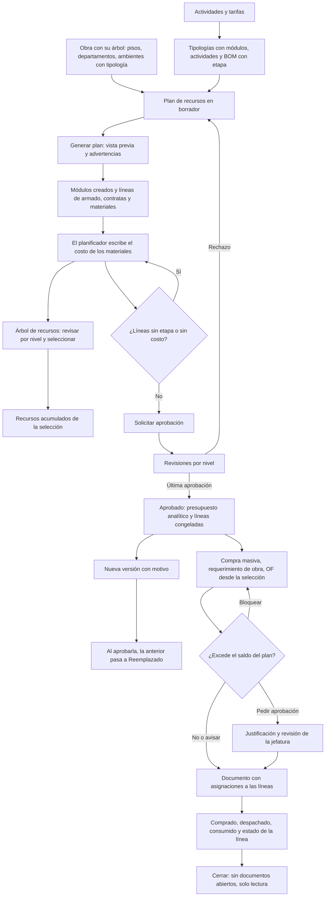

# Guía funcional — Planificación de obra (AL)

> Módulo técnico `al_construction_planner` · versión `4.20261010` · área `OL-PROJECTS`.
> Para consultores funcionales: qué resuelve, los conceptos que usa y el
> proceso de las fases 1 a 4 (plan, árbol, línea base, asignaciones y
> compras) con un ejemplo que cuadra. Enlaces verificados el
> 10/10/2026 con `docs/validacion/verificar_enlaces.py`.

## 1. Para qué sirve

Una obra de muebles a medida (cocinas, closets) se costea en un maestro de
Excel por tipología: módulos, metros lineales, materiales y contratas. El
planificador lleva ese maestro a Odoo y genera el **plan de recursos** de la
obra sobre su propio árbol de tareas (piso › departamento › ambiente ›
módulo), con el monto planificado de cada nivel. Lo usan Oficina Técnica
(planificador) y Jefatura de Proyectos.

Desde la fase 4 el plan también abastece: la compra masiva, los
requerimientos de obra y las órdenes de fabricación nacen de la selección
del árbol y descuentan el saldo de cada línea, con control de exceso.

Fuera del alcance de las fases 1 a 4: asignación de contratas, avances,
liquidaciones, cuadrillas, ingresos y cronograma (fases 5 a 8, ver
`docs/planificador/DISENO_TECNICO.md`).

## 2. Marco normativo y conceptual

No hay norma que obligue el proceso: es planificación de gestión. Conceptos:

| Término | Significado | Dónde en Odoo |
|---|---|---|
| Tipología | Plantilla de un ambiente (p. ej. «Cocina 01»): módulos, actividades y lista de materiales | Configuración ▸ Tipologías |
| Módulo | Mueble unitario (tornillo, tarugo, campana, cajonera…). Se paga el armado por módulo | Tarea de nivel Módulo |
| Driver | Unidad con la que se paga una contrata: und, ML (metro lineal) o módulo | Actividad de obra |
| ML bajo / alto | Suma de anchos de los módulos bajos o altos | Tipología |
| Etapa | Producción, Armado, Instalación, Acabado y entrega | Línea del plan, componente de la BOM |
| Tarifa | Precio del driver, por obra y contrata, con vigencia y retención | Configuración ▸ Tarifas de contrata |
| Línea base | Versión aprobada del plan: sus montos quedan congelados como presupuesto | Plan aprobado y su presupuesto analítico |
| Base del costo | Qué miró el planificador al fijar el costo (manual, último precio, ponderado de 3 o 6 meses) y su fecha | Línea del plan |
| Versión | Copia del plan para replanificar; la vigente sigue en uso hasta aprobar la nueva | Plan ▸ Nueva versión |
| Asignación | Parte de un documento (compra masiva, requerimiento, OF, OC de servicio, turno) que corresponde a una línea del plan | Plan ▸ Asignaciones |
| Fecha de necesidad | Inicio de la tarea menos la anticipación del tipo de recurso; ordena el reparto de lo hecho | Línea del plan |
| Saldo del plan | Planificado menos lo ya pedido (requerimientos de obra y OF) | Línea del plan; columna del requerimiento de obra |
| Política de exceso | Qué pasa al pedir más que el saldo más la tolerancia: avisar, pedir aprobación o bloquear | Plan ▸ Políticas |
| Compra masiva con analítica / stock general | Compra para la obra con su cuenta analítica, o para el almacén central descontando lo libre | Plan ▸ Compra masiva |

Prioridad de la tarifa: obra y contrata › solo obra › solo contrata › tarifa
base › precio de la actividad.

## 3. Proceso de inicio a fin

| # | Paso | Dónde en Odoo | Quién | Resultado |
|---|---|---|---|---|
| 1 | Cargar actividades y tarifas | Planificación de obra ▸ Configuración ▸ Actividades de obra / Tarifas de contrata | Administrador | Catálogo con drivers y precios |
| 2 | Indicar la etapa de consumo de cada componente | Fabricación ▸ Lista de materiales ▸ Componentes | Planificador | Columna «Etapa de consumo» |
| 3 | Crear las tipologías | Configuración ▸ Tipologías | Planificador | Módulos, actividades por ambiente y BOM |
| 4 | Crear el árbol de la obra | Proyecto ▸ Tareas (campo «Nivel de obra»; subtareas) | Planificador | Pisos, departamentos y ambientes con tipología |
| 5 | Crear el plan | Obras ▸ Planes de recursos ▸ Nuevo | Planificador | PLR/2026/##### · v1 en borrador |
| 6 | Generar | Plan ▸ Generar plan | Planificador | Módulos (estado Planificado) y líneas |
| 7 | Aplicar costos | Plan ▸ Aplicar costo (o Líneas ▸ seleccionar ▸ Aplicar costo) | Planificador | Costo y base en las líneas del producto |
| 8 | Revisar por nivel | Obras ▸ Árbol de recursos (o botón «Árbol de recursos» del plan) | Todos | Módulos, ML y montos de cada nivel |
| 9 | Seleccionar y revisar los recursos | Árbol de recursos: casillas de piso, departamento, ambiente o módulo | Planificador | Barra de selección y panel de recursos acumulados |
| 10 | Revisar el resumen por etapa | Plan ▸ pestaña Resumen por etapa | Planificador | Ninguna fila «Sin etapa» |
| 11 | Solicitar aprobación | Plan ▸ Solicitar aprobación | Planificador | En aprobación, con sus revisiones |
| 12 | Aprobar o rechazar | Plan ▸ Validar / Rechazar (bloque de revisiones) | Jefatura; gerencia sobre S/ 100 000 (reglas de ejemplo) | Aprobado con presupuesto, o de vuelta a borrador |
| 13 | Replanificar | Plan aprobado ▸ Nueva versión | Planificador | Versión nueva en borrador |
| 14 | Comprar en bloque | Árbol de recursos (selección) o plan ▸ Compra masiva | Planificador con requerimientos de compra | Requerimiento de compra (OCA) en borrador; sube el comprado |
| 15 | Pedir a la obra | Árbol de recursos o plan ▸ Requerimiento de obra | Planificador / residente | Requerimiento de obra en borrador con saldo y control por línea |
| 16 | Solicitar la aprobación del requerimiento | Requerimiento ▸ Solicitar aprobación | Residente | Según la política: sigue, pide justificación y revisión de la jefatura, o se bloquea |
| 17 | Fabricar | Árbol de recursos o plan ▸ Orden de fabricación; OF ▸ Confirmar | Planificador / planta | OF por piso con la BOM; al confirmar se controla el saldo; al cerrar sube lo consumido |
| 18 | Cerrar | Plan ▸ Cerrar | Administrador | Plan de solo lectura y presupuesto «Hecho» (no con documentos abiertos) |

Caminos alternativos: **volver a generar** (modo «Reemplazar lo generado»)
borra solo las líneas generadas de esos ambientes, conserva las manuales y
los costos escritos, y no duplica módulos. **Cancelar** un plan que no se
aprobó y **Volver a borrador** desde cancelado o desde «En aprobación» (las
revisiones se reinician). Si ninguna regla de aprobación aplica, «Solicitar
aprobación» aprueba directamente.

## 4. Ejemplo completo

Datos de demostración «DEMO PLAN MOMEN-35-26», piso 05 (script
`tools/planner_demo_data.py`). Tipología 01 (Dpto 501), de la especificación:

| Concepto | Driver | Tarifa | Monto S/ |
|---|---|---|---|
| Armado: 1 tornillo, 3 tarugo, microondas, campana, cajonera | 7 módulos | 6 · 8 · 10 · 7 · 7 | 54.00 |
| Colocación de puertas | 1.93 und | 3.00 | 5.79 |
| Entarugado de muebles | 8.5 und | 3.00 | 25.50 |
| **Armado de la tipología** | | | **85.29** |
| Instalación mueble bajo / alto | 2.12 / 2.10 ML | 18.00 (tarifa de la obra) | 38.16 + 37.80 |

Piso completo tras generar y aplicar costos:

| Nivel | Módulos | ML | Material | Contrata | Total |
|---|---|---|---|---|---|
| Dpto 501 | 7 | 4.22 | 735.29 | 258.37 | 993.66 |
| Dpto 502 | 8 | 5.00 | 795.84 | 272.80 | 1,068.64 |
| Dpto 503 | 10 | 5.52 | 897.68 | 307.30 | 1,204.98 |
| Dptos 504 a 508 | 41 | 26.59 | 4,214.10 | 1,463.06 | 5,677.16 |
| **Piso 05** | **66** | **41.33** | **6,642.91** | **2,301.53** | **8,944.44** |

La instalación del piso suma S/ 941.17 (instalación, regulación, tapas,
recortes, pines y push), como en P-05 de la especificación. El reparto entre
las tipologías 04 a 08 y los precios de material son de ejemplo y cuadran con
una línea de ajuste marcada «(ajuste demo)».

### Árbol de recursos (P-02)

**Obras ▸ Árbol de recursos** muestra la obra como árbol: obra › piso ›
departamento › ambiente › módulo. Cada nivel se abre con la flecha y trae
sus módulos, ML, material, contrata y total. En el piso 05 de demostración:

| Fila | Módulos | ML | Material | Contrata | Total |
|---|---|---|---|---|---|
| Piso 05 | 66 | 41.33 | 6,642.91 | 2,301.53 | 8,944.44 |
| Dpto 501 | 7 | 4.22 | 735.29 | 258.37 | 993.66 |

- **Marcar** el piso marca todos sus departamentos, ambientes y módulos; la
  barra de selección muestra «66 módulos · 8 ambientes · 41.33 ML ·
  S/ 8,944.44». **Desmarcar** un módulo deja al ambiente, al departamento y
  al piso con un guion (selección parcial) y la barra pasa a 65 módulos.
- El panel **Recursos acumulados de la selección** lista cada actividad,
  material o rol con su cantidad de driver, lo ejecutado (desde la fase de
  avances), el monto y la contrata asignada («sin asignar» si falta).
  «Ver solo lo que no tiene contrata» filtra contratas y personal sin
  asignar.
- **Filtros**: etapa (p. ej. solo instalación: S/ 941.17 de contrata en el
  piso 05), tipo de recurso, estado del módulo y contrata.
- **Medida**: soles, cantidad de driver o avance (el avance por driver llega
  con la fase de contratas y avances; hoy el módulo muestra su estado).
- Los botones de la barra (compra, requerimiento, fabricación, contrata,
  cuadrilla, avance, fechas) aparecen a medida que se instalan sus fases.

### Línea base (P-03)

Con `tools/planner_demo_baseline.py` la versión 1 del piso 05 queda
aprobada (la melamina RH, sin etapa en el maestro, se asigna a Producción
antes de pedir la aprobación) y su resumen por etapa cuadra con el
presupuesto:

| Etapa | Material | Contrata | Planificado | Presupuesto | Diferencia |
|---|---|---|---|---|---|
| Producción | 4,928.28 | — | 4,928.28 | 4,928.28 | 0.00 |
| Armado | 1,638.63 | 781.29 | 2,419.92 | 2,419.92 | 0.00 |
| Instalación | 55.00 | 941.17 | 996.17 | 996.17 | 0.00 |
| Acabado y entrega | 21.00 | 579.07 | 600.07 | 600.07 | 0.00 |
| **Total** | **6,642.91** | **2,301.53** | **8,944.44** | **8,944.44** | **0.00** |

El presupuesto analítico «DEMO PLAN MOMEN-35-26 · PLR/2026/00018 · v1» tiene
una línea de S/ 8,944.44 en la cuenta de la obra: todas las líneas usan la
distribución por defecto (cuenta de la obra al 100 %). Si una línea reparte
60 % / 40 % entre dos partidas de otro plan analítico, el presupuesto tiene
una línea por combinación (obra + partida) con ese reparto.

**Aplicar costo (W-12).** La melamina blanca tiene tres compras confirmadas:
20 a S/ 118.50 (hace 150 días), 35 a S/ 122.00 (75 días) y 15 a S/ 124.90
(20 días). El asistente sugiere:

| Base | Cálculo | Costo |
|---|---|---|
| Último precio | La compra más reciente | 124.90 |
| Ponderado de 3 meses | (35 × 122.00 + 15 × 124.90) ÷ 50 | 122.87 |
| Ponderado de 6 meses | (20 × 118.50 + 35 × 122.00 + 15 × 124.90) ÷ 70 | 121.62 |

El planificador puede escribir otro costo; las 8 líneas quedan con 121.62 y
la base «Ponderado de 6 meses al 10/10/2026: 121,62».

**Nueva versión (W-09).** La versión 2 copia las 226 líneas (enlazadas a las
de la v1), aplica el ponderado (material de Producción 4,928.28 → 4,109.22;
el maestro tenía 168.00) y agrega la rejilla de ventilación sin etapa ni
costo. Su resumen compara contra el presupuesto vigente (diferencia
−819.06) y muestra la fila «Sin etapa»; «Solicitar aprobación» se bloquea
listando la rejilla en «Líneas sin etapa» y «Líneas sin costo». Al aprobarla,
la v1 pasará a «Reemplazado» y su presupuesto a «Revisado».

### Asignaciones y compras (P-10, P-11)

Con `tools/planner_demo_supply.py`, sobre la versión 1 vigente del piso 05:

**Compra masiva con analítica (W-02)**, solo Producción del piso 05. La
necesidad es lo planificado menos lo ya comprado o pedido; las planchas se
redondean a entero hacia arriba:

| Material | Necesidad | A comprar |
|---|---|---|
| Melamina MDP blanco fantasía | 17.66 | 18 planchas |
| Melamina coñac | 8.22 | 9 planchas |
| Melamina blanco RH fantasía | 2.26 | 3 planchas |

El requerimiento de compra PR lleva la cuenta de la obra en cada línea
(modo «Con analítica de la obra») y 24 asignaciones (una por cocina y
material, 30 planchas en total): la primera cocina que se necesita recibe
su parte y el redondeo va a la última. En **stock general** la necesidad se
descuenta de lo libre en el central y de lo que ya viene en compras, sin
analítica de obra.

**Requerimiento de obra del piso (W-03)**, instalación y acabado, agrupado
por piso: 1,100 tornillos 4×50 y 700 tapatornillos, cada línea con la tarea
«Piso 05» y 8 asignaciones (una por cocina). Control «En plan»; queda en
aprobación con las reglas del requerimiento.

**Exceso (W-10).** Un segundo requerimiento del Dpto 501 pide 20 tornillos
más: su saldo ya es 0 (los 121 del plan los pidió el requerimiento del
piso) y la columna «Control» dice «Excede 20». Con la política del plan
**pedir aprobación**, «Solicitar aprobación» abre el asistente de exceso; la
justificación es obligatoria («Reposición por piezas dañadas en el
traslado») y el requerimiento recibe la revisión adicional «Exceso sobre el
plan: jefatura del planificador». Con **avisar** basta confirmar; con
**bloquear** no se envía. La tolerancia del plan (p. ej. 10 %) deja pasar
pedidos hasta lo planificado más ese porcentaje.

**Orden de fabricación (W-04)** del Dpto 502: 1 «Cocina tipo 02» con la BOM
de la tipología; asignaciones a las líneas de producción y armado de esa
cocina (melamina blanca 2.15, coñac 1.00, RH 0.28, bisagras 12 y un
herraje). Los tornillos y tapatornillos de la BOM (instalación y acabado) no
se asignan: van a la obra con el requerimiento. Al confirmar se controla el
saldo de esas líneas con la misma política (el exceso de una OF lo confirma
la jefatura); al cerrarla, sus consumos suben lo consumido y la línea pasa a
«Completa».

Estado de la línea (en este orden): **Excedida** (pedido mayor que lo
planificado más la tolerancia), **Completa** (llegó a la obra lo
planificado), **En compra** (compra masiva abierta o faltante en compra),
**Parcial** y **Planificada**.

## 5. Configuración inicial

1. Instalar el módulo desde Aplicaciones.
2. Marcar la obra con **Es obra** (Proyecto ▸ Ajustes ▸ Obra).
3. Asignar grupos en Ajustes ▸ Usuarios: **Planificador** a Oficina Técnica,
   **Administrador** a Jefatura de Proyectos, **Reporte de avance** a
   capataces y supervisores.
4. Cargar actividades, tarifas y tipologías (pasos 1 a 3).
5. Definir las reglas de aprobación del plan en **Configuración ▸ Reglas de
   aprobación** (por grupo o usuario, con condición por monto
   `amount_total`). Sin reglas, el plan se aprueba al solicitarlo.
6. La obra necesita su cuenta analítica (o cada línea su distribución) para
   crear el presupuesto.
7. Política de exceso y tolerancia en **Plan ▸ Políticas** (en borrador).
8. Para comprar y pedir desde el plan, el planificador necesita también los
   grupos de **requerimientos de compra** y de **requerimientos de obra**
   (y de **fabricación** para las OF).
9. La regla «Exceso sobre el plan: jefatura del planificador» del
   requerimiento de obra viene con el módulo (Requerimientos de obra ▸
   Configuración ▸ Reglas de aprobación). Sus revisores deben poder ver los
   requerimientos: déles también el grupo de aprobador del requerimiento.

## 6. Reportes y libros relacionados

- Planes de recursos (lista con montos por tipo y estado).
- Recursos planificados (pivote por departamento y etapa).
- Resumen por etapa del plan (P-03): planificado, presupuesto, diferencia,
  comprometido, real y saldo.
- Análisis del plan: pivote y gráfico de las líneas de los planes vigentes.
- Presupuesto analítico de cada versión aprobada (Contabilidad ▸
  Presupuestos), con lo alcanzado por los apuntes analíticos.
- Árbol de recursos (P-02): árbol por niveles con la selección y sus recursos.
- Tareas de la obra (lista de niveles con su monto planificado).
- Asignaciones del plan (Abastecimiento ▸ Asignaciones del plan, o el botón
  del plan): por documento y producto, con lo asignado, lo ejecutado y su
  estado; pivote.
- Columnas de ejecución de las líneas: pedido, comprado, despachado,
  consumido y saldo por pedir.

No alimenta libros PLE ni archivos SUNAT.

## 7. Casos especiales y errores frecuentes

| Situación | Qué pasa | Qué hacer |
|---|---|---|
| Ambiente sin tipología | No se genera; se avisa | Asignar la tipología al ambiente |
| Componente sin etapa de consumo | La línea se genera «sin etapa» y se avisa | Indicar la etapa en la BOM y regenerar |
| Líneas de material sin costo | Se avisa | Escribir el costo unitario |
| Tipología sin anchos | La instalación por ML queda en el ambiente; se avisa | Cargar los anchos del ETO por módulo |
| El ambiente ya tiene módulos del ETO | Se usan por código; los que faltan se avisan | Crear el módulo faltante o corregir el código |
| «Debe colgar de un …» | Un nivel no cuelga del nivel inmediato superior | Corregir la tarea padre |
| «Ya tiene un plan en preparación» | Solo un borrador o en aprobación por obra | Usar el existente o cancelarlo |
| El árbol no muestra líneas de ambiente con el filtro «Estado del módulo» | Ese filtro solo aplica a lo que cuelga de un módulo | Quitar el filtro para ver instalación y actividades por ambiente |
| Editar una línea de un plan aprobado | Bloqueado (salvo la fecha de necesidad) | Crear una versión nueva (Nueva versión) |
| «No se puede enviar a aprobación» | Hay líneas sin etapa, sin costo o contratas sin actividad (el mensaje las lista) | Corregir la etapa, aplicar el costo o asignar la actividad |
| «Ya tiene la versión … en preparación» | Solo una versión en preparación por obra | Terminarla o cancelarla |
| El revisor no ve el botón Validar | No pertenece al grupo de la regla o falta un nivel previo | Revisar la regla y el orden de los niveles |
| Comprometido y real en cero | Se llenan con las asignaciones (compra, requerimiento, OF); contratas y personal desde la fase 5 | Generar los documentos desde el plan |
| «El plan … no está vigente» al abrir una compra masiva, requerimiento u OF | Los asistentes trabajan sobre el plan aprobado o en ejecución | Aprobar el plan |
| El asistente no propone un material | Ya no tiene saldo (comprado o pedido) o su etapa no está marcada | Revisar las etapas y las asignaciones de la línea |
| «Pide más de lo que queda en el plan … bloquear» | La política del plan es bloquear | Reducir la cantidad o replanificar |
| «Fuera de plan» en el requerimiento | El material no está en el plan bajo el nivel de la línea | Pedirlo en el nivel correcto o justificarlo |
| «El exceso de una OF lo aprueba la jefatura» | Política «pedir aprobación» en una OF | Que el administrador del planificador confirme la OF |
| «Tiene documentos abiertos» al cerrar el plan | Hay compras, requerimientos u OF sin terminar | Terminarlos o cancelarlos |
| Consumido en cero en material de obra | Se cuenta lo que sale de la ubicación de la obra a una ubicación de consumo | Registrar el consumo en obra |
| Eliminar un plan aprobado | No se permite: queda como historia de la obra | Cerrarlo o reemplazarlo con una versión nueva |

## 8. Preguntas frecuentes del consultor

- **¿Por qué el material sale sin costo?** La especificación pide que lo
  escriba el planificador tras revisar los precios de compra; al regenerar se
  conserva el ya escrito.
- **¿Las contratas tienen costo?** Sí: la tarifa vigente de la obra como
  referencia.
- **¿Puedo tener tarifas distintas por contrata?** Sí, con la combinación
  obra + contrata; sin superponer vigencias.
- **¿Qué pasa con el presupuesto de la versión anterior?** Pasa a
  «Revisado» y la nueva lo tiene como presupuesto padre: queda la historia
  de revisiones en Contabilidad ▸ Presupuestos.
- **¿«Solo saldos» copia menos líneas?** Copia lo planificado menos lo
  pedido con documentos ya cerrados; los abiertos pasan a la versión nueva
  al aprobarla y siguen contando allí. Las líneas totalmente cubiertas no se
  copian.
- **¿La compra masiva cuenta como pedido de la obra?** No: sube el
  comprado. El pedido es de los requerimientos de obra y las OF.
- **¿Cómo se reparte una compra entre varias cocinas?** Por fecha de
  necesidad: primero la que se necesita antes, hasta su saldo; lo que sobra
  (redondeo o exceso), a la última.
- **¿El residente ve el plan?** No: ve el saldo y el control en su
  requerimiento; el plan solo lo ven los usuarios del planificador.
- **¿El costo sugerido incluye descuentos y otra moneda?** Sí: usa el precio
  neto de descuento, en la unidad del producto y convertido a la moneda de la
  compañía al tipo de cambio de la fecha de cada compra.

## 9. Referencias

- Especificación v1.4: [`docs/planificador/ESPECIFICACION_v1.4.md`](../../docs/planificador/ESPECIFICACION_v1.4.md)
- Diseño técnico: [`docs/planificador/DISENO_TECNICO.md`](../../docs/planificador/DISENO_TECNICO.md)
- Odoo 19, Proyecto: https://www.odoo.com/documentation/19.0/applications/services/project.html
- Odoo 19, Fabricación (listas de materiales): https://www.odoo.com/documentation/19.0/applications/inventory_and_mrp/manufacturing.html
- Odoo 19, Presupuestos: https://www.odoo.com/documentation/19.0/applications/finance/accounting/reporting/budget.html
- OCA `base_tier_validation` (rama 18.0; la 19.0 aún no está publicada): https://github.com/OCA/server-ux/tree/18.0/base_tier_validation
