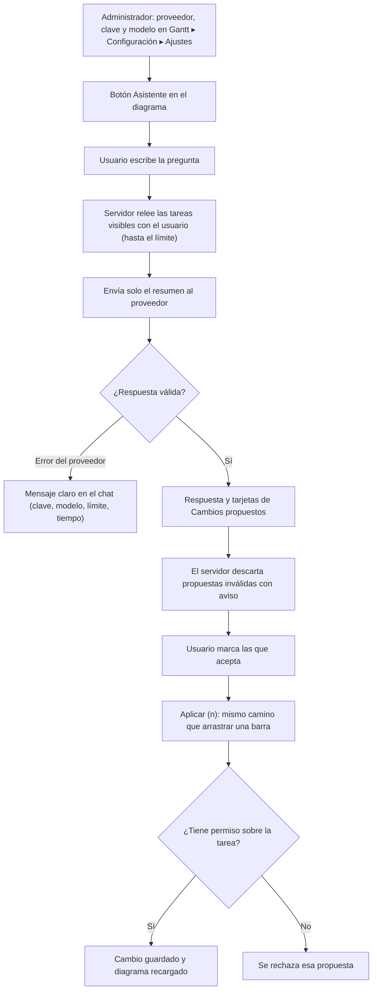

# Guía funcional — Asistente de IA para el Gantt

> Módulo técnico `al_project_gantt_ai` · versión `5.20261008` · área `OL-PROJECTS`.
> Para consultores funcionales: qué resuelve, qué datos salen de Odoo y el
> proceso completo con un ejemplo. Enlaces verificados el 10/10/2026 con
> `docs/validacion/verificar_enlaces.py`.

## 1. Para qué sirve

Pone un **chat dentro del diagrama de Gantt** del backend para preguntar por
el cronograma («¿qué tareas van con retraso?», «¿hay solapamientos en la ruta
crítica?») y recibir **propuestas de cambio concretas** (fechas, avance,
nombre, personas asignadas). La IA **nunca escribe** en Odoo: el usuario
revisa cada propuesta y la aplica con un botón, con sus propios permisos.

Lo usan jefes de proyecto y planificadores. **Fuera del alcance:** el sitio
web `/gantt` (solo backend), crear o borrar tareas desde el chat, y créditos
del proveedor de IA (se contratan aparte).

## 2. Marco normativo y conceptual

- **Datos personales (Perú).** Si se envían las personas asignadas a un
  proveedor externo, es tratamiento y transferencia de datos personales según
  la Ley 29733 de Protección de Datos Personales; la empresa decide si lo
  permite (casilla **Enviar personas asignadas**)
  ([Ley 29733](https://www.gob.pe/institucion/minjus/normas-legales/243470-29733),
  [Autoridad Nacional de Protección de Datos Personales](https://www.gob.pe/anpd)).
- **Proveedores de IA.** Se conecta por HTTP directo a Anthropic (Claude),
  OpenAI o DeepSeek, con la clave de la empresa
  ([Anthropic](https://docs.anthropic.com/en/api/overview),
  [OpenAI](https://developers.openai.com/api/docs),
  [DeepSeek](https://api-docs.deepseek.com/)).
- **Propuestas estructuradas («function calling»).** El modelo no devuelve
  texto libre para los cambios, sino propuestas con campos definidos que el
  servidor valida antes de mostrarlas.

| Se envía al proveedor | No se envía |
|---|---|
| Nombre y proyecto de la tarea | Descripción |
| Fechas de inicio y fin | Mensajes y chatter |
| Estado y avance | Adjuntos |
| Dependencias visibles | Cliente o contacto |
| Personas asignadas (opcional) | Etiquetas, horas e importes |

## 3. Proceso de inicio a fin

| # | Paso | Dónde en Odoo | Quién | Resultado |
|---|---|---|---|---|
| 1 | Conectar el proveedor | Gantt ▸ Configuración ▸ Ajustes | Administrador del sistema | Proveedor, clave (queda en el servidor) y modelo |
| 2 | Ajustar límites | Mismos ajustes: esfuerzo, tokens máximos (8 000), tiempo de espera (90 s), tareas por consulta (200) | Administrador | Costo y privacidad acotados |
| 3 | Abrir el panel | Gantt ▸ Diagrama de Gantt ▸ Asistente | Usuario | Panel con proveedor, modelo y preguntas de ejemplo |
| 4 | Preguntar | Asistente ▸ «Pregunte algo sobre este cronograma…» | Usuario | Respuesta en la conversación |
| 5 | Revisar y aplicar | Asistente ▸ Cambios propuestos ▸ Aplicar (n) | Usuario | Solo se guardan las propuestas marcadas |

## 4. Ejemplo completo

Proyecto «[DEMO Gantt] Edificio A», proveedor configurado. La pregunta y
las propuestas son **ilustrativas** (la respuesta exacta depende del modelo);
el desvío de 7,2 días es el de la línea base de demostración.

1. Pregunta: «¿Qué tareas de Obra gruesa están atrasadas respecto a la línea
   base y cómo recupero el plazo?».
2. El servidor relee las tareas visibles del usuario (por ejemplo 18 de un
   máximo de 200) y envía nombre, fechas, estado, avance y dependencias.
3. La respuesta explica que «Obra gruesa» termina 7,2 días después de la
   línea base y propone dos tarjetas:
   - «Cimentación» — Avance: 20 % → 60 % (motivo: el residente reporta el
     vaciado terminado);
   - «Acabados» — Inicio: 10/12 → 05/12 (motivo: puede empezar en paralelo).
4. El usuario marca solo la primera y pulsa **Aplicar (1)**: se guarda el
   avance de «Cimentación» con sus permisos y el diagrama se recarga. La
   segunda no se aplica.
5. Si hubiera propuesto un avance de 140 % o una tarea fuera de la vista, el
   chat mostraría «propuesta descartada» y no llegaría a tarjeta.

## 5. Configuración inicial

1. Instalar **Gantt de Proyectos — Asistente IA** (requiere el Gantt del
   backend).
2. Crear la clave de API en la consola del proveedor.
3. **Gantt ▸ Configuración ▸ Ajustes:** proveedor, clave, modelo (se propone
   solo: `claude-opus-5-5`, `gpt-5` o `deepseek-chat`), y opcionalmente URL base
   para pasarelas compatibles.
4. Definir la política de privacidad: activar o no **Enviar personas
   asignadas** (necesario para proponer reasignaciones).
5. Acotar **Tareas por consulta** y **Tokens máximos** para controlar el costo.

## 6. Reportes y libros relacionados

No genera reportes. Los cambios aplicados quedan en las tareas (y en su
historial) como cualquier edición del Gantt; los informes Excel/PDF del
núcleo reflejan el plan resultante.

## 7. Casos especiales y errores frecuentes

| Situación | Qué pasa | Qué hacer |
|---|---|---|
| No aparece el botón Asistente | Falta la clave o el modelo | Completar los ajustes |
| «Clave rechazada» | El proveedor no reconoce la clave | Revisarla en su consola |
| «Modelo desconocido» | El nombre del modelo no existe en ese proveedor | Elegir uno vigente que admita function calling |
| «Límite de peticiones» o tiempo agotado | Cupo del proveedor o respuesta lenta | Esperar o subir el tiempo de espera |
| No propone reasignaciones | «Enviar personas asignadas» desactivado | Activarlo si la política de datos lo permite |

## 8. Preguntas frecuentes del consultor

- **¿La IA puede cambiar datos sola?** No. Solo propone; el usuario aplica.
- **¿La clave se ve en el navegador?** No; queda en los parámetros del
  servidor.
- **¿Qué cuesta?** El uso se factura según el contrato con el proveedor; el
  módulo no incluye créditos.
- **¿Sirve sin internet o con un modelo local?** Solo si existe una pasarela
  compatible con la API de esos proveedores (URL base).

## 9. Referencias

Verificadas el 10/10/2026:

- Ley 29733, Protección de Datos Personales: https://www.gob.pe/institucion/minjus/normas-legales/243470-29733
- Autoridad Nacional de Protección de Datos Personales: https://www.gob.pe/anpd
- Anthropic — API: https://docs.anthropic.com/en/api/overview
- OpenAI — API: https://developers.openai.com/api/docs
- DeepSeek — API: https://api-docs.deepseek.com/
- Odoo 19 — Proyecto: https://www.odoo.com/documentation/19.0/applications/services/project.html
