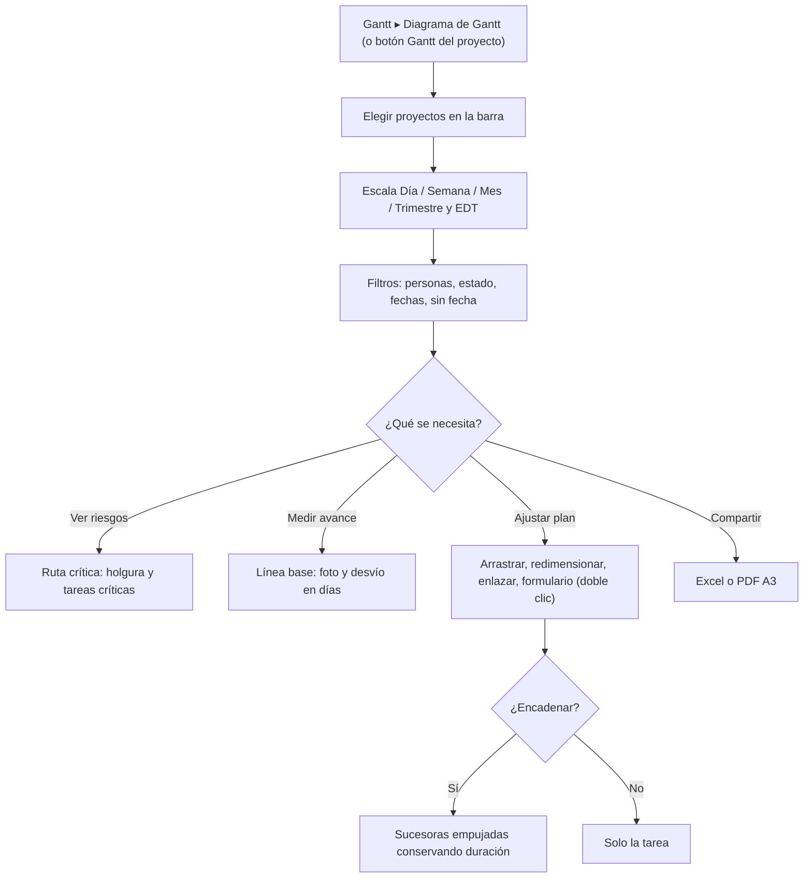

# Guía funcional — Diagrama de Gantt de proyectos (backend)

> Módulo técnico `al_project_gantt_backend` · versión `14.20261009` · área `OL-PROJECTS`.
> Para consultores funcionales: qué resuelve, los conceptos que usa y el
> proceso completo con un ejemplo. Enlaces verificados el 10/10/2026 con
> `docs/validacion/verificar_enlaces.py`.

## 1. Para qué sirve

Añade la aplicación **Gantt** al menú principal de Odoo: un diagrama de
barras de uno, varios o todos los proyectos, editable con el ratón, con ruta
crítica, líneas base, filtros, EDT y exportación a Excel y PDF. Lo usan
jefes de proyecto, planificadores y gerencia para ver y ajustar el
cronograma sin salir de Odoo.

La lógica (lectura, escritura, cálculos e informes) vive en el núcleo
`al_project_gantt_base`; este módulo es la pantalla. **Fuera del alcance:**
gestión de recursos (histograma, nivelación), calendarios en la
reprogramación y dependencias con retraso; el asistente de IA es un módulo
aparte (`al_project_gantt_ai`).

## 2. Marco normativo y conceptual

Sin norma peruana aplicable: el marco es la planificación de proyectos
(diagrama de Gantt, EDT, ruta crítica, línea base), explicado en la guía del
núcleo (`al_project_gantt_base/GUIA_FUNCIONAL.md`). Puntos clave para el
usuario de esta pantalla:

| Término | En pantalla |
|---|---|
| Barra | Periodo de la tarea; el color indica su estado |
| Flecha | Dependencia fin-comienzo |
| Rombo | Hito del proyecto o tarea de duración cero |
| Trama | Tarea que el usuario no puede modificar |
| Punto rojo/naranja/verde | Actividad atrasada, para hoy o planificada |
| Holgura (h) / Desvío (d) | Ruta crítica / comparación con la línea base |

Datos y permisos son los nativos de Proyecto
([Proyecto en Odoo 19](https://www.odoo.com/documentation/19.0/applications/services/project.html)).

## 3. Proceso de inicio a fin

| # | Paso | Dónde en Odoo | Quién | Resultado |
|---|---|---|---|---|
| 1 | Abrir el diagrama | Gantt ▸ Diagrama de Gantt, o Proyecto ▸ (proyecto) ▸ botón Gantt | Usuario con el grupo Gantt | Diagrama de los proyectos elegidos |
| 2 | Escala y EDT | Botones Escala y EDT | Usuario | Vista por día, semana, mes o trimestre con código EDT |
| 3 | Filtrar | Botón Filtros | Usuario | Personas, estado, rango de fechas, incluir sin fecha |
| 4 | Ruta crítica | Botón Ruta crítica | Jefe de proyecto | Columna Holgura (h) y tareas críticas resaltadas |
| 5 | Línea base | Cámara (guardar) y desplegable «Sin línea base» | Jefe de proyecto | Barra gris del plan original y columna Desvío (d) |
| 6 | Editar | Arrastre, doble clic (formulario), clic derecho | Usuario con permiso | Guardado inmediato; si el servidor rechaza, se avisa y recarga |
| 7 | Exportar | Botones Excel / PDF | Usuario | Archivo con filtros y escala de la pantalla |

## 4. Ejemplo completo

Proyectos «[DEMO Gantt] Edificio A» y «[DEMO Gantt] Migración ERP».

1. Desde **Proyecto ▸ Edificio A** el botón **Gantt** muestra el número de
   tareas planificadas y abre el diagrama acotado a ese proyecto.
2. **Escala Mes + EDT:** «Expediente técnico» = 1, «Planos estructurales» =
   1.1, «Obra gruesa» = 2, «Cimentación» = 2.2, «Acabados» = 3.
3. **Ruta crítica:** «Entrega de obra» tiene holgura 0 → es crítica.
4. **Línea base del 17/08/2026** (desvío = fin actual − fin en la foto):

| EDT | Tarea | Fin actual | Desvío (d) |
|---|---|---|---|
| 1 | Expediente técnico | 08/10/2026 | −6,7 |
| 1.1 | Planos estructurales | 13/10/2026 | +0,3 |
| 2 | Obra gruesa | 25/12/2026 | +7,2 |
| 2.2 | Cimentación | 29/11/2026 | +0,3 |
| 3 | Acabados | 10/01/2027 | 0 |

5. **Editar con «Encadenar»:** retrasar «Excavación» (28/10–09/11) 5 días la
   lleva a 02/11–14/11 y empuja «Cimentación» a 14/11–04/12 y «Estructura» a
   04/12–01/01, cada una con su duración (12, 20 y 28 días).
6. **Exportar** el resultado a PDF A3 para la reunión de obra.

## 5. Configuración inicial

1. Instalar **Gantt de Proyectos — Backend** (instala el núcleo).
2. Dar **Gantt de Proyectos: Usuario** a quien lo necesite (los
   administradores de Proyecto ya lo tienen).
3. Asegurar que las tareas tengan **fecha límite** (y fecha de inicio si la
   edición la tiene).
4. Opcional: **Gantt ▸ Configuración ▸ Colores por estado**.

## 6. Reportes y libros relacionados

Excel (hojas *Tareas* y *Diagrama*) y PDF A3 apaisado, ambos generados en el
servidor con lo que está en pantalla. No alimenta libros contables.

## 7. Casos especiales y errores frecuentes

| Situación | Qué pasa | Qué hacer |
|---|---|---|
| Aviso «tareas sin fecha límite» | No se pueden dibujar | Darles fecha o activar «Incluir sin fecha» |
| «Aplicar» desactivado en Filtros | «Desde» es posterior a «Hasta» | Corregir el rango |
| No aparece «Añadir subtarea» | El usuario no puede crear tareas | Revisar permisos de Proyecto |
| Días sombreados no se ven | Solo se aprecian en la escala Día | Cambiar a Día |

## 8. Preguntas frecuentes del consultor

- **¿Reemplaza la vista Gantt de Enterprise?** No la usa; es una aplicación
  aparte y funciona también en Community.
- **¿Se pierde algo al editar desde el Gantt?** El formulario es corto a
  propósito; **Abrir en Odoo** lleva a la ficha completa (descripción,
  chatter, adjuntos).
- **¿Varios proyectos a la vez?** Sí, con los botones de proyecto o «Todos».

## 9. Referencias

Verificadas el 10/10/2026:

- Odoo 19 — Proyecto: https://www.odoo.com/documentation/19.0/applications/services/project.html
- dhtmlxGantt — documentación: https://docs.dhtmlx.com/gantt/
- dhtmlxGantt — ruta crítica: https://docs.dhtmlx.com/gantt/desktop__critical_path.html
- dhtmlxGantt — líneas base: https://docs.dhtmlx.com/gantt/desktop__baselines.html
