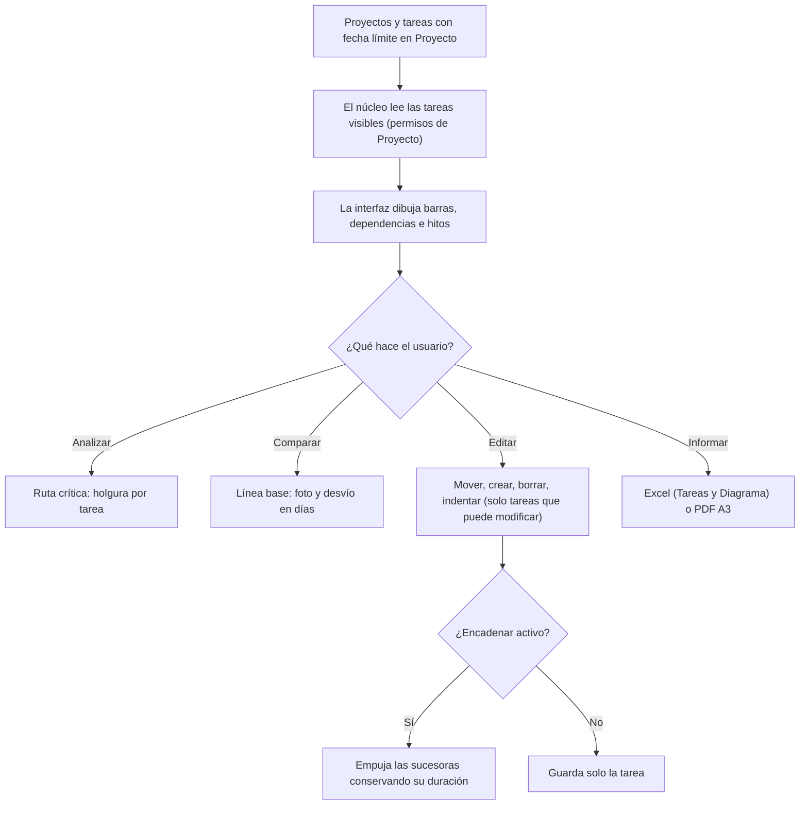

# Guía funcional — Gantt de Proyectos (núcleo común)

> Módulo técnico `al_project_gantt_base` · versión `16.20261008` · área `OL-PROJECTS`.
> Para consultores funcionales: qué resuelve, los conceptos de planificación
> que aplica y el proceso completo con un ejemplo. Enlaces verificados el
> 10/10/2026 con `docs/validacion/verificar_enlaces.py`.

## 1. Para qué sirve

Es el **núcleo** de la suite Gantt: lee las tareas de Proyecto, calcula la
ruta crítica y las líneas base, aplica los cambios con los permisos de cada
usuario y genera los informes Excel y PDF. **No tiene pantalla propia**: lo
usan las dos interfaces, la aplicación del backend
(`al_project_gantt_backend`) y la página web `/gantt`
(`al_project_gantt_website`), y el asistente de IA (`al_project_gantt_ai`).

Lo configura el administrador (colores por estado, permisos, parámetros); el
resto de usuarios lo percibe a través de las interfaces.

**Fuera del alcance:** histograma y nivelación de recursos, calendarios
laborales en la reprogramación (los días no laborables solo se sombrean),
dependencias con tipo o retraso (todas son fin-comienzo) y plantillas de
plan. Funciona en Community y Enterprise y **no usa** la vista Gantt de
Enterprise.

## 2. Marco normativo y conceptual

No hay norma peruana que regule la planificación de proyectos; el marco es
metodológico. Conceptos que aplica el módulo:

| Término | Significado | Dónde aparece en Odoo |
|---|---|---|
| Diagrama de Gantt | Barras de cada tarea sobre una línea de tiempo | Gantt ▸ Diagrama de Gantt |
| EDT (WBS) | Código jerárquico de la tarea: 1, 1.1, 1.2… | Botón EDT, Excel y PDF |
| Dependencia fin-comienzo | B no empieza hasta que termina A | Flechas entre barras |
| Ruta crítica (CPM) | Cadena de tareas sin holgura: si se retrasan, se retrasa el proyecto | Botón Ruta crítica, columna Holgura (h) |
| Holgura total | Cuánto puede retrasarse una tarea sin mover el fin del proyecto | Columna Holgura (h) |
| Línea base | Foto inmutable del plan para medir el desvío | Botón de la cámara, columna Desvío (d) |
| Hito | Evento de duración cero (entrega, aprobación) | Rombos en el diagrama |

La librería de dibujo es dhtmlxGantt (edición MIT, empaquetada en el
módulo); su edición gratuita no trae ruta crítica ni exportación local, por
eso el módulo las calcula y genera en el servidor
([documentación de la librería](https://docs.dhtmlx.com/gantt/),
[ruta crítica](https://docs.dhtmlx.com/gantt/desktop__critical_path.html),
[líneas base](https://docs.dhtmlx.com/gantt/desktop__baselines.html)). Los
datos son las tareas y proyectos nativos de Odoo
([Proyecto en Odoo 19](https://www.odoo.com/documentation/19.0/applications/services/project.html)).

## 3. Proceso de inicio a fin

| # | Paso | Dónde en Odoo | Quién | Resultado |
|---|---|---|---|---|
| 1 | Dar fechas a las tareas | Proyecto ▸ tarea ▸ Fecha límite (y Planificado en Enterprise) | Jefe de proyecto | Las tareas con fecha de fin se dibujan |
| 2 | Asignar acceso | Ajustes ▸ Usuarios ▸ Permisos: «Gantt de Proyectos» Usuario / Administrador | Administrador | Los usuarios internos ven el Gantt |
| 3 | Colores por estado | Gantt ▸ Configuración ▸ Colores por estado | Administrador | Barras coloreadas por estado de la tarea |
| 4 | Ver y editar | Gantt ▸ Diagrama de Gantt (o /gantt) | Usuarios | Cambios guardados al momento con sus permisos |
| 5 | Ruta crítica y línea base | Botones del diagrama | Jefe de proyecto | Holgura, tareas críticas y desvío |
| 6 | Informes | Botones Excel / PDF | Cualquiera | Archivo con los filtros y la escala en pantalla |

**Reglas importantes:** sin fecha de fin la tarea no se dibuja (se avisa y
puede incluirse como «sin fecha»); sin fecha de inicio se calcula 8 horas
antes del fin; si hay más tareas que el límite (2 000) el resultado se marca
como recortado, nunca en silencio.

## 4. Ejemplo completo

Proyecto de demostración «[DEMO Gantt] Edificio A». Tres tareas encadenadas
fin-comienzo:

| Tarea | Inicio | Fin | Duración |
|---|---|---|---|
| Excavación | 28/10 | 09/11 | 12 días |
| Cimentación (depende de Excavación) | 09/11 | 29/11 | 20 días |
| Estructura (depende de Cimentación) | 29/11 | 27/12 | 28 días |

**Retrasar Excavación 5 días con «Encadenar»:** cada sucesora se empuja lo
justo para empezar cuando termina su predecesora y conserva su duración:

| Tarea | Antes | Después |
|---|---|---|
| Excavación | 28/10 – 09/11 | 02/11 – 14/11 |
| Cimentación | 09/11 – 29/11 | 14/11 – 04/12 |
| Estructura | 29/11 – 27/12 | 04/12 – 01/01 |

**Ruta crítica:** las tareas de la cadena que termina en «Entrega de obra»
tienen holgura 0 y se resaltan; una tarea paralela con 3 días de margen
mostraría «Holgura (h)» = 72 (3 × 24 h).

**Línea base del 17/08/2026:** «Obra gruesa» termina hoy el 25/12/2026 y en
la foto terminaba 7,2 días antes, así que su **Desvío (d)** es +7,2 (en
rojo); «Expediente técnico» muestra −6,7 (adelanto, en verde).

## 5. Configuración inicial

1. Instalar la interfaz que se vaya a usar (backend y/o sitio web): instalan
   este núcleo solas.
2. Dar el grupo **Gantt de Proyectos: Usuario** (o Administrador) a quien lo
   necesite; los administradores de Proyecto lo reciben al instalar.
3. Revisar **Gantt ▸ Configuración ▸ Colores por estado**.
4. Opcional (Ajustes ▸ Técnico ▸ Parámetros del sistema):
   `al_gantt.task_limit` (2 000), `al_gantt.default_duration_hours` (8) y
   `al_gantt.field_map` para forzar otros campos de fecha.

## 6. Reportes y libros relacionados

- **Excel:** hoja *Tareas* (EDT, fechas, días, responsables, etapa, avance,
  horas, holgura y desvío) y hoja *Diagrama* (una columna por periodo).
- **PDF A3 apaisado:** rejilla con EDT, barras por periodo, marca de ruta
  crítica y leyenda. La escala se agranda sola si el plan no cabe.
- Ambos se generan en el servidor: el plan **no** se envía al servicio de
  exportación del fabricante de la librería.

## 7. Casos especiales y errores frecuentes

| Situación | Qué pasa | Qué hacer |
|---|---|---|
| Una tarea no aparece | No tiene fecha límite o el usuario no la ve en Proyecto | Darle fecha o revisar seguidores/privacidad |
| Barra con trama y no se mueve | El usuario no puede modificar esa tarea | Es correcto: mandan los permisos de Proyecto |
| Aviso de resultado recortado | Más tareas que el límite | Filtrar o subir `al_gantt.task_limit` (máx. 20 000) |
| No se puede mover la barra | La instalación no tiene campo de inicio | Instalar Enterprise (`planned_date_begin`) o mapear otro campo |
| El avance no se guarda | Sin `hr_timesheet` el avance se deriva del estado | Instalar Partes de horas si se quiere editarlo |
| Dependencia rechazada | Formaría un ciclo | Revisar el orden de las tareas |

## 8. Preguntas frecuentes del consultor

- **¿Necesita Enterprise?** No; con Enterprise aprovecha la fecha de inicio
  planificada.
- **¿Pueden verlo clientes del portal?** No: solo usuarios internos con el
  grupo del Gantt.
- **¿Duplica permisos?** No: lee y escribe con las reglas nativas de
  Proyecto (privacidad, seguidores, multicompañía).
- **¿La línea base se puede corregir?** No; es una foto inmutable. Se crea
  otra.
- **¿Mover una tarea hacia atrás adelanta a las demás?** No; «Encadenar» solo
  empuja hacia adelante.

## 9. Referencias

Verificadas el 10/10/2026:

- Odoo 19 — Proyecto: https://www.odoo.com/documentation/19.0/applications/services/project.html
- Odoo 19 — Usuarios y permisos: https://www.odoo.com/documentation/19.0/applications/general/users/access_rights.html
- dhtmlxGantt — documentación: https://docs.dhtmlx.com/gantt/
- dhtmlxGantt — ruta crítica: https://docs.dhtmlx.com/gantt/desktop__critical_path.html
- dhtmlxGantt — líneas base: https://docs.dhtmlx.com/gantt/desktop__baselines.html
