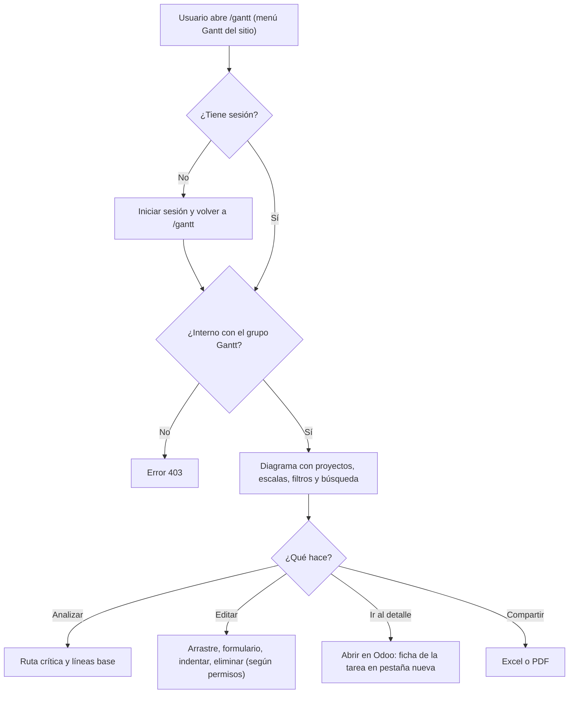

# Guía funcional — Gantt de proyectos en el sitio web

> Módulo técnico `al_project_gantt_website` · versión `12.20261008` · área `OL-PROJECTS`.
> Para consultores funcionales: qué resuelve, quién puede usarlo y el
> proceso completo con un ejemplo. Enlaces verificados el 10/10/2026 con
> `docs/validacion/verificar_enlaces.py`.

## 1. Para qué sirve

Publica el diagrama de Gantt en la página **`/gantt`** del sitio web de
Odoo, con las mismas herramientas que la aplicación del backend. Sirve para
pantallas de pared, tablets de obra o personal interno que no trabaja dentro
de la aplicación Proyecto.

**No es una página de portal:** clientes, usuarios de portal y visitantes no
pueden abrirla aunque tengan el enlace. **Fuera del alcance:** el asistente de
IA (solo backend), la edición del bloque del diagrama con el editor del sitio
y el acceso de terceros.

## 2. Marco normativo y conceptual

Sin norma peruana aplicable. Los conceptos de planificación (EDT, ruta
crítica, línea base) están en la guía del núcleo
(`al_project_gantt_base/GUIA_FUNCIONAL.md`). Lo propio de este módulo es el
**control de acceso**: la página usa el sitio web de Odoo
([sitio web en Odoo 19](https://www.odoo.com/documentation/19.0/applications/websites/website.html))
pero exige sesión de usuario interno con el grupo del Gantt
([permisos en Odoo 19](https://www.odoo.com/documentation/19.0/applications/general/users/access_rights.html)).

| Usuario | Página /gantt | Datos del diagrama |
|---|---|---|
| Visitante sin sesión | Redirige a iniciar sesión | No |
| Usuario de portal | Error 403 | No |
| Interno sin el grupo Gantt de Proyectos | Error 403 | No |
| Interno con el grupo | Página | Sí, según sus permisos de Proyecto |

## 3. Proceso de inicio a fin

| # | Paso | Dónde | Quién | Resultado |
|---|---|---|---|---|
| 1 | Abrir la página | Sitio web ▸ menú Gantt (`/gantt`) | Usuario interno | Diagrama al 70 % del alto de la ventana |
| 2 | Filtrar | /gantt ▸ Filtros | Usuario | Personas, estado, fechas, sin fecha |
| 3 | Buscar | /gantt ▸ Buscar tarea… | Usuario | Filtra al escribir, conserva los niveles superiores |
| 4 | Editar | Arrastre, doble clic, clic derecho | Usuario con permiso | Guardado inmediato («Guardando…», «Guardado») |
| 5 | Abrir el detalle | Clic derecho ▸ Abrir en Odoo / Planificar actividad | Usuario | Ficha de la tarea en otra pestaña del backend |
| 6 | Exportar | Botones Excel / PDF | Usuario | Archivo con lo que está en pantalla |

## 4. Ejemplo completo

Proyectos de demostración «[DEMO Gantt]» en el sitio web de la base.

1. Una tablet de obra abre `/gantt`: como no hay sesión, pide iniciar sesión
   y vuelve sola a la página.
2. Con el usuario del jefe de obra (interno, con el grupo), aparece el
   diagrama de **Edificio A**.
3. En **Buscar tarea…** escribe «Obra»: quedan «Obra gruesa» y «Entrega de
   obra», con su proyecto como nivel superior.
4. Arrastra «Excavación» 5 días con «Encadenar»: «Cimentación» pasa de
   09/11–29/11 a 14/11–04/12 y «Estructura» de 29/11–27/12 a 04/12–01/01.
5. Un cliente con usuario de portal que recibe el enlace obtiene **error
   403**: el plan interno no queda expuesto.

| Aspecto | Backend | Sitio web |
|---|---|---|
| Dónde | Gantt ▸ Diagrama de Gantt | /gantt |
| Abrir en Odoo | Misma pestaña | Pestaña nueva |
| Añadir subtarea en el menú contextual | Sí | No (signo + de la fila) |
| Aviso de guardado | Notificación de Odoo | Texto en la barra |
| Asistente de IA | Sí, con `al_project_gantt_ai` | No |

## 5. Configuración inicial

1. Instalar **Gantt de Proyectos — Website** (instala Sitio web y el núcleo
   si faltan).
2. Dar **Gantt de Proyectos: Usuario** a quienes deban ver la página.
3. Opcional: mover o renombrar el menú **Gantt** desde el editor del sitio.

## 6. Reportes y libros relacionados

Los mismos que el backend: Excel (*Tareas* y *Diagrama*) y PDF A3, generados
en el servidor.

## 7. Casos especiales y errores frecuentes

| Situación | Qué pasa | Qué hacer |
|---|---|---|
| Error 403 a un empleado | No tiene el grupo Gantt de Proyectos | Asignarlo en su usuario |
| No aparece el botón Tarea | El usuario no puede crear tareas | Revisar permisos de Proyecto |
| El menú Gantt no se ve | Se quitó del menú del sitio | Reponerlo desde el editor o ir a /gantt |

## 8. Preguntas frecuentes del consultor

- **¿Sirve para mostrar el avance al cliente?** No; para eso use el portal de
  Proyecto. Esta página es solo interna.
- **¿Puede convivir con la app del backend?** Sí; ambas usan el mismo núcleo.
- **¿Aparece en el mapa del sitio o en buscadores?** No: está fuera del mapa
  del sitio y exige sesión.

## 9. Referencias

Verificadas el 10/10/2026:

- Odoo 19 — Sitio web: https://www.odoo.com/documentation/19.0/applications/websites/website.html
- Odoo 19 — Permisos de acceso: https://www.odoo.com/documentation/19.0/applications/general/users/access_rights.html
- Odoo 19 — Proyecto: https://www.odoo.com/documentation/19.0/applications/services/project.html
- dhtmlxGantt — documentación: https://docs.dhtmlx.com/gantt/
