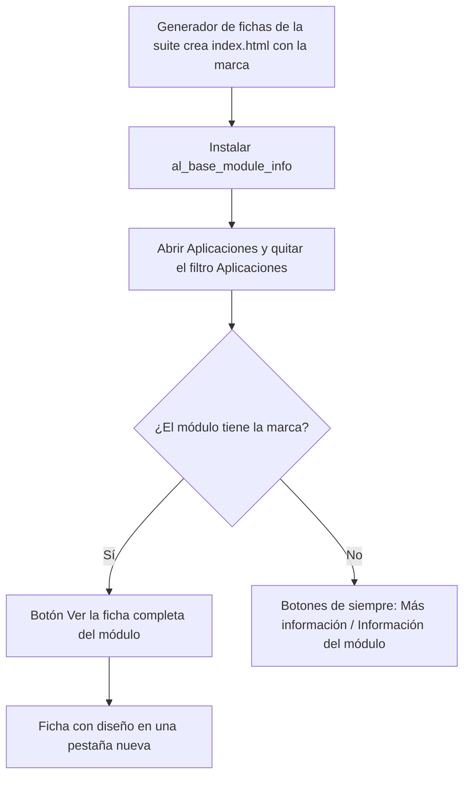

# Guía funcional — Ficha completa del módulo en Aplicaciones

> Módulo técnico `al_base_module_info` · versión `2.20261008` · área `OL-TOOLS`.
> Para consultores funcionales: qué resuelve, cómo se usa y qué controla.
> Enlaces verificados el 10/10/2026 con `docs/validacion/verificar_enlaces.py`.

## 1. Para qué sirve

En **Aplicaciones**, Odoo muestra la descripción de cada módulo «saneada»:
quita estilos, gráficos y todo lo que considera inseguro, así que la ficha de
los módulos de la suite (portada, capturas, ejemplos) se ve sin diseño. Este
módulo pone en la tarjeta de cada módulo de la suite el botón **Ver la ficha
completa del módulo**, que la abre con todo su diseño en una pestaña nueva.

Además lleva los **controles de calidad multicompañía** de la suite (pruebas
automáticas que comprueban reglas por compañía y relaciones entre compañías
en todos los módulos propios).

Lo usan consultores y administradores al revisar qué hace cada módulo.
**Fuera del alcance:** no cambia los módulos de Odoo ni los de terceros, no
añade menús ni ajustes y no genera las fichas (eso lo hace el generador de
fichas de la suite).

## 2. Marco normativo y conceptual

Sin norma peruana aplicable; el marco es técnico:

| Término | Significado |
|---|---|
| Ficha del módulo | Página `static/description/index.html` del módulo, generada por la suite con portada, recorrido, ejemplos y novedades |
| Descripción saneada | Versión que Odoo muestra dentro de Aplicaciones, sin estilos |
| Marca `al-ficha-link` | Señal que deja el generador en la ficha; solo esos módulos reciben el botón |
| Multicompañía | Cada registro pertenece a una compañía y Odoo impide mezclar datos de compañías distintas |

Referencias de Odoo:
[Aplicaciones y módulos](https://www.odoo.com/documentation/19.0/applications/general/apps_modules.html),
[descripción en el manifiesto](https://www.odoo.com/documentation/19.0/developer/reference/backend/module.html)
y [guía multicompañía](https://www.odoo.com/documentation/19.0/developer/howtos/company.html).

## 3. Proceso de inicio a fin

| # | Paso | Dónde en Odoo | Quién | Resultado |
|---|---|---|---|---|
| 1 | Instalar | Aplicaciones | Administrador | Sin configuración |
| 2 | Buscar el módulo | Aplicaciones (sin el filtro «Aplicaciones») | Consultor | Tarjetas de la suite con el botón nuevo |
| 3 | Abrir la ficha | Tarjeta ▸ Ver la ficha completa del módulo (o menú ⋮) | Consultor | `/<módulo>/static/description/index.html` con diseño |
| 4 | Web del autor | Menú ⋮ ▸ Más información | Consultor | Se conserva |

## 4. Ejemplo completo

Búsqueda «Perú» en Aplicaciones:

| Módulo | ¿Tiene ficha? | Botón del pie de la tarjeta |
|---|---|---|
| PE - Base Contabilidad (AL) | Sí | Ver la ficha completa del módulo |
| Perú - Contabilidad (Odoo) | No (con web del autor) | Más información |
| EDI para Perú (Odoo) | No (sin web del autor) | Información del módulo |

Al pulsar el botón en «PE - Retenciones de IGV (AL)» se abre su ficha
completa: portada, destacados, recorrido con capturas, ejemplos, preguntas
frecuentes y novedades.

**Control multicompañía:** al ejecutar las pruebas del módulo, se revisan los
módulos propios: cada modelo con compañía tiene su regla por compañía y su
control automático, y las relaciones hacia modelos con compañía llevan
control de compañía; la compañía es de solo lectura en las vistas propias.
Si un módulo nuevo no cumple, la prueba falla y lo señala por nombre.

## 5. Configuración inicial

1. Instalar el módulo (solo depende de `base`).
2. Para que un módulo nuevo ofrezca su ficha, generarla con el generador de
   fichas de la suite (`docs/fichas/generar_fichas.py`), que al final aplica
   `docs/validacion/fichas_modulos.py` (añade el enlace y la marca
   `al-ficha-link`), y reiniciar el servidor (la detección se guarda en caché).

## 6. Reportes y libros relacionados

No genera reportes ni libros.

## 7. Casos especiales y errores frecuentes

| Situación | Qué pasa | Qué hacer |
|---|---|---|
| Ficha recién generada sin botón | La detección está en caché | Reiniciar el servidor |
| El botón no aparece nunca | El `index.html` no tiene la marca `al-ficha-link` | Generar la ficha con el generador de la suite |
| ¿Dónde quedó «Más información»? | Pasa al menú ⋮ de la tarjeta | Usarlo desde ahí |

## 8. Preguntas frecuentes del consultor

- **¿Cambia algo en los módulos de Odoo?** No.
- **¿La ficha es pública?** Es un archivo estático del módulo: la abre
  cualquier usuario que llegue a la dirección.
- **¿Para qué sirven las pruebas multicompañía?** Garantizan que ningún
  módulo de la suite mezcle datos de compañías distintas.

## 9. Referencias

Verificadas el 10/10/2026:

- Odoo 19 — Aplicaciones y módulos: https://www.odoo.com/documentation/19.0/applications/general/apps_modules.html
- Odoo 19 — Manifiesto del módulo: https://www.odoo.com/documentation/19.0/developer/reference/backend/module.html
- Odoo 19 — Guía multicompañía: https://www.odoo.com/documentation/19.0/developer/howtos/company.html
