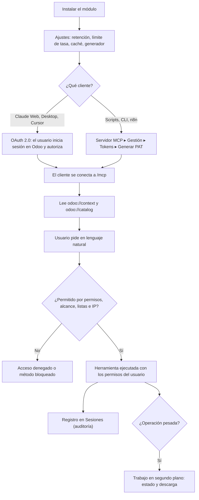

# Guía funcional — Servidor MCP para Odoo

> Módulo técnico `al_mcp_server` · versión `8.20261009` · área `OL-TOOLS`.
> Para consultores funcionales: qué resuelve, cómo se gobierna el acceso y el
> proceso completo con un ejemplo. Enlaces verificados el 10/10/2026 con
> `docs/validacion/verificar_enlaces.py`.

## 1. Para qué sirve

Convierte Odoo en un **servidor MCP** (Model Context Protocol): asistentes de
IA como Claude, ChatGPT, Cursor o herramientas como n8n se conectan a los
datos en vivo de Odoo y trabajan en lenguaje natural («muéstrame las facturas
impagas con más de 30 días», «crea una orden de venta para…»), siempre con
los **permisos del usuario dueño del token**.

Incluye gobierno del acceso (tokens con alcance, listas de modelos e IP,
límite de tasa), auditoría de cada llamada, herramientas de análisis (tabla
dinámica, series de tiempo, ranking, cohortes, embudo, exportación),
trabajos en segundo plano, páginas de portal compartibles y un generador de
módulos (solo con alcance de administrador).

Lo administran el área de sistemas y los administradores de Odoo; lo usan
analistas y usuarios que trabajan con un asistente de IA. **Fuera del
alcance:** no incluye el asistente de IA ni sus créditos (lo pone el
cliente: Claude, ChatGPT, etc.), y no salta los permisos de Odoo.

## 2. Marco normativo y conceptual

- **Model Context Protocol.** Estándar abierto para que los asistentes de IA
  usen herramientas y datos externos; el módulo implementa la versión
  2025-03-26 (transporte HTTP)
  ([qué es MCP](https://modelcontextprotocol.io/introduction),
  [especificación](https://modelcontextprotocol.io/specification/2025-03-26)).
- **OAuth 2.0 con PKCE.** Los clientes con ventana de inicio de sesión
  obtienen el acceso sin que el usuario copie claves
  ([OAuth 2.0, RFC 6749](https://www.rfc-editor.org/rfc/rfc6749),
  [PKCE, RFC 7636](https://www.rfc-editor.org/rfc/rfc7636)).
- **Datos personales (Perú).** Si el asistente de IA es un servicio externo,
  lo que lea de Odoo (clientes, empleados) sale de la empresa: aplica la Ley
  29733. Por eso existen las listas de modelos y campos permitidos y el
  ocultamiento de datos personales en la auditoría
  ([Ley 29733](https://www.gob.pe/institucion/minjus/normas-legales/243470-29733),
  [ANPD](https://www.gob.pe/anpd)).

| Término | Significado |
|---|---|
| Herramienta MCP | Acción que el asistente puede invocar (buscar, crear, agrupar, exportar…) |
| Recurso MCP | Lectura de contexto: `odoo://context`, `odoo://catalog`, `odoo://model/<modelo>` |
| Token personal (PAT) | Clave para scripts y clientes de línea de comandos; se muestra una sola vez |
| Alcance | `read` (solo lectura), `write` (lectura y escritura) o `admin` (todo) |
| Sesión / registro | Conexión de un cliente y la auditoría de cada llamada |

## 3. Proceso de inicio a fin

| # | Paso | Dónde en Odoo | Quién | Resultado |
|---|---|---|---|---|
| 1 | Configurar | Servidor MCP ▸ Configuración | Administrador | Retención de sesiones (7 días) y registros (30), límite (60 solicitudes por ventana de 60 s), caché de esquema (300 s), Redis opcional, generador de módulos |
| 2 | Dar acceso | Servidor MCP ▸ Gestión ▸ Tokens (PAT) o inicio de sesión OAuth | Usuario / administrador | Token válido 30 días con alcance y restricciones |
| 3 | Conectar el cliente | Configuración del cliente de IA con la URL `/mcp` de su dominio de Odoo (por ejemplo `su-empresa.odoo.com/mcp`, siempre con HTTPS) | Usuario | Asistente conectado |
| 4 | Trabajar | Desde el asistente | Usuario | Consultas, altas, reportes, exportaciones |
| 5 | Auditar | Servidor MCP ▸ Gestión ▸ Sesiones | Administrador | Quién llamó a qué herramienta y cuándo |
| 6 | Revocar | Servidor MCP ▸ Gestión ▸ Tokens ▸ (token) | Administrador | El token deja de funcionar al instante |

Otros menús: **Herramientas** (registro de herramientas), **Trabajos**,
**Páginas de portal**, **Artefactos HTML**, **Módulos generados** y
**Clientes OAuth**.

## 4. Ejemplo completo

Un analista de cobranzas usa Claude Desktop con un token de alcance `read`
restringido a facturas y contactos.

1. **Token:** en *Servidor MCP ▸ Gestión ▸ Tokens* genera un PAT, alcance
   `read`, modelos permitidos `account.move` y `res.partner`, IP de la
   oficina. Copia el token (se muestra una sola vez; Odoo guarda solo su
   huella SHA-256).
2. **Conexión:** en el cliente configura la URL `/mcp` de su dominio de Odoo (por ejemplo `su-empresa.odoo.com/mcp`, siempre con HTTPS) con la
   cabecera `Authorization: Bearer <token>`.
3. **Contexto:** «Lee odoo://context y odoo://catalog»: el asistente conoce
   compañía, moneda (PEN), módulos y modelos.
4. **Consulta:** «Facturas de cliente impagas con más de 30 días, agrupadas
   por cliente». El asistente usa la herramienta de agrupación sobre
   `account.move` y devuelve, por ejemplo, 3 clientes con su saldo.
5. **Intento fuera de alcance:** «Crea una nota de crédito» → rechazado: el
   token es de solo lectura.
6. **Auditoría:** en *Sesiones* queda la sesión con cada llamada (herramienta,
   modelo, resultado); con «Capturar cargas útiles» se guarda además el
   detalle, con los datos personales ocultos.
7. **Fin:** al terminar el proyecto, el administrador revoca el token.

## 5. Configuración inicial

1. Instalar **Servidor MCP** (depende de `base`, `web` y `mail`; Community o
   Enterprise).
2. En producción, publicar Odoo con **HTTPS** (obligatorio para OAuth).
3. **Servidor MCP ▸ Configuración:** retenciones, límite de tasa, caché y, si
   se usará, el generador de módulos (con su ruta).
4. Definir la política: qué usuarios pueden generar tokens, con qué alcance y
   sobre qué modelos; IP permitidas.
5. Opcional: `redis` (límite de tasa compartido entre servidores) y
   `xlsxwriter` (exportación a Excel).

## 6. Reportes y libros relacionados

- Herramientas de análisis: tabla dinámica, series de tiempo con tendencia,
  ranking Top-N, retención por cohorte, embudo y exportación CSV/XLSX.
- **Páginas de portal**: tableros compartibles por enlace.
- Auditoría en **Sesiones**. No alimenta libros contables ni archivos SUNAT.

## 7. Casos especiales y errores frecuentes

| Situación | Qué pasa | Qué hacer |
|---|---|---|
| «Access Denied» | El usuario del token no tiene permiso en ese modelo | Revisar sus derechos en Odoo o las listas del token |
| «Method is blocked» | Método privado o de escalada de privilegios | Usar los métodos que lista la herramienta de vistas |
| «Required field missing» al crear | Faltan obligatorios | Pedir al asistente valores por defecto y onchange antes de crear |
| «Rate limit exceeded» | Más solicitudes de las permitidas por ventana | Esperar o subir el límite en Configuración |
| La URL del PDF no abre | Las URL de reportes exigen sesión en Odoo | Iniciar sesión en el navegador |
| El asistente «no conoce» los modelos | No leyó el contexto | Pedir que lea `odoo://context` y `odoo://catalog` |

## 8. Preguntas frecuentes del consultor

- **¿El asistente ve todo Odoo?** Solo lo que puede ver el usuario del token,
  acotado por el alcance y las listas de modelos, campos e IP.
- **¿Se puede usar con ChatGPT o n8n?** Sí, con cualquier cliente compatible
  con MCP.
- **¿Dónde queda el token?** En Odoo solo su huella; el texto se muestra una
  vez. Vence a los 30 días y se puede revocar.
- **¿El generador de módulos instala código?** Solo con alcance `admin`,
  activado en Configuración y con confirmación.

## 9. Referencias

Verificadas el 10/10/2026:

- Model Context Protocol — introducción: https://modelcontextprotocol.io/introduction
- Model Context Protocol — especificación 2025-03-26: https://modelcontextprotocol.io/specification/2025-03-26
- OAuth 2.0 (RFC 6749): https://www.rfc-editor.org/rfc/rfc6749
- PKCE (RFC 7636): https://www.rfc-editor.org/rfc/rfc7636
- Ley 29733, Protección de Datos Personales: https://www.gob.pe/institucion/minjus/normas-legales/243470-29733
- Autoridad Nacional de Protección de Datos Personales: https://www.gob.pe/anpd
- Odoo 19 — Permisos de acceso: https://www.odoo.com/documentation/19.0/applications/general/users/access_rights.html
